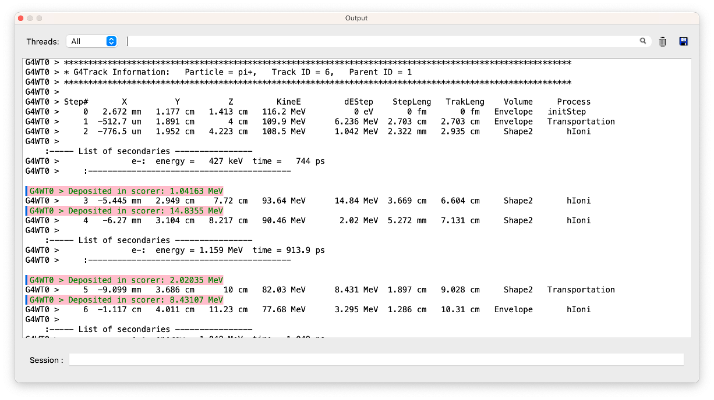

# 003 How to Define the main() Program

## A Sample `main()` Method

The contents of `main()` will vary according to the needs of a given simulation application and therefore must be supplied by the user. The Geant4 toolkit does not provide a `main()` method, but a sample is provided here as a guide to the beginning user. Listing 1 is the simplest example of `main()` required to build a simulation program.

```cpp
#include "DetectorConstruction.hh"
#include "PhysicsList.hh"
#include "ActionInitialization01.hh"

#include "G4RunManagerFactory.hh"
#include "G4UImanager.hh"

int main()
{
  // construct the default run manager
  auto runManager = G4RunManagerFactory::CreateRunManager();

  // set mandatory initialization classes
  runManager->SetUserInitialization(new DetectorConstruction);
  runManager->SetUserInitialization(new PhysicsList);
  runManager->SetUserInitialization(new ActionInitialization);

  // initialize G4 kernel
  runManager->Initialize();

  // get the pointer to the UI manager and set verbosities
  G4UImanager* UI = G4UImanager::GetUIpointer();
  UI->ApplyCommand("/run/verbose 1");
  UI->ApplyCommand("/event/verbose 1");
  UI->ApplyCommand("/tracking/verbose 1");

  // start a run
  int numberOfEvent = 3;
  runManager->BeamOn(numberOfEvent);

  // job termination
  delete runManager;
  return 0;
}
```

The `main()` method is implemented by two toolkit classes, `G4RunManager` and `G4UImanager`, and three classes, `DetectorConstruction`, `PhysicsList` and `ActionInitialization`, which are derived from toolkit classes. Each of these are explained in the following sections.

## `G4RunManager`

The first thing `main()` must do is create an instance of the `G4RunManager` class. This is the only manager class in the Geant4 kernel which should be explicitly constructed in the user's `main()`. It controls the flow of the program and manages the event loop(s) within a run. `G4RunManagerFactory::CreateRunManager()` instantiates a `G4RunManager` object whose concrete type is:

-   `G4MTRunManager` if Geant4 library was built with multithreading support

-   `G4RunManager` otherwise

The concrete type chosen may be overridden at application runtime without recompilation by setting the environment variable `G4RUN_MANAGER_TYPE`, whose value can be set to either `Serial`, `MT`, `Tasking` or `TBB`. For Geant4 version 10.7, options `Tasking` and `TBB` are provided as beta-release. The traditional style of direct instantiation of `G4RunManager` (sequential mode) or `G4MTRunMabager` (multithreaded mode) is also available.

When `G4RunManager` is created, the other major manager classes are also created. They are deleted automatically when `G4RunManager` is deleted. The run manager is also responsible for managing initialization procedures, including methods in the user initialization classes. Through these the run manager must be given all the information necessary to build and run the simulation, including

1.  how the detector should be constructed,

2.  all the particles and all the physics processes to be simulated,

3.  how the primary particle(s) in an event should be produced, and

4.  any additional requirements of the simulation.

In the sample `main()` the lines

```cpp
runManager->SetUserInitialization(new DetectorConstruction);
runManager->SetUserInitialization(new PhysicsList);
runManager->SetUserInitialization(new ActionInitialization);
```

create objects which specify the detector geometry, physics processes and primary particle, respectively, and pass their pointers to the run manager. `DetectorConstruction` is an example of a user initialization class which is derived from `G4VUserDetectorConstruction`. This is where the user describes the entire detector setup, including

-   its geometry,

-   the materials used in its construction,

-   a definition of its sensitive regions and

-   the readout schemes of the sensitive regions.

Similarly `PhysicsList` is derived from `G4VUserPhysicsList` and requires the user to define

-   the particles to be used in the simulation,

-   all the physics processes to be simulated.

User can also override the default implementation for

-   the range cuts for these particles and

Also `ActionInitialization` is derived from `G4VUserActionInitialization` and requires the user to define

-   so-called user action classes (see next section) that are invoked during the simulation,

-   which includes one mandatory user action to define the primary particles.

The next instruction

```cpp
runManager->Initialize();
```

performs the detector construction, creates the physics processes, calculates cross sections and otherwise sets up the run. The final run manager method in `main()`

```cpp
int numberOfEvent = 3;
runManager->beamOn(numberOfEvent);
```

begins a run of three sequentially processed events. The `beamOn()` method may be invoked any number of times within `main()` with each invocation representing a separate run. Once a run has begun neither the detector setup nor the physics processes may be changed. They may be changed between runs, however, as described in Customizing the Run Manager. More information on `G4RunManager` in general is found in Run.

As mentioned above, other manager classes are created when the run manager is created. One of these is the user interface manager, `G4UImanager`. In `main()` a pointer to the interface manager must be obtained

```cpp
G4UImanager* UI = G4UImanager::getUIpointer();
```

in order for the user to issue commands to the program. In the present example the `applyCommand()` method is called three times to direct the program to print out information at the run, event and tracking levels of simulation. A wide range of commands is available which allows the user detailed control of the simulation. A list of these commands can be found in Built-in Commands.

## User Initialization and Action Classes

### User Classes

There are two kinds of user classes, user initialization classes and user action classes. User initialization classes are used during the initialization phase, while user action classes are used during the run. User initialization classes should be directly set to `G4RunManager` through `SetUserInitialization()` method, while user action classes should be defined in `G4VUserActionInitialization` class.

### User Initialization Classes

All three user initialization classes are mandatory. They must be derived from the abstract base classes provided by Geant4:

-   `G4VUserDetectorConstruction`

-   `G4VUserPhysicsList`

-   `G4VUserActionInitialization`

Geant4 does not provide default behavior for these classes. `G4RunManager` checks for the existence of these mandatory classes when the `Initialize()` and `BeamOn()` methods are invoked.

As mentioned in the previous section, `G4VUserDetectorConstruction` requires the user to define the detector and `G4VUserPhysicsList` requires the user to define the physics. Detector definition will be discussed in Sections How to Define a Detector Geometry and How to Specify Materials in the Detector. Physics definition will be discussed in How to Specify Particles and How to Specify Physics Processes. The user action `G4VUserPrimaryGeneratorAction` requires that the initial event state be defined. Primary event generation will be discussed in How to Make an Executable Program.

`G4VUserActionInitialization` should include at least one mandatory user action class `G4VUserPrimaryGeneratorAction`. All user action classes are described in the next section.

```cpp
#include "ActionInitialization.hh"
#include "PrimaryGeneratorAction.hh"

void ActionInitialization::Build() const
{
  SetUserAction(new PrimaryGeneratorAction);
}
```

### User Action Classes

`G4VUserPrimaryGeneratorAction` is a mandatory class the user has to provide. It creates an instance of a primary particle generator. `PrimaryGeneratorAction` is an example of a user action class which is derived from `G4VUserPrimaryGeneratorAction`. In this class the user must describe the initial state of the primary event. This class has a public virtual method named `GeneratePrimaries()` which will be invoked at the beginning of each event. Details will be given in How to Generate a Primary Event. Note that Geant4 does not provide any default behavior for generating a primary event.

Geant4 provides additional five user hook classes:

-   `G4UserRunAction`

-   `G4UserEventAction`

-   `G4UserStackingAction`

-   `G4UserTrackingAction`

-   `G4UserSteppingAction`

These optional user action classes have several virtual methods which allow the specification of additional procedures at all levels of the simulation application. Details of the user initialization and action classes are provided in User Actions.

## `G4UImanager` and UI CommandSubmission

Geant4 provides a category named **intercoms**. `G4UImanager` is the manager class of this category. Using the functionalities of this category, you can invoke **set** methods of class objects of which you do not know the pointer. In Listing 3, the verbosities of various Geant4 manager classes are set. Detailed mechanism description and usage of **intercoms** will be given in the next chapter, with a list of available commands. Command submission can be done all through the application.

```cpp
#include "DetectorConstruction.hh"
#include "PhysicsList.hh"
#include "PrimaryGeneratorAction.hh"

#include "G4RunManager.hh"
#include "G4UImanager.hh"

#include "G4UIExecutive.hh"

int main(int argc,char** argv)
{
  // construct the default run manager
  G4RunManager* runManager = new G4RunManager;

  // set mandatory initialization classes
  runManager->SetUserInitialization(new DetectorConstruction);
  runManager->SetUserInitialization(new PhysicsList);

  // set mandatory user action class
  runManager->SetUserAction(new PrimaryGeneratorAction);

  // initialize G4 kernel
  runManager->Initialize();

  // Get the pointer to the User Interface manager
  G4UImanager* UImanager = G4UImanager::GetUIpointer();

  if ( argc == 1 ) {
    // interactive mode : define UI session
    G4UIExecutive* ui = new G4UIExecutive(argc, argv);
    UImanager->ApplyCommand("/control/execute init.mac");
    ui->SessionStart();
    delete ui;
  }
  else {
    // batch mode
    G4String command = "/control/execute ";
    G4String fileName = argv[1];
    UImanager->ApplyCommand(command+fileName);
  }

  // job termination
  delete runManager;
  return 0;
}
```

## `G4cout`, `G4cerr` and `G4debug`

Although not yet included in the above examples, output streams will be needed. `G4cout` and `G4cerr` are **iostream** objects defined by Geant4. The usage of these objects is exactly the same as the ordinary *cout* and *cerr*, except that the output streams will be handled by `G4UImanager`. Thus, output strings may be displayed on another window or stored in a file. Manipulation of these output streams will be described in How to control the output of G4cout/G4cerr. These objects should be used instead of the ordinary *cout* and *cerr*.

Similarly, `G4debug` may be used for your debug statements. In the Qt GUI lines are highlighted to help you pick out your debug information.


