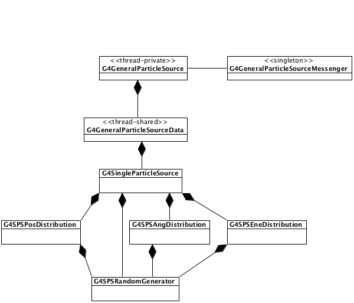
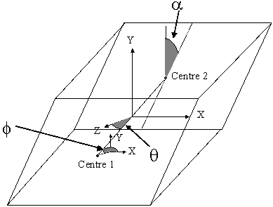
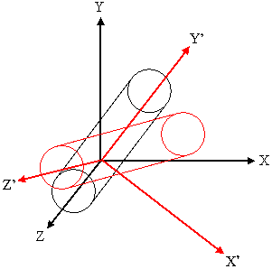
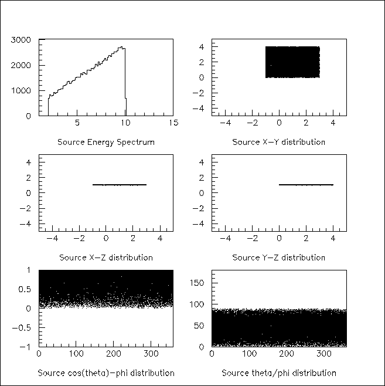

# 009 Geant4 General Particle Source

## Introduction

The `G4GeneralParticleSource` (GPS) is part of the Geant4 toolkit for Monte-Carlo, high-energy particle transport. Specifically, it allows the specifications of the spectral, spatial and angular distribution of the primary source particles. An overview of the GPS class structure is presented here. Configuration covers the configuration of GPS for a user application, and Macro Commands describes the macro command interface. Example Macro File gives an example input file to guide the first time user.

`G4GeneralParticleSource` is used exactly the same way as `G4ParticleGun` in a Geant4 application. In existing applications one can simply change your PrimaryGeneratorAction by globally replacing `G4ParticleGun` with `G4GeneralParticleSource`. GPS may be configured via command line, or macro based, input. The experienced user may also hard-code distributions using the methods and classes of the GPS that are described in more detail in a technical note .

The class diagram of GPS is shown in Fig. 1. As of version 10.01, a split-class mechanism was introduced to reduce memory usage in multithreaded mode. The `G4GeneralParticleSourceData` class is a thread-safe singleton which provides access to the source information for the `G4GeneralParticleSource` class. The `G4GeneralParticleSourceData` class can have multiple instantiations of the `G4SingleParticleSource` class, each with independent positional, angular and energy distributions as well as incident particle types. To the user, this change should be transparent.

[]

[Fig. 1 ][The class diagram of `G4GeneralParticleSource`.]

1]

:   General purpose Source Particle Module for Geant4/SPARSET: Technical Note, UoS-GSPM-Tech, Issue 1.1, C Ferguson, February 2000.

## Configuration

GPS allows the user to control the following characteristics of primary particles:

-   Spatial sampling: on simple 2D or 3D surfaces such as discs, spheres, and boxes.

-   Angular distribution: unidirectional, isotropic, cosine-law, beam or arbitrary (user defined).

-   Spectrum: linear, exponential, power-law, Gaussian, blackbody, or piece-wise fits to data.

-   Multiple sources: multiple independent sources can be used in the same run.

As noted above, `G4GeneralParticleSource` is used exactly the same way as `G4ParticleGun` in a Geant4 application, and may be substituted for the latter by \"global search and replace\" in existing application source code.

### Position Distribution

The position distribution can be defined by using several basic shapes to contain the starting positions of the particles. The easiest source distribution to define is a point source. One could also define planar sources, where the particles emanate from circles, annuli, ellipses, squares or rectangles. There are also methods for defining 1D or 2D accelerator beam spots. The five planes are oriented in the x-y plane. To define a circle one gives the radius, for an annulus one gives the inner and outer radii, and for an ellipse, a square or a rectangle one gives the half-lengths in x and y.

More complicated still, one can define surface or volume sources where the input particles can be confined to either the surface of a three dimensional shape or to within its entire volume. The four 3D shapes used within G4GeneralParticleSource are sphere, ellipsoid, cylinder and parallelepiped. A sphere can be defined simply by specifying the radius. Ellipsoids are defined by giving their half-lengths in x, y and z. Cylinders are defined such that the axis is parallel to the z-axis, the user is therefore required to give the radius and the z half-length. Parallelepipeds are defined by giving x, y and z half-lengths, plus the angles $\alpha$, $\theta$, and $\phi$ (Fig. 2).

[]

[Fig. 2 ][The angles used in the definition of a Parallelepiped.]

To allow easy definition of the sources, the planes and shapes are assumed to be orientated in a particular direction to the coordinate axes, as described above. For more general applications, the user may supply two vectors (x' and a vector in the plane x'-y') to rotate the co-ordinate axes of the shape with respect to the overall co-ordinate system (Fig. 3). The rotation matrix is automatically calculated within G4GeneralParticleSource. The starting points of particles are always distributed homogeneously over the 2D or 3D surfaces, although biasing can change this.

[]

[Fig. 3 ][An illustration of the use of rotation matrices. A cylinder is defined with its axis parallel to the z-axis (black lines), but the definition of 2 vectors can rotate it into the frame given by x', y', z' (red lines).]

### Angular Distribution

The angular distribution is used to control the directions in which the particles emanate from/incident upon the source point. In general there are three main choices, isotropic, cosine-law or user-defined. In addition there are options for specifying parallel beam as well as diverse accelerator beams. The isotropic distribution represents what would be seen from a uniform $4\pi$ flux. The cosine-law represents the distribution seen at a plane from a uniform $2\pi$ flux.

It is possible to bias (Biasing) both $\theta$ and $\phi$ for any of the predefined distributions, including setting lower and upper limits to $\theta$ and $\phi$. User-defined distributions cannot be additionally biased (any bias should obviously be incorporated into the user definition).

Incident with zenith angle $\theta=0$ means the particle is travelling along the -z axis. It is important to bear this in mind when specifying user-defined co-ordinates for angular distributions. The user must be careful to rotate the co-ordinate axes of the angular distribution if they have rotated the position distribution (Fig. 3).

The user defined distribution requires the user to enter a histogram in either $\theta$ or $\phi$ or both. The user-defined distribution may be specified either with respect to the coordinate axes or with respect to the surface-normal of a shape or volume. For the surface-normal distribution, $\theta$ should only be defined between 0 and $\pi/2$, not the usual 0 to $\pi$ range.

The top-level `/gps/direction` command uses direction cosines to specify the primary particle direction, as follows:

$$\begin{aligned}P_x & = - \sin \theta \cos \phi \\ P_y & = - \sin \theta \sin \phi \\ P_z & = - \cos \theta\end{aligned}$$

### Energy Distribution

The energy of the input particles can be set to follow several built-in functions or a user-defined one, as shown in `GPS-spectra`. The user can bias any of the pre-defined energy distributions in order to speed up the simulation (user-defined distributions are already biased, by construction).

There is also the option for the user to define a histogram in energy (\"User\") or energy per nucleon (\"Epn\") or to give an arbitrary point-wise spectrum (\"Arb\") that can be fit with various simple functions. The data for histograms or point spectra must be provided in ascending bin (abscissa) order. The point-wise spectrum may be differential (as with a binned histogram) or integral (a cumulative distribution function). If integral, the data must satisfy $s(e1) \geq s(e2)$ for $e1<e2$ when entered; this is not validated by the GPS code. The maximum energy of an integral spectrum is defined by the last-but-one data point, because GPS converts to a differential spectrum internally.

Unlike the other spectral distributions it has proved difficult to integrate indefinitely the black-body spectrum and this has lead to an alternative approach. Instead it has been decided to use the black-body formula to create a 10,000 bin histogram and then to produce random energies from this.

Similarly, the broken power-law for cosmic diffuse gamma rays makes generating an indefinite integral CDF problematic. Instead, the minimum and maximum energies specified by the user are used to construct a definite-integral CDF from which random energies are selected.

### Biasing

The user can bias distributions by entering a histogram. It is the random numbers from which the quantities are picked that are biased and so one only needs a histogram from 0 to 1. Great care must be taken when using this option, as the way a quantity is calculated will affect how the biasing works, as discussed below. Bias histograms are entered in the same way as other user-defined histograms.

When creating biasing histograms it is important to bear in mind the way quantities are generated from those numbers. For example let us compare the biasing of a $\theta$ distribution with that of a $\phi$ distribution. Let us divide the $\theta$ and $\phi$ ranges up into 10 bins, and then decide we want to restrict the generated values to the first and last bins. This gives a new $\phi$ range of 0 to 0.628 and 5.655 to 6.283. Since $\phi$ is calculated using $\phi = 2\pi \times \rm{RNDM}$, this simple biasing will work correctly.

If we now look at $\theta$, we expect to select values in the two ranges 0 to 0.314 (for $0 \le \rm{RNDM} \le 0.1$) and 2.827 to 3.142 (for $0 \le \rm{RNDM} \le 0.9$). However, the polar angle $\theta$ is calculated from the formula $\theta = \arccos (1-2\times \rm{RNDM})$. From this, we see that 0.1 gives a $\theta$ of 0.644 and a $\rm{RNDM}$ of 0.9 gives a $\theta$ of 2.498. This means that the above will not bias the distribution as the user had wished. The user must therefore take into account the method used to generate random quantities when trying to apply a biasing scheme to them. Some quantities such as x, y, z and $\phi$ will be relatively easy to bias, but others may require more thought.

### User-Defined Histograms

The user can define histograms for several reasons: angular distributions in either $\theta$ or $\phi$; energy distributions; energy per nucleon distributions; or biasing of x, y, z, $\theta$, $\phi$, or energy. Even though the reasons may be different the approach is the same.

To choose a histogram the command `/gps/hist/type` is used (Macro Commands). If one wanted to enter an angular distribution one would type \"theta\" or \"phi\" as the argument. The histogram is loaded, one bin at a time, by using the `/gps/hist/point` command, followed by its two arguments the upper boundary of the bin and the weight (or area) of the bin. Histograms are therefore differential functions.

Currently histograms are limited to 1024 bins. The first value of each user input data pair is treated as the upper edge of the histogram bin and the second value is the bin content. The exception is the very first data pair the user input whose first value is the treated as the lower edge of the first bin of the histogram, and the second value is not used. This rule applies to all distribution histograms, as well as histograms for biasing.

The user has to be aware of the limitations of histograms. For example, in general $\theta$ is defined between 0 and $\pi$ and $\phi$ is defined between 0 and $2\pi$, so histograms defined outside of these limits may not give the user what they want (see also Biasing).

## Macro Commands

`G4GeneralParticleSource` can be configured by typing commands from the `/gps` command directory tree, or including the `/gps` commands in a g4macro file.

### `G4ParticleGun` equivalent commands

| Command | Arguments | Description and restrictions |
| --- | --- | --- |
| /gps/List |  | List available incident particles |
| /gps/particle | name | Defines the particle type \[default *geantino*\], using Geant4 naming convention. |
| /gps/direction | Px Py Pz | Set the momentum direction \[default (1,0,0)\] of generated particles using (1) |
| /gps/energy | E unit | Sets the energy \[default 1 MeV\] for mono-energetic sources. The units can be eV, keV, MeV, GeV, TeV or PeV. (NB: it is recommended to use /gps/ene/mono instead.) |
| /gps/position | X Y Z unit | Sets the centre co-ordinates (X,Y,Z) of the source \[default (0,0,0) cm\]. The units can be micron, mm, cm, m or km. (NB: it is recommended to use /gps/pos/centre instead.) |
| /gps/ion | Z A Q E | After `/gps/particle ion`, sets the properties (atomic number Z, atomic mass A, ionic charge Q, excitation energy E in keV) of the ion. |
| /gps/ionLvl | Z A Q lvl | After `/gps/particle ion`, sets the properties (atomic number Z, atomic mass A, ionic charge Q, Number of metastable state excitation level (0-9) of the ion. |
| /gps/time | t0 unit | Sets the primary particle (event) time \[default 0 ns\]. The units can be ps, ns, us, ms, or s. |
| /gps/polarization | Px Py Pz | Sets the polarization vector of the source, which does not need to be a unit vector. |
| /gps/number | N | Sets the number of particles \[default 1\] to simulate on each event. |
| /gps/verbose | level | Control the amount of information printed out by the GPS code. Larger values produce more detailed output. |

: [Table 1 ][`G4ParticleGun` equivalent commands.]

### Multiple source specification

| Command | Arguments | Description and restrictions |
| --- | --- | --- |
| /gps/source/add | intensity | Add a new particle source with the specified intensity |
| /gps/source/list |  | List the particle sources defined. |
| /gps/source/clear |  | Remove all defined particle sources. |
| /gps/source/show |  | Display the current particle source |
| /gps/source/set | index | Select the specified particle source as the current one. |
| /gps/source/delete | index | Remove the specified particle source. |
| /gps/source/ multiplevertex | flag | Specify *true* for simultaneous generation of multiple vertices, one from each specified source. False \[default\] generates a single vertex, choosing one source randomly. |
| /gps/source/ intensity | intensity | Reset the current source to the specified intensity |
| /gps/source/ flatsampling | flag | Set to True to allow biased sampling among the sources. Setting to True will ignore source intensities. The default is False. |

: [Table 2 ][Multiple source specification.]

### Source position and structure

### Source direction and angular distribution

### Energy spectra

### User-defined histograms and interpolated functions

## Example Macro File

```cpp
# Macro test2.g4mac
/control/verbose 0
/tracking/verbose 0
/event/verbose 0
/gps/verbose 2
/gps/particle gamma
/gps/pos/type Plane
/gps/pos/shape Square
/gps/pos/centre 1 2 1 cm
/gps/pos/halfx 2 cm
/gps/pos/halfy 2 cm
/gps/ang/type cos
/gps/ene/type Lin
/gps/ene/min 2 MeV
/gps/ene/max 10 MeV
/gps/ene/gradient 1
/gps/ene/intercept 1
/run/beamOn 10000
```

The above macro defines a planar source, square in shape, 4 cm by 4 cm and centred at (1,2,1) cm. By default the normal of this plane is the z-axis. The angular distribution is to follow the cosine-law. The energy spectrum is linear, with gradient and intercept equal to 1, and extends from 2 to 10 MeV. 10,000 primaries are to be generated.

[]

[Fig. 4 ][Energy, position and angular distributions of the primary particles as generated by the macro file shown above.]

The standard Geant4 output should show that the primary particles start from between 1, 0, 1 and 3, 4, 1 (in cm) and have energies between 2 and 10 MeV, as shown in Fig. 4, in which we plotted the actual energy, position and angular distributions of the primary particles generated by the above macro file.
