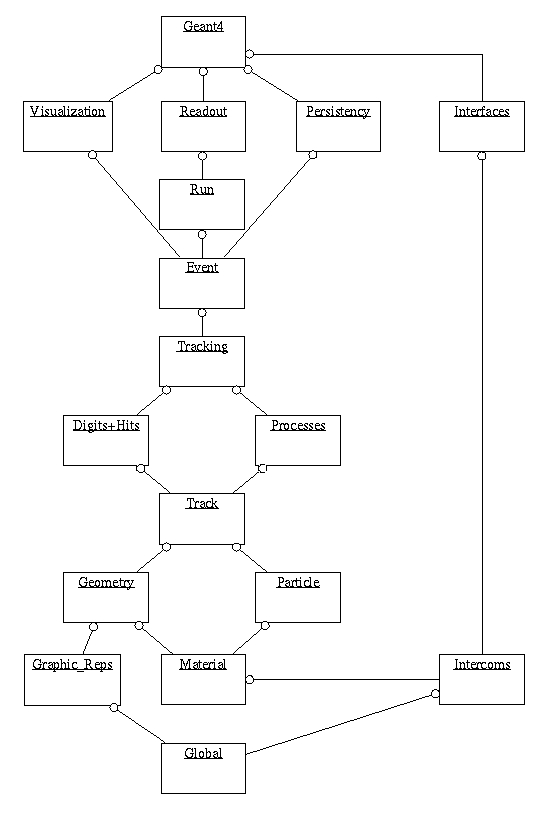

# 014 Class Categories and Domains

## What is a class category?

In the design of a large software system such as Geant4, it is essential to partition it into smaller logical units. This makes the design well organized and easier to develop. Once the logical units are defined independent to each other as much as possible, they can be developed in parallel without serious interference.

In object-oriented analysis and design methodology by Grady Booch \[Booch1994\, class categories are used to create logical units. They are defined as \"clusters of classes that are themselves cohesive, but are loosely coupled relative to other clusters.\" This means that a class category contains classes which have a close relationship (for example, the \"has-a\" relation). However, relationships between classes which belong to different class categories are weak, i.e., only limited classes of these have \"uses\" relations. The class categories and their relations are presented by a class category diagram. The class category diagram designed for Geant4 is shown in the figure below (Fig. 5). Each box in the figure represents a class category, and a \"uses\" relation by a straight line. The circle at an end of a straight line means the class category which has this circle uses the other category.

[]

[Fig. 5 ][Class categories in Geant4.]

The file organization of the Geant4 codes follows basically the structure of this class category. This *User's Manual* is also organized according to class categories.

In the development and maintenance of Geant4, one software team will be assigned to a class category. This team will have a responsibility to develop and maintain all classes belonging to the class category.

## Class categories in Geant4

The following is a brief summary of the role of each class category in Geant4.

1.  **Run and Event**

    These are categories related to the generation of events, interfaces to event generators, and any secondary particles produced. Their roles are principally to provide particles to be tracked to the Tracking Management.

2.  **Tracking and Track**

    These are categories related to propagating a particle by analyzing the factors limiting the step and applying the relevant physics processes. The important aspect of the design was that a generalized Geant4 physics process (or interaction) could perform actions, along a tracking step, either localized in space, or in time, or distributed in space and time (and all the possible combinations that could be built from these cases).

3.  **Geometry and Magnetic Field**

    These categories manage the geometrical definition of a detector (solid modeling) and the computation of distances to solids (also in a magnetic field). The Geant4 geometry solid modeler is based on the ISO STEP standard and it is fully compliant with it. A key feature of the Geant4 geometry is that the volume definitions are independent of the solid representation. By this abstract interface for the G4 solids, the tracking component works identically for various representations. The treatment of the propagation in the presence of fields has been provided within specified accuracy. An OO design allows to exchange different numerical algorithms and/or different fields (not only B-field), without affecting any other component of the toolkit.

4.  **Particle Definition and Matter**

    These two categories manage the the definition of materials and particles.

5.  **Physics**

    This category manages all physics processes participating in the interactions of particles in matter. The abstract interface of physics processes allows multiple implementations of physics models per interaction or per channel. Models can be selected by energy range, particle type, material, etc. Data encapsulation and polymorphism make it possible to give transparent access to the cross sections (independently of the choice of reading from an ascii file, or of interpolating from a tabulated set, or of computing analytically from a formula). Electromagnetic and hadronic physics were handled in a uniform way in such a design, opening up the physics to the users.

6.  **Hits and Digitization**

    These two categories manage the creation of hits and their use for the digitization phase. The basic design and implementation of the Hits and Digi had been realized, and also several prototypes, test cases and scenarios had been developed before the alpha-release. Volumes (not necessarily the ones used by the tracking) are aggregated in sensitive detectors, while hits collections represent the logical read out of the detector. Different ways of creating and managing hits collections had been delivered and tested, notably for both single hits and calorimetry hits types. In all cases, hits collections had been successfully stored into and retrieved from an Object Data Base Management System.

7.  **Visualization**

    This manages the visualization of solids, trajectories and hits, and interacts with underlying graphical libraries (the Visualization class category). The basic and most frequently used graphics functionality had been implemented already by the alpha-release. The OO design of the visualization component allowed us to develop several drivers independently, such as for OpenGL, Qt and OpenInventor (for X11 and Windows), DAWN, Postscript (via DAWN) and VRML.

8.  **Interfaces**

    This category handles the production of the graphical user interface (GUI) and the interactions with external software (OODBMS, reconstruction etc.).
