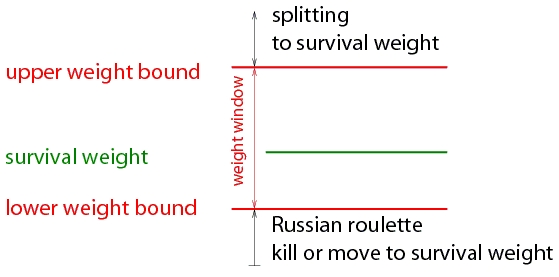
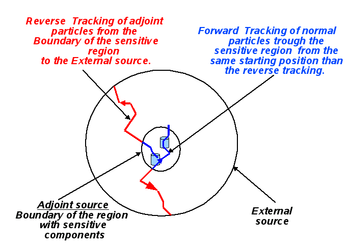

# 020 Event Biasing Techniques

## Scoring, Geometrical Importance Sampling and Weight Roulette

Geant4 provides event biasing techniques which may be used to save computing time in such applications as the simulation of radiation shielding. These are *geometrical splitting* and *Russian roulette* (also called geometrical importance sampling), and *weight roulette*. Scoring is carried out by `G4MultiFunctionalDetector` (see G4MultiFunctionalDetector and G4VPrimitiveScorer and Concrete classes of G4VPrimitiveScorer) using the standard Geant4 scoring technique. Biasing specific scorers have been implemented and are described within `G4MultiFunctionalDetector` documentation. In this chapter, it is assumed that the reader is familiar with both the usage of Geant4 and the concepts of importance sampling. More detailed documentation may be found in the documents 'Scoring, geometrical importance sampling and weight roulette'.

A detailed description of different use-cases which employ the sampling and scoring techniques can be found in the document 'Use cases of importance sampling and scoring in Geant4'.

The purpose of importance sampling is to save computing time by sampling less often the particle histories entering \"less important\" geometry regions, and more often in more \"important\" regions. Given the same amount of computing time, an importance-sampled and an analogue-sampled simulation must show equal mean values, while the importance-sampled simulation will have a decreased variance.

The implementation of scoring is independent of the implementation of importance sampling. However both share common concepts. *Scoring and importance sampling apply to particle types chosen by the user*, which should be borne in mind when interpreting the output of any biased simulation.

Examples on how to use scoring and importance sampling may be found in `examples/extended/biasing`.

### Geometries

The kind of scoring referred to in this note and the importance sampling apply to spatial cells provided by the user.

A **cell** is a physical volume (further specified by it's replica number, if the volume is a replica). Cells may be defined in two kinds of geometries:

1.  **mass geometry**: the geometry setup of the experiment to be simulated. Physics processes apply to this geometry.

2.  **parallel-geometry**: a geometry constructed to define the physical volumes according to which scoring and/or importance sampling is applied.

The user has the choice to score and/or sample by importance the particles of the chosen type, according to mass geometry or to parallel geometry. It is possible to utilize several parallel geometries in addition to the mass geometry. This provides the user with a lot of flexibility to define separate geometries for different particle types in order to apply scoring or/and importance sampling.

Note

Parallel geometries should be constructed using the implementation as described in Parallel Geometries. There are a few conditions for parallel geometries:

-   The world volume for parallel and mass geometries must be identical copies.

-   Scoring and importance cells must not share boundaries with the world volume.

### Changing the Sampling

Samplers are higher level tools which perform the necessary changes of the Geant4 sampling in order to apply importance sampling and weight roulette.

Variance reduction (and scoring through the `G4MultiFunctionalDetector`) may be combined arbitrarily for chosen particle types and may be applied to the mass or to parallel geometries.

The `G4GeometrySampler` can be applied equally to mass or parallel geometries with an abstract interface supplied by `G4VSampler`. `G4VSampler` provides `Prepare...` methods and a `Configure` method:

```text
class G4VSampler
{
  public:
   G4VSampler();
   virtual ~G4VSampler();
   virtual void PrepareImportanceSampling(G4VIStore *istore,
                                          const G4VImportanceAlgorithm
                                          *ialg = 0) = 0;
   virtual void PrepareWeightRoulett(G4double wsurvive = 0.5,
                                     G4double wlimit = 0.25,
                                     G4double isource = 1) = 0;
   virtual void PrepareWeightWindow(G4VWeightWindowStore *wwstore,
                                    G4VWeightWindowAlgorithm *wwAlg = 0,
                                    G4PlaceOfAction placeOfAction =
                                    onBoundary) = 0;
   virtual void Configure() = 0;
   virtual void ClearSampling() = 0;
   virtual G4bool IsConfigured() const = 0;
};
```

The methods for setting up the desired combination need specific information:

-   Importance sampling: message `PrepareImportanceSampling` with a `G4VIStore` and optionally a `G4VImportanceAlgorithm`

-   Weight window: message `PrepareWeightWindow` with the arguments:

    -   *\*wwstore*: a `G4VWeightWindowStore` for retrieving the lower weight bounds for the energy-space cells

    -   *\*wwAlg*: a `G4VWeightWindowAlgorithm` if a customized algorithm should be used

    -   *placeOfAction*: a `G4PlaceOfAction` specifying where to perform the biasing

-   Weight roulette: message `PrepareWeightRoulett` with the optional parameters:

    -   *wsurvive*: survival weight

    -   *wlimit*: minimal allowed value of weight \* source importance / cell importance

    -   *isource*: importance of the source cell

Each object of a sampler class is responsible for one particle type. The particle type is given to the constructor of the sampler classes via the particle type name, e.g. \"neutron\". Depending on the specific purpose, the `Configure()` of a sampler will set up specialized processes (derived from `G4VProcess`) for transportation in the parallel geometry, importance sampling and weight roulette for the given particle type. When `Configure()` is invoked the sampler places the processes in the correct order independent of the order in which user invoked the `Prepare...` methods.

Note

-   The `Prepare...()` functions may each only be invoked once.

-   To configure the sampling the function `Configure()` must be called *after* the `G4RunManager` has been initialized and the PhysicsList has been instantiated.

The interface and framework are demonstrated in the `examples/extended/biasing` directory, with the main changes being to the G4GeometrySampler class and the fact that in the parallel case the WorldVolume is a copy of the Mass World. The parallel geometry now has to inherit from `G4VUserParallelWorld` which also has the `GetWorld()` method in order to retrieve a copy of the mass geometry WorldVolume.

```text
class B02ImportanceDetectorConstruction : public G4VUserParallelWorld
ghostWorld = GetWorld();
```

The constructor for `G4GeometrySampler` takes a pointer to the physical world volume and the particle type name (e.g. \"neutron\") as arguments. In a single mass geometry the sampler is created as follows:

```text
G4GeometrySampler mgs(detector->GetWorldVolume(),"neutron");
mgs.SetParallel(false);
```

Whilst the following lines of code are required in order to set up the sampler for the parallel geometry case:

```text
G4VPhysicalVolume* ghostWorld = pdet->GetWorldVolume();

G4GeometrySampler pgs(ghostWorld,"neutron");

pgs.SetParallel(true);
```

Also note that the preparation and configuration of the samplers has to be carried out *after* the instantiation of the UserPhysicsList. With the modular reference PhysicsList the following set-up is required (first is for biasing, the second for scoring):

```text
physicsList->RegisterPhysics(new G4ImportanceBiasing(&pgs,parallelName));
physicsList->RegisterPhysics(new G4ParallelWorldPhysics(parallelName));
```

If the a UserPhysicsList is being implemented, then the following should be used to give the pointer to the GeometrySampler to the PhysicsList:

```text
physlist->AddBiasing(&pgs,parallelName);
```

Then to instantiate the biasing physics process the following should be included in the UserPhysicsList and called from `ConstructProcess()`:

```text
AddBiasingProcess(){
  fGeomSampler->SetParallel(true); // parallelworld
  G4IStore* iStore = G4IStore::GetInstance(fBiasWorldName);
  fGeomSampler->SetWorld(iStore->GetParallelWorldVolumePointer());
  //  fGeomSampler->PrepareImportanceSampling(G4IStore::
  //                              GetInstance(fBiasWorldName), 0);
  static G4bool first = true;
  if(first) {
    fGeomSampler->PrepareImportanceSampling(iStore, 0);

    fGeomSampler->Configure();
    G4cout << " GeomSampler Configured!!! " << G4endl;
    first = false;
  }

#ifdef G4MULTITHREADED
    fGeomSampler->AddProcess();
#else
  G4cout << " Running in singlethreaded mode!!! " << G4endl;
#endif
```

```text
pgs.PrepareImportanceSampling(G4IStore::GetInstance(pdet->GetName()), 0);
pgs.Configure();
```

Due to the fact that biasing is a process and has to be inserted after all the other processes have been created.

### Importance Sampling

Importance sampling acts on particles crossing boundaries between \"importance cells\". The action taken depends on the importance values assigned to the cells. In general a particle history is either split or Russian roulette is played if the importance increases or decreases, respectively. A weight assigned to the history is changed according to the action taken.

The tools provided for importance sampling require the user to have a good understanding of the physics in the problem. This is because the user has to decide which particle types require importance sampled, define the cells, and assign importance values to the cells. If this is not done properly the results cannot be expected to describe a real experiment.

The assignment of importance values to a cell is done using an importance store described below.

An \"importance store\" with the interface `G4VIStore` is used to store importance values related to cells. In order to do importance sampling the user has to create an object (e.g. of class `G4IStore`) of type `G4VIStore`. The samplers may be given a `G4VIStore`. The user fills the store with cells and their importance values. The store is now a singleton class so should be created using a GetInstance method:

```text
G4IStore *aIstore = G4IStore::GetInstance();
```

Or if a parallel world is used:

```text
G4IStore *aIstore = G4IStore::GetInstance(pdet->GetName());
```

An importance store has to be constructed with a reference to the world volume of the geometry used for importance sampling. This may be the world volume of the mass or of a parallel geometry. Importance stores derive from the interface `G4VIStore`:

```cpp
class  G4VIStore
{
  public:
    G4VIStore();
    virtual  ~G4VIStore();
    virtual G4double GetImportance(const G4GeometryCell &gCell) const = 0;
    virtual G4bool IsKnown(const G4GeometryCell &gCell) const = 0;
    virtual const G4VPhysicalVolume &GetWorldVolume() const = 0;
};
```

A concrete implementation of an importance store is provided by the class `G4VStore`. The *public* part of the class is:

```text
class G4IStore : public G4VIStore
{
  public:
    explicit G4IStore(const G4VPhysicalVolume &worldvolume);
    virtual ~G4IStore();
    virtual G4double GetImportance(const G4GeometryCell &gCell) const;
    virtual G4bool IsKnown(const G4GeometryCell &gCell) const;
    virtual const G4VPhysicalVolume &GetWorldVolume() const;
    void AddImportanceGeometryCell(G4double importance,
                             const G4GeometryCell &gCell);
    void AddImportanceGeometryCell(G4double importance,
                             const G4VPhysicalVolume &,
                                   G4int aRepNum = 0);
    void ChangeImportance(G4double importance,
                          const G4GeometryCell &gCell);
    void ChangeImportance(G4double importance,
                          const G4VPhysicalVolume &,
                                G4int aRepNum = 0);
    G4double GetImportance(const G4VPhysicalVolume &,
                                 G4int aRepNum = 0) const ;
  private: .....
};
```

The member function `AddImportanceGeometryCell()` enters a cell and an importance value into the importance store. The importance values may be returned either according to a physical volume and a replica number or according to a `G4GeometryCell`. The user must be aware of the interpretation of assigning importance values to a cell. If scoring is also implemented then this is attached to logical volumes, in which case the physical volume and replica number method should be used for assigning importance values. See `examples/extended/biasing B01` and `B02` for examples of this.

Note

An importance value must be assigned to every cell.

The different cases:

-   *Cell is not in store*

    Not filling a certain cell in the store will cause an exception.

-   *Importance value = zero*

    Tracks of the chosen particle type will be killed.

-   *importance values \> 0*

    Normal allowed values

-   *Importance value smaller zero*

    Not allowed!

### The Importance Sampling Algorithm

Importance sampling supports using a customized importance sampling algorithm. To this end, the sampler interface Changing the Sampling may be given a pointer to the interface `G4VImportanceAlgorithm`:

```text
class G4VImportanceAlgorithm
{
  public:
    G4VImportanceAlgorithm();
    virtual ~G4VImportanceAlgorithm();
    virtual G4Nsplit_Weight Calculate(G4double ipre,
                                      G4double ipost,
                                      G4double init_w) const = 0;
};
```

The method `Calculate()` takes the arguments:

-   *ipre*, *ipost* : importance of the previous cell and the importance of the current cell, respectively.

-   *init_w*: the particle's weight

It returns the struct:

```text
class G4Nsplit_Weight
{
  public:

  G4int fN;
  G4double fW;
};
```

-   *fN*: the calculated number of particles to exit the importance sampling

-   *fW*: the weight of the particles

The user may have a customized algorithm used by providing a class inheriting from `G4VImportanceAlgorithm`.

If no customized algorithm is given to the sampler the default importance sampling algorithm is used. This algorithm is implemented in `G4ImportanceAlgorithm`.

### The Weight Window Technique

The weight window technique is a weight-based alternative to importance sampling:

-   applies splitting and Russian roulette depending on space (cells) and energy

-   user defines weight windows in contrast to defining importance values as in importance sampling

In contrast to importance sampling this technique is not weight blind. Instead the technique is applied according to the particle weight with respect to the current energy-space cell.

Therefore the technique is convenient to apply in combination with other variance reduction techniques such as cross-section biasing and implicit capture.

A weight window may be specified for every cell and for several energy regions: *space-energy cell*.



[Fig. 6 ][Weight window concept]

**Weight window concept**

The user specifies a *lower weight bound W_L* for every space-energy cell.

-   The upper weight bound W_U and the survival weight W_S are calculated as:

    W_U = C_U *W_L* and

    W_S = C_S *W_L*.

-   The user specifies C_S and C_U once for the whole problem.

-   The user may give different sets of energy bounds for every cell or one set for all geometrical cells

-   Special case: if C_S = C_U = 1 for all energies then weight window is equivalent to importance sampling

-   The user can choose to apply the technique: at boundaries, on collisions or on boundaries and collisions

The energy-space cells are realized by `G4GeometryCell` as in importance sampling. The cells are stored in a weight window store defined by `G4VWeightWindowStore`:

```text
class  G4VWeightWindowStore {
 public:
   G4VWeightWindowStore();
   virtual  ~G4VWeightWindowStore();
   virtual G4double GetLowerWeitgh(const G4GeometryCell &gCell,
                                 G4double partEnergy) const = 0;
   virtual G4bool IsKnown(const G4GeometryCell &gCell) const = 0;
   virtual const G4VPhysicalVolume &GetWorldVolume() const = 0;
};
```

A concrete implementation is provided:

```text
class G4WeightWindowStore: public G4VWeightWindowStore {
 public:
   explicit G4WeightWindowStore(const G4VPhysicalVolume &worldvolume);
   virtual ~G4WeightWindowStore();
   virtual G4double GetLowerWeitgh(const G4GeometryCell &gCell,
                                   G4double partEnergy) const;
   virtual G4bool IsKnown(const G4GeometryCell &gCell) const;
   virtual const G4VPhysicalVolume &GetWorldVolume() const;
   void AddLowerWeights(const G4GeometryCell &gCell,
                        const std::vector<G4double> &lowerWeights);
   void AddUpperEboundLowerWeightPairs(const G4GeometryCell &gCell,
                                       const G4UpperEnergyToLowerWeightMap&
                                       enWeMap);
   void SetGeneralUpperEnergyBounds(const
       std::set<G4double, std::less<G4double> > & enBounds);

 private::
 ...
};
```

The user may choose equal energy bounds for all cells. In this case a set of upper energy bounds must be given to the store using the method `SetGeneralUpperEnergyBounds`. If a general set of energy bounds have been set `AddLowerWeights` can be used to add the cells.

Alternatively, the user may chose different energy regions for different cells. In this case the user must provide a mapping of upper energy bounds to lower weight bounds for every cell using the method `AddUpperEboundLowerWeightPairs`.

Weight window algorithms implementing the interface class `G4VWeightWindowAlgorithm` can be used to define a customized algorithm:

```text
class G4VWeightWindowAlgorithm {
 public:
   G4VWeightWindowAlgorithm();
   virtual ~G4VWeightWindowAlgorithm();
   virtual G4Nsplit_Weight Calculate(G4double init_w,
                                     G4double lowerWeightBound) const = 0;
};
```

A concrete implementation is provided and used as a default:

```text
class G4WeightWindowAlgorithm : public G4VWeightWindowAlgorithm {
 public:
   G4WeightWindowAlgorithm(G4double upperLimitFaktor = 5,
                           G4double survivalFaktor = 3,
                           G4int maxNumberOfSplits = 5);
   virtual ~G4WeightWindowAlgorithm();
   virtual G4Nsplit_Weight Calculate(G4double init_w,
                                     G4double lowerWeightBound) const;
 private:
  ...
};
```

The constructor takes three parameters which are used to: calculate the upper weight bound (upperLimitFaktor), calculate the survival weight (survivalFaktor), and introduce a maximal number (maxNumberOfSplits) of copies to be created in one go.

In addition, the inverse of the maxNumberOfSplits is used to specify the minimum survival probability in case of Russian roulette.

### The Weight Roulette Technique

Weight roulette (also called weight cutoff) is usually applied if importance sampling and implicit capture are used together. Implicit capture is not described here but it is useful to note that this procedure reduces a particle weight in every collision instead of killing the particle with some probability.

Together with importance sampling the weight of a particle may become so low that it does not change any result significantly. Hence tracking a very low weight particle is a waste of computing time. Weight roulette is applied in order to solve this problem.

**The weight roulette concept**

Weight roulette takes into account the importance \"Ic\" of the current cell and the importance \"Is\" of the cell in which the source is located, by using the ratio \"R=Is/Ic\".

Weight roulette uses a relative minimal weight limit and a relative survival weight. When a particle falls below the weight limit Russian roulette is applied. If the particle survives, tracking will be continued and the particle weight will be set to the survival weight.

The weight roulette uses the following parameters with their default values:

-   *wsurvival*: 0.5

-   *wlimit*: 0.25

-   *isource*: 1

The following algorithm is applied:

If a particle weight \"w\" is lower than R\*wlimit:

-   the weight of the particle will be changed to \"ws = wsurvival\*R\"

-   the probability for the particle to survive is \"p = w/ws\"

## Physics Based Biasing

Geant4 supports physics based biasing through a number of general use, built in biasing techniques. A utility class, G4WrapperProcess, is also available to support user defined biasing.

### Built in Biasing Options

#### Primary Particle Biasing

Primary particle biasing can be used to increase the number of primary particles generated in a particular phase space region of interest. The weight of the primary particle is modified as appropriate. A general implementation is provided through the `G4GeneralParticleSource` class. It is possible to bias position, angular and energy distributions.

`G4GeneralParticleSource` is a concrete implementation of `G4VPrimaryGenerator`. To use, instantiate `G4GeneralParticleSource` in the `G4VUserPrimaryGeneratorAction` class, as demonstrated below.

```text
MyPrimaryGeneratorAction::MyPrimaryGeneratorAction() {
   generator = new G4GeneralParticleSource;
}

void
MyPrimaryGeneratorAction::GeneratePrimaries(G4Event*anEvent){
   generator->GeneratePrimaryVertex(anEvent);
}
```

The biasing can be configured through interactive commands, as described in  General Particle Source. Examples are also distributed with the Geant4 distribution in **examples/extended/eventgenerator/exgps**.

#### Hadronic Leading Particle Biasing

One hadronic leading particle biasing technique is implemented in the G4HadLeadBias utility. This method keeps only the most important part of the event, as well as representative tracks of each given particle type. So the track with the highest energy as well as one of each of Baryon, pi0, mesons and leptons. As usual, appropriate weights are assigned to the particles. Setting the **SwitchLeadBiasOn** environmental variable will activate this utility.

#### Hadronic Cross Section Biasing

Cross section biasing artificially enhances/reduces the cross section of a process. This may be useful for studying thin layer interactions or thick layer shielding. The built in hadronic cross section biasing applies to photon inelastic, electron nuclear and positron nuclear processes.

The biasing is controlled through the **BiasCrossSectionByFactor** method in G4HadronicProcess, as demonstrated below.

```text
void MyPhysicsList::ConstructProcess()
{
   ...
   G4ElectroNuclearReaction * theElectroReaction =
      new G4ElectroNuclearReaction;

   G4ElectronNuclearProcess theElectronNuclearProcess;
   theElectronNuclearProcess.RegisterMe(theElectroReaction);
   theElectronNuclearProcess.BiasCrossSectionByFactor(100);

   pManager->AddDiscreteProcess(&theElectronNuclearProcess);
   ...
}
```

### Radioactive Decay Biasing

The `G4RadioactiveDecay` (GRDM) class simulates the decay of radioactive nuclei and implements the following biasing options:

-   Increase the sampling rate of radionuclides within observation times through a user defined probability distribution function

-   Nuclear splitting, where the parent nuclide is split into a user defined number of nuclides

-   Branching ratio biasing where branching ratios are sampled with equal probability

G4RadioactiveDecay is a process which must be registered with a process manager, as demonstrated below.

```text
void MyPhysicsList::ConstructProcess()
{
   ...
   G4RadioactiveDecay* theRadioactiveDecay =
      new  G4RadioactiveDecay();

   G4ProcessManager* pmanager = ...
   pmanager ->AddProcess(theRadioactiveDecay);
   ...
}
```

Biasing can be controlled either in compiled code or through interactive commands. Radioactive decay biasing examples are also distributed with the Geant4 distribution in **examples/extended/radioactivedecay/exrdm**.

To select biasing as part of the process registration, use

```text
theRadioactiveDecay->SetAnalogueMonteCarlo(false);
```

or the equivalent macro command:

```text
/process/had/rdm/analogueMC [true|false]
```

In both cases, *true* specifies that the unbiased (analogue) simulation will be done, and *false* selects biasing.

#### Limited Radionuclides

Radioactive decay may be restricted to only specific nuclides, in order (for example) to avoid tracking extremely long-lived daughters in decay chains which are not of experimental interest. To limit the range of nuclides decayed as part of the process registration (above), use

```text
G4NucleusLimits limits(aMin, aMax, zMin, zMax);
theRadioactiveDecay->SetNucleusLimits(limits);
```

or via the macro command

```text
/process/had/rdm/nucleusLimits [aMin] [aMax] [zMin] [zMax]
```

#### Geometric Biasing

Radioactive decays may be generated throughout the user's detector model, in one or more specified volumes, or nowhere. The detector geometry must be defined before applying these geometric biases.

Volumes may be selected or deselected programmatically using

```text
theRadioactiveDecay->SelectAllVolumes();
theRadioactiveDecay->DeselectAllVolumes();

G4LogicalVolume* aLogicalVolume;        // Acquired by the user
theRadioactiveDecay->SelectVolume(aLogicalVolume);
theRadioactiveDecay->DeselectVolume(aLogicalVolume);
```

or with the equivalent macro commands

```text
/process/had/rdm/allVolumes
/process/had/rdm/noVolumes
/process/had/rdm/selectVolume [logicalVolume]
/process/had/rdm/deselectVolume [logicalVolume]
```

In macro commands, the volumes are specified by name, and found by searching the `G4LogicalVolumeStore`.

#### Decay Time Biasing

The decay time function (normally an exponential in the natural lifetime) of the primary particle may be replaced with a *time profile* F(t), as discussed in Section 40.6 of the *Physics Reference Manual*. The profile function is represented as a two-column ASCII text file with up to 100 time points (first column) with fractions (second column).

```text
theRadioactiveDecay->SetSourceTimeProfile(fileName);
theRadioactiveDecay->SetDecayBias(fileName);
```

```text
/process/had/rdm/sourceTimeProfile [fileName]
/process/had/rdm/decayBiasProfile [fileName]
```

#### Branching Fraction Biasing

Radionuclides with rare decay channels may be biased by forcing all channels to be selected uniformly (`BRBias` = *true* below), rather than according to their natural branching fractions (*false*).

```text
theRadioactiveDecay->SetBRBias(true);
```

```text
/process/had/rdm/BRbias [true|false]
```

#### Nuclear Splitting

The statistical efficiency of generated events may be increased by generating multiple \"copies\" of nuclei in an event, each of which is decayed independently, with an assigned weight of 1/Nsplit. Scoring the results of tracking the decay daughters, using their corresponding weights, can improve the statistical reach of a simulation while preserving the shape of the resulting distributions.

```text
theRadioactiveDecay->SetSplitNuclei(Nsplit);
```

```text
/process/had/rdm/splitNucleus [Nsplit]
```

### G4WrapperProcess

G4WrapperProcess can be used to implement user defined event biasing. G4WrapperProcess, which is a process itself, wraps an existing process. By default, all function calls are forwarded to the wrapped process. It is a non-invasive way to modify the behaviour of an existing process.

To use this utility, first create a derived class inheriting from G4WrapperProcess. Override the methods whose behaviour you would like to modify, for example, PostStepDoIt, and register the derived class in place of the process to be wrapped. Finally, register the wrapped process with G4WrapperProcess. The code snippets below demonstrate its use.

```text
class MyWrapperProcess  : public G4WrapperProcess {
...
 G4VParticleChange* PostStepDoIt(const G4Track& track,
                                 const G4Step& step) {
    // Do something interesting
 }
};

void MyPhysicsList::ConstructProcess()
{
...
   G4eBremsstrahlung* bremProcess =
      new G4eBremsstrahlung();

   MyWrapperProcess* wrapper = new MyWrapperProcess();
   wrapper->RegisterProcess(bremProcess);

   processManager->AddProcess(wrapper, -1, -1, 3);
}
```

## Adjoint/Reverse Monte Carlo

Another powerful biasing technique available in Geant4 is the Reverse Monte Carlo (RMC) method, also known as the Adjoint Monte Carlo method. In this method particles are generated on the external boundary of the sensitive part of the geometry and then are tracked backward in the geometry till they reach the external source surface, or exceed an energy threshold. By this way the computing time is focused only on particle tracks that are contributing to the tallies. The RMC method is much rapid than the Forward MC method when the sensitive part of the geometry is small compared to the rest of the geometry and to the external source, that has to be extensive and not beam like. At the moment the RMC method is implemented in Geant4 only for some electromagnetic processes (see Reverse processes). An example illustrating the use of the Reverse MC method in Geant4 is distributed within the Geant4 toolkit in **examples/extended/biasing/ReverseMC01**.

### Treatment of the Reverse MC method in Geant4

Different G4Adjoint classes have been implemented into the Geant4 toolkit in order to run an adjoint/reverse simulation in a Geant4 application. This implementation is illustrated in Fig. 7. An adjoint run is divided in a series of alternative adjoint and forward tracking of adjoint and normal particles. One Geant4 event treats one of this tracking phase.

[]

[Fig. 7 ][Schematic view of an adjoint/reverse simulation in Geant4.]

#### Adjoint tracking phase

Adjoint particles (adjoint_e-, adjoint_gamma,\...) are generated one by one on the so called adjoint source with random position, energy (1/E distribution) and direction. The adjoint source is the external surface of a user defined volume or of a user defined sphere. The adjoint source should contain one or several sensitive volumes and should be small compared to the entire geometry. The user can set the minimum and maximum energy of the adjoint source. After its generation the adjoint primary particle is tracked backward in the geometry till a user defined external surface (spherical or boundary of a volume) or is killed before if it reaches a user defined upper energy limit that represents the maximum energy of the external source. During the reverse tracking, reverse processes take place where the adjoint particle being tracked can be either scattered or transformed in another type of adjoint particle. During the reverse tracking the G4AdjointSimulationManager replaces the user defined primary, run, stepping, \... actions, by its own actions. A reverse tracking phase corresponds to one Geant4 event.

#### Forward tracking phase

When an adjoint particle reaches the external surface its weight, type, position, and direction are registered and a normal primary particle, with a type equivalent to the last generated primary adjoint, is generated with the same energy, position but opposite direction and is tracked in the forward direction in the sensitive region as in a forward MC simulation. During this forward tracking phase the event, stacking, stepping, tracking actions defined by the user for his forward simulation are used. By this clear separation between adjoint and forward tracking phases, the code of the user developed for a forward simulation should be only slightly modified to adapt it for an adjoint simulation (see How to update a G4 application to use the reverse Monte Carlo mode). Indeed the computation of the signals is done by the same actions or classes that the one used in the forward simulation mode. A forward tracking phase corresponds to one G4 event.

#### Reverse processes

During the reverse tracking, reverse processes act on the adjoint particles. The reverse processes that are at the moment available in Geant4 are the:

-   Reverse discrete ionization for e-, proton and ions

-   Continuous gain of energy by ionization and bremsstrahlung for e- and by ionization for protons and ions

-   Reverse discrete e- bremsstrahlung

-   Reverse photo-electric effect

-   Reverse Compton scattering

-   Approximated multiple scattering (see comment in Reverse multiple scattering)

It is important to note that the electromagnetic reverse processes are cut dependent as their equivalent forward processes. The implementation of the reverse processes is based on the forward processes implemented in the G4 standard electromagnetic package.

#### Nb of adjoint particle types and nb of G4 events of an adjoint simulation

The list of type of adjoint and forward particles that are generated on the adjoint source and considered in the simulation is a function of the adjoint processes declared in the physics list. For example if only the e- and gamma electromagnetic processes are considered, only adjoint e- and adjoint gamma will be considered as primaries. In this case an adjoint event will be divided in four G4 event consisting in the reverse tracking of an adjoint e-, the forward tracking of its equivalent forward e-, the reverse tracking of an adjoint gamma, and the forward tracking of its equivalent forward gamma. In this case a run of 100 adjoint events will consist into 400 Geant4 events. If the proton ionization is also considered adjoint and forward protons are also generated as primaries and 600 Geant4 events are processed for 100 adjoint events.

### How to update a G4 application to use the reverse Monte Carlo mode

Some modifications are needed to an existing Geant4 application in order to adapt it for the use of the reverse simulation mode (see also the G4 example **examples/extended/biasing/ReverseMC01**). It consists into the:

-   Creation of the adjoint simulation manager in the main code

-   Optional declaration of user actions that will be used during the adjoint tracking phase

-   Use of a special physics lists that combine the adjoint and forward processes

-   Modification of the user analysis part of the code

#### Creation of G4AdjointSimManager in the main

The class G4AdjointSimManager represents the manager of an adjoint simulation. This static class should be created somewhere in the main code. The way to do that is illustrated below

```text
int main(int argc,char** argv) {
   ...
   G4AdjointSimManager* theAdjointSimManager = G4AdjointSimManager::GetInstance();
   ...
}
```

By doing this the G4 application can be run in the reverse MC mode as well as in the forward MC mode. It is important to note that G4AdjointSimManager is not a new G4RunManager and that the creation of G4RunManager in the main and the declaration of the geometry, physics list, and user actions to G4RunManager is still needed. The definition of the adjoint and external sources and the start of an adjoint simulation can be controlled by G4UI commands in the directory **/adjoint**.

#### Optional declaration of adjoint user actions

During an adjoint simulation the user stepping, tracking, stacking and event actions declared to G4RunManager are used only during the G4 events dedicated to the forward tracking of normal particles in the sensitive region, while during the events where adjoint particles are tracked backward the following happen concerning these actions:

-   The user stepping action is replaced by G4AdjointSteppingAction that is responsible to stop an adjoint track when it reaches the external source, exceed the maximum energy of the external source, or cross the adjoint source surface. If needed the user can declare its own stepping action that will be called by G4AdjointSteppingAction after the check of stopping track conditions. This stepping action can be different that the stepping action used for the forward simulation. It is declared to G4AdjointSimManager by the following lines of code:

    ```text
    G4AdjointSimManager* theAdjointSimManager = G4AdjointSimManager::GetInstance();
    theAdjointSimManager->SetAdjointSteppingAction(aUserDefinedSteppingAction);
    ```

-   No stacking, tracking and event actions are considered by default. If needed the user can declare to G4AdjointSimManager stacking, tracking and event actions that will be used only during the adjoint tracking phase. The following lines of code show how to declare these adjoint actions to G4AdjointSimManager:

    ```text
    G4AdjointSimManager* theAdjointSimManager = G4AdjointSimManager::GetInstance();
    theAdjointSimManager->SetAdjointEventAction(aUserDefinedEventAction);
    theAdjointSimManager->SetAdjointStackingAction(aUserDefinedStackingAction);
    theAdjointSimManager->SetAdjointTrackingAction(aUserDefinedTrackingAction);
    ```

By default no user run action is considered in an adjoint simulation but if needed such action can be declared to G4AdjointSimManager as such:

```text
G4AdjointSimManager* theAdjointSimManager = G4AdjointSimManager::GetInstance();
theAdjointSimManager->SetAdjointRunAction(aUserDefinedRunAction);
```

#### Physics list for reverse and forward electromagnetic processes

To run an adjoint simulation a specific physics list should be used where existing G4 adjoint electromagnetic processes and their forward equivalent have to be declared. An example of such physics list is provided by the class G4AdjointPhysicsLits in the G4 example **extended/biasing/ReverseMC01**.

#### Modification in the analysis part of the code

The user code should be modified to normalize the signals computed during the forward tracking phase to the weight of the last adjoint particle that reaches the external surface. This weight represents the statistical weight that the last full adjoint tracks (from the adjoint source to the external source) would have in a forward simulation. If multiplied by a signal and registered in function of energy and/or direction the simulation results will give an answer matrix of this signal. To normalize it to a given spectrum it has to be furthermore multiplied by a directional differential flux corresponding to this spectrum The weight, direction, position , kinetic energy and type of the last adjoint particle that reaches the external source, and that would represents the primary of a forward simulation, can be gotten from G4AdjointSimManager by using for example the following line of codes

```text
G4AdjointSimManager* theAdjointSimManager = G4AdjointSimManager::GetInstance();
G4String particle_name = theAdjointSimManager->GetFwdParticleNameAtEndOfLastAdjointTrack();
G4int PDGEncoding= theAdjointSimManager->GetFwdParticlePDGEncodingAtEndOfLastAdjointTrack();
G4double weight = theAdjointSimManager->GetWeightAtEndOfLastAdjointTrack();
G4double Ekin  = theAdjointSimManager->GetEkinAtEndOfLastAdjointTrack();
G4double Ekin_per_nuc=theAdjointSimManager->GetEkinNucAtEndOfLastAdjointTrack(); // for ions
G4ThreeVector dir =  theAdjointSimManager->GetDirectionAtEndOfLastAdjointTrack();
G4ThreeVector pos = theAdjointSimManager->GetPositionAtEndOfLastAdjointTrack();
```

In order to have a code working for both forward and adjoint simulation mode, the extra code needed in user actions or analysis manager for the adjoint simulation mode can be separated to the code needed only for the normal forward simulation by using the following public method of G4AdjointSimManager:

```text
G4bool GetAdjointSimMode();
```

that returns true if an adjoint simulation is running and false if not.

The following code example shows how to normalize a detector signal and compute an answer matrix in the case of an adjoint simulation.

```cpp
G4double S = ...; // signal in the sensitive volume computed during a forward tracking phase

//Normalization of the signal for an adjoint simulation
G4AdjointSimManager* theAdjSimManager = G4AdjointSimManager::GetInstance();
if (theAdjSimManager->GetAdjointSimMode()) {
  G4double normalized_S=0.;        //normalized to a given e- primary spectrum
  G4double S_for_answer_matrix=0.; //for e- answer matrix

  if (theAdjSimManager->GetFwdParticleNameAtEndOfLastAdjointTrack() == "e-") {
    G4double ekin_prim = theAdjSimManager->GetEkinAtEndOfLastAdjointTrack();
    G4ThreeVector dir_prim =  theAdjointSimManager->GetDirectionAtEndOfLastAdjointTrack();
    G4double weight_prim = theAdjSimManager->GetWeightAtEndOfLastAdjointTrack();
    S_for_answer_matrix = S*weight_prim;
    normalized_S = S_for_answer_matrix*F(ekin_prim,dir);
    // F(ekin_prim,dir_prim) gives the differential directional flux of primary e-
  }
  //follows the code where normalized_S and S_for_answer_matrix are registered or whatever
   ....
}

//analysis/normalization code for forward simulation
else {
  ....
}
....
```

### Control of an adjoint simulation

The G4UI commands in the directory /adjoint. allow the user to :

-   Define the adjoint source where adjoint primaries are generated

-   Define the external source till which adjoint particles are tracked

-   Start an adjoint simulation

### Known issues in the Reverse MC mode

#### Occasional wrong high weight in the adjoint simulation

In rare cases an adjoint track may get a wrong high weight when reaching the external source. While this happens not often it may corrupt the simulation results significantly. This happens in some tracks where both reverse photo-electric and bremsstrahlung processes take place at low energy. We still need some investigations to remove this problem at the level of physical adjoint/reverse processes. However this problem can be solved at the level of event actions or analysis in the user code by adding a test on the normalized signal during an adjoint simulation. An example of such test has been implemented in the Geant4 example **extended/biasing/ReverseMC01**. In this implementation an event is rejected when the relative error of the computed normalized energy deposited increases during one event by more than 50% while the computed precision is already below 10%.

#### Reverse bremsstrahlung

A difference between the differential cross sections used in the adjoint and forward bremsstrahlung models is the source of a higher flux of \>100 keV gamma in the reverse simulation compared to the forward simulation mode. In principle the adjoint processes/models should make use of the direct differential cross section to sample the adjoint secondaries and compute the adjoint cross section. However due to the way the effective differential cross section is considered in the forward model G4eBremsstrahlungModel this was not possible to achieve for the reverse bremsstrahlung. Indeed the differential cross section used in G4AdjointeBremstrahlungModel is obtained by the numerical derivation over the cut energy of the direct cross section provided by G4eBremsstrahlungModel. This would be a correct procedure if the distribution of secondary in G4eBremsstrahlungModel would match this differential cross section. Unfortunately it is not the case as independent parameterization are used in G4eBremsstrahlungModel for both the cross sections and the sampling of secondaries. (It means that in the forward case if one would integrate the effective differential cross section considered in the simulation we would not find back the used cross section). In the future we plan to correct this problem by using an extra weight correction factor after the occurrence of a reverse bremsstrahlung. This weight factor should be the ratio between the differential CS used in the adjoint simulation and the one effectively used in the forward processes. As it is impossible to have a simple and direct access to the forward differential CS in G4eBremsstrahlungModel we are investigating the feasibility to use the differential CS considered in G4Penelope models.

#### Reverse multiple scattering

For the reverse multiple scattering the same model is used than in the forward case. This approximation makes that the discrepancy between the adjoint and forward simulation cases can get to a level of \~ 10-15% relative differences in the test cases that we have considered. In the future we plan to improve the adjoint multiple scattering models by forcing the computation of multiple scattering effect at the end of an adjoint step.

## Generic Biasing

The generic biasing scheme provides facilities for:

-   physics-based biasing, to alter the behavior of existing physics processes:

    -   biasing of physics process interaction occurrence,

    -   biasing of physics process final state production;

-   non-physics-based biasing, to introduce or remove particles in the simulation but without affecting the existing physics processes, with techniques like, but not limited to

    -   splitting,

    -   Russian roulette (killing).

Decisions on what techniques to apply are taken on a step by step and intra-step basis, hence providing a lot of flexibility.

The scheme has been introduced in 10.0, with new features and some non-backward compatible changes introduced in 10.1 and 10.2; these are documented in Changes from 10.0 to 10.1 and Changes from 10.1 to 10.2. Parallel geometry capability has been introduced in 10.3.

### Overview

The generic biasing scheme relies on two abstract classes, that are meant to model the biasing problems. You have to inherit from them to create your own concrete classes, or use some of the concrete instances provided (see Existing biasing operations, operator and interaction laws), if they respond to your case. A dedicated process provides the interface between these biasing classes and the tracking. In case of parallel geometry usage, an other process handles the navigation in these geometries.

The two abstract classes are:

-   `G4VBiasingOperation`: which represents a simple, or \"atomic\" biasing operation, like changing a process interaction occurrence probability, or changing its final state production, or making a splitting operation, etc. For the occurrence biasing case, the biasing is handled with an other class, **\`\`G4VBiasingInteractionLaw\`\`**, which holds the properties of the biased interaction law. An object of this class type must be provided by the occurrence biasing operation returned.

-   `G4VBiasingOperator`: which purpose is to make decisions on the above biasing operations to be applied. It is attached to a G4LogicalVolume and is the pilot of the biasing in this volume. An operator may decide to delegate to other operators. An operator acts only in the `G4LogicalVolume` it is attached to. In volumes with no biasing operator attached, the usual tracking is applied.

The process acting as interface between the biasing classes and the tracking is:

-   `G4BiasingProcessInterface`: it is a concrete `G4VProcess` implementation. It interrogates the current biasing operator, if any, for biasing operations to be applied. The `G4BiasingProcessInterface` can either:

    -   hold a physics process that it wraps and controls: in this case it asks the operator for physics-based biasing operations (only) to be applied to the wrapped process,

    -   not hold a physics process: in this case it asks the operator for non-physics-based biasing operations (only): splitting, killing, etc.

-   The `G4BiasingProcessInterface` class provides many information that can be used by the biasing operator. Each `G4BiasingProcessInterface` provides its identity to the biasing operator it calls, so that the operator has this information but also information of the underneath wrapped physics process, if it is the case.

    The `G4BiasingProcessInterface` can be asked for all other `G4BiasingProcessInterface` instances at play on the current track. In particular, this allows the operator to get all cross-sections at the current point (feature available since 10.1). The code is organized in such a way that these cross-sections are all available at the first call to the operator in the current step.

-   To make `G4BiasingProcessInterface` instances wrapping physics processes, or to insert instances not holding a physics process, the physics list has to be modified -the generic biasing approach is hence invasive to the physics list-. The way to configure your physics list and related helper tools are described below.

The process handling parallel geometries is:

-   `G4ParallelGeometriesLimiterProcess`, it is a concrete `G4VProcess` implementation, which takes care of limiting the step on the boundaries of parallel geometries.

-   A single instance of `G4ParallelGeometriesLimiterProcess` handles all parallel geometries to be considered for a particle type. It collects these geometries by means of `myLimiterProcess->AddParallelWorld("myParallelGeometry")` calls.

    Given such a process is attached to a particle type, parallel geometries are hence specified per particle type.

-   Attaching an instance of this process to a given particle type, and specifying the parallel geometries to be considered is eased by the helper tools as explained below.

### Getting Started

#### Examples

Seven \"Generic Biasing (GB)\" examples are proposed (they have been introduced in 10.0, 10.1, 10.3 and 10.6):

-   `examples/extended/biasing/GB01`:

    -   which shows how biasing of process cross-section can be done.

    -   This example uses the physics-based biasing operation `G4BOptnChangeCrossSection` defined in `geant4/source/processes/biasing/generic`. This operation performs the actual process cross-section change. In the example a first `G4VBiasingOperator`, `GB01BOptrChangeCrossSection`, configures and selects this operation. This operator applies to only one particle type.

    -   To allow several particle types to be biased, a second `G4VBiasingOperator`, `GB01BOptrMultiParticleChangeCrossSection`, is implemented, and which holds a `GB01BOptrChangeCrossSection` operator for each particle type to be biased. This second operator then delegates to the first one the handling of the biasing operations.

-   `examples/extended/biasing/GB02`:

    -   which shows how a \"force collision\" scheme very close to the MCNP one can be activated.

    -   This second example has a quite similar approach than the `GB01` one, with a `G4VBiasingOperator`, `QGB02BOptrMultiParticleForceCollision`, that holds as many operators than particle types to be biased, this operators being of `G4BOptrForceCollision` type.

    -   This `G4BOptrForceCollision` operator is defined in `source/processes/biasing/generic`. It combines several biasing operations to build-up the needed logic (see Setting up the application). It can be in particular looked at to see how it collects and makes use of physics process cross-sections.

-   `examples/extended/biasing/GB03`:

    -   which implements a kind of importance geometry biasing, using the generic biasing classes.

    -   The example uses a simple sampling calorimeter. On the boundary of the absorber parts, it does splitting (killing) if the track is moving forward (backward). As the splitting can be too strong in some cases, falling into an over-splitting situation, even with a splitting by a factor 2, a technique is introduced to alleviate the problem : a probability to apply the splitting (killing) is introduced, and with proper tuning of this probability, the over-splitting can be avoided.

-   `examples/extended/biasing/GB04`:

    -   which implements a bremsstrahlung splitting. Bremsstrahlung splitting exists in the EM package. In the present example, it is shown how to implement a similar technique, using the generic biasing classes.

    -   A biasing operator, `GB04BOptrBremSplitting`, sends a final state biasing operation, `GB04BOptnBremSplitting`, for the bremsstrahlung process. Splitting factor, and options to control the biasing are available through command line.

-   `examples/extended/biasing/GB05`:

    -   which illustrates a technique that uses physics cross-sections to determine the splitting\[killing\] rate in a shielding problem, it is applied to neutrons. This technique is supposed to be an invention, to illustrate a technique combining physics-based information with splitting/killing.

    -   In the classical treatment of the shielding problem, the shield is divided in slices at the boundaries of which particles are splitted\[killed\] if moving forward\[backward\]. In the present technique, we collect the cross-sections of \"absorbing/destroying\" processes : decay, capture, inelastic. We then use the generic biasing facilities to create an equivalent of a splitting process, that has a \"cross-section\" which is the sum of the previous ones. This process is competing with other processes, as a regular one. When this process wins the competition, it splits the track, with a splitting factor 2. This splitting is hence occurring at the same rate than the absorption, resulting in an expected maintained (unweighted) flux.

    -   `GB05BOptrSplitAndKillByCrossSection` and `GB05BOptnSplitAndKillByCrossSection` are respectively the biasing operator and operation. The operator collects the absorbing cross-sections at the beginning of the step, passes them to the operation, requests it to sample the distance to its next interaction, and returns this operation to the calling `G4BiasingProcessInterface` as the operation to be applied in the step.

    -   The operation interaction distance is then proposed by the calling `G4BiasingProcessInterface` and, if being the shortest of the interaction distances, the operation final state generation (the splitting) is applied by the process.

-   `examples/extended/biasing/GB06`:

    -   which demonstrates the use of parallel geometries in generic biasing, on a classical shield problem, using geometry-based importance biasing.

    -   The mass geometry consists of a single block of concrete; it is overlayed by a parallel geometry defining the slices used for splitting/killing.

    -   The navigation capability in the parallel geometry is activated in the main program, by means of the physics list constructor.

-   `examples/extended/biasing/GB07`:

    -   which demonstrates the use of the leading particle biasing technique in generic biasing.

    -   The mass geometry consists of a block of concrete in which the biasing is applied. A thin volume then follows to score (simple printing) the particles leaving the block of concrete.

#### Setting up the application

For making an existing `G4VBiasingOperator` used by your application, you have to do two things:

1.  Attach the operator to the `G4LogicalVolume` where the biasing should take place: You have to make this attachment in your `ConstructSDandField()` method (to make your application both sequential and MT-compliant):

    ```cpp
    // Fetch the logical volume pointer by name (it is an example, not a mandatory way):
    G4LogicalVolume* biasingVolume = G4LogicalVolumeStore::GetInstance()->GetVolume("volumeWithBiasing");
    // Create the biasing operator:
    MyBiasingOperator* myBiasingOperator = new MyBiasingOperator("ExampleOperator");
    // Attach it to the volume:
    myBiasingOperator->AttachTo(biasingVolume);
    ```

2.  Setup the physics list you use to properly include the needed `G4BiasingProcessInterface` instances. You have several options for this.

    -   The easiest way is if you use a pre-packaged physics list (e.g. `FTFP_BERT`, `QGSP`\...). As such a physics list is of `G4VModularPhysicsList` type, you can alter it with a `G4VPhysicsConstructor`. The constructor `G4GenericBiasingPhysics` is meant for this. It can be used, typically in your main program, as:

        ```cpp
        // Instantiate the physics list:
        FTFP_BERT* physicsList = new FTFP_BERT;
        // Create the physics constructor for biasing:
        G4GenericBiasingPhysics* biasingPhysics = new G4GenericBiasingPhysics();
        // Tell what particle types have to be biased:
        biasingPhysics->Bias("gamma");
        biasingPhysics->Bias("neutron");
        // Register the physics constructor to the physics list:
        physicsList->RegisterPhysics(biasingPhysics);
        // Set this physics list to the run manager:
        runManager->SetUserInitialization(physicsList);
        ```

        Doing so, all physics processes will be wrapped, and, for example, the gamma conversion process, `"conv"`, will appear as `"biasWrapper(conv)"` when dumping the processes (`/particle/process/dump`). An additional `"biasWrapper(0)"` process, for non-physics-based biasing is also inserted.

        Other methods to specifically chose some physics processes to be biased or to insert only `G4BiasingProcessInterface` instances for non-physics-based biasing also exist.

    -   The second way is useful if you write your own physics list, and if this one is not a modular physics list, but inherits directly from the lowest level abstract class `G4VUserPhysicsList`. In this case, the above solution with `G4GenericBiasingPhysics` does not apply. Instead you can use the `G4BiasingHelper` utility class (this one is indeed used by `G4GenericBiasingPhysics`).

        ```cpp
        // Get physics list helper:
        G4PhysicsListHelper* ph = G4PhysicsListHelper::GetPhysicsListHelper();
        ...
        // Assume "particle" is a pointer on a G4ParticleDefinition object
        G4String particleName = particle->GetParticleName();
        if (particleName == "gamma")
        {
        ph->RegisterProcess(new G4PhotoElectricEffect , particle);
        ph->RegisterProcess(new G4ComptonScattering ,   particle);
        ph->RegisterProcess(new G4GammaConversion ,     particle);
        G4ProcessManager* pmanager = particle->GetProcessManager();
        G4BiasingHelper::ActivatePhysicsBiasing(pmanager, "phot");
        G4BiasingHelper::ActivatePhysicsBiasing(pmanager, "compt");
        G4BiasingHelper::ActivatePhysicsBiasing(pmanager, "conv");
        G4BiasingHelper::ActivateNonPhysicsBiasing(pmanager);
        }
        ```

    -   A last way to setup the physics list is by direct insertion of the `G4BiasingProcessInterface` instances, but this requires solid expertise in physics list creation.

In case you also use parallel geometries, you have to make the generic biasing sensitive to these. Assuming you have created three parallel geometries with names `"parallelWorld1"`, `"parallelWorld2"` and `"parallelWorld3"` that you want to be active for neutrons, the additional calls you have to make compared to example EvtBias.GenericBiasing.Overview.UsePhysConstructor above are simply:

```cpp
// -- activate parallel geometries for neutrons:
biasingPhysics->AddParallelGeometry("neutron","parallelWorld1");
biasingPhysics->AddParallelGeometry("neutron","parallelWorld2");
biasingPhysics->AddParallelGeometry("neutron","parallelWorld3");
```

It is also possible, even though less convenient, to use the `G4BiasingHelper` utility class making calls to the static method `limiter = G4BiasingHelper::AddLimiterProcess(pmanager,"limiterProcessName")` in addition to the ones of example EvtBias.GenericBiasing.Overview.UseBiasingHelper above. This call returns a pointer `limiter` on the constructed `G4ParallelGeometriesLimiterProcess` process, setting its name as `"limiterProcessName"`, this pointer has then to be used to specify the parallel geometries to the process : `limiter->AddParallelWorld("parallelWorld1")`\...

### Existing biasing operations, operator and interaction laws

Below are the set of available concrete biasing operations, operators and interaction laws. These are defined in `source/processes/biasing/generic`. Please note that several examples (Examples) also implement dedicated operators and operations.

-   Concrete implementation classes of `G4VBiasingOperation`:

    -   `G4BOptnCloning`: a non-physics-based biasing operation that clones the current track. Each of the two copies is given freely a weight.

    -   `G4BOptnChangeCrossSection`: a physics-based biasing operation to change one process cross-section

    -   `G4BOptnForceFreeFlight`: a physics-based biasing operation to force a flight with no interaction through the current volume. This operation is better said a \"silent flight\": the flight is conducted under a zero weight, and the track weight is restored at the end of the free flight, taking into account the cumulative weight change for the non-interaction flight. This special feature is because this class in used in the MCNP-like force collision scheme `G4BOptrForceCollision`.

    -   `G4BOptnForceCommonTruncatedExp`: a physics-based biasing operation to force a collision inside the current volume. It is \"common\" as several processes may be forced together, driving the related interaction law by the sum of these processes cross-section. The relative natural occurrence of processes is conserved. This operation makes use of a \"truncated exponential\" law, which is the exponential law limited to a segment \[0,L\], where L is the distance to exit the current volume.

    -   `G4BOptnLeadingParticle`: a non-physics-based biasing operation that implements a Leading Particle Biasing scheme. The technique can be applied to hadronic, electromagnetic et decay processes. At each interaction point, are kept:

        >
        >
        > -   the leading particle (highest energy track),
        >
        > -   one particle of each species (considering particles and anti-particles as of same species, and all particles with Z \>= 2 as one species).
        >
        >

        A Russian roulette is additionnally played on the surviving non-leading tracks. This is specially of interest for electromagnetic processes as these have low multiplicities, making unaffected the final state if applying the above algorithm. The default killing probability is 2/3, but can be changed by the `void SetFurtherKillingProbability(G4double p)` method.

-   Concrete implementation class of `G4VBiasingOperator`:

    -   `G4BOptrForceCollision`: a biasing operator that implements a force collision scheme quite close to the one provided by MCNP. It handles the scheme though the following sequence:

        1.  The operator starts by using a `G4BOptnCloning` cloning operation, making a copy of the primary entering the volume. The primary is given a zero weight.

        2.  The primary is then transported through to the volume, without interactions. This is done with the operator requesting forced free flight `G4BOptnForceFreeFlight` operations to all physics processes. The weight is zero to prevent the primary to contribute to scores. This flight purpose is to accumulate the probability to fly through the volume without interaction. When the primary reaches the volume boundary, the first free flight operation restores the primary weight to its initial weight and all operations multiply this weight by their weight for non-interaction flight. The operator then abandons here the primary track, letting it back to normal tracking.

        3.  The copy of the primary track starts and the track is forced to interact in the volume, using the `G4BOptnForceCommonTruncatedExp` operation, itself using the total cross-section to compute the forced interaction law (exponential law limited to path length in the volume). One of the physics processes is randomly selected (on the basis of cross-section values) for the interaction.

        4.  Other processes are receiving a forced free flight operation, from the operator.

        5.  The copy of the primary is transported up to its interaction point. With these operations configured, the `G4BiasingProcessInterface` instances have all needed information to automatically compute the weight of the primary track and of its interaction products.

        As this operation starts on the volume boundary, a single force interaction occurs: if the track survives the interaction (e.g Compton process), as it moved apart the boundary, the operator does not consider it further.

-   `G4VBiasingInteractionLaw` classes. These classes describe the interaction law in term of a non-interaction probability over a segment of length l, and an \"effective\" cross-section for an interaction at distance l (see Physics Reference Manual, section generic biasing). An interaction law can also be sampled.

    -   `G4InteractionLawPhysical`: the usual exponential law, driven by a cross-section constant over a step. The effective cross-section is the cross-section.

    -   `G4ILawForceFreeFlight`: an \"interaction\" law for, precisely, a non-interacting track, with non-interaction probability always 1, and zero effective cross-section. It is a limit case of the modeling.

    -   `G4ILawTruncatedExp`: an exponential interaction law limited to a segment \[0,L\]. The non-interaction probability and effective cross-section depend on l, the distance travelled, and become zero and infinite, respectively, at l=L.

### Changes from 10.0 to 10.1

The `G4VBiasingOperation` class has been evolved to simplify the interface. The changes regard physics-based biasing (occurrence biasing and final state biasing) and are:

-   Suppression of the method `virtual G4ForceCondition ProposeForceCondition(const G4ForceCondition wrappedProcessCondition)`

    -   The functionality has been kept, absorbing the `ProposeForceCondition(...)` method by the `ProvideOccurenceBiasingInteractionLaw(...)` one, which has now the signature:

        ```text
        virtual const G4VBiasingInteractionLaw*
        ProvideOccurenceBiasingInteractionLaw ( const
        G4BiasingProcessInterface* callingProcess, G4ForceCondition&
        proposeForceCondition) = 0;
        ```

    -   The value of `proposeForceCondition` passed to the method is the `G4ForceCondition` value of the wrapped process, as this was the case with deprecated method `ProposeForceCondition(...)` .

-   Suppression of the virtual method \"G4bool DenyProcessPostStepDoIt(const G4BiasingProcessInterface\* callingProcess, const G4Track\* track, const G4Step\* step, G4double& proposedTrackWeight)\":

    -   This method was used to prevent the wrapped process hold by `callingProcess` to have its `PostStepDoIt(...)` called, providing a weight for this non-call.

    -   The method has been removed, but the functionality still exists, and has been merged and generalized with the change of the pure virtual `ApplyFinalStateBiasing(...)` described just after.

-   Extra argument `G4bool& forceBiasedFinalState` added as last argument of `virtual G4VParticleChange* ApplyFinalStateBiasing( const G4BiasingProcessInterface* callingProcess, const G4Track* track, const G4Step* step, G4bool& forceBiasedFinalState) = 0`

    -   This method is meant to return a final state interaction through the `G4VParticleChange`. The final state may be the analog wrapped process one, or a biased one, which comes with its weight correction for biasing the final state. If an occurrence biasing is also at play in the same step, the weight correction for this biasing is applied to the final state before this one is returned to the stepping. This is the default behavior. This behavior can be controlled by forceBiasedFinalState:

        -   If `forceBiasedFinalState` is left `false`, the above default behavior is applied.

        -   If `forceBiasedFinalState` is set to `true`, the `G4VParticleChange` final state will be *returned as is* to the stepping, and that, *regardless* there is an occurrence at play. Hence, when setting `forceBiasedFinalState` to `true`, the biasing operation *takes full responsibility* for the total weight (occurrence + final state) calculation.

-   Deletion of `G4ILawCommonTruncatedExp`, which could be eliminated after better implementation of `G4BOptnForceCommonTruncatedExp` operation.

### Changes from 10.1 to 10.2

Changes in 10.2 derive from the introduction of the `track` feature `G4VAuxiliaryTrackInformation`. They regard essentially the force collision operator `G4BOptrForceCollision` and related features. These changes are transparent to the user if using `G4BOptrForceCollision` and following `examples/extended/biasing/GB02`. The information below are provided for developers of biasing classes.

The `G4VAuxiliaryTrackInformation` functionality allows to extend the `G4Track` attributes with an instance of a concrete class deriving from `G4VAuxiliaryTrackInformation`. Such an object is registered to the `G4Track` using an `ID` that has to be previously obtained from the `G4PhysicsModelCatalog`. The `G4VBiasingOperator` class defines two new virtual methods, `Configure()` and `ConfigureForWorker()`, to help with the creation of these `ID's` at the proper time (see `G4BOptrForceCollision` as an example).

Before 10.2, the `G4BOptrForceCollision` class was using state variables to make the bookkeeping of the tracks handled by the scheme. Now this bookkeeping is handled using a `G4VAuxiliaryTrackInformation`, `G4BOptrForceCollisionTrackData`.

To help with the bookkeeping, the base class `G4VBiasingOperator` was defining a set of methods (`GetBirthOperation(..), RememberSecondaries(..), ForgetTrack(..)`), these have been removed in 10.2 and are easy to overpass with a dedicated `G4VAuxiliaryTrackInformation`.
