# 022 Solids

The Geant4 geometry modeller implements Constructive Solid Geometry (CSG) representations for geometrical primitives. CSG representations are easy to use and normally give superior performance.

All solids must be allocated using 'new' in the user's program; they get registered to a `G4SolidStore` at construction, which will also take care to deallocate them at the end of the job, if not done already in the user's code.

All constructed solids can stream out their contents via appropriate methods and streaming operators.

For all solids it is possible to estimate the geometrical volume and the surface area by invoking the methods:

```cpp
G4double GetCubicVolume()
G4double GetSurfaceArea()
```

which return an estimate of the solid volume and total area in internal units respectively. For elementary solids the functions compute the exact geometrical quantities, while for composite or complex solids an estimate is made using Monte Carlo techniques.

For all solids it is also possible to generate pseudo-random points lying on their surfaces, by invoking the method

```cpp
G4ThreeVector GetPointOnSurface() const
```

which returns the generated point in local coordinates relative to the solid. To be noted that this function is not meant to provide a uniform distribution of points on the surfaces of the solids.

Since release 10.3, solids can be scaled in their dimensions along the Cartesian axes `X`, `Y` or `Z`, by providing a scale transformation associated to the original solid.

```cpp
G4ScaledSolid( const G4String& pName,
                     G4VSolid* pSolid ,
               const G4Scale3D& pScale  )
```

Note

Geant4 does not impose any restriction on the name assigned to solids; names can be shared. It is however good practice to specify unique names for each constructed solid, to allow for easier retrivial from stores for post-processing use.

## Constructed Solid Geometry (CSG) Solids

CSG solids are defined directly as three-dimensional primitives. They are described by a minimal set of parameters necessary to define the shape and size of the solid. CSG solids are Boxes, Tubes and their sections, Cones and their sections, Spheres, Wedges, and Toruses.

**Box:**

To create a **box** one can use the constructor:

| G4Box(const G4String& pName, G4double pX, G4double pY, G4double pZ) | 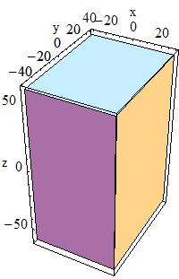 *In the picture*: `pX = 30, pY = 40, pZ = 60` |
| --- | --- |

by giving the box a name and its half-lengths along the X, Y and Z axis:

| `pX` | half length in X | `pY` | half length in Y | `pZ` | half length in Z |
| --- | --- | --- | --- | --- | --- |

This will create a box that extends from `-pX` to `+pX` in X, from `-pY` to `+pY` in Y, and from `-pZ` to `+pZ` in Z.

For example to create a box that is 2 by 6 by 10 centimeters in full length, and called `BoxA` one should use the following code:

```cpp
G4Box* aBox = new G4Box("BoxA", 1.0*cm, 3.0*cm, 5.0*cm);
```

**Cylindrical Section or Tube:**

Similarly to create a **cylindrical section** or **tube**, one would use the constructor:

| G4Tubs(const G4String& pName, G4double pRMin, G4double pRMax, G4double pDz, G4double pSPhi, G4double pDPhi) |  *In the picture*: `pRMin = 10, pRMax = 15, pDz = 20` |
| --- | --- |

giving its name `pName` and its parameters which are:

| `pRMin` | Inner radius | `pRMax` | Outer radius |
| --- | --- | --- | --- |
| `pDz` | Half length in Z | `pSPhi` | Starting phi angle in radians |
| `pDPhi` | Angle of the segment in radians |  |  |

**Cylindrical Cut Section or Cut Tube:**

A cut in `Z` can be applied to a cylindrical section to obtain a **cut tube**. The following constructor should be used:

| G4CutTubs(const G4String& pName, G4double pRMin, G4double pRMax, G4double pDz, G4double pSPhi, G4double pDPhi, G4ThreeVector pLowNorm, G4ThreeVector pHighNorm) | 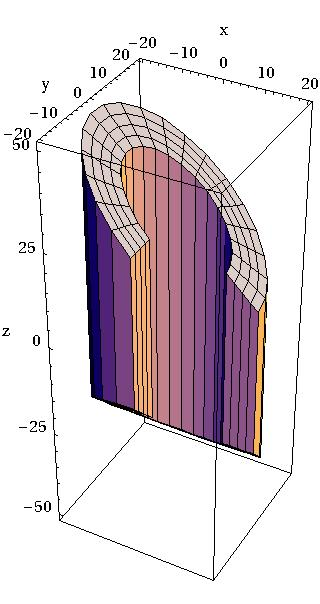 *In the picture*: `pRMin = 12, pRMax = 20, pDz = 30, pSPhi = 0, pDPhi = 1.5*pi,` `pLowNorm = (0,-0.7,-0.71), pHighNorm = (0.7,0,0.71)` |
| --- | --- |

giving its name `pName` and its parameters which are:

| `pRMin` | Inner radius | `pRMax` | Outer radius |
| --- | --- | --- | --- |
| `pDz` | Half length in Z | `pSPhi` | Starting phi angle in radians |
| `pDPhi` | Angle of the segment in radians | `pLowNorm` | Outside Normal at -Z |
| `pHighNorm` | Outside Normal at +Z |  |  |

**Cone or Conical section:**

Similarly to create a **cone**, or **conical section**, one would use the constructor

| G4Cons(const G4String& pName, G4double pRmin1, G4double pRmax1, G4double pRmin2, G4double pRmax2, G4double pDz, G4double pSPhi, G4double pDPhi) |  *In the picture*: `pRmin1 = 5, pRmax1 = 10,` `pRmin2 = 20, pRmax2 = 25,` `pDz = 40, pSPhi = 0, pDPhi = 4/3*Pi` |
| --- | --- |

giving its name `pName`, and its parameters which are:

| `pRmin1` | inside radius at `-pDz` | `pRmax1` | outside radius at `-pDz` |
| --- | --- | --- | --- |
| `pRmin2` | inside radius at `+pDz` | `pRmax2` | outside radius at `+pDz` |
| `pDz` | half length in Z | `pSPhi` | starting angle of the segment in radians |
| `pDPhi` | the angle of the segment in radians |  |  |

**Parallelepiped:**

A **parallelepiped** is constructed using:

| G4Para(const G4String& pName, G4double dx, G4double dy, G4double dz, G4double alpha, G4double theta, G4double phi) |  *In the picture*: `dx = 30, dy = 40, dz = 60` |
| --- | --- |

giving its name `pName` and its parameters which are:

| `dx,dy,dz` | Half-length in x,y,z |
| --- | --- |
| `alpha` | Angle formed by the Y axis and by the plane joining the centre of the faces *parallel* to the Z-X plane at -dy and +dy |
| `theta` | Polar angle of the line joining the centres of the faces at -dz and +dz in Z |
| `phi` | Azimuthal angle of the line joining the centres of the faces at -dz and +dz in Z |

**Trapezoid:**

To construct a **trapezoid** use:

| G4Trd(const G4String& pName, G4double dx1, G4double dx2, G4double dy1, G4double dy2, G4double dz) | 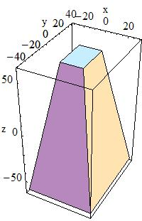 *In the picture*: `dx1 = 30, dx2 = 10,` `dy1 = 40, dy2 = 15,` `dz = 60` |
| --- | --- |

to obtain a solid with name `pName` and parameters

| `dx1` | Half-length along X at the surface positioned at `-dz` |
| --- | --- |
| `dx2` | Half-length along X at the surface positioned at `+dz` |
| `dy1` | Half-length along Y at the surface positioned at `-dz` |
| `dy2` | Half-length along Y at the surface positioned at `+dz` |
| `dz` | Half-length along Z axis |

**Generic Trapezoid:**

To build a **generic trapezoid**, the `G4Trap` class is provided. `G4Trap` is a solid with six trapezoidal faces, it has two bases parallel to the XY-plane and four lateral faces. The bases are located at the same distance from the XY-plane, but on opposite sides from it. Each of the bases has two edges parallel the X-axis. Let's call the line joining middle point of these edges - *the centre line of the base*, and the middle point of this line - *the centre of the base*. An important property of `G4Trap` is that the line joining the centres of the bases goes through the origin of the local coordinate system.

`G4Trap` has three main constructors; for a Right Angular Wedge, for a general trapezoid and a constructor from eight points:

| G4Trap(const G4String& pName, G4double pZ, G4double pY, G4double pX, G4double pLTX) G4Trap(const G4String& pName, G4double pDz, G4double pTheta, G4double pPhi, G4double pDy1, G4double pDx1, G4double pDx2, G4double pAlp1, G4double pDy2, G4double pDx3, G4double pDx4, G4double pAlp2) G4Trap(const G4String& pName, const G4ThreeVector pt[8]) | 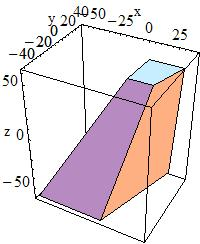 *In the picture*: `pDx1 = 30, pDx2 = 40, pDy1 = 40,` `pDx3 = 10, pDx4 = 14, pDy2 = 16,` `pDz = 60, pTheta = 20*Degree,` `pPhi = 5*Degree, pAlp1 = pAlp2 = 10*Degree` 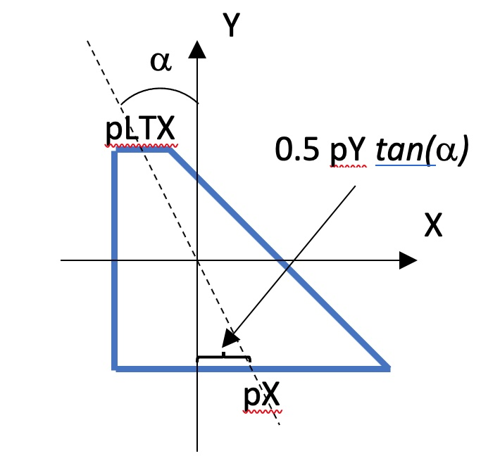 |
| --- | --- |

to obtain a Right Angular Wedge with name `pName` and parameters:

| `pZ` | Length along Z |
| --- | --- |
| `pY` | Length along Y |
| `pX` | Length along X at the wider side |
| `pLTX` | Length along X at the narrower side (`plTX<=pX`) |

The angle between the Y-axis and the centre lines of the bases in case of Right Angular Wedge is defined by the following expression:

>
>
> tan(alpha) = 0.5 \* (pLTX - pX) / pY
>
>

or, to obtain the general trapezoid:

| `pDz` | Half Z length - distance from the origin to the bases |
| --- | --- |
| `pTheta` | Polar angle of the line joining the centres of the bases at -/+pDz |
| `pPhi` | Azimuthal angle of the line joining the centre of the base at -pDz to the centre of the base at +pDz |
| `pDy1` | Half Y length of the base at -pDz |
| `pDy2` | Half Y length of the base at +pDz |
| `pDx1` | Half X length at smaller Y of the base at -pDz |
| `pDx2` | Half X length at bigger Y of the base at -pDz |
| `pDx3` | Half X length at smaller Y of the base at +pDz |
| `pDx4` | Half X length at bigger y of the base at +pDz |
| `pAlp1` | Angle between the Y-axis and the centre line of the base at -pDz (lower endcap) |
| `pAlp2` | Angle between the Y-axis and the centre line of the base at +pDz (upper endcap) |

Note

The angle `pAlph1` and `pAlph2` have to be the same due to the planarity condition.

or, to obtain from eight points with name `pName`:

| `pt` \\| Coordinates of the vertices |  |
| --- | --- |
| `pt[0]`, `pt[1]` \\| Edge with smaller Y of the base at -z |  |
| `pt[2]`, `pt[3]` \\| Edge with bigger Y of the base at -z |  |
| `pt[4]`, `pt[5]` \\| Edge with smaller Y of the base at +z |  |
| `pt[6]`, `pt[7]` \\| Edge with bigger Y of the base at +z |  |

Array of vertices is given as a sequence of four edges parallel to the X-axis, first two edges define the base at -z, next two edges define the base at +z. First point in edge should have smaller X.

Note

The following properties of `G4Trap` should be respected: (a) Lateral faces should be planar; (b) The line joining the centers of the bases should go through the origin

**Sphere or Spherical Shell Section:**

To build a **sphere**, or a **spherical shell section**, use:

| G4Sphere(const G4String& pName, G4double pRmin, G4double pRmax, G4double pSPhi, G4double pDPhi, G4double pSTheta, G4double pDTheta ) | 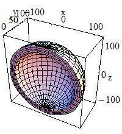 *In the picture*: `pRmin = 100, pRmax = 120,` `pSPhi = 0*Degree, pDPhi = 180*Degree,` `pSTheta = 0 Degree, pDTheta = 180*Degree` |
| --- | --- |

to obtain a solid with name `pName` and parameters:

| `pRmin` | Inner radius |
| --- | --- |
| `pRmax` | Outer radius |
| `pSPhi` | Starting Phi angle of the segment in radians |
| `pDPhi` | Delta Phi angle of the segment in radians |
| `pSTheta` | Starting Theta angle of the segment in radians |
| `pDTheta` | Delta Theta angle of the segment in radians |

**Full Solid Sphere:**

To build a **full solid sphere** use:

| G4Orb(const G4String& pName, G4double pRmax) | 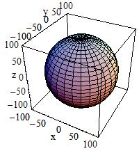 *In the picture*: `pRmax = 100` |
| --- | --- |

The Orb can be obtained from a Sphere with: `pRmin` = 0, `pSPhi` = 0, `pDPhi` = $2*\pi$, `pSTheta` = 0, `pDTheta` = $\pi$

| `pRmax` | Outer radius |
| --- | --- |

**Torus:**

To build a **torus** use:

| G4Torus(const G4String& pName, G4double pRmin, G4double pRmax, G4double pRtor, G4double pSPhi, G4double pDPhi) | 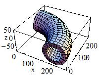 *In the picture*: `pRmin = 40, pRmax = 60, pRtor = 200,` `pSPhi = 0, pDPhi = 90*degree` |
| --- | --- |

to obtain a solid with name `pName` and parameters:

| `pRmin` | Inside radius |
| --- | --- |
| `pRmax` | Outside radius |
| `pRtor` | Swept radius of torus |
| `pSPhi` | Starting Phi angle in radians (`fSPhi+fDPhi<=2PI`, `fSPhi>-2PI`) |
| `pDPhi` | Delta angle of the segment in radians |

In addition, the Geant4 Design Documentation shows in the Solids Class Diagram the complete list of CSG classes.

**Specific CSG Solids**

**Polycons:**

**Polycons** (PCON) are implemented in Geant4 through the `G4Polycone` class:

| G4Polycone(const G4String& pName, G4double phiStart, G4double phiTotal, G4int numZPlanes, const G4double zPlane[], const G4double rInner[], const G4double rOuter[]) | 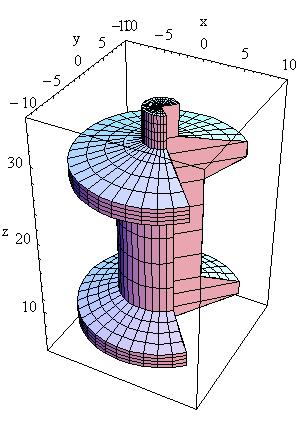 *In the picture*: `phiStart = 1/4*Pi, phiTotal = 3/2*Pi, numZPlanes = 9,` `rInner = { 0, 0, 0, 0, 0, 0, 0, 0, 0},` `rOuter = { 0, 10, 10, 5 , 5, 10 , 10 , 2, 2},` `z = { 5, 7, 9, 11, 25, 27, 29, 31, 35 }` |
| --- | --- |

where:

| `phiStart` | Initial Phi starting angle |
| --- | --- |
| `phiTotal` | Total Phi angle |
| `numZPlanes` | Number of Z planes |
| `numRZ` | Number of corners in r,Z space |
| `zPlane` | Position of Z planes, with Z in increasing order |
| `rInner` | Tangent distance to inner surface |
| `rOuter` | Tangent distance to outer surface |
| `r` | r coordinate of corners |
| `z` | Z coordinate of corners |

A **Polycone** where Z planes position can also decrease is implemented through the `G4GenericPolycone` class:

| G4GenericPolycone(const G4String& pName, G4double phiStart, G4double phiTotal, G4int numRZ, const G4double r[], const G4double z[]) |
| --- |

where:

| `phiStart` | Initial Phi starting angle |
| --- | --- |
| `phiTotal` | Total Phi angle |
| `numRZ` | Number of corners in r,Z space |
| `r` | r coordinate of corners |
| `z` | Z coordinate of corners |

**Polyhedra (PGON):**

**Polyhedra** (PGON) are implemented through `G4Polyhedra`:

| G4Polyhedra(const G4String& pName, G4double phiStart, G4double phiTotal, G4int numSide, G4int numZPlanes, const G4double zPlane[], const G4double rInner[], const G4double rOuter[] ) G4Polyhedra(const G4String& pName, G4double phiStart, G4double phiTotal, G4int numSide, G4int numRZ, const G4double r[], const G4double z[] ) | 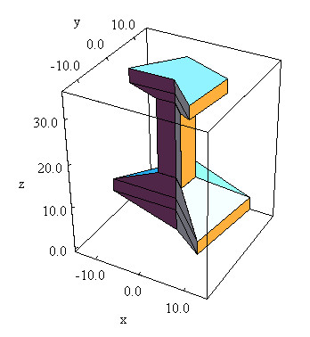 *In the picture*: `phiStart = -1/4*Pi, phiTotal= 5/4*Pi,` `numSide = 3, nunZPlanes = 7,` `rInner = { 0, 0, 0, 0, 0, 0, 0 },` `rOuter = { 0, 15, 15, 4, 4, 10, 10 },` `z = { 0, 5, 8, 13 , 30, 32, 35 }` |
| --- | --- |

where:

| `phiStart` | Initial Phi starting angle |
| --- | --- |
| `phiTotal` | Total Phi angle |
| `numSide` | Number of sides |
| `numZPlanes` | Number of Z planes |
| `numRZ` | Number of corners in r,Z space |
| `zPlane` | Position of Z planes |
| `rInner` | Tangent distance to inner surface |
| `rOuter` | Tangent distance to outer surface |
| `r` | r coordinate of corners |
| `z` | Z coordinate of corners |

**Tube with an elliptical cross section:**

A **tube with an elliptical cross section** (ELTU) with elliptical semimajor and semiminor axes along the X and Y cartesian axes can be defined as follows:

| G4EllipticalTube(const G4String& pName, G4double xSemiAxis, G4double ySemiAxis, G4double Dz) | 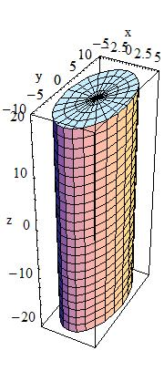 *In the picture* `xSemiAxis = 5, semiAxisY = 10, Dz = 20` |
| --- | --- |

The tube extends in `Z` from `-Dz` to `+Dz` and the equation of the surface in the x/y plane is:

```cpp
(x/xSemiAxis)**2+(y/ySemiAxis)**2 = 1.0
```

where:

| `xSemiAxis` | Half length of axis along X |
| --- | --- |
| `ySemiAxis` | Half length of axis along Y |
| `Dz` | Half length Z |

**General Ellipsoid:**

The general **ellipsoid** with possible cut in `Z` can be defined as follows:

| G4Ellipsoid(const G4String& pName, G4double xSemiAxis, G4double ySemiAxis, G4double zSemiAxis, G4double zBottomCut=0, G4double zTopCut=0) | 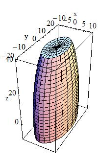 *In the picture*: `xSemiAxis = 10, ySemiAxis = 20, zSemiAxis = 50,` `zBottomCut = -10, pzTopCut = 40` |
| --- | --- |

A general (or triaxial) ellipsoid is a quadratic surface which is given in Cartesian coordinates by:

```cpp
1.0 = (x/xSemiAxis)**2 + (y/ySemiAxis)**2 + (z/zSemiAxis)**2
```

where:

| `xSemiAxis` | Semiaxis in X |
| --- | --- |
| `ySemiAxis` | Semiaxis in Y |
| `zSemiAxis` | Semiaxis in Z |
| `zBottomCut` | lower cut plane level, Z |
| `zTopCut` | upper cut plane level, Z |

**Cone with Elliptical Cross Section:**

A **cone with an elliptical cross section** can be defined as follows:

| G4EllipticalCone(const G4String& pName, G4double xSemiAxis, G4double ySemiAxis, G4double zHeight, G4double zTopCut) | 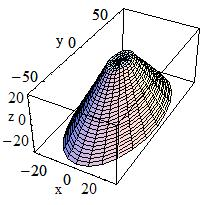 *In the picture*: `xSemiAxis = 30/75, ySemiAxis = 60/75,` `zHeight = 50, zTopCut = 25` |
| --- | --- |

where:

| `xSemiAxis` | A scalar value, it defines the scaling along X-axis |
| --- | --- |
| `ySemiAxis` | A scalar value, it defines the scaling along Y-axis |
| `zHeight` | Z-coordinate if the apex |
| `zTopCut` | Upper cut plane level |

Value of `zTopCut` cannot exceed `zHeight`; the bases of an elliptical cone are located at `-zTopCut` and `+zTopCut`.

The lateral surface of an elliptical cone is described by the equation:

>
>
> (x/xSemiAxis)\*\*2 + (y/ySemiAxis)\*\*2 = (zHeight - z)\*\*2
>
>

Values of `xSemiAxis` and `ySemiAxis` can be figured out from the equations for the semimajor axes of the elliptical section at z=0:

>
>
> dx = xSemiAxis \* zHeight dy = ySemiAxis \* zHeight
>
>

**Paraboloid, a solid with parabolic profile:**

A **solid with parabolic profile** and possible cuts along the `Z` axis can be defined as follows:

| G4Paraboloid(const G4String& pName, G4double Dz, G4double R1, G4double R2) The equation for the solid is: rho**2 <= k1 * z + k2; -dz <= z <= dz r1**2 = k1 * (-dz) + k2 r2**2 = k1 * ( dz) + k2 | 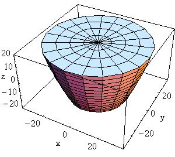 *In the picture*: `R1 = 20, R2 = 35, Dz = 20` |
| --- | --- |

| `Dz` | Half length Z | `R1` | Radius at -Dz | `R2` | Radius at +Dz greater than R1 |
| --- | --- | --- | --- | --- | --- |

**Tube with Hyperbolic Profile:**

A **tube with a hyperbolic profile** (HYPE) can be defined as follows:

| G4Hype(const G4String& pName, G4double innerRadius, G4double outerRadius, G4double innerStereo, G4double outerStereo, G4double halfLenZ) | 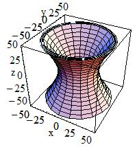 *In the picture*: `innerStereo = 0.7, outerStereo = 0.7,` `halfLenZ = 50,` `innerRadius = 20, outerRadius = 30` |
| --- | --- |

`G4Hype` is shaped with curved sides parallel to the `Z`-axis, has a specified half-length along the `Z` axis about which it is centred, and a given minimum and maximum radius.

A minimum radius of `0` defines a filled Hype (with hyperbolic inner surface), i.e. inner radius = 0 AND inner stereo angle = 0.

The inner and outer hyperbolic surfaces can have different stereo angles. A stereo angle of `0` gives a cylindrical surface:

| `innerRadius` | Inner radius |
| --- | --- |
| `outerRadius` | Outer radius |
| `innerStereo` | Inner stereo angle in radians |
| `outerStereo` | Outer stereo angle in radians |
| `halfLenZ` | Half length in Z |

**Tetrahedra:**

A **tetrahedra** solid can be defined as follows:

| G4Tet(const G4String& pName, G4ThreeVector anchor, G4ThreeVector p2, G4ThreeVector p3, G4ThreeVector p4, G4bool* degeneracyFlag=nullptr) | 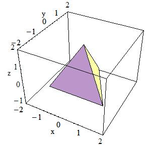 *In the picture*: `anchor = {0, 0, sqrt(3)},` `p2 = { 0, 2*sqrt(2/3), -1/sqrt(3) },` `p3 = { -sqrt(2), -sqrt(2/3),-1/sqrt(3) },` `p4 = { sqrt(2), -sqrt(2/3) , -1/sqrt(3) }` |
| --- | --- |

The solid is defined by 4 points in space:

| `anchor` | Anchor point |
| --- | --- |
| `p2` | Point 2 |
| `p3` | Point 3 |
| `p4` | Point 4 |
| `degeneracyFlag` | Flag indicating degeneracy of points |

**Extruded Polygon:**

The extrusion of an arbitrary polygon (**extruded solid**) with fixed outline in the defined `Z` sections can be defined as follows (in a general way, or in a simplified construct with only two `Z` sections). `G4ExtrudedSolid` is constructed by moving a 2D polygonal contour along a 3D polyline. During movement the polygonal contour can be scaled.

| G4ExtrudedSolid(const G4String& pName, std::vector<G4TwoVector> polygon, std::vector<ZSection> zsections) G4ExtrudedSolid(const G4String& pName, std::vector<G4TwoVector> polygon, G4double halfZ, G4TwoVector off1, G4double scale1, G4TwoVector off2, G4double scale2) | 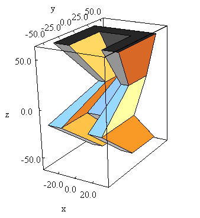 *In the picture*: `polygon = {-30,-30},{-30,30},{30,30},{30,-30},` `{15,-30},{15,15},{-15,15},{-15,-30}` `zsections = [-60,{0,30},0.8], [-15, {0,-30},1.],` `[10,{0,0},0.6], [60,{0,30},1.2]` |
| --- | --- |

The Z-sides of the solid are the scaled versions of the same polygon.

| `polygon` | 2D polygonal contour; the vertices of the outlined polygon defined in clock-wise order |
| --- | --- |
| `zsections` | 3D polyline with scale factors; the Z-sections defined by Z position in increasing order |
| `halfZ` | Half length in Z; distance from the origin to the sections |
| `off1, scale1` | (X, Y) position of the polygon and scale factor at -halfZ |
| `off2, scale2` | (X, Y) position of the polygon and scale factor at +halfZ |

Each node in the 3D polyline is defined as a ZSection object:

```cpp
struct ZSection
{
  G4double fZ;         // Z coordinate of the node
  G4TwoVector fOffset; // (X, Y) coordinates of the node
  G4double fScale;     // Scale factor that should be applied to the 2D polygon at the node
}
```

Very often an **extruded solid** is constructed by shifting a polygon in the perpendicular direction to its plane. In such case `off1`, `off2` should be specified as G4TwoVector(0,0) and `scale1`, `scale2` should be equal to 1.

**Box Twisted:**

A **box twisted** along one axis can be defined as follows:

| G4TwistedBox(const G4String& pName, G4double twistedangle, G4double pDx, G4double pDy, G4double pDz) | 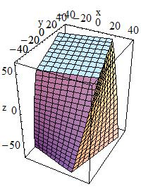 *In the picture*: `twistedangle = 30*Degree, pDx = 30, pDy =40, pDz = 60` |
| --- | --- |

`G4TwistedBox` is a box twisted along the z-axis. The twist angle cannot be greater than 90 degrees:

| `twistedangle` | Twist angle |
| --- | --- |
| `pDx` | Half x length |
| `pDy` | Half y length |
| `pDz` | Half z length |

**Trapezoid Twisted along One Axis:**

*trapezoid twisted* along one axis can be defined as follows:

| G4TwistedTrap(const G4String& pName, G4double twistedangle, G4double pDxx1, G4double pDxx2, G4double pDy, G4double pDz) G4TwistedTrap(const G4String& pName, G4double twistedangle, G4double pDz, G4double pTheta, G4double pPhi, G4double pDy1, G4double pDx1, G4double pDx2, G4double pDy2, G4double pDx3, G4double pDx4, G4double pAlph) | 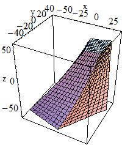 *In the picture*: `pDx1 = 30, pDx2 = 40, pDy1 = 40,` `pDx3 = 10, pDx4 = 14, pDy2 = 16,` `pDz = 60,` `pTheta = 20*Degree, pDphi = 5*Degree,` `pAlph = 10*Degree, twistedangle = 30*Degree` |
| --- | --- |

The first constructor of `G4TwistedTrap` produces a regular trapezoid twisted along the `Z`-axis, where the caps of the trapezoid are of the same shape and size.

The second constructor produces a generic trapezoid with polar, azimuthal and tilt angles.

The twist angle cannot be greater than 90 degrees:

| `twistedangle` | Twisted angle |
| --- | --- |
| `pDx1` | Half X length at y=-pDy |
| `pDx2` | Half X length at y=+pDy |
| `pDy` | Half Y length |
| `pDz` | Half Z length |
| `pTheta` | Polar angle of the line joining the centres of the faces at -/+pDz |
| `pPhi` | Azimuthal angle of the line joining centres of the faces at -/+pDz |
| `pDy1` | Half Y length at -pDz |
| `pDx1` | Half X length at -pDz, y=-pDy1 |
| `pDx2` | Half X length at -pDz, y=+pDy1 |
| `pDy2` | Half Y length at +pDz |
| `pDx3` | Half X length at +pDz, y=-pDy2 |
| `pDx4` | Half X length at +pDz, y=+pDy2 |
| `pAlph` | Angle with respect to the Y axis from the centre of the side |

**Twisted Trapezoid with X and Y dimensions varying along Z:**

A **twisted trapezoid** with the `X` and `Y` dimensions **varying along** `Z` can be defined as follows:

| G4TwistedTrd(const G4String& pName, G4double pDx1, G4double pDx2, G4double pDy1, G4double pDy2, G4double pDz, G4double twistedangle) | 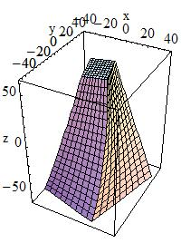 *In the picture*: `dx1 = 30, dx2 = 10,` `dy1 = 40, dy2 = 15,` `dz = 60, twistedangle = 30*Degree` |
| --- | --- |

where:

| `pDx1` | Half X length at the surface positioned at -dz |
| --- | --- |
| `pDx2` | Half X length at the surface positioned at +dz |
| `pDy1` | Half Y length at the surface positioned at -dz |
| `pDy2` | Half Y length at the surface positioned at +dz |
| `pDz` | Half Z length |
| `twistedangle` | Twisted angle |

**Generic trapezoid with optionally collapsing vertices:**

An **arbitrary trapezoid** with up to 8 vertices standing on two parallel planes perpendicular to the `Z` axis can be defined as follows:

| G4GenericTrap(const G4String& pName, G4double pDz, const std::vector<G4TwoVector>& vertices) |
| --- |

| 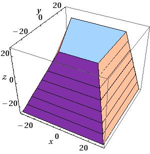 |
| --- |
| *In the picture*: `pDz = 25` `vertices = {-30, -30}, {-30, 30}, {30, 30}, {30, -30}` `{-5, -20}, {-20, 20}, {20, 20}, {20, -20}` |
|  |
| 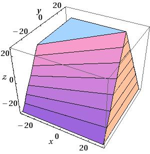 |
| *In the picture*: `pDz = 25` `vertices = {-30,-30}, {-30,30}, {30,30}, {30,-30}` `{-20,-20},{-20, 20}, {20,20}, {20, 20}` |
|  |
| 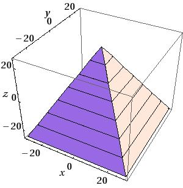 |
| *In the picture*: `pDz = 25` `vertices = {-30,-30}, {-30,30}, {30,30}, {30,-30}` `{0,0}, {0,0}, {0,0}, {0,0}` |

where:

| `pDz` | Half Z length |
| --- | --- |
| `vertices` | The (X,Y) coordinates of vertices |

The order of specification of the coordinates for the vertices in `G4GenericTrap` is important. The first four points are the vertices sitting on the `-hz` plane; the last four points are the vertices sitting on the `+hz` plane.

The order of defining the vertices of the solid is the following:

```cpp
point 0 is connected with points 1,3,4
point 1 is connected with points 0,2,5
point 2 is connected with points 1,3,6
point 3 is connected with points 0,2,7
point 4 is connected with points 0,5,7
point 5 is connected with points 1,4,6
point 6 is connected with points 2,5,7
point 7 is connected with points 3,4,6
```

Points can be identical in order to create shapes with less than 8 vertices; the only limitation is to have at least one triangle at `+hz` or `-hz`; the lateral surfaces are not necessarily planar. Not planar lateral surfaces are represented by a surface that linearly changes from the edge on `-hz` to the corresponding edge on `+hz`; it represents a *sweeping* surface with twist angle linearly dependent on `Z`, but it is not a real twisted surface mathematically described by equations as for the other *twisted* solids described in this chapter.

**Tube Section Twisted along Its Axis:**

A **tube section twisted** along its axis can be defined as follows:

| G4TwistedTubs(const G4String& pName, G4double twistedangle, G4double endinnerrad, G4double endouterrad, G4double halfzlen, G4double dphi) | 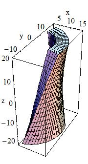 *In the picture*: `endinnerrad = 10, endouterrad = 15,` `halfzlen = 20, dphi = 90*Degree,` `twistedangle = 60*Degree` |
| --- | --- |

`G4TwistedTubs` is a sort of twisted cylinder which, placed along the `Z`-axis and divided into `phi`-segments is shaped like an hyperboloid, where each of its segmented pieces can be tilted with a stereo angle.

It can have inner and outer surfaces with the same stereo angle:

| `twistedangle` | Twisted angle |
| --- | --- |
| `endinnerrad` | Inner radius at endcap |
| `endouterrad` | Outer radius at endcap |
| `halfzlen` | Half Z length |
| `dphi` | Phi angle of a segment |

Additional constructors are provided, allowing the shape to be specified either as:

-   the number of segments in `phi` and the total angle for all segments, or

-   a combination of the above constructors providing instead the inner and outer radii at `z=0` with different `Z`-lengths along negative and positive `Z`-axis.

## Solids made by Boolean operations

Simple solids can be combined using Boolean operations. For example, a cylinder and a half-sphere can be combined with the union Boolean operation.

Creating such a new *Boolean* solid, requires:

-   Two solids

-   A Boolean operation: union, intersection or subtraction.

-   Optionally a transformation for the second solid.

The solids used should be either CSG solids (for examples a box, a spherical shell, or a tube) or another Boolean solid: the product of a previous Boolean operation. An important purpose of Boolean solids is to allow the description of solids with peculiar shapes in a simple and intuitive way, still allowing an efficient geometrical navigation inside them.

Note

The constituent solids of a Boolean operation should possibly *avoid* be composed by sharing all or part of their surfaces. This precaution is necessary in order to avoid the generation of 'fake' surfaces due to precision loss, or errors in the final visualization of the Boolean shape. In particular, if any one of the *subtractor* surfaces is coincident with a surface of the *subtractee*, the result is undefined. Moreover, the final Boolean solid should represent a single 'closed' solid, i.e. a Boolean operation between two solids which are disjoint or far apart each other, is *not* a valid Boolean composition.

Note

The tracking cost for navigating in a Boolean solid is proportional to the number of constituent solids. So care must be taken to avoid extensive, unnecessary use of Boolean solids in performance-critical areas of a geometry description, where each solid is created from Boolean combinations of many other solids.

Examples of the creation of the simplest Boolean solids are given below:

```cpp
G4Box*  box =
  new G4Box("Box",20*mm,30*mm,40*mm);
G4Tubs* cyl =
  new G4Tubs("Cylinder",0,50*mm,50*mm,0,twopi);  // r:     0 mm -> 50 mm
                                                 // z:   -50 mm -> 50 mm
                                                 // phi:   0 ->  2 pi
G4UnionSolid* union =
  new G4UnionSolid("Box+Cylinder", box, cyl);
G4IntersectionSolid* intersection =
  new G4IntersectionSolid("Box*Cylinder", box, cyl);
G4SubtractionSolid* subtraction =
  new G4SubtractionSolid("Box-Cylinder", box, cyl);
```

where the union, intersection and subtraction of a box and cylinder are constructed.

The more useful case where one of the solids is displaced from the origin of coordinates also exists. In this case the second solid is positioned relative to the coordinate system (and thus relative to the first). This can be done in two ways:

-   Either by giving a rotation matrix and translation vector that are used to transform the coordinate system of the second solid to the coordinate system of the first solid. This is called the *passive* method.

-   Or by creating a transformation that moves the second solid from its desired position to its standard position, e.g., a box's standard position is with its centre at the origin and sides parallel to the three axes. This is called the *active* method.

In the first case, the translation is applied first to move the origin of coordinates. Then the rotation is used to rotate the coordinate system of the second solid to the coordinate system of the first.

```cpp
G4RotationMatrix* yRot = new G4RotationMatrix;  // Rotates X and Z axes only
yRot->rotateY(M_PI/4.*rad);                     // Rotates 45 degrees
G4ThreeVector zTrans(0, 0, 50);

G4UnionSolid* unionMoved =
  new G4UnionSolid("Box+CylinderMoved", box, cyl, yRot, zTrans);
//
// The new coordinate system of the cylinder is translated so that
// its centre is at +50 on the original Z axis, and it is rotated
// with its X axis halfway between the original X and Z axes.

// Now we build the same solid using the alternative method
//
G4RotationMatrix invRot = yRot->invert();
G4Transform3D transform(invRot, zTrans);
G4UnionSolid* unionMoved =
  new G4UnionSolid("Box+CylinderMoved", box, cyl, transform);
```

Note that the first constructor that takes a pointer to the rotation-matrix (`G4RotationMatrix*`), does NOT copy it. Therefore once used a rotation-matrix to construct a Boolean solid, it must NOT be modified.

In contrast, with the alternative method shown, a `G4Transform3D` is provided to the constructor by value, and its transformation is stored by the Boolean solid. The user may modify the `G4Transform3D` and eventually use it again.

When positioning a volume associated to a Boolean solid, the relative center of coordinates considered for the positioning is the one related to the *first* of the two constituent solids.

## Multi-Union Structures

Since release 10.4, the possibility to define multi-union structures is part of the standard set of constructs in Geant4. A `G4MultiUnion` structure allows for the description of a Boolean union of many displaced solids at once, therefore representing volumes with the same associated material. An example on how to define a simple MultiUnion structure is given here:

```cpp
#include "G4MultiUnion.hh"

// Define two -G4Box- shapes
//
G4Box* box1 = new G4Box("Box1", 5.*mm, 5.*mm, 10.*mm);
G4Box* box2 = new G4Box("Box2", 5.*mm, 5.*mm, 10.*mm);

// Define displacements for the shapes
//
G4RotationMatrix rotm  = G4RotationMatrix();
G4ThreeVector position1 = G4ThreeVector(0.,0.,1.);
G4ThreeVector position2 = G4ThreeVector(0.,0.,2.);
G4Transform3D tr1 = G4Transform3D(rotm,position1);
G4Transform3D tr2 = G4Transform3D(rotm,position2);

// Initialise a MultiUnion structure
//
G4MultiUnion* munion_solid = new G4MultiUnion("Boxes_Union");

// Add the shapes to the structure
//
munion_solid->AddNode(*box1,tr1);
munion_solid->AddNode(*box2,tr2);

// Finally close the structure
//
munion_solid->Voxelize();

// Associate it to a logical volume as a normal solid
//
G4LogicalVolume* lvol =
new G4LogicalVolume(munion_solid,         // its solid
                    munion_mat,           // its material
                    "Boxes_Union_LV");    // its name
```

Fast detection of intersections in tracking is assured by the adoption of a specialised optimisation applied to the 3D structure itself and generated at initialisation.

## Tessellated Solids

In Geant4 it is also implemented a class `G4TessellatedSolid` which can be used to generate a generic solid defined by a number of facets (`G4VFacet`). Such constructs are especially important for conversion of complex geometrical shapes imported from CAD systems bounded with generic surfaces into an approximate description with facets of defined dimension (see Fig. 8).

[]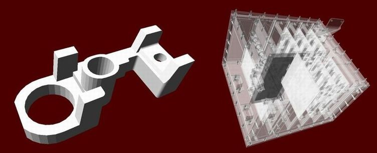

[Fig. 8 ][Example of geometries imported from CAD system and converted to tessellated solids.]

They can also be used to generate a solid bounded with a generic surface made of planar facets. It is important that the supplied facets shall form a fully enclosed space to represent the solid, and that adjacent facets always share a complete edge (no vertex on one facet can lie between vertices on an adjacent facet).

Two types of facet can be used for the construction of a `G4TessellatedSolid`: a triangular facet (`G4TriangularFacet`) and a quadrangular facet (`G4QuadrangularFacet`).

An example on how to generate a simple tessellated shape is given below.

```cpp
// First declare a tessellated solid
//
G4TessellatedSolid solidTarget = new G4TessellatedSolid("Solid_name");

// Define the facets which form the solid
//
G4double targetSize = 10*cm ;
G4TriangularFacet *facet1 = new
G4TriangularFacet (G4ThreeVector(-targetSize,-targetSize,        0.0),
                   G4ThreeVector(+targetSize,-targetSize,        0.0),
                   G4ThreeVector(        0.0,        0.0,+targetSize),
                   ABSOLUTE);
G4TriangularFacet *facet2 = new
G4TriangularFacet (G4ThreeVector(+targetSize,-targetSize,        0.0),
                   G4ThreeVector(+targetSize,+targetSize,        0.0),
                   G4ThreeVector(        0.0,        0.0,+targetSize),
                   ABSOLUTE);
G4TriangularFacet *facet3 = new
G4TriangularFacet (G4ThreeVector(+targetSize,+targetSize,        0.0),
                   G4ThreeVector(-targetSize,+targetSize,        0.0),
                   G4ThreeVector(        0.0,        0.0,+targetSize),
                   ABSOLUTE);
G4TriangularFacet *facet4 = new
G4TriangularFacet (G4ThreeVector(-targetSize,+targetSize,        0.0),
                   G4ThreeVector(-targetSize,-targetSize,        0.0),
                   G4ThreeVector(        0.0,        0.0,+targetSize),
                   ABSOLUTE);
G4QuadrangularFacet *facet5 = new
G4QuadrangularFacet (G4ThreeVector(-targetSize,-targetSize,        0.0),
                     G4ThreeVector(-targetSize,+targetSize,        0.0),
                     G4ThreeVector(+targetSize,+targetSize,        0.0),
                     G4ThreeVector(+targetSize,-targetSize,        0.0),
                     ABSOLUTE);

// Now add the facets to the solid
//
solidTarget->AddFacet((G4VFacet*) facet1);
solidTarget->AddFacet((G4VFacet*) facet2);
solidTarget->AddFacet((G4VFacet*) facet3);
solidTarget->AddFacet((G4VFacet*) facet4);
solidTarget->AddFacet((G4VFacet*) facet5);

Finally declare the solid is complete
//
solidTarget->SetSolidClosed(true);
```

The `G4TriangularFacet` class is used for the construction of `G4TessellatedSolid`. It is defined by three vertices, which shall be supplied in *anti-clockwise order* looking from the outside of the solid where it belongs. Its constructor looks like:

```cpp
G4TriangularFacet ( const G4ThreeVector     Pt0,
                    const G4ThreeVector     vt1,
                    const G4ThreeVector     vt2,
                           G4FacetVertexType fType )
```

i.e., it takes 4 parameters to define the three vertices:

| `G4FacetVertexType` | `ABSOLUTE` in which case `Pt0`, `vt1` and `vt2` are the three vertices in anti-clockwise order looking from the outside. |
| --- | --- |
| `G4FacetVertexType` | `RELATIVE` in which case the first vertex is `Pt0`, the second vertex is `Pt0+vt1` and the third vertex is `Pt0+vt2`, all in anti-clockwise order when looking from the outside. |

The `G4QuadrangularFacet` class can be used for the construction of `G4TessellatedSolid` as well. It is defined by four vertices, which shall be in the same plane and be supplied in *anti-clockwise order* looking from the outside of the solid where it belongs. Its constructor looks like:

```cpp
G4QuadrangularFacet ( const G4ThreeVector     Pt0,
                      const G4ThreeVector     vt1,
                      const G4ThreeVector     vt2,
                      const G4ThreeVector     vt3,
                             G4FacetVertexType fType )
```

i.e., it takes 5 parameters to define the four vertices:

| `G4FacetVertexType` | `ABSOLUTE` in which case `Pt0`, `vt1`, `vt2` and `vt3` are the four vertices required in anti-clockwise order when looking from the outside. |
| --- | --- |
| `G4FacetVertexType` | `RELATIVE` in which case the first vertex is `Pt0`, the second vertex is `Pt0+vt`, the third vertex is `Pt0+vt2` and the fourth vertex is `Pt0+vt3`, in anti-clockwise order when looking from the outside. |

### Importing CAD models as tessellated shapes

Tessellated solids can also be used to import geometrical models from CAD systems (see fig-geom-solid-1). In order to do this, it is required to convert first the CAD shapes into tessellated surfaces. A way to do this is to save the shapes in the geometrical model as STEP files and convert them to tessellated (faceted surfaces) solids, using a tool which allows such conversion. This strategy allows to import any shape with some degree of approximation; the converted CAD models can then be imported through GDML (Geometry Description Markup Language) into Geant4 and be represented as `G4TessellatedSolid` shapes.

Tools which can be used to generate meshes to be then imported in Geant4 as tessellated solids are:

>
>
> -   FASTRAD - 3D tool for radiation shielding analysis; exports meshes to GDML.
>
> -   InStep - A free STL to GDML conversion tool.
>
> -   SALOME - Open-source software allowing to import STEP/BREP/IGES/STEP/ACIS formats, mesh them and export to STL.
>
> -   ESABASE2 - Space environment analysis CAD, basic modules free for academic non-commercial use. Can import STEP files and export to GDML shapes or complete geometries.
>
> -   CADMesh - Tool based on the VCG Library to read STL files and import in Geant4.
>
> -   Cogenda - Commercial TCAD software for generation of 3D meshes through the module *Gds2Mesh* and final export to GDML.
>
> -   EDGE - A commercial GDML editor, able to import/export STEP/STL geometries.
>
> -   G4CAD - Tool to convert FreeCAD geometries to Geant4 (tessellated and CSG shapes) also on github.
>
> -   pyg4ometry - A python library to manipulate GDML geometery. Has an interface from OpenCASCADE and Geant4 tessellated
>
>

## Unified Solids

An alternative implementation for most of the cited geometrical primitives is provided since release 10.0 of Geant4. With release 10.6, all primitives shapes except the twisted specific solids, can be replaced.

The code for the new geometrical primitives originated as part of the AIDA Unified Solids Library and is now integrated in the VecGeom library (the vectorized geometry library for particle-detector simulation); it is provided as alternative use and can be activated in place of the original primitives defined in Geant4, by selecting the appropriate compilation flag when configuring the Geant4 libraries installation. The installation allows to build against an external system installation of the VecGeom library, therefore the appropriate installation path must also be provided during the installation configuration:

```cpp
-DGEANT4_USE_USOLIDS="all"      // to replace all available shapes
-DGEANT4_USE_USOLIDS="box;tubs" // to replace only individual shapes
```

The original API for all geometrical primitives is preserved.
