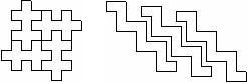
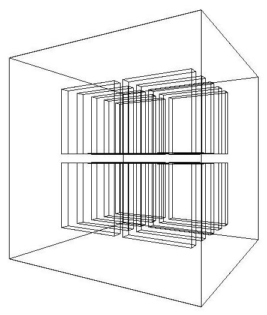

# 026 Creating an Assembly of Volumes

`G4AssemblyVolume` is a helper class which allows several logical volumes to be combined together in an arbitrary way in 3D space. The result is a placement of a normal logical volume, but where final physical volumes are many.

However, an *assembly* volume does not act as a real mother volume, being an envelope for its daughter volumes. Its role is over at the time the placement of the logical assembly volume is done. The physical volume objects become independent copies of each of the assembled logical volumes.

This class is particularly useful when there is a need to create a regular pattern in space of a complex component which consists of different shapes and can't be obtained by using replicated volumes or parametrised volumes (see also Fig. 9. Careful usage of `G4AssemblyVolume` must be considered though, in order to avoid cases of \"proliferation\" of physical volumes all placed in the same mother.

[]

[Fig. 9 ][Examples of *assembly* of volumes.]

## Filling an assembly volume with its \"daughters\"

Participating logical volumes are represented as a triplet of \<logical volume, translation, rotation\> (`G4AssemblyTriplet` class).

The adopted approach is to place each participating logical volume with respect to the assembly's coordinate system, according to the specified translation and rotation.

## Assembly volume placement

An assembly volume object is composed of a set of logical volumes; imprints of it can be made inside a mother logical volume.

Since the assembly volume class generates physical volumes during each imprint, the user has no way to specify identifiers for these. An internal counting mechanism is used to compose uniquely the names of the physical volumes created by the invoked `MakeImprint(...)` method(s).

The name for each of the physical volume is generated with the following format:

```cpp
av_WWW_impr_XXX_YYY_ZZZ
```

where:

```cpp
WWW - assembly volume instance number
XXX - assembly volume imprint number
YYY - the name of the placed logical volume
ZZZ - the logical volume index inside the assembly volume
```

It is however possible to access the constituent physical volumes of an assembly and eventually customise ID and copy-number.

The setting of the copy-numbers can be complex, depending on how complex is the structure being built. Each assembly (`G4AssemblyVolume`) instance gets automatically assigned a number, `assemblyID`, which starts from zero and gets incremented based on the number of imprints being made. Each assembly is being stored in a `G4AssemblyStore` and can always been retrieved at any time. `G4AssemblyVolume` allows to define a *base copy-number* for each imprint (call to `MakeImprint()`), by specifying it as a parameter, `copyNumBase`, which is set to zero by default. The computation of the effective copy-number of each volume in the assembly is done using such parameter, i.e. based on the number of triplets (number of volumes added in the assembly), each volume copy number is assigned as:

```cpp
numberOfDaughters + i
```

where `i` goes from zero to the number of volumes in the assembly; `numberOfDaughters` is either set to the number of daughter volumes in the mother where the assembly must be placed (if `copyNumBase` is zero, i.e. not being specified at the time the imprint is made), *or* the specified `copyNumBase`.

In case the assembly includes another assembly inside, the call to `makeImprint()` is made recursively, and the *base copy-number* in this case is being set to:

```cpp
i*100+copyNumBase
```

so, shifted by 100 times the index of the triplet in the original assembly.

## Destruction of an assembly volume

At destruction all the generated physical volumes and associated rotation matrices of the imprints will be destroyed. A list of physical volumes created by `MakeImprint()` method is kept, in order to be able to cleanup the objects when not needed anymore. This requires the user to keep the assembly objects in memory during the whole job or during the life-time of the `G4Navigator`, logical volume store and physical volume store may keep pointers to physical volumes generated by the assembly volume.

The `MakeImprint()` method will operate correctly also on transformations including reflections and can be applied also to recursive assemblies (i.e., it is possible to generate imprints of assemblies including other assemblies). Giving `true` as the last argument of the `MakeImprint()` method, it is possible to activate the volumes overlap check for the assembly's constituents (the default is `false`).

Each assembly structure is registered at construction in a specialised store, `G4AssemblyStore`, which can then be used to identify all structures defined in a geometry setup, as well as the volumes belonging to each imprint.

At destruction of a `G4AssemblyVolume`, all its generated physical volumes and rotation matrices will be automatically freed.

## Example

This example shows how to use the `G4AssemblyVolume` class. It implements a layered detector where each layer consists of 4 plates.

In the code below, at first the world volume is defined, then solid and logical volume for the plate are created, followed by the definition of the assembly volume for the layer.

The assembly volume for the layer is then filled by the plates in the same way as normal physical volumes are placed inside a mother volume.

Finally the layers are placed inside the world volume as the imprints of the assembly volume (see Listing 41).

```cpp
static unsigned int layers = 5;

void TstVADetectorConstruction::ConstructAssembly()
{
  // Define world volume
  G4Box* WorldBox = new G4Box( "WBox", worldX/2., worldY/2., worldZ/2. );
  G4LogicalVolume*   worldLV  = new G4LogicalVolume( WorldBox, selectedMaterial,
                                                    "WLog", 0, 0, 0 );
  G4VPhysicalVolume* worldVol = new G4PVPlacement( 0, G4ThreeVector(), "WPhys",worldLV,
                                                  0, false, 0 );

  // Define a plate
  G4Box* PlateBox = new G4Box( "PlateBox", plateX/2., plateY/2., plateZ/2. );
  G4LogicalVolume* plateLV = new G4LogicalVolume( PlateBox, Pb, "PlateLV", 0, 0, 0 );

  // Define one layer as one assembly volume
  G4AssemblyVolume* assemblyDetector = new G4AssemblyVolume();

  // Rotation and translation of a plate inside the assembly
  G4RotationMatrix Ra;
  G4ThreeVector Ta;
  G4Transform3D Tr;

  // Rotation of the assembly inside the world
  G4RotationMatrix Rm;

  // Fill the assembly by the plates
  Ta.setX( caloX/4. ); Ta.setY( caloY/4. ); Ta.setZ( 0. );
  Tr = G4Transform3D(Ra,Ta);
  assemblyDetector->AddPlacedVolume( plateLV, Tr );

  Ta.setX( -1*caloX/4. ); Ta.setY( caloY/4. ); Ta.setZ( 0. );
  Tr = G4Transform3D(Ra,Ta);
  assemblyDetector->AddPlacedVolume( plateLV, Tr );

  Ta.setX( -1*caloX/4. ); Ta.setY( -1*caloY/4. ); Ta.setZ( 0. );
  Tr = G4Transform3D(Ra,Ta);
  assemblyDetector->AddPlacedVolume( plateLV, Tr );

  Ta.setX( caloX/4. ); Ta.setY( -1*caloY/4. ); Ta.setZ( 0. );
  Tr = G4Transform3D(Ra,Ta);
  assemblyDetector->AddPlacedVolume( plateLV, Tr );

  // Now instantiate the layers
  for( unsigned int i = 0; i < layers; i++ )
  {
    // Translation of the assembly inside the world
    G4ThreeVector Tm( 0,0,i*(caloZ + caloCaloOffset) - firstCaloPos );
    Tr = G4Transform3D(Rm,Tm);
    assemblyDetector->MakeImprint( worldLV, Tr );
  }
}
```

The resulting detector will look as in Fig. 10.

[]

[Fig. 10 ]The geometry corresponding to the [Listing 41.]
