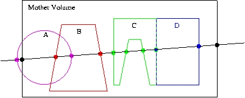
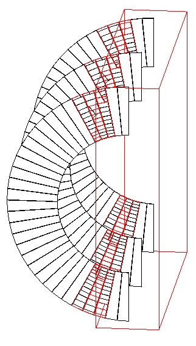

# 031 Detecting Overlapping Volumes

## The problem of overlapping volumes

Volumes are often positioned within other volumes with the intent that one is fully contained within the other. If, however, a volume extends beyond the boundaries of its mother volume, it is defined as overlapping. It may also be intended that volumes are positioned within the same mother volume such that they do not intersect one another. When such volumes do intersect, they are also defined as overlapping.

The problem of detecting overlaps between volumes is bounded by the complexity of the solid model description. Hence it requires the same mathematical sophistication which is needed to describe the most complex solid topology, in general. However, a tunable accuracy can be obtained by approximating the solids via first and/or second order surfaces and checking their intersections.

In general, the most powerful clash detection algorithms are provided by CAD systems, treating the intersection between the solids in their topological form.

### Detecting overlaps at construction

The Geant4 geometry modeler provides the ability to detect overlaps of placed volumes (normal placements or parameterised) at the time of construction. This check is optional and can be activated when instantiating a placement (see `G4PVPlacement` constructor in Placements: single positioned copy) or a parameterised volume (see `G4PVParameterised` constructor in Repeated volumes).

The positioning of that specific volume will be checked against all volumes in the same hierarchy level and its mother volume. Depending on the complexity of the geometry being checked, the check may require considerable CPU time; it is therefore suggested to use it only for debugging the geometry setup and to apply it only to the part of the geometry setup which requires debugging.

The classes `G4PVPlacement` and `G4PVParameterised` also provide a method:

```text
G4bool CheckOverlaps(G4int res=1000, G4double tol=0., G4bool verbose=true, G4int maxErr=1)
```

which will force the check for the specified volume, and can be therefore used to verify for overlaps also once the geometry is fully built. The check verifies if each placed or parameterised instance is overlapping with other instances or with its mother volume. A default resolution for the number of points to be generated and verified is provided. The method returns `true` if an overlap occurs. It is also possible to specify a \"tolerance\" by which overlaps not exceeding such quantity will not be reported and a maximum of overlaps errors for the volume; by default, one overlap per volume is reported.

### Detecting overlaps: built-in kernel commands

Built-in run-time commands to activate verification tests for the user-defined geometry are also provided

```text
geometry/test/run [check_mode]
--> to start verification of geometry for overlapping regions.
    If no argument is provided, a recursive check is run through
    the volumes tree (default behavior).
    An optional 'check_mode' parameter can be specified:
      - 'placed': (default) recursively checks all placed volumes
      - 'logical': checks only one instance per logical volume,
        reducing redundancy and improving performance in repeated structures
geometry/test/recursion_start [int]
--> to set the starting depth level in the volumes tree from where
    checking overlaps. Default is level '0' (i.e. the world volume).
    The new settings will then be applied to any recursive test run.
geometry/test/recursion_depth [int]
--> to set the total depth in the volume tree for checking overlaps.
    Default is '-1' (i.e. checking the whole tree).
    Recursion will stop after having reached the specified depth (the
    default being the full depth of the geometry tree).
    The new settings will then be applied to any recursive test run.
geometry/test/tolerance [double] [unit]
--> to define tolerance by which overlaps should not be reported.
    Default is '0'.
geometry/test/verbosity [bool]
--> to set verbosity mode. Default is 'true'.
geometry/test/resolution [int]
--> to establish the number of points on surface to be generated
    and checked for each volume. Default is '10000'.
geometry/test/maximum_errors [int]
--> to fix the threshold for the number of errors to be reported
    for a single volume. By default, for each volume, reports stop
    after the first error reported.
```

To detect overlapping volumes, the built-in UI commands use the random generation of points on surface technique described above. It allows to detect with high level of precision any kind of overlaps, as depicted below. For example, consider Fig. 11:

[]

[Fig. 11 ][Different cases of placed volumes overlapping each other.]

Here we have a line intersecting some physical volume (large, black rectangle). Belonging to the volume are four daughters: A, B, C, and D. Indicated by the dots are the intersections of the line with the mother volume and the four daughters.

This example has two geometry errors. First, volume A sticks outside its mother volume (this practice, sometimes used in GEANT3.21, is not allowed in Geant4). This can be noticed because the intersection point (leftmost magenta dot) lies outside the mother volume, as defined by the space between the two black dots.

The second error is that daughter volumes A and B overlap. This is noticeable because one of the intersections with A (rightmost magenta dot) is inside the volume B, as defined as the space between the red dots. Alternatively, one of the intersections with B (leftmost red dot) is inside the volume A, as defined as the space between the magenta dots.

Another difficult issue is roundoff error. For example, daughters C and D lie precisely next to each other. It is possible, due to roundoff, that one of the intersections points will lie just slightly inside the space of the other. In addition, a volume that lies tightly up against the outside of its mother may have an intersection point that just slightly lies outside the mother.

Finally, notice that no mention is made of the possible daughter volumes of A, B, C, and D. To keep the code simple, only the immediate daughters of a volume are checked at one pass. To test these \"granddaughter\" volumes, the daughters A, B, C, and D each have to be tested themselves in turn. To make this automatic, a recursive algorithm is applied; it first tests the target volume, then it loops over all daughter volumes and calls itself.

Note

for a complex geometry, checking the entire volume hierarchy can be extremely time consuming.

### Using built-in visualisation features

See Debugging geometry with vis.

### Using the visualization tool DAVID

The Geant4 visualization offers also a debugging tool for detecting potential intersections of physical volumes. The Geant4 DAVID visualization tool can automatically detect the overlaps between the volumes defined in Geant4 and converted to a graphical representation for visualization purposes. The accuracy of the graphical representation can be tuned onto the exact geometrical description. In the debugging, physical-volume surfaces are automatically decomposed into 3D polygons, and intersections of the generated polygons are investigated. If a polygon intersects with another one, physical volumes which these polygons belong to are visualized in color (red is the default). The Fig. 12 figure below is a sample visualization of a detector geometry with intersecting physical volumes highlighted:

[]

[Fig. 12 ][A geometry with overlapping volumes highlighted by DAVID.]

At present physical volumes made of the following solids can be debugged: `G4Box`, `G4Cons`, `G4Para`, `G4Sphere`, `G4Trd`, `G4Trap`, `G4Tubs`. (Existence of other solids is harmless.)

Visual debugging of physical-volume surfaces is performed with the DAWNFILE driver defined in the visualization category and with the two application packages, i.e. Fukui Renderer \"DAWN\" and a visual intersection debugger \"DAVID\".

How to compile Geant4 with the DAWNFILE driver incorporated is described in The Visualization Drivers.

If the DAWNFILE driver, DAWN and DAVID are all working well in your host machine, the visual intersection debugging of physical-volume surfaces can be performed as follows:

Run your Geant4 executable, invoke the DAWNFILE driver, and execute visualization commands to visualize your detector geometry:

```text
Idle> /vis/open DAWNFILE
.....(setting camera etc)...
Idle> /vis/drawVolume
Idle> /vis/viewer/update
```

Then a file \"g4.prim\", which describes the detector geometry, is generated in the current directory and DAVID is invoked to read it. (The description of the format of the file g4.prim can be found from the DAWN web site documentation.)

If DAVID detects intersection of physical-volume surfaces, it automatically invokes DAWN to visualize the detector geometry with the intersected physical volumes highlighted (See the above sample visualization).

If no intersection is detected, visualization is skipped and the following message is displayed on the console:

```text
------------------------------------------------------
!!! Number of intersected volumes : 0 !!!
!!! Congratulations ! \(^o^)/         !!!
------------------------------------------------------
```

If you always want to skip visualization, set an environmental variable as follows beforehand:

```text
%  setenv DAVID_NO_VIEW  1
```

To control the precision associated to computation of intersections (default precision is set to 9), it is possible to use the environmental variable for the DAWNFILE graphics driver, as follows:

```text
%  setenv G4DAWNFILE_PRECISION  10
```

If necessary, re-visualize the detector geometry with intersected parts highlighted. The data are saved in a file \"g4david.prim\" in the current directory. This file can be re-visualized with DAWN as follows:

```text
% dawn g4david.prim
```

It is also helpful to convert the generated file g4david.prim into a VRML-formatted file and perform interactive visualization of it with your WWW browser. The file conversion tool `prim2wrml` can be downloaded from the DAWN web site.
