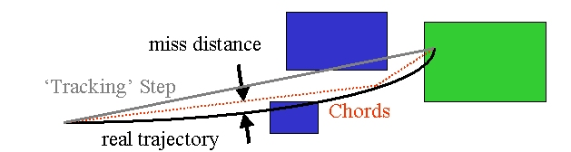
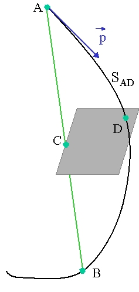

# 037 Electromagnetic Field

## An Overview of Propagation in a Field

Geant4 is capable of describing and propagating in a variety of fields. Magnetic fields, electric fields, electromagnetic fields, and gravity fields, uniform or non-uniform, can specified for a Geant4 setup. The propagation of tracks inside them can be performed to a user-defined accuracy.

In order to propagate a track inside a field, the equation of motion of the particle in the field is integrated. In general, this is done using a Runge-Kutta method for the integration of ordinary differential equations. However, for specific cases where an analytical solution is known, it is possible to utilize this instead. Several Runge-Kutta methods are available, suitable for different conditions. In specific cases (such as a uniform field where the analytical solution is known) different solvers can also be used. In addition, when an approximate analytical solution is known, it is possible to utilize it in an iterative manner in order to converge to the solution to the precision required. This latter method is currently implemented and can be used particularly well for magnetic fields that are almost uniform.

Once a method is chosen that calculates the track's propagation in a specific field, the curved path is broken up into linear chord segments. These chord segments are determined so that they closely approximate the curved path. The chords are then used to interrogate the Navigator as to whether the track has crossed a volume boundary. Several parameters are available to adjust the accuracy of the integration and the subsequent interrogation of the model geometry.

How closely the set of chords approximates a curved trajectory is governed by a parameter called the *miss distance* (also called the *chord distance*). This is an upper bound for the value of the sagitta - the distance between the 'real' curved trajectory and the approximate linear trajectory of the chord. By setting this parameter, the user can control the precision of the volume interrogation. Every attempt has been made to ensure that all volume interrogations will be made to an accuracy within this *miss distance*.



[Fig. 13 ][The curved trajectory will be approximated by chords, so that the maximum estimated distance and chord is less than the *miss distance*.]

In addition to the *miss distance* there are two more parameters which the user can set in order to adjust the accuracy (and performance) of tracking in a field. In particular these parameters govern the accuracy of the intersection with a volume boundary and the accuracy of the integration of other steps. As such they play an important role for tracking.

The *delta intersection* parameter is the accuracy to which an intersection with a volume boundary is calculated. If a candidate boundary intersection is estimated to have a precision better than this, it is accepted. This parameter is especially important because it is used to limit a bias that our algorithm (for boundary crossing in a field) exhibits. This algorithm calculates the intersection with a volume boundary using a chord between two points on the curved particle trajectory. As such, the intersection point is always on the 'inside' of the curve. By setting a value for this parameter that is much smaller than some acceptable error, the user can limit the effect of this bias on, for example, the future estimation of the reconstructed particle momentum.



[Fig. 14 ][The distance between the calculated chord intersection point C and a computed curve point D is used to determine whether C is an accurate representation of the intersection of the curved path ADB with a volume boundary. Here CD is likely too large, and a new intersection on the chord AD will be calculated.]

The *delta one step* parameter is the accuracy for the endpoint of 'ordinary' integration steps, those which do not intersect a volume boundary. This parameter is a limit on the estimated error of the endpoint of each physics step. It can be seen as akin to a statistical uncertainty and is not expected to contribute any systematic behavior to physical quantities. In contrast, the bias addressed by *delta intersection* is clearly correlated with potential systematic errors in the momentum of reconstructed tracks. Thus very strict limits on the intersection parameter should be used in tracking detectors or wherever the intersections are used to reconstruct a track's momentum.

*Delta intersection* and *delta one step* are parameters of the Field Manager; the user can set them according to the demands of his application. Because it is possible to use more than one field manager, different values can be set for different detector regions.

Note that reasonable values for the two parameters are strongly coupled: it does not make sense to request an accuracy of 1 nm for *delta intersection* and accept 100 $\mu$m for the *delta one step* error value. Nevertheless *delta intersection* is the more important of the two. It is recommended that these parameters should not differ significantly - certainly not by more than an order of magnitude.

## Creating a Field for a Detector

To define a field for a detector involves creating a field object, describing the field strength and registering this field to the Geant4 object needed to propagate particle tracks in it.

### Creating a Magnetic Field for a Detector

The simplest way to define a field for a detector involves using a suitable Geant4 magnetic field class.

It can be uniform:

```cpp
#include "G4SystemOfUnits.hh"

G4MagneticField *magField;
magField = new G4UniformMagField(G4ThreeVector(0.,0.,3.0*kilogauss));
```

a non-uniform magnetic field:

```cpp
magField = new G4QuadrupoleMagField( 1.*tesla/(1.*meter) );
```

Users can also define their own magnetic field class derived from `G4MagneticField`, for example:

```cpp
magField = new MyMagField();
```

### Registering a field and configuring parameters for propagation (the new way)

In Geant4 release 11.3 we introduced a new way to register a field, create the class objects needed to propagate particle tracks in it, and to configure key parameters of propagation.

( These parameters determine the accuracy of integration of the equations of motion, breaking up the trajectory into linear segments and then determining the approximate location the track crosses the next volume boundary. )

To use this capability first create or obtain the `G4FieldBuilder` object:

1.  create a field builder:

    ```cpp
    G4FieldBuilder::Instance();
      // this will create the field builder
      // together with UI commands for field configuration
    ```

2.  create a magnetic field (see Creating a Magnetic Field for a Detector)

3.  inform the field builder about your field and ask the builder to construct all classes needed to propagate your charged particles:

    ```cpp
    auto fieldBuilder = G4FieldBuilder::Instance();
    fieldBuilder->SetGlobalField(magField);

    // Construct all Geant4 field objects
    fieldBuilder->ConstructFieldSetup();
    ```

Note that the `G4FieldBuilder` class can be used also for other types of fields, such as the combined electromagnetic field.

Instantiating `G4FieldBuilder` also creates a set of UI commands in the `<cite>`/field`</cite>` directory.

#### Registering a global magnetic field and enabling propagation (the old way)

A1. create a pure magnetic field the same way (see Creating a Magnetic Field for a Detector)

A2. set field to global field manager

>
>
>
>
>     G4FieldManager* fieldMgr
>       = G4TransportationManager::GetTransportationManager()
>         ->GetFieldManager();
>     fieldMgr->SetDetectorField(magField);
>
>
>
>

A3. create the objects which calculate the trajectory for a pure magnetic field

>
>
> >
> >
> >
> >
> >     fieldMgr->CreateChordFinder(magField);
> >
> >
> >
> >
>
> This is a short cut, which creates all the equation of motion, a method for integration (Runge-Kutta stepper) and the driver which controls the integration and limits its estimated error.
>
> Note that it works only for pure magnetic fields - it does not work for a combined electromagnetic field or other types.
>
>

### Creating a Uniform Magnetic Field with user commands

Since 10.0 version, it is also possible to create a uniform magnetic field and perform the other two steps above the `G4GlobalMagFieldMessenger` class:

```cpp
G4ThreeVector fieldValue = G4ThreeVector(0.,0.,fieldValue);
fMagFieldMessenger = new G4GlobalMagFieldMessenger(fieldValue);
fMagFieldMessenger->SetVerboseLevel(1);
```

The messenger creates the global uniform magnetic field, which is activated (set to the `G4TransportationManager` object) only when the `fieldValue` is non zero vector. The messenger class setter functions can be then used to change the field value (and activate or inactivate the field again) or the level of output messages. The messenger also takes care of deleting the field.

As its class name suggests, the messenger creates also UI commands which can be used to change the field value and the verbose level interactively or from a macro:

```text
/globalField/setValue vx vy vz unit
/globalField/verbose level
```

### Configuring the behaviour of G4FieldBuilder

You can control the verbosity and get general information from `G4FieldBuilder` using the following interactive commands.

To choose the level of information printed by G4FieldBuilder when it creates other objects, use the command:

```text
/field/verboseLevel level
    level = 0, 1, 2
```

To ask it print all field parameters, say:

```text
/field/printParameters
```

Whenever any field parameters are modified after run initialization, the field must be updated with:

```text
/field/update
```

Commands that can be used to tune the precision of field propagation are described in the following section Practical Aspects.

An example which uses `G4FieldBuilder` together with a uniform magnetic field is provided in examples/extended/field/field01.

Alrenatively, the field can be also set to the global field manager explicitely, without use of `G4FieldBuilder`:

### Creating a Field for a Part of the Volume Hierarchy

It is possible to create a field for a part of the detector. In particular it can describe the field (with pointer pEmField, for example) inside a logical volume and its daughter volumes.

As an example we want to assign to logical volume at pointer `<cite>`logicVolumeWithField`</cite>` the magnetic field in the pointer `<cite>`localMagField`</cite>`.

```cpp
G4LogicalVolume*  logicalVolumeWithField;
G4MagneticField*  localMagField;
```

#### Local field using G4FieldBuilder

This can be done by modifying the above steps as follows:

1.  create a field builder and a **new configuration for a local field** in a logical volume, eg. \"Radiator\":

    ```cpp
    auto fieldBuilder = G4FieldBuilder::Instance();
       // this will create Create field builder
       // together with UI commands for the global field configuration

    fieldBuilder->CreateFieldParameters("Radiator");
       // this will create UI commands for the local field configuration
    ```

2.  inform the field builder that want to **attach a field to a logical volume** and let the builder construct all the object needed for propagation:

    ```cpp
    auto fieldBuilder = G4FieldBuilder::Instance();
    fieldBuilder->SetLocalField(localMagField, logicVolumeWithField);

    // Construct all Geant4 field objects
    fieldBuilder->ConstructFieldSetup();
    ```

Note that instantiating `G4FieldBuilder` creates a set of parameters and UI commands for a global field only. To create a separate set of parameters and commands for a local field you need to call `fieldBuilder->CreateFieldParameters` with the logical volume's name as an argument. This will create a new UI command directory, which in this case will be `/field/Radiator` with the same commands as for the global field.

An example with both global and local magnetic fields is provided in examples/extended/field/field03.

#### Local field without G4FieldBuild (the old way)

In order for your user code to work with releases 11.2 and earlier, you need to use the old method.

Just create a `G4FieldManager` and attach it to a logical volume

```cpp
G4FieldManager * localFieldManager = new G4FieldManager(localMagField);

G4bool allLocal = true;
logicVolumeWithField->SetFieldManager(localFieldManager, allLocal);
```

Use the second parameter to `SetFieldManager` you choose whether daughter volumes of this logical volume will also be given this new field:

-   if its value is `true`, the field manager will be assigned also to all of its daughters, and to all of their sub-volumes;

-   else, if it is `false`, the field manager will be assigned only to those daughter volumes which do not have a field manager already, and recursively to their sub-volumes which are without a field manager.

You can attach the same `G4FieldManager` object to multiple logical volumes. However we note that the field is provided with a position in global coordinates, and you may need to transform it into a local coordinate system to calculate its value.

### Creating an Electric or Electromagnetic Field

The design and implementation of the *Field* category allows and enables the use of an electric or combined electromagnetic field. These fields can also vary with time, as can magnetic fields.

The electric or electromagnetic field can be defined with the field builder as follows:

1.  create a field builder (same as before)

    ```cpp
    G4FieldBuilder::Instance();
       // this will create the field builder
       // together with UI commands for field configuration
    ```

2.  create a uniform **electric** field:

    ```cpp
    #include "G4SystemOfUnits.hh"
    #include "G4UniformElectricField.hh"

    auto elField
      = new G4UniformElectricField(G4ThreeVector(0.0,100000.0*kilovolt/cm,0.0));
    ```

3.  set field to the field builder, **notify the builder about non default (electromagnetic) field type** and let it construct all field objects:

    ```cpp
    auto fieldBuilder = G4FieldBuilder::Instance();
    fieldBuilder->SetGlobalField(elField);

    // Construct all Geant4 field objects
    fieldBuilder->SetFieldType(kElectroMagnetic);
    fieldBuilder->ConstructFieldSetup();
    ```

An example with an electric field is examples/extended/field/field02.

The `G4FieldBuilder` greatly simplifies creating this type of field. For reference, the code below does it in a way which is portable, ie backwards compatible with older Geant4 versions:

```cpp
#include "G4EqMagElectricField.hh"
#include "G4UniformElectricField.hh"
#include "G4DormandPrince745.hh"

const G4int nvar = 8;

auto pEMfield = new G4UniformElectricField(
                      G4ThreeVector(0.0,100000.0*kilovolt/cm,0.0));

auto pEquation = new G4EqMagElectricField(pEMfield);

auto stepper = new G4DormandPrince745( pEquation, nvar );
// Create the Runge-Kutta 'stepper' using the efficient 'DoPri5' method

auto fieldManager= G4TransportationManager::GetTransportationManager()->
                                            GetFieldManager();
// Set this field to the global field manager
fieldManager->SetDetectorField( pEMfield );

G4double minStep = 0.010*mm ; // minimal step of 10 microns

// Create a driver to control that integration is within acceptable errors
auto pIntgrationDriver =
     new G4IntegrationDriver<G4DormandPrince745>(minStep, stepper, nvar);

fieldManager->SetChordFinder( new G4ChordFinder(pIntgrationDriver) );
```

### Creating a Gravity and User Own Type Fields

An example with a uniform gravity field (G4UniformGravityField) is examples/extended/field/field06.

Note that using gravity since Geant4 10.6 it is necessary to enable it in the transportation process(es) used in the simulation. ( This is in order to enable optimisations which are possible only in its absence. )

The user can also create their own type of field, inheriting from `G4VField`, and an associated Equation of Motion class (inheriting from `G4EqRhs`) to simulate other types of fields.

## Practical Aspects

### How to Adjust the Accuracy of hitting a volume

Straight-line chord segments are used to detect volume boundary crossing. The curved trajectory is broken up into such segments using an accuracy parameter `DeltaChord`. Segments much be chosen so that their 'sagitta', the maximum distance between the curve and chord, is smaller than `DeltaChord`. So effectively this is the maximum distance by which a volume that should be intersected could be missed.

To change the accuracy of the approximation of the curved trajectory by linear segments, use the `SetDeltaChord` method:

```text
fieldMgr->GetChordFinder()->SetDeltaChord( dcLength ); // Units: length
```

Geant4 propagation will seek ensure that any volume within `dcLenght` from the curved trajectory will be intersected.

When field is created using `G4FieldBuilder` the parameter can be set via the UI command:

```text
/field/setDeltaChord value unit
```

### How to Adjust the Integration Accuracy

In order to obtain a particular accuracy in tracking particles through an electromagnetic field, it is necessary to adjust the parameters of the field propagation module. In the following section, some of these additional parameters are discussed.

When integration is used to calculate the trajectory, it is necessary to determine an acceptable level of numerical imprecision in order to get performant simulation with acceptable errors. The parameters in Geant4 tell the field module what level of integration inaccuracy is acceptable.

In all quantities which are integrated (position, momentum, energy) there will be errors. Here, however, we focus on the error in two key quantities: the position and the momentum. (The error in the energy will come from the momentum integration).

Three parameters exist which are relevant to the integration accuracy. DeltaOneStep is a distance and is roughly the position error which is acceptable in an integration step. Since many integration steps may be required for a single physics step, DeltaOneStep should be a fraction of the average physics step size. The next two parameters impose a further limit on the relative error of the position/momentum inaccuracy. EpsilonMin and EpsilonMax impose a minimum and maximum on this relative error - and take precedence over DeltaOneStep. (Note: if you set EpsilonMin=EpsilonMax=your-value, then all steps will be made to this relative precision.

```cpp
G4FieldManager *globalFieldManager =
     G4TransportationManager::GetTransportationManager()->GetFieldManager();

                          // Relative accuracy values:
G4double minEps= 1.0e-5;  //   Minimum & value for largest steps
G4double maxEps= 1.0e-4;  //   Maximum & value for smallest steps

globalFieldManager->SetMinimumEpsilonStep( minEps );
globalFieldManager->SetMaximumEpsilonStep( maxEps );
globalFieldManager->SetDeltaOneStep( 0.5e-3 * mm );  // 0.5 micrometer

G4cout << "EpsilonStep: set min= " << minEps << " max= " << maxEps << G4endl;
```

We note that these parameters will limit the relative inaccuracy in each substep. The final inaccuracy, due to the integration of the full trajectory, will accumulate the errors of each substep, with each one amplified by later substeps!

The exact point at which a track crosses a boundary is also calculated with finite accuracy. To limit this inaccuracy, a parameter called `DeltaIntersection` is used. This is a maximum for the inaccuracy of a single boundary crossing. Thus the accuracy of the position of the track after a number of boundary crossings is directly proportional to the number of boundaries.

When field is created using `G4FieldBuilder` UI commands are available for all above parameters:

```text
/field/setMinimumEpsilonStep 1.0e-5 mm
/field/setMaximumEpsilonStep 1.0e-4 mm
/field/setDeltaOneStep 0.5e-3 mm
/field/setDeltaIntersection value unit
```

### Full control of integration method for a magnetic field

You can instead specify explicitly the full set of classes for propagating in a magnetic field. This provides full control over the method of integration, and allows the choice of higher or lower order methods. It also all you to select the use of methods which used to be the default choice in the past (e.g. `G4ClassicalRungeRK4` or `G4DormandPrince745` without using interpolation.)

The classes required are the equation of motion:

```cpp
auto pEquation = new G4Mag_UsualEqRhs(magField);
G4int nVar= pEquation->GetNumberOfVariables();
```

the method of integration (stepper):

```cpp
auto stepper =  new G4DormandPrince745( pEquation );
```

the driver to control the accuracy of integration:

```cpp
auto driver = G4InterpolationDriver<G4DormandPrince745>(minStep,stepper, nvar);
```

or alternatively a driver without interpolation:

```cpp
auto driver= G4IntegrationDriver<typeof(stepper)>(minStep,stepper, nvar);
```

and the chord finder:

```cpp
auto chordFinder = new G4ChordFinder( driver );
```

### Choosing a Stepper

Runge-Kutta integration is used to compute the motion of a charged track in a general field. There are many general steppers from which to choose, of low and high order, and specialized steppers for pure magnetic fields. By default, Geant4 uses the established stepper of Dormand and Prince Runge-Kutta stepper, which is general purpose, efficient and robust. It is a 5th order method which provides an error estimate directly , and requires fewer evaluations of the derivative (and field) than the previous default, the classical 4th order method (for which an error estimate required multiple sub-steps).

For somewhat smooth fields, which change smoothly over the length scales of typical physics steps, there is choice between fifth order steppers (such as the default `G4DormandPrince745`):

```text
G4int nvar = 8;  // To integrate time & energy
                 //    in addition to position, momentum
G4EqMagElectricField* pEquation= new G4EqMagElectricField(pEMfield);

auto doPri5stepper = new G4DormandPrince745( pEquation, nvar );
  //  The recommended stepper, well suited for reasonably smooth fields
  //   and intermediate accuracy requirements ( 10^-4 to 10^-7 )
```

Alternative fifth order embedded steppers beside the recommended and default `G4DormandPrince745` which requires 7 field evaluations (stages) include the older `G4CashKarpRKF45` which requires fewer field evaluations (6 'stages')

```text
auto CK45stepper = new G4CashKarpRKF45( pEquation, nvar );
   // Alternative 4/5th order stepper for reasonably smooth fields
```

The newest experimental classes `G4BogackiShampine45` or `G4TsitourasRK45` implement some of the most efficient fifth order methods in the literature, but require an additional derivative (field evaluation) per step.:

```text
auto BS45stepper = new G4BogackiShampine45( pEquation, nvar );
   // Alternative 4/5th order stepper with 8 stages (evaluations).
```

If there are particularly challenging accuracy demands (better than 1e-7) it may be worth to investigate higher order steppers. Alternatively, if the field is known to have specific properties, lower or higher order steppers can be used to obtain the results of the necessary accuracy using fewer computing cycles.

Since Geant4 10.5 it is recommended to use the templated driver G4IntegrationDriver together with the stepper:

```text
auto dp45driver =
  new G4IntegrationDriver<G4DormandPrince745>(stepMin, doPri5stepper, nvar);
```

### Steppers for rough fields

Sometimes the field changes greatly over short distances, and is estimated in ways that do not ensure that its derivatives are smooth. These can present a challenge for fourth or fifth order Runge-Kutta methods.

What matters is the variation of the field in geometrical regions in which a large fraction of particles are tracked. In particular, if the field is calculated from a field map and it varies significantly and in a non-smooth way over short distances in important regions, it is suggested to investigate a lower order stepper.

Steppers of reduced order are also suitable when lower accuracy is required, such as errors of order 10^-3^. Such accuracy could be suitable for the least important tracks, such as low energy electrons near the end of their trajectory (but still inside material.)

Steppers of reduced order require fewer derivative evaluations per step. The choice of lower order steppers includes the third order embedded stepper `G4BogackiShampine23`, which provides a direct error estimate.:

```text
auto pStepper = new G4BogackiShampine23( pEquation, nvar );
  //  3rd order embbedded stepper
  //  Suitable for lower accuracy needs (<~ 10^-3) and/or 'rough' fields
```

Older type steppers, which do not provide a direct error estimate, offer an alternative for the roughest fields. ( Note: these methods estimate the error in a step by subdividing it into two smaller steps and using the difference between the new estimate and the estimate for the whole step as the estimated error. )

The recommended ones are the fourth order `G4ClassicalRK4`, which was the default in releases of Geant4 up to 10.3, and is very robust:

```text
pStepper = new ClassicalRK4( pEquation, nvar );
    //  4th  order, the old default - a robust alternative
```

the third order stepper `G4SimpleHeum`, and the second order steppers `G4ImplicitEuler` and `G4SimpleRunge`.:

```text
pStepper = new G4SimpleHeum( pEquation, nvar );
    //  3rd order robust alternative for low accuracy and/or rought fields

pStepper = new G4SimpleRunge( pEquation, nvar );
    //  2nd  order, for very rough (non-smooth) fields
```

A first order stepper is not recommended, but may be used only for the roughest fields, as a cross check for other higher performance methods.

For somewhat smooth fields (intermediate), the choice between a fifth order stepper (such as the default `G4DormandPrince745`):

```text
pStepper = new G4DormandPrince745( pEquation, nvar );
  //  The recommended stepper, well suited for reasonably smooth fields
```

embedded third, the older type second or third order steppers, or the established fourth order `G4ClassicalRK4` or

should be made by trial and error.

Trying a few different types of steppers for a particular field or application is suggested if maximum performance is a goal.

The choice of stepper depends on the type of field: magnetic or general. A general field can be an electric or electromagnetic field, it can be a magnetic field or a user-defined field (which requires a user-defined equation of motion.)

For a general field all the above steppers are potential alternatives to the recommended / default `G4DormandPrince745`.

But specialized steppers for pure magnetic fields are also available. The `G4NystromRK4` stepper is a fourth order method which estimates the integration error in a step directly from the variation of the field at the initial point, the midpoint and near the endpoint of the step. Thus it requires no additional evaluations (stages.):

```text
G4Mag_UsualEqRhs*
   pEquation = new G4Mag_UsualEqRhs(fMagneticField);
pStepper = new G4NystromRK4( pEquation );
```

Others take into account the fact that a local trajectory in a slowly varying field will not vary significantly from a helix. Combining this in with a variation the Runge-Kutta method can provide higher accuracy at lower computational cost when large steps are possible.

```text
pStepper = new G4HelixImplicitEuler( pEquation );
// Note that for magnetic field that do not vary with time,
//  the default number of variables suffices.

// or ..
pStepper = new G4HelixExplicitEuler( pEquation );
pStepper = new G4HelixSimpleRunge( pEquation );
```

A new stepper for propagation in magnetic field is available in release 9.3. Choosing the G4NystromRK4 stepper provides accuracy near that of G4ClassicalRK4 (4th order) with a significantly reduced cost in field evaluation. Using a novel analytical expression for estimating the error of a proposed step and the Nystrom reuse of the mid-point field value, it requires only 2 additional field evaluations per attempted step, in place of 10 field evaluations of ClassicalRK4 (which uses the general midpoint method for estimating the step error.)

```text
G4Mag_UsualEqRhs*
   pMagFldEquation = new G4Mag_UsualEqRhs(fMagneticField);
pStepper = new G4NystromRK4( pMagFldEquation );
```

It is proposed as an alternative stepper in the case of a pure magnetic field. It is not applicable for the simulation of electric or full electromagnetic or other types of field. For a pure magnetic field, results should be fully compatible with the results of ClassicalRK4 in nearly all cases. (The only potential exceptions are large steps for tracks with small momenta - which cannot be integrated well by any RK method except the Helical extended methods.)

You can choose an alternative stepper either when the field manager is constructed or later. At the construction of the ChordFinder it is an optional argument:

```text
G4ChordFinder( G4MagneticField* itsMagField,
               G4double         stepMinimum = 1.0e-2 * mm,
               G4MagIntegratorStepper* pItsStepper = 0 );
```

To change the stepper at a later time use

```text
pChordFinder->GetIntegrationDriver()
            ->RenewStepperAndAdjust( newStepper );
```

### Increasing efficiency with interpolation and FSAL stepper

Often a significant fraction of CPU time is spent in integrating the motion of charged particles in field. This is particularly the case when the cost of evaluating the field at a location (and possibly time) is significant. To improve on this developments over the past years have introduced methods that require fewer field evaluations for the same overall accuracy.

New in Geant4 10.6 is the ability to full use of the newest RK methods, which have an interpolation capability. Such Runge-Kutta methods provide an interpolation polynomial which can be evaluated to estimate the values of all integrated variables at an arbitrary intermediate length in the integration interval.

Both these interpolation capabilities are harnessed by the new type of integration driver `G4InterpolationDriver`. Currently this combination is available only with the `G4DormandPrince745` stepper.

```cpp
using InterpolationDriverType = G4InterpolationDriver<G4DormandPrince745>;
auto dopri5stepper = G4DormandPrince745( pEquation, nvar );

auto interpDriver= new InterpolationDriver(stepMinimum, dopri5stepper,
                   dopri5stepper->GetNumberOfVariables() );
auto pChordFinder = new G4ChordFinder( interpDriver );
fieldManager->SetChordFinder( pChordFinder );
```

Geant4 10.4 introduced the capability to use RK methods with the 'First Same as Last' (FSAL) property. Embedded steppers with this property evaluate the field and the derivative in the equation of motion at the endpoint of each step, as an intrinsic part of the method. As a result, after a successful integration step, (one in which the estimated error was acceptable) the derivative at the start of the next step is already available. So one evaluation of the field is saved for every successive integration interval after the first one in each tracking/physical step.

Since Geant4 10.6 an FSAL capable stepper can be selected for magnetic fields simply by requesting it when constructing a `G4ChordFinder`:

```cpp
G4MagneticField * pMagField;
G4double  stepMinimum = 0.03 * millimeter;
G4int     useFSALstp= 1;

auto pChordFinder= new G4ChordFinder( pMagField, stepMinimum, nullptr, useFSALstp );
fieldManager->SetChordFinder( pChordFinder );
```

### Handling very long steps by switching to helix based stepper

Very long steps of lower energy charged particles can cause excessive simulation time when regular Runge-Kutta methods are used \-- as these can integrate only a limited angle of a helical track in a single integration step.

This can be a problem for setups in which there is a significant fraction of tracks of low-energy charged particles in a volume with vaccum or a thin gas. In addition integration slowdown or abandoned tracks can occur when muons are tracked in a large air volume with even a fringe magnetic field.

For these setups an alternative type of driver specialised for pure magnetic fields was created. It combines an Interpolation stepper / driver for 'shorter' steps, and a helix-based method for 'long' steps.

It samples the magnetic field at the start of a step, and selects the 'long' step integration method if the helix angle exceed the threshold, currently fixed at 2 `pi`.

This type of driver `G4BFieldIntegrationDriver` was the default driver created by `G4ChordFinder` in Geant4 10.6 for pure magnetic fields.

```cpp
G4MagneticField * pMagField;
G4double  stepMinimum = 0.03 * millimeter;
G4bool    useFSALstp= false;

auto pChordFinder= new G4ChordFinder( pMagField, stepMinimum, nullptr, useFSALstp );
fieldManager->SetChordFinder( pChordFinder );
```

In Geant4 10.7 the default has changed to use an interpolation driver with templated steppers (see next subsection).

As a result, to select it `G4BFieldIntegrationDriver` in Geant4 10.7 a user must use:

```cpp
G4int     driverId = 3;  // B-Field driver = 3
auto pChordFinder= new G4ChordFinder( pMagField, stepMinimum, nullptr, driverId );
fieldManager->SetChordFinder( pChordFinder );
```

It can also be created directly

```cpp
using SmallStepDriver = G4InterpolationDriver<G4DormandPrince745>;
using LargeStepDriver = G4IntegrationDriver<G4HelixHeum>;

auto  regularStepper = new G4DormandPrince745(pEquation);
int   numVar = regularStepper->GetNumberOfVariables();

auto longStepper = std::unique_ptr<G4HelixHeum>(new G4HelixHeum(pEquation));

G4VIntegrationDriver driver =
  new G4BFieldIntegrationDriver(
        std::unique_ptr<SmallStepDriver>(new SmallStepDriver(stepMinimum,
                regularStepper,    numVar ) )
        std::unique_ptr<LargeStepDriver>(new LargeStepDriver(stepMinimum,
                longStepper.get(), numVar ) ) );
```

### UI commands for stepper and equation selection

When field is created using `G4FieldBuilder` the UI commands can also be used to choose a non-default stepper:

```text
/field/stepperType stepperType
     stepperType = BogackiShampine23, BogackiShampine45, CashKarpRKF45,
                   ClassicalRK4,
                   DormandPrince745, DormandPrinceRK56, DormandPrinceRK78,
                   ExplicitEuler, ImplicitEuler,
                   SimpleHeum, SimpleRunge, ConstRK4,
                   ExactHelixStepper, HelixExplicitEuler, HelixHeum,
                   HelixImplicitEuler, HelixMixedStepper, HelixSimpleRunge,
                   NystromRK4, RKG3_Stepper, TsitourasRK45,
                   RK547FEq1, RK547FEq2, RK547FEq3,
                   UserDefinedStepper
```

and/or equation of motion:

```text
/field/equationType equationType
    equetionType = EqMagnetic, EqMagneticWithSpin,
                   EqElectroMagnetic, EqEMfieldWithSpin, EqEMfieldWithEDM,
                   UserDefinedEq
```

The names of the stepper correspond to the corresponding class names. The commands also check the applicabilty of the stepper and equation types to the constructed field type; steppers or equations that are nor applicable will be rejected when the field is constructed and replaced by the default types. Users will be notified with a warning.

The default minimum step of the created integration driver can also be changed:

```text
/field/setMinimumStep value unit
```

Users can also define their own stepper or equation of motion classes, set them to `G4FieldBuilder`, the stepper and equation of motion classes are then of `UserDefinedStepper` and `UserDefinedEq` types respectively.

### Speeding up using steppers templated on equation

To reduce the CPU time of field propagation in Geant4 10.7 an equation class for magnetic fields and some templated stepper classes were created.

The first optimisation is that the templated equation knows the type of the field class:

```text
using Equation_t = G4TMagFieldEquation<Field_class_type>;
Equation_t*  equation= new Equation_t(field_object);
```

Given the field class' type, the equation will invoke the field without a virtual call. The relevant include files are:

```cpp
#include "G4TMagFieldEquation.hh"
#include "G4TDormandPrince45.hh"

// For field definition
#include "G4SystemOfUnits.hh"
#include "G4QuadrupoleMagField.hh"
```

To create the templated equation it is simpler to declare each class' type first:

```cpp
using Field_t = G4QuadrupoleMagField;
using Equation_t = G4TMagFieldEquation<Field_t>;

Field_t*     quadMagField = new G4QuadrupoleMagField(1.*tesla/(1.*meter));

Equation_t*  equation=  new Equation_t(quadMagField);
```

but it can also be created directly such as

```cpp
auto  equation= new G4TMagFieldEquation<G4QuadrupoleMagField>(quadMagField);
```

The second optimisation makes the type of the equation known to the templated stepper. This avoid a virtual call from the stepper to the equation.

```cpp
using TemplatedStepper_t = G4TDormandPrince45<Equation_t>;

TemplatedStepper_t* dopri5_stepper=
   new G4TDormandPrince45<Equation_t>( equation );
```

Here `G4TDormandPrince45` is the templated version of the recommended `G4DormandPrince745` stepper that implements the well known 4th/5th order embedded Runge-Kutta method of Dormand and Prince.

Alternative methods which have a templated stepper from Geant4 10.7 include the embedded method of Cash and Karp (`G4TCashKarpRKF45`), and a number of methods which use bisection for error estimatios: the original method of Runge and Kutta (`G4TClassicalRK4`) which used to be the default before Geant4 release 10.4, and two lower order methods, the 2nd order `G4TSimpleRunge` and the third order `G4TSimpleHeum`.

As a further optimisation, it can also be used with a templated driver

```cpp
double stepMin= 0.1 * CLHEP::millimeter;

auto dp45driver =
  new G4IntegrationDriver<TemplatedStepper_t>(stepMin, dopri5_stepper);

auto interpolatingDrv =
  new G4InterpolationDriver<TemplatedStepper_t>(stepMin, dopri5_stepper);
```

which is simplified greatly by using a name for the type of the templated stepper.

Note that the templated stepper class also can be used without using an equation templated on the type of field. This could be preferable in the case of complex field classes in which a large amount of code calculates the value of the field.

A templated stepper also using an alternative type of field. We demonstrate using a full electromagnetic field (which in practice will be a derived class for a user's application) and its equation G4EqMagElectricField:

```cpp
#include "G4EqMagElectricField.hh"

using Equation_t = G4EqMagElectricField;
constexpr nvar= 8; //  Equation integrates over x, p, t

using TemplatedDoPri5_t = G4TDormandPrince45<Equation_t,nvar>;

MyElectroMagneticField *emField= ...; // deriving from

auto emEquation= new G4EqMagElectricField(emField);

TemplatedDoPri5_t* pStepperTDP45 = new TemplatedDoPri5_t( emEquation, nvar );

auto ck45Stepper = new G4TCashKarpRKF45<Equation_t,nvar>( emEquation, nvar );
```

### Using different FSAL steppers \-- without interpolation

A different method which only has the FSAL property can be used for a magnetic field by adding a flag to the constructor of G4ChordFinder:

```cpp
G4MagneticField * pMagField;
G4double  stepMinimum = 0.03 * millimeter;
G4bool    useFSALstp= true;

auto pChordF= new G4ChordFinder( pMagField, stepMinimum, nullptr, useFSALstp );
```

This uses the constructor:

```cpp
G4ChordFinder::G4ChordFinder( G4MagneticField*        theMagField,
                              G4double                stepMinimum,
                              G4MagIntegratorStepper* pItsStepper,
                              G4bool                  useFSALstepper );
```

Steppers of this type can also be created directly:

```cpp
#include "G4RK547FEq1.hh"
#include "G4SystemsOfUnits.hh"

using FsalStepperType = G4RK547FEq1;
G4double  stepMinimum= 0.1 * millimeter;  // Minimum size of step (for driver)
int  nvar= 6; // or 8 to include time, Energy

auto fsalStepper=  new FsalStepperType(pEquation, nvar);
```

They must then be coupled to a new type of driver `G4FSALIntegrationDriver` in order to be used in integration. ( This is a derived class of the new base class for drivers `G4VIntegrationDriver`.)

```cpp
auto intgrDriver = new
     G4FSALIntegrationDriver<NewFsalStepperType>(stepMinimum,
                                                 fsalStepper,
                                                 fsalStepper->GetNumberOfVariables() );
```

This also demonstrates one of a new family of (FSAL) steppers `G4RK547FEq1` ( others are `G4RK547FEq2` and `G4RK547FEq3`) which were created to provide an improved equilibrium in integration. When a integration step fails due to an error above threshold, for some setups there can be oscillations in step size that cause multiple bounces between a successful and a failed step. The coefficients of these steppers were optimised to reduce these oscillations, and thus increase the success rate of steps. Initial tests demonstrated a small potential (1.0-2.5%) performance advantage.

### Further reducing the number of field calls to speed-up simulation

An additional method to reduce the number of field evaluations is to avoid recalculating the field value inside a sphere of a given radius `distConst` from the previously evaluated location.

This can be done by utilising the class G4CachedMagneticField class, for the case of pure magnetic fields which do not vary with time.

```cpp
G4MagneticField * pMagField;  // Your field - Defined elsewhere

G4double          distConst = 2.5 * millimeter;
G4MagneticField * pCachedMagField= new G4CachedMagneticField(  pMagField,  distConst);
```

This is not recommended if there are locations in the setup in which large variations occur in the field vector. In those cases it is best to rely on advanced integration method. In particular the Interpolation capabilities introduced in Geant4 10.6 greatly reduced the number of field calls already.

### Choosing different accuracies for the same volume

It is possible to create a `G4FieldManager` which has different properties for particles of different momenta (or depending on other parameters of a track). This is useful, for example, in obtaining high accuracy for 'important' tracks (e.g. muons) and accept less accuracy in tracking other tracks (e.g. electrons). To use this, you must create your own field manager class, derived from `G4FieldManager` which implements the method

```cpp
void ConfigureForTrack( const G4Track * ) override final;
```

and uses it to configure itself using the parameters of the current track.

For example to choose different values for the relative accuracy of integration for particles with energy below or above 2.5 MeV, this could be achieve as follows:

```cpp
class MyFieldManager : G4FieldManager
{
  MyFieldManager() = default;
  ~MyFieldManager() = default;

  void ConfigureForTrack( const G4Track * ) override final;
};

void MyFieldManager::ConfigureForTrack( const G4Track *pTrack)
{
  const G4double lowEepsMin= 1.0e-5, lowEepsMax= 1.0e-4;
  const G4double  hiEepsMin= 2.5e-6,  hiEepsMax= 1.0e-5;

  if( pTrack->GetKineticEnergy() < 2.5 * MeV ) {
     SetMinimumEpsilonStep( lowEepsMin );
     SetMaximumEpsilonStep( lowEepsMax );  // Max relative accuracy
  } else {
     SetMinimumEpsilonStep(  hiEepsMin );
     SetMaximumEpsilonStep(  hiEepsMax );  // Max relative accuracy
  }
}
```

### Parameters that must scale with problem size

The default settings of this module are for problems with the physical size of a typical high energy physics setup, that is, distances smaller than about one kilometer. A few parameters are necessary to carry this information to the magnetic field module, and must typically be rescaled for problems of vastly different sizes in order to get reasonable performance and robustness. Two of these parameters are the maximum acceptable step and the minimum step size.

The **maximum acceptable step** should be set to a distance larger than the biggest reasonable step. If the apparatus in a setup has a diameter of two meters, a likely maximum acceptable steplength would be 10 meters. A particle could then take large spiral steps, but would not attempt to take, for example, a 1000-meter-long step in the case of a very low-density material. Similarly, for problems of a planetary scale, such as the earth with its radius of roughly 6400 km, a maximum acceptable steplength of a few times this value would be reasonable.

An upper limit for the size of a step is a parameter of `G4PropagatorInField`, and can be set by calling its `SetLargestAcceptableStep` method.

The **minimum step size** is used during integration to limit the amount of work in difficult cases. It is possible that strong fields or integration problems can force the integrator to try very small steps; this parameter stops them from becoming unnecessarily small.

Trial steps smaller than this parameter will be treated with less accuracy, and may even be ignored, depending on the situation.

The minimum step size is a parameter of the MagInt_Driver, but can be set in the constructor of G4ChordFinder, as in the source listing above.

### Known Issues

For most integration method it is computationally expensive to change the *miss distance* to very small values, as it causes tracks to be limited to curved sections whose 'sagitta' is smaller than this value. (The sagitta is the distance of the mid-point from the chord between endpoints see e.g. \<https://en.wikipedia.org/wiki/Sagitta\_%28geometry%29\> .) For tracks with small curvature (typically low momentum particles in strong fields) this can cause a large number of steps

-   even in areas where there are no volumes to intersect (where the safety could be utilized to partially alleviate this limitation)

-   especially in a region near a volume boundary (in which case it is necessary in order to discover whether a track might intersect a volume for only a short distance.)

Requiring such precision for the intersection of all potential volumes is clearly expensive, and in some cases it is not possible to reduce expense greatly.

By contrast, changing the intersection parameter *delta intersection* is less computationally expensive. It causes further calculation for only a fraction of the steps, those that intersect a volume boundary.

## Spin Tracking

The effects of a particle's motion on the precession of its spin angular momentum in slowly varying external fields are simulated. The relativistic equation of motion for spin is known as the BMT equation. The equation demonstrates a remarkable property; in a purely magnetic field, in vacuum, and neglecting small anomalous magnetic moments, the particle's spin precesses in such a manner that the longitudinal polarization remains a constant, whatever the motion of the particle. But when the particle interacts with electric fields of the medium and multiple scatters, the spin, which is related to the particle's magnetic moment, does not participate, and the need thus arises to propagate it independent of the momentum vector. In the case of a polarized muon beam, for example, it is important to predict the muon's spin direction at decay-time in order to simulate the decay electron (Michel) distribution correctly.

In order to track the spin of a particle in a magnetic field, you need to code the following:

1.  in your DetectorConstruction:

    ```cpp
    #include "G4Mag_SpinEqRhs.hh"

    G4Mag_EqRhs* pEquation = new G4Mag_SpinEqRhs(magField);
    G4MagIntegratorStepper* pStepper = new G4ClassicalRK4(pEquation,12);
                                                     //    notice the 12
    ```

2.  in your PrimaryGenerator:

    ```cpp
    particleGun->SetParticlePolarization(G4ThreeVector p)
    ```

    for example:

    ```cpp
    particleGun->
    SetParticlePolarization(-(particleGun->GetParticleMomentumDirection()));

    // or
    particleGun->
    SetParticlePolarization(particleGun->GetParticleMomentumDirection()
                                           .cross(G4ThreeVector(0.,1.,0.)));
    ```

    where you set the initial spin direction.

While the G4Mag_SpinEqRhs class constructor:

```cpp
G4Mag_SpinEqRhs::G4Mag_SpinEqRhs( G4MagneticField* MagField )
   : G4Mag_EqRhs( MagField )
{
    anomaly = 1.165923e-3;
}
```

sets the muon anomaly by default, the class also comes with the public method:

```cpp
inline void SetAnomaly(G4double a) { anomaly = a; }
```

with which you can set the magnetic anomaly to any value you require.

The code has been rewritten (in Release 9.5) such that field tracking of the spin can now be done for charged and neutral particles with a magnetic moment, for example spin tracking of ultra cold neutrons. This requires the user to set `EnableUseMagneticMoment`, a method of the `G4Transportation` process. The force resulting from the term, MUSDOTNABLAB, is not yet implemented in Geant4 (for example, simulated trajectory of a neutral hydrogen atom trapped by its magnetic moment in a gradient B-field.)

## Alternative Integration Methods

There are three alternative integration methods available in Geant4. One is general, can be applied for any equation of motion.

The final, Symplectic Integration, aims to preserve phase space volume and energy exactly \-- and its implementations achieve this to the order of the method used (currently 2nd order.)

## Quantized State Simulation

The Quantized State Simulation method is a general integration method which uses polynomial approximation of the solutions of ODEs. In Geant4 its implementation is currently specialised for pure magnetic fields only. It is of potential interest to applications with a large number of volume boundary crossings per track.

```cpp
#include "G4ChordFinder.hh"
#include "G4QSSDriverCreator.hh"

{
  G4MagneticField* magField = ...
  G4double  stepMinimum= 0.01 * CLHEP::mm

  auto chordFnd = new G4ChordFinder( magField, stepMinimum, nullptr, kQss2DriverType);
}
..
```

```cpp
#include "G4QSStepper.hh"
#include "G4QSSDriver.hh"
#include "G4QSSMessenger.hh"
#include "G4ChordFinder.hh"

{
    G4int qssOrder = 2;  //  It can also be '3'

    G4QSSMessenger::instance()->SetQssOrder(qssOrder);

    auto qssStepper = new G4QSStepper(pEquation, 6, qssOrder);
    auto qss_driver = new G4QSSDriver<G4QSStepper>(qssStepper);

    G4cout << "-- Created QSS driver for B-field integration" << G4endl;

    auto chordFinder= new G4ChordFinder( driver );
}
..
```

Currently controling the precision of the QSS methods is possible only directly, using the method of G4QSSDriver:

```cpp
// Call G4QSSDriver<T>::SetPrecision(G4double dq_rel, G4double dq_min)

G4double deltaq_rel= 1.0e-04;
G4double deltaq_min= 2.0e-04;
qss_driver->SetPrecision(deltaq_rel, deltaq_min)
..
```

## Bulirsch-Stoer

The Bulirsch-Stoer method is an alternative to Runge-Kutta methods, and uses a midpoint method to obtain an estimate of the trajectory solution. It can be used with any equation of motion. One key use is to cross check results obtained with Runge-Kutta methods.

The current method is fourth order. (tbc)

```cpp
#include "G4BulirschStoer.hh"
#include "G4BulirschStoerDriver.hh"

void DetectorConstruction::ConstructSDandField()
{
   G4MagneticField     *magField = new G4UniformMagField( G4ThreeVector( 0, 0, 3.8*tesla );
   G4EquationOfMotion  pEquation= new G4Mag_UsualEqRhs(pMyMagField);

   G4BulirschStoer  * pBSstepper = new G4BulirschStoer( pEquation, nVar, epsilon );
   G4VIntegrationDriver*  driver = new G4IntegrationDriver<G4BulirschStoer>( stepMinimum, pBSstepper, nVar );
   G4cout << "Using Bulirsch Stoer method (and driver) - alternative to RK"  << G4endl;

   G4ChordFinder*   chordFinder= new G4ChordFinder( driver );

   // Use this for the global field
   G4FieldMananger* globalFieldMgr= G4TransportationManager::GetTransportationManager()->GetFieldManager();
   globalFieldMgr->SetChordFinder( chordFinder );
}
..
```

## Symplectic Integration

Some accelerator applications require long-term stability in the integration of energy and/or the preservation of phase-space volume. These are not well served by (medium order) Runge-Kutta method, and even high-order Runge-Kutta methods typically are not able to provide the required accuracy.

To address such applications Geant4 release 11.1 introduces a new integration method, the symplectic 2nd order `Boris` integration method. This method is implemented by the integration driver `G4BorisDriver`.

```cpp
#include "G4BorisScheme.hh"
#include "G4BorisDriver.hh"

void
CreateBorisDriver(G4EquationOfMotion* equation,
                  G4FieldManager* fieldManager,
                  G4double minimumStep
                 )
{
  //   1. Create Scheme and Driver
  auto borisScheme = new G4BorisScheme(equation);
  auto driver = new G4BorisDriver(minimumStep, borisScheme);

  //  2. Create ChordFinder
  auto chordFinder = new G4ChordFinder( driver );

  //  3. Updating Field Manager (with ChordFinder, field)
  fieldManager->SetChordFinder( chordFinder );
}

..
```

Recall that in a pure magnetic field the transportation process, e.g. `G4Transportation`, will conserve energy by ignoring integration errors. The field manager stores a property 'FieldChangesEnergy' which recalls this, and whose default behaviour must be overriden. If investigating energy conservation for a pure magnetic field, you must switch this off by calling the method `SetFieldChangesEnergy(G4bool);` with the argnument `true` for the relevant field manager.

This is demonstrated in the `field01` extended example for the global field manager using:

```cpp
GetGlobalFieldManager()->SetFieldChangesEnergy(true);
```

This enables you to test the level of energy conservation in the integration.

Note in a combined electro-magnetic field this property is automatically `false`, and changes due to integration already affect the particle energy.
