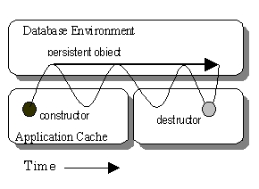

# 041 Object Persistency

## Persistency in Geant4

Object persistency is provided by Geant4 as an optional functionality.

When a usual (transient) object is created in C++, the object is placed onto the application heap and it ceases to exist when the application terminates. Persistent objects, on the other hand, live beyond the termination of the application process and may then be accessed by other processes (in some cases, by processes on other machines).

[Fig. 15 ][Persistent object.]

C++ does not have, as an intrinsic part of the language, the ability to store and retrieve persistent objects. Geant4 provides an abstract framework for persistency of hits, digits and events.

Two examples demonstrating an implementation of object persistency using one of the tools accessible through the available interface, is provided in `examples/extended/persistency`.

## Using Root-I/O for persistency of Geant4 objects

Object persistency of Geant4 objects is also possible by using the Root-I/O features through Root (since release `v6.04/08`).

The basic steps that one needs to do in order to use Root-I/O for arbitrary C++ classes is:

1.  Generate the dictionary for the given classes from Root (this usually is done by adding the appropriate command to the makefile)

2.  Add initialization of Root-I/O and loading of the generated dictionary for the given classes in the appropriate part of the code

3.  Whenever the objects to be persistified are available, call the `WriteObject` method of `TFile` with the pointer to the appropriate object as argument (usually it is some sort of container, like `std::vector` containing the collection of objects to be persistified)

The two examples (`P01` and `P02`) provided in `examples/extended/persistency` demonstrate how to perform object persistency using the Root-I/O mechanism for storing hits and geometry description.
