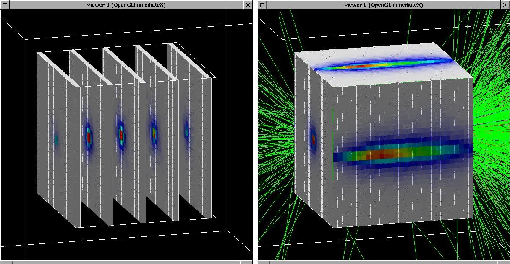
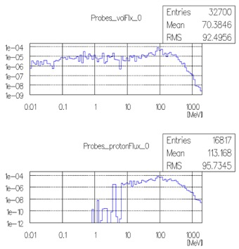

# 043 Command-based scoring

## Introduction

Command-based scoring in Geant4 defines `G4MultiFunctionalDetector` to a volume that is either defined in the tracking volume or created in a dedicated parallel world utilizing parallel navigation as described in the previous sections. The parallel world volume can be a scoring mesh or a scoring probe.

Once a scoring volume is defined, through interactive commands, the user can define arbitrary number of primitive scorers to score physics quantities and filters to be associated to each primitive scorer.

After scoring (i.e. a run), the user can dump scores into a file. Scores are automatically merged over worker threads. Also, for scoring mesh, scores can be visualized as well. All available UI commands are listed in List of built-in commands.

Command-based scoring is an optional functionality and the user has to explicitly define its use in the `main()`. To do this, the method `G4ScoringManager::GetScoringManager()` must be invoked right after the instantiation of `G4RunManager`. The scoring manager is a singleton object, and the pointer accessed above should not be deleted by the user.

```cpp
#include "G4RunManager.hh"
#include "G4ScoringManager.hh"

int main(int argc,char** argv)
{
 // Construct the run manager
 G4RunManager * runManager = new G4RunManager;

 // Activate command-based scorer
 G4ScoringManager::GetScoringManager();

 ...
}
```

## Defining a scoring volume in the tracking world

Scoring volume can be declared as a logical volume that is already defined as a part of the mass geometry through `/score/create/realWorldLogVol <LV_name> ` command, where `<LV_name>` is the name of `G4LogicalVolume` defined in the tracking world. If there are more than one physical volumes that share the same logical volume, scores are made for each individual physical volumes separately. Copy number of the physical volume is the index. If the physical volume is placed only once in its mother volume, but its (grand-)mother volume is duplicated, use the `` parameter to indicate the ancestor level where the copy number should be taken as the index of the score.

## Defining a scoring mesh

To define a scoring mesh, the user has to specify the following.

-   Shape and name of the 3D scoring mesh. Currently, box and cylinder are the only available shapes.

-   Size of the scoring mesh. Mesh size must be specified as \"half width\" similar to the arguments of `G4Box` or `G4Tubs`, respectively .

-   Number of bins for each axes. Note that too high number causes immense memory consumption.

-   Optionally, position and rotation of the mesh. If not specified, the mesh is positioned at the center of the world volume without rotation.

The following sample UI commands define a scoring mesh named `boxMesh_1`, size of which is 2 m \* 2 m \* 2 m, and sliced into 30 cells along each axes.

```text
#
# define scoring mesh
#
/score/create/boxMesh boxMesh_1
/score/mesh/boxSize 100. 100. 100. cm
/score/mesh/nBin 30 30 30
```

## Defining a scoring probe

User may locate scoring "probes" at arbitrary locations. A "probe" is a virtual cube, the size of which has to be specfied as \"half width\". Given probes are located in an artificial "parallel world", probes may overlap to the volumes defined in the mass geometry, as long as probes themselves are not overlapping to each other or protruding from the world volume.

In addition, the user may optionally set a material to the probe. Once a material is set to the probe, it overwrites the material(s) defined in the tracking geometry when a track enters the probe cube. This material has to be already instantiated in user's detector construction class or defined in `G4NISTmanager`.

Because of this overwriting, physics quantities that depend on material or density, e.g. energy deposition or dose, would be measured according to the specified material. Please note that this overwriting material obviously affects to the simulation results, so the size and number of probes should be reasonably small to avoid significant side effects.

If probes are placed more than once, all probes have the same scorers but score individually.

The following sample UI commands define a scoring probe named `Probes`, size of which is 10 cm \* 10 cm \* 10 cm, filled by `G4_Water`, and located at three positions.

```text
#
# define scoring probe
#
/score/create/probe Probes 5. cm
/score/probe/material G4_WATER
/score/probe/locate 0. 0. 0. cm
/score/probe/locate 25. 0. 0. cm
/score/probe/locate 0. 25. 0. cm
```

## Defining primitive scorers to a scoring volume

Once the scoring volume is defined, the user can define arbitrary scoring quantities and filters.

For a scoring volume the user may define arbitrary number primitive scorers to score for each physical volume (each cell for scoring mesh and each probe for scoring probe). For each scoring quantity, the use can set one filter. Please note that `/score/filter` commad affects on the immediately preceding scorer.

Names of scorers and filters must be unique for the scoring volume. It is possible to define more than one scorers of same kind with different names and, likely, with different filters. The list of available primitive scorers can be found at Table 3.

Defining a scoring volume and primitive scores should terminate with the `/score/close` command. The following sample UI commands define a scoring mesh named `boxMesh_1`, size of which is 2 m \* 2 m \* 2 m, and sliced into 30 cells along each axes. For each cell energy deposition, number of steps of gamma, number of steps of electron and number of steps of positron are scored.

```text
#
# define scoring mesh
#
/score/create/boxMesh boxMesh_1
/score/mesh/boxSize 100. 100. 100. cm
/score/mesh/nBin 30 30 30
#
# define scorers and filters
#
/score/quantity/energyDeposit eDep
/score/quantity/nOfStep nOfStepGamma
/score/filter/particle gammaFilter gamma
/score/quantity/nOfStep nOfStepEMinus
/score/filter/particle eMinusFilter e-
/score/quantity/nOfStep nOfStepEPlus
/score/filter/particle ePlusFilter e+
#
/score/close
#
```

## Drawing scores for a scoring mesh

Once scores assigned to a scoring mesh are filled, it is possible to visualize these scores. The score is drawn on top of the mass geometry with the current visualization settings.



[Fig. 16 ][Drawing scores in slices (left) and projection (right).]

Scored data can be visualized using the commands `/score/drawProjection` and `/score/drawColumn`. For details, see examples/extended/runAndEvent/RE03.

By default, entries are linearly mapped to colors (gray - blue - green - red). This color mapping is implemented in `G4DefaultLinearColorMap` class, and registered to `G4ScoringManager` with the color map name `"defaultLinearColorMap"`. The user may alternate color map by implementing a customised color map class derived from `G4VScoreColorMap` and register it to `G4ScoringManager`. Then, for each `draw` command, one can specify the preferred color map.

This drawing funactionality is available only for scoring mesh.

## Writing scores to a file

It is possible to dump a score in a mesh (`/score/dumpQuantityToFile` command) or all scores in a mesh (`/score/dumpAllQuantitiesToFile` command) to a file. The default file format is the simple CSV. To alternate the file format, one should overwrite `G4VScoreWriter` class and register it to `G4ScoringManager`. The scoring manager takes ownership of the registered writer, and will delete it at the end of the job.

Please refer to `/examples/extended/runAndEvent/RE03` for details.

## Filling 1-D histogram

Through the template interface class `G4TScoreHistFiller` a primitive scorer can directly fill a 1-D histogram defined by `G4Analysis` module. Track-by-track or step-by-step filling allows command-based histogram such as energy spectrum. `G4TScoreHistFiller` template class must be instantiated in the user's code (e.g. in the constructor of user run action) with his/her choice of analysis data format.

```text
#include "G4AnalysisManager.hh"
#include “G4TScoreHistFiller.hh”

auto histFiller = new G4TScoreHistFiller<G4AnalysisManager>;
```

`/score/fill1D <histID> <volName> <primName> <copNo>` command defines the histogram `<histID>` to be filled by `<primName>` primitive scorer assigned to `<volName>` scoring volume. If scoring volume in tracking world or probe is placed more than once, fill1D command should be issued for each individual copy number `<copNo>`.. Histogram `<histID>` must be defined through `/analysis/h1/create` command in advance to setting it to a primitive scorer. Scoring volume `<volName>` (either tracking world scorer or probe scorer) as well as the primitive scorer `<primName>` must be defined in advance, as well. This ifilling 1-D histogram functionality is not available for mesh scorer due to memory consumption concern. The list of primitive scorers available for 1-D histogram can be found at Table 3.

The following UI commands define a scoring probe named `Probes`, size of which is 10 cm \* 10 cm \* 10 cm, with two volume flux primitive scorers (one for total flux and the other for proton flux), and fill 1-D histograms of these two fluxes.

```text
#
# define scoring probe
#
/score/create/probe Probes 5. cm
/score/probe/locate 0. 0. 0. cm
#
# define flux scorers and filter
#
/score/quantity/volumeFlux volFlux
/score/quantity/volumeFlux protonFlux
/score/filter/particle protonFilter proton
/score/close
#
# define histograms
#
/analysis/h1/create volFlux Probes_volFlux 100 0.01 2000. MeV ! log
/analysis/h1/create protonFlux Probes_protonFlux 100 0.01 2000. MeV ! log
#
# filling histograms
#
/score/fill1D 1 Probes volFlux
/score/fill1D 2 Probes protonFlux
```



[Fig. 17 ][Histograms of total flux (top) and proton flux (bottom)]

## List of available primitive scorers

A primitive scorer is assigned to the scoring volume by `/score/quantity/xxxxx <primName> <unit>` where `xxxxx` is the name of primitive scorer listed below. Some of these primitive scorers can fill 1-D histogram described in the previous section.

| Name of primitive scorer | Description | Default unit | x-axis of 1-D histogram | y-axis of 1-D histogram |
| --- | --- | --- | --- | --- |
| cellCharge | deposited charge in the volume | e+ | n/a | n/a |
| cellFlux | sum of track length divided by the volume | $$cm^{-2}$$ | Ek in MeV | weighted cell flux |
| doseDeposit | deposited dose in the volume | Gy | dose per step in Gy | track weight |
| energyDeposit | deposited energy in the volume | MeV | eDep per step in MeV | track weight |
| flatSurfaceCurrent | surface current on -z surface to be used only for Box | $$cm^{-2}$$ | Ek in MeV | weighted current |
| flatSurfaceFlux | surface flux (1/cos(theta)) on -z surface to be used only for Box | $$cm^{-2}$$ | Ek in MeV | weighted flux |
| nOfCollision | number of steps made by physics interaction | n/a | n/a | n/a |
| nOfSecondary | number od secondary tracks generated in the volume | n/a | Ek in MeV | track weight |
| nOfStep | number of steps in the volume | n/a | step length in mm | entry (unweighted) |
| nOfTerminatedTrack | numver of tracks terminated in the volume (due to decay, interaction, stop, etc.) | n/a | n/a | n/a |
| nOfTrack | number of tracks in the volume (including both passing and terminated tracks) | n/a | Ek in MeV | track weight |
| passageCellCurrent | number of tracks that pass through the volume | n/a | Ek in MeV | track weight |
| passageCellFlux | sum of track length divided by the volume counted only for tracks that pass through the volume | $$cm^{-2}$$ | Ek in MeV | weighted cell flux |
| passageTrackLength | sum of track length in the volume for tracks that pass through the volume | mm | track length in mm | entry (unweighted) |
| population | number of tracks in the volume that are unique in an event | n/a | n/a | n/a |
| trackLength | total track length in the volume (including both passing and terminated tracks) | mm | n/a | n/a |
| volumeFlux | number of tracks getting into the volume | n/a | Ek in MeV | track weight |

: [Table 3 ][List of primitive scorers.]
