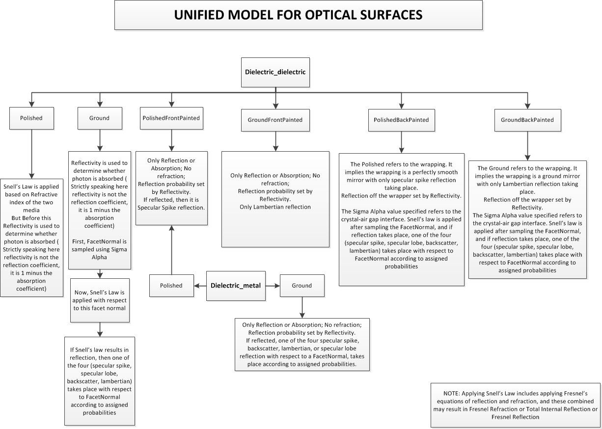
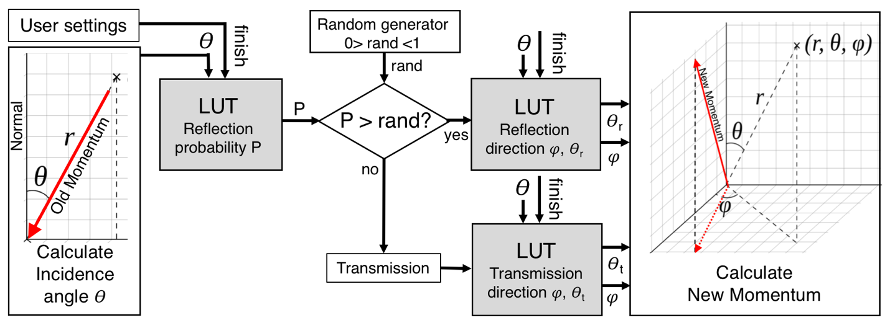
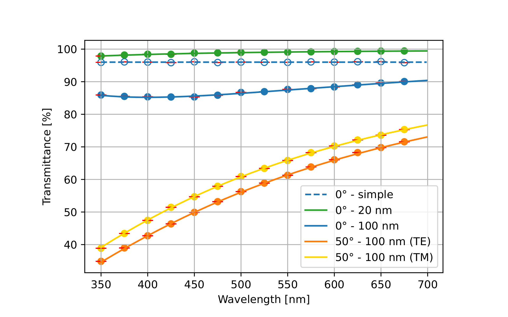
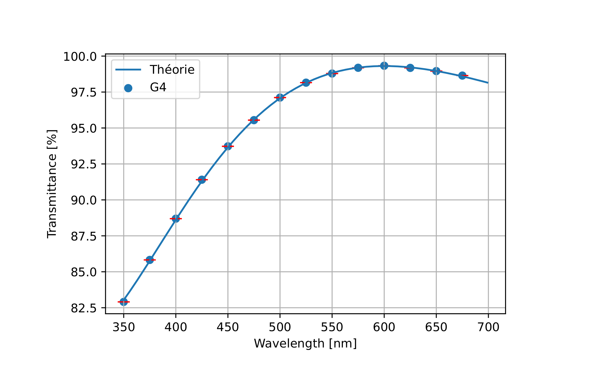
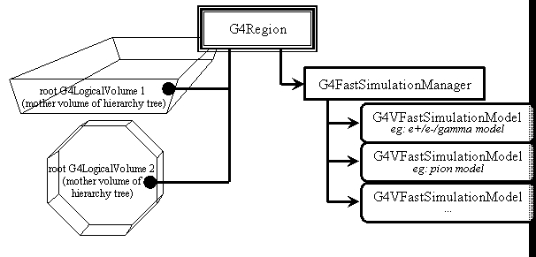

# 045 Physics Processes

## Overview

Physics processes describe how particles interact with a material. Seven major categories of processes are provided by Geant4:

1.  electromagnetic,

2.  hadronic,

3.  decay,

4.  photolepton-hadron,

5.  optical,

6.  parameterization, and

7.  transportation.

The generalization and abstraction of physics processes is a key issue in the design of Geant4. All physics processes are treated in the same manner from the tracking point of view. The Geant4 approach enables anyone to create a process and assign it to a particle type. This openness should allow the creation of processes for novel, domain-specific or customised purposes by individuals or groups of users.

Each process has two groups of methods which play an important role in tracking, `GetPhysicalInteractionLength` (GPIL) and `DoIt`. The GPIL method gives the step length from the current space-time point to the next space-time point. It does this by calculating the probability of interaction based on the process's cross section information. At the end of this step the `DoIt` method should be invoked. The `DoIt` method implements the details of the interaction, changing the particle's energy, momentum, direction and position, and producing secondary tracks if required. These changes are recorded as `G4VParticleChange` objects (see Particle change).

### G4VProcess

`G4VProcess` is the base class for all physics processes. Each physics process must implement virtual methods of `G4VProcess` which describe the interaction (DoIt) and determine when an interaction should occur (GPIL). In order to accommodate various types of interactions `G4VProcess` provides three `DoIt` methods:

-   `G4VParticleChange* AlongStepDoIt( const G4Track& track, const G4Step& stepData )`

    This method is invoked while `G4SteppingManager` is transporting a particle through one step. The corresponding `AlongStepDoIt` for each defined process is applied for every step regardless of which process produces the minimum step length. Each resulting change to the track information is recorded and accumulated in `G4Step`. After all processes have been invoked, changes due to `AlongStepDoIt` are applied to `G4Track`, including the particle relocation and the safety update. Note that after the invocation of `AlongStepDoIt`, the endpoint of the `G4Track` object is in a new volume if the step was limited by a geometric boundary. In order to obtain information about both the old and new volumes, `G4Step` must be accessed, since it contains information about both pre-step and post-step points of a step.

-   `G4VParticleChange* PostStepDoIt( const G4Track& track, const G4Step& stepData )`

    This method is invoked at the end point of a step, only if its process limit the step, or if the process is forced to occur at each step. `G4Track` will be updated after each invocation of `PostStepDoIt`.

-   `G4VParticleChange* AtRestDoIt( const G4Track& track, const G4Step& stepData )`

    This method is invoked only for stopped particles, and only if its process limit the step in time, or if the process is forced to occur.

    For each of the above `DoIt` methods `G4VProcess` provides a corresponding pure virtual GPIL method:

-   `PostStepGetPhysicalInteractionLength`

    ```cpp
    G4double PostStepGetPhysicalInteractionLength(const G4Track& track,
                                                  G4double previousStepSize,
                                                  G4ForceCondition* condition )
    ```

    This method generates the step length allowed by its process. It also provides a flag to force the interaction to occur regardless of its step length.

-   `AlongStepGetPhysicalInteractionLength`

    ```cpp
    G4double AlongStepGetPhysicalInteractionLength(const G4Track& track,
                                                   G4double previousStepSize,
                                                   G4double currentMinimumStep,
                                                   G4double& proposedSafety,
                                                   G4GPILSelection* selection )
    ```

    This method generates the step length allowed by its process.

-   `AtRestGetPhysicalInteractionLength`

    ```cpp
    G4double AtRestGetPhysicalInteractionLength(const G4Track& track,
                                                G4ForceCondition* condition )
    ```

    This method generates the step length in time proposed by this process. It also provides a flag to force the interaction to occur regardless of its step length.

Other pure virtual methods in `G4VProcess` follow:

-   `virtual G4bool IsApplicable(const G4ParticleDefinition&)`

    returns true if this process object is applicable to the particle type.

-   `virtual void PreparePhysicsTable(const G4ParticleDefinition&)` and

-   `virtual void BuildPhysicsTable(const G4ParticleDefinition&)`

    is messaged by the process manager, whenever cross section tables should be prepared and rebuilt due to changing cut-off values. It is not mandatory if the process is not affected by cut-off values.

-   `virtual void StartTracking()` and

-   `virtual void EndTracking()`

    are messaged by the tracking manager at the beginning and end of tracking the current track.

-   `virtual const G4VProcess* GetCreatorProcess() const`

    returns the sub-process pointer to be used as CreatorProcess for secondaries produced at the given step. It is needed for combined processes like G4GammaGeneralProcess or G4NeutronGeneralProcess. Other methods:

-   `virtual const G4String& GetProcessName() const`

-   `virtual G4ProcessType GetProcessType() const`

-   `virtual G4int GetProcessSubType() const`

    are useful for control on MC truth in an application and debugging. To access the process in the master thread from worker thread the following method may be used:

-   `virtual G4VProcess* GetMasterProcess() const`

    Process description should be provided by the process developer:

-   `virtual void ProcessDescription(std::ostream& outfile) const`

### Other base classes for processes

Specialized processes may be derived from seven additional virtual base classes which are themselves derived from `G4VProcess`. Three of these classes are used for simple processes:

`G4VRestProcess`

:   Processes using only the `AtRestDoIt` method.

    example: neutron capture

`G4VDiscreteProcess`

:   Processes using only the `PostStepDoIt` method.

    example: Compton scattering, hadron inelastic interaction. There are virtual methods, which are needed for more accurate tracking of charged particles:

-   `virtual G4double GetCrossSection(const G4double kinE, const G4MaterialCutsCouple*)`

-   `virtual G4double MinPrimaryEnergy(const G4ParticleDefinition*, const G4Material*)`

The other four classes are provided for rather complex processes:

`G4VContinuousDiscreteProcess`

:   Processes using both `AlongStepDoIt` and `PostStepDoIt` methods.

    example: transportation, ionisation(energy loss and delta ray)

`G4VRestDiscreteProcess`

:   Processes using both `AtRestDoIt` and `PostStepDoIt` methods.

    example: decay, radioactive decay

`G4VRestContinuousProcess`

:   Processes using both `AtRestDoIt` and `AlongStepDoIt` methods.

`G4VRestContinuousDiscreteProcess`

:   Processes using `AtRestDoIt`, `AlongStepDoIt and` PostStepDoIt methods.

### Particle change

`G4VParticleChange` and its descendants are used to store the final state information of the track, including secondary tracks, which has been generated by the `DoIt` methods. The instance of `G4VParticleChange` is the only object whose information is updated by the physics processes, hence it is responsible for updating the step. The stepping manager collects secondary tracks and only sends requests via particle change to update `G4Step`.

`G4VParticleChange` is introduced as an abstract class. It has a minimal set of methods for updating `G4Step` and handling secondaries. A physics process can therefore define its own particle change derived from `G4VParticleChange`. Three pure virtual methods are provided,

-   `virtual G4Step* UpdateStepForAtRest( G4Step* step)` ,

-   `virtual G4Step* UpdateStepForAlongStep( G4Step* step )`, and

-   `virtual G4Step* UpdateStepForPostStep( G4Step* step)`,

which correspond to the three `DoIt` methods of `G4VProcess`. Each derived class should implement these methods. There are specialized derived classes

-   `G4ParticleChange` - used in hadronic physics processes,

-   `G4ParticleChangeForTransport` - used for transportation processes,

-   `G4ParticleChangeForDecay` - used for `G4Decay`,

-   `G4ParticleChangeForRadDecay` - used for `G4VRadioactiveDecay`,

-   `G4ParticleChangeForLoss` - used for energy loss processes,

-   `G4ParticleChangeForMSC` - used for multiple scattering processes,

-   `G4ParticleChangeForGamma` - used for discrete electromagnetic processes.

## Electromagnetic Interactions

This section summarizes the electromagnetic (EM) physics processes which are provided with Geant4. Extended information are available at EM web pages. For details on the implementation of these processes please refer to the Physics Reference Manual.

To use the EM physics data files are needed. The user should set the environment variable G4LEDATA to the directory with these files, which are distributed together with Geant4 and can be obtained via the Geant4 download web page.

### Electromagnetic Processes

For EM processes following intermediate interfaces are used:

-   `G4VEnergyLossProcesses` - active `AlongStep` and `PostStep`,

-   `G4VEmProcess` - active `AtRest` and `PostStep`,

-   `G4VMultipleScattering` - active `AlongStep`.

The list of EM processes:

-   Photon processes

    -   Gamma conversion (also called pair production, class name `G4GammaConversion`)

    -   Photo-electric effect (class name `G4PhotoElectricEffect`)

    -   Compton scattering (class name `G4ComptonScattering`)

    -   Rayleigh scattering (class name `G4RayleighScattering`)

    -   Muon pair production (class name `G4GammaConversionToMuons`)

    -   X-ray reflection (class name `G4XrayReflection`)

    -   General gamma process (class name `G4GeneralGammaProcess`)

-   Electron/positron processes

    -   Ionisation and delta ray production (class name `G4eIonisation`)

    -   Bremsstrahlung (class name `G4eBremsstrahlung`)

    -   e+e- pair production (class name `G4ePairProduction`)

    -   Multiple scattering (class name `G4eMultipleScattering`)

    -   Positron annihilation into two gammas (class name `G4eplusAnnihilation`)

    -   Positron annihilation into two muons (class name `G4AnnihiToMuPair`)

    -   Positron annihilation into hadrons (class name `G4eeToHadrons`)

    -   Combined process for multiple scattering and transportation (class name `G4TransportationWithMsc`)

-   Muon processes

    -   Ionisation and delta ray production (class name `G4MuIonisation`)

    -   Bremsstrahlung (class name `G4MuBremsstrahlung`)

    -   e+e- pair production (class name `G4MuPairProduction`)

    -   mu+mu- pair production (class name `G4MuonToMuonPairProduction`)

    -   Multiple scattering (class name `G4MuMultipleScattering`)

-   Hadron/ion processes

    -   Ionisation (class name `G4hIonisation`)

    -   Ionisation for ions (class name `G4ionIonisation`)

    -   Ionisation for heavy exotic particles (class name `G4hhIonisation`)

    -   Ionisation for classical magnetic monopole (class name `G4mplIonisation`)

    -   Ionisation for exotic particles (class name `G4DynamicParticleIonisation`)

    -   Non-ionisation energy loss (NIEL) for protons and ions (class name `G4NuclearStopping`)

    -   Multiple scattering (class name `G4hMultipleScattering`)

    -   Multiple scattering of exotic particles (class name `G4DynamicParticleMSC`)

    -   Bremsstrahlung (class name `G4hBremsstrahlung`)

    -   e+e- pair production (class name `G4hPairProduction`)

-   Coulomb scattering processes

    -   Alternative process for simulation of single Coulomb scattering of all charged particles (class name `G4CoulombScattering`)

    -   Alternative process for simulation of single Coulomb scattering of ions (class name `G4ScreenedNuclearRecoil`)

-   Processes for simulation of polarized electron and gamma beams

    -   Compton scattering of circularly polarized gamma beam on polarized target (class name `G4PolarizedCompton`)

    -   Pair production induced by circularly polarized gamma beam (class name `G4PolarizedGammaConversion`)

    -   Photo-electric effect induced by circularly polarized gamma beam (class name `G4PolarizedPhotoElectricEffect`)

    -   Bremsstrahlung of polarized electrons and positrons (class name `G4ePolarizedBremsstrahlung`)

    -   Ionisation of polarized electron and positron beam (class name `G4ePolarizedIonisation`)

    -   Annihilation of polarized positrons (class name `G4eplusPolarizedAnnihilation`)

-   Processes for simulation of X-rays and optical protons production by charged particles

    -   Synchrotron radiation (class name `G4SynchrotronRadiation`)

    -   Transition radiation (class name `G4TransitionRadiation`)

    -   Cerenkov radiation (class name `G4Cerenkov`)

    -   Scintillations (class name `G4Scintillation`)

-   The processes described above use physics model classes, which may be combined according to particle energy. It is possible to change the energy range over which different models are valid, and to apply other models specific to particle type, energy range, and G4Region.

Any EM process may use one or several EM models via the interface

-   `G4VEmModel`.

Models, which are used in the default EM Physics List, are mainly from

:   the standard EM sub-library:

    -   Photoelectric effect (class name `G4LivermorePhotoElectricModel`)

    -   Compton scattering (class name `G4KleinNishinaCompton`)

    -   Electron/positron pair production (class name `G4PairProductionRelModel`)

    -   Rayleigh scattering (class name `G4LivermoreRayleighModel`)

    -   Multiple scattering (class name `G4UrbanMscModel`)

    -   Multiple scattering (class name `G4WentzelVIModel`)

    -   Single Coulomb scattering (class name `G4eCoulombScatteringModel`)

    -   Electron ionisation (class name `G4MollerBhabhaModel`)

    -   Electron/positron bremsstrahlung (class name `G4SeltzerBergerModel`)

    -   Electron/positron bremsstrahlung (class name `G4eBremsstrahlungRelModel`)

    -   Positron annihilation into 2 gamma (class name `G4eeToTwoGammaModel`)

    -   Muon and hadron low-energy ionisation (class name `G4BraggModel`)

    -   Ion low-energy ionisation (class name `G4BraggIonModel`)

    -   Ionisation of ions (class name `G4LindhardSorensenIonModel`)

    -   Anti-particle low-energy ionisation (class name `G4ICRU73QOModel`)

    -   Muon and hadron ionisation (class name `G4BetheBlochModel`)

    -   Muon ionisation (class name `G4MuBetheBlochModel`)

    -   Muon bremsstrahlung (class name `G4MuBremsstrahlungModel`)

    -   Muon pair production by muons (class name `G4MuonToMuonPairProductionModel`)

    -   Hadron bremsstrahlung (class name `G4hBremsstrahlungModel`)

    -   Muon e+e- pair production (class name `G4MuPairProductionModel`)

    -   Hadron e+e- pair production (class name `G4hPairProductionModel`)

    -   NIEL model for protons and ions (class name `G4ICRU49NuclearStoppingModel`)

    The following alternative models are available in the standard EM sub-library:

    -   Photoelectric effect (class name `G4PEEffectFluoModel`)

    -   Compton scattering (class name `G4KleinNishinaModel`)

    -   Ionisation in thin absorbers (class name `G4PAIModel`)

    -   Ionisation in thin absorbers (class name `G4PAIPhotModel`)

    -   Ionisation in low-density media (class name `G4BraggIonGasModel`)

    -   Ionisation in low-density media (class name `G4BetheBlochIonGasModel`)

    -   Ionisation of relativistic ions (class name `G4AtimaEnergyLossModel`)

    -   Parameterized e+e- bremsstrahlung (class name `G4eBremParametrizedModel`)

    -   Electron/positron pair production (class name `G4BetheHeitlerModel`)

    -   Electron/positron pair production (class name `G4BetheHeitler5DModel`)

    -   Electron/positron pair production (class name `G4RiGeMuPairProductionModel`)

    -   Positron annihilation into 2 or 3 gamma (class name `G4eplusTo2or3GammaModel`)

    -   Positron annihilation into 3 gamma (class name `G4eplusTo3GammaOKVIModel`)

    -   Multiple scattering (class name `G4GoudsmitSaundersonMscModel`)

    -   Multiple scattering (class name `G4LowEWentzelVIModel`)

    -   Single scattering (class name `G4eSingleCoulombScatteringModel`)

    -   Single scattering (class name `G4eDPWACoulombScatteringModel`)

    -   Single scattering (class name `G4hCoulombScatteringModel`)

    -   Single scattering (class name `G4IonCoulombScatteringModel`)

    In the low-energy sub-library there are alternative models (more detailes see below):

    -   Photoelectric effect (class name `G4PenelopePhotoElectricModel`)

    -   Compton scattering (class name `G4PenelopeComptonModel`)

    -   Compton scattering (class name `G4LivermoreComptonModel`)

    -   Compton scattering (class name `G4LivermorePolarizedComptonModel`)

    -   Compton scattering (class name `G4LowEPComptonModel`)

    -   Compton scattering (class name `G4LowEPPolarizedComptonModel`)

    -   Gamma conversion to e+e- pair (class name `G4LivermoreGammaConversionModel`)

    -   Gamma conversion to e+e- pair (class name `G4LivermoreGammaConversion5DModel`)

    -   Gamma conversion to e+e- pair (class name `G4PenelopeGammaConversionModel`)

    -   Rayleigh scattering (class name `G4JAEAElasticScatteringModel`)

    -   Rayleigh scattering (class name `G4JAEAPolarizedElasticScatteringModel`)

    -   Rayleigh scattering (class name `G4LivermorePolarizedRayleighModel`)

    -   Rayleigh scattering (class name `G4PenelopeRayleighModel`)

    -   Electron ionisation (class name `G4LivermoreIonisationModel`)

    -   Electron and positron ionisation (class name `G4PositronIonisationModel`)

    -   Ion ionisation (class name `G4IonParametrisedLossModel`)

    -   Electron, proton, alpha, and ion ionisation (class name `G4MicroElecInelastic`)

    -   Electron, proton, alpha, and ion elastic scattering (class name `G4MicroElecElastic`)

    -   Electron, proton, alpha, and ion ionisation (class name `G4MicroElecInelastic_new`)

    -   Electron, proton, alpha, and ion elastic scattering (class name `G4MicroElecElastic_new`)

It is recommended to use physics constructor classes provided with reference physics lists (in subdirectory `source/physics_lists/constructors/electromagnetic` of the Geant4 source distribution):

-   default EM physics `G4EmStandardPhysics`, multiple scattering is simulated with \"UseSafety\" type of step limitation by combined `G4WentzelVIModel` and `G4eCoulombScatteringModel` for all particle types, for of e+- below 100 MeV `G4UrbanMscModel` is used, `RangeFactor = 0.04`, `G4LivermorePhotoElectricModel` is used for simulation of the photo-electric effect, the Rayleigh scattering process is enabled below 1 MeV, `G4GammaGeneralProcess` is enabled, physics tables are built from 100 eV to 100 TeV, 7 bins per energy decade of physics tables are used (class name `G4EmStandardPhysics`);

-   `G4EmStandardPhysics_option1` providing fast but less accurate electron transport due to \"Minimal\" method of step limitation by multiple scattering, `RangeFactor = 0.2`, Rayleigh scattering is disabled, photo-electric effect is using `G4PEEffectFluoModel`, enabled \"ApplyCuts\" option, and enabled `G4TransportationWithMsc` combined process;

-   `G4EmStandardPhysics_option2` providing fast but less accurate electron transport due to \"Minimal\" method of step limitation by multiple scattering, `RangeFactor = 0.2`, \"Simple\" method of step limitation by multiple scattering, Rayleigh scattering is disabled, and photo-electric effect is using `G4PEEffectFluoModel`;

-   `G4EmStandardPhysics_option3` for simulation with high accuracy due to `UseDistanceToBoundary` multiple scattering step limitation and usage of `G4UrbanMscModel` for all charged particles, `RangeFactor = 0.04`, reduced *finalRange* parameter of stepping function optimized per particle type, alternative model `G4KleinNishinaModel` for Compton scattering, enabled fluorescence, enabled nuclear stopping, `G4Generator2BS` angular generator for bremsstrahlung, `G4LindhardSorensenIonModel` for ion ionisation, `G4ePairProduction` for electron/positron, 20 bins energy decade of physics tables, and 10 eV low-energy limit for tables;

-   `G4EmStandardPhysics_option4` combination of EM models for simulation with high accuracy includes multiple scattering with \"UseSafetyPlus\" type of step limitation by combined `G4WentzelVIModel` and `G4eCoulombScatteringModel` for all particle types, for of e+- below 100 MeV `G4GoudsmitSaundersonMscModel` is used, `RangeFactor = 0.08`, `Scin = 3` (error free stepping near geometry boundaries), reduced *finalRange* parameter of stepping function optimized per particle type, enabled fluorescence, enabled nuclear stopping, enable accurate angular generator for ionisation models, `G4LowEPComptonModel` below 20 MeV and `G4KleinNishinaModel` above, `G4BetheHeitler5DModel` for gamma conversion, `G4PenelopeIonisationModel` for electrons and positrons below 100 keV, `G4LindhardSorensenIonModel` for ion ionisation, `G4Generator2BS` angular generator for bremsstrahlung, `G4ePairProduction` for electron/positron, and 20 bins per energy decade of physics tables;

-   `G4EmLivermorePhysics` models based on Livermore data bases for electrons and gamma, enabled Rayleigh scattering, enabled fluorescence, `G4BetheHeitler5DModel` is used for gamma conversion, enabled nuclear stopping, enable accurate angular generator for ionisation models, `G4IonParameterisedLossModel` for ion ionisation, for of e+- below 100 MeV `G4GoudsmitSaundersonMscModel` is used with \"UseSafetyPlus\" multiple scattering step limitation, `RangeFactor = 0.08`, `Scin = 3` (error free stepping near geometry boundaries), `G4Generator2BS` angular generator for bremsstrahlung, `G4ePairProduction` for electron/positron, `G4LindhardSorensenIonModel` for ion ionisation, and 20 bins per energy decade of physics tables;

-   `G4EmLowEPPhysics` models with linear polarized gamma models based on Livermore data bases and new model for Compton scattering `G4LowEPComptonModel`, `G4BetheHeitler5DModel` is used for gamma conversion, and `G4LindhardSorensenIonModel`;

-   Penelope2008 models for electrons, positrons and gamma, enabled Rayleigh scattering, enabled fluorescence, enabled nuclear stopping, enable accurate angular generator for ionisation models, `G4LindhardSorensenIonModel` for ion ionisation, for of e+- below 100 MeV `G4GoudsmitSaundersonMscModel` is used with \"UseSafetyPlus\" multiple scattering step limitation, `RangeFactor = 0.08`, `Scin = 3` (error free stepping near geometry boundaries), and 20 bins per energy decade of physics tables, (`G4EmPenelopePhysics`);

-   `G4EmStandardPhysicsGS` experimental physics with multiple scattering of e+- below 100 MeV simulated by `G4GoudsmitSaundersonMscModel` is done on top of the default EM physics;

-   `G4EmStandardPhysicsWVI` experimental physics is done on top of the default EM physics with multiple scattering of e+- below 100 MeV simulated by a combination of `G4UrbanMscModel` below 1 MeV and `G4WentzelVIModel`, `G4eCoulombScatteringModel`, and for ions `G4LindhardSorensenIonModel`;

-   `G4EmStandardPhysicsSS` experimental physics with single scattering models instead of multiple scattering is done on top of the default EM physics, for all leptons and hadrons `G4eCoulombScatteringModel` is used, for ions - `G4IonCoulombScatteringModel`;

-   `G4EmDNAPhysics` low-energy Geant4-DNA physics.

-   Alternative low-energy Geant4-DNA physics constructors (`G4EmDNAPhysics_optionX`, where X is 1 to 8). Refer to Geant4-DNA section. The default upper energy applicability limit is 300 MeV. For particles or processes where Geant4-DNA physics is not available, the standard models are used.

Examples of the registration of these physics constructor and construction of alternative combinations of options are shown in basic, extended and advanced examples, which can be found in the subdirectories `examples/basic`, `examples/extended/electromagnetic`, `examples/medical`, `examples/advanced`, and of the Geant4 source distribution. Examples illustrating the use of electromagnetic processes are available as part of the Geant4 release.

**Options** are available for steering of electromagnetic processes. These options may be invoked either by UI commands or by the new C++ interface class `G4EmParameters`. The interface `G4EmParameters::Instance()` is thread safe, EM parameters are shared between threads, and parameters are shared between all EM processes. Parameters may be modified at G4State_PreInit or G4State_Idle states of Geant4. Note, that when any of EM physics constructor is instantiated a default set of EM parameters for this EM physics configuration is defined. So, parameters modification should be applied only after. This class has the following public methods:

-   Dump()

-   StreamInfo(std::ostream&)

-   SetDefaults()

-   SetLossFluctuations(G4bool)

-   SetBuildCSDARange(G4bool)

-   SetLPM(G4bool)

-   SetUseCutAsFinalRange(G4bool)

-   SetApplyCuts(G4bool)

-   SetFluo(G4bool val)

-   SetFluoDirectory(G4EmFluoDirectory type)

-   SetAuger(G4bool val)

-   SetPixe(G4bool val)

-   SetDeexcitationIgnoreCut(G4bool val)

-   SetLateralDisplacement(G4bool val)

-   SetLateralDisplacementAlg96(G4bool val)

-   SetMuHadLateralDisplacement(G4bool val)

-   ActivateAngularGeneratorForIonisation(G4bool val)

-   SetUseMottCorrection(G4bool val)

-   SetIntegral(G4bool val)

-   SetBirksActive(G4bool val)

-   SetUseICRU90Data(G4bool val)

-   SetFluctuationType(G4EmFluctuationType type)

-   SetPositronAtRestModelType(G4PositronAtRestModelType type)

-   SetDNAFast(G4bool val)

-   SetDNAStationary(G4bool val)

-   SetDNAElectronMsc(G4bool val)

-   SetGeneralProcessActive(G4bool val)

-   SetEnableSamplingTable(G4bool val)

-   SetEnablePolarisation(G4bool val)

-   SetDirectionalSplitting(G4bool val)

-   SetQuantumEntanglement(G4bool val)

-   SetRetrieveMuDataFromFile(G4bool val)

-   SetPhotoeffectBelowKShell(G4bool val)

-   SetMscPositronCorrection(G4bool val)

-   SetUseEPICS2017XS(G4bool val)

-   Set3GammaAnnihilationOnFly(G4bool val)

-   SetUseRiGePairProductionModel(G4bool val)

-   SetOnIsolated(G4bool val)

-   ActivateDNA(G4bool val)

-   SetIsPrintedFlag(G4bool val);

-   SetMinEnergy(G4double)

-   SetMaxEnergy(G4double)

-   SetMaxEnergyForCSDARange(G4double)

-   SetLowestElectronEnergy(G4double)

-   SetLowestMuHadEnergy(G4double)

-   SetLowestTripletEnergy(G4double)

-   SetLinearLossLimit(G4double)

-   SetBremsstrahlungTh(G4double)

-   SetMuHadBremsstrahlungTh(G4double val)

-   SetLambdaFactor(G4double)

-   SetFactorForAngleLimit(G4double)

-   SetMscThetaLimit(G4double)

-   SetMscEnergyLimit(G4double)

-   SetMscRangeFactor(G4double)

-   SetMscMuHadRangeFactor(G4double)

-   SetMscGeomFactor(G4double)

-   SetMscSafetyFactor(G4double)

-   SetMscLambdaLimit(G4double)

-   SetMscSkin(G4double)

-   SetScreeningFactor(G4double)

-   SetMaxNIELEnergy(G4double)

-   SetMaxEnergyFor5DMuPair(G4double)

-   SetStepFunction(G4double, G4double)

-   SetStepFunctionMuHad(G4double, G4double)

-   SetStepFunctionLightIons(G4double, G4double);

-   SetStepFunctionIons(G4double, G4double);

-   SetDirectionalSplittingRadius(G4double)

-   SetDirectionalSplittingTarget(const G4ThreeVector&)

-   SetNumberOfBinsPerDecade(G4int)

-   SetVerbose(G4int)

-   SetWorkerVerbose(G4int)

-   SetNumberForFreeVector(G4int)

-   SetTransportationWithMsc(G4TransportationWithMscType type)

-   SetMscStepLimitType(G4MscStepLimitType type)

-   SetMscMuHadStepLimitType(G4MscStepLimitType type)

-   SetSingleScatteringType(G4eSingleScatteringType type)

-   SetNuclearFormFactorType(G4NuclearFormFactorType type)

-   SetDNAeSolvationSubType(G4DNAModelSubType type)

-   SetTimeStepModel(const G4ChemTimeStepModel& model)

-   SetConversionType(G4int type)

-   SetPIXECrossSectionModel(const G4String&)

-   SetPIXEElectronCrossSectionModel(const G4String&)

-   SetLivermoreDataDir(const G4String&)

-   AddPAIModel(const G4String& particle, const G4String& region, const G4String& type)

-   AddMicroElec(const G4String& region)

-   AddDNA(const G4String& region, const G4String& type)

-   AddPhysics(const G4String& region, const G4String& type)

-   SetSubCutRegion(const G4String& region)

-   SetDeexActiveRegion(const G4String& region, G4bool, G4bool, G4bool)

-   SetProcessBiasingFactor(const G4String& process, G4double, G4bool)

-   ActivateForcedInteraction(const G4String& process, const G4String& region, G4double, G4bool)

-   ActivateSecondaryBiasing(const G4String& process, const G4String& region, G4double, G4double)

-   SetEmSaturation(G4EmSaturation\*)

The corresponding UI command can be accessed in the UI subdirectories \"/process/eLoss\", \"/process/em\", and \"/process/msc\". The following types of step limitation by multiple scattering are available:

-   fMinimal - simplified step limitation (used in \_EMV and \_EMX Physics Lists)

-   fUseSafety - default

-   fUseDistanceToBoundary - advance method of step limitation used in EM examples, required parameter *skin \> 0* , should be used for setup without magnetic field

-   fUseSafetyPlus - advanced method may be used with magnetic field

**G4EmCalculator** is a class which provides access to cross sections and stopping powers. This class can be used anywhere in the user code provided the physics list has already been initialised (G4State_Idle). `G4EmCalculator` has \"Get\" methods which can be applied to materials for which physics tables are already built, and \"Compute\" methods which can be applied to any material defined in the application or existing in the Geant4 internal database. The public methods of this class are:

-   GetDEDX(kinEnergy,particle,material,const G4Region\* r=nullptr)

-   GetRangeFromRestrictedDEDX(kinEnergy,particle,material,const G4Region\* r=nullptr)

-   GetCSDARange(kinEnergy,particle,material,const G4Region\* r=nullptr)

-   GetRange(kinEnergy,particle,material,const G4Region\* r=nullptr)

-   GetKinEnergy(range,particle,material,const G4Region\* r=nullptr)

-   GetCrossSectionPerVolume(kinEnergy,particle,material,const G4Region\* r=nullptr)

-   GetShellIonisationCrossSectionPerAtom(particle,Z,shell,kinEnergy)

-   GetMeanFreePath(kinEnergy,particle,material,const G4Region\* r=nullptr)

-   PrintDEDXTable(particle)

-   PrintRangeTable(particle)

-   PrintInverseRangeTable(particle)

-   ComputeDEDX(kinEnergy,particle,process,material,cut=DBL_MAX)

-   ComputeElectronicDEDX(kinEnergy,particle,material,cut=DBL_MAX)

-   ComputeDEDXForCutInRange(kinEnergy,particle,material,cut=DBL_MAX)

-   ComputeNuclearDEDX(kinEnergy,particle,material,cut=DBL_MAX)

-   ComputeTotalDEDX(kinEnergy,particle,material,cut=DBL_MAX)

-   ComputeCrossSectionPerVolume(kinEnergy,particle,process,material,cut=nullptr)

-   ComputeCrossSectionPerAtom(kinEnergy,particle,process,Z,A,cut=nullptr)

-   ComputeCrossSectionPerShell(kinEnergy,particle,process,Z,shellIdx,cut=nullptr)

-   ComputeGammaAttenuationLength(kinEnergy,material)

-   ComputeShellIonisationCrossSectionPerAtom(particle,Z,shell,kinEnergy)

-   ComputeMeanFreePath(kinEnergy,particle,process,material,cut=nullptr)

-   ComputeEnergyCutFromRangeCut(range,particle,material)

-   FindParticle(const G4String&)

-   FindIon(G4int Z, G4int A)

-   FindMaterial(const G4String&)

-   FindRegion(const G4String&)

-   FindCouple(const G4Material\*, const const G4Region\* r=nullptr)

-   FindProcess(particle, const G4String& processName)

-   SetVerbose(G4int)

For these interfaces, particles, materials, or processes may be pointers (`const G4ParticleDefinition*`, `const G4Material*`) or strings with names (`const G4String&`).

**G4NIELCalculator** is a class which provides computation of NIEL energy loss at a step independently on cuts and tracking. `G4NIELCalculator` has follow methods:

-   ComputeNIEL(const G4Step\*)

-   RecoilEnergy(const G4Step\*)

-   AddEmModel(G4VEmModel\*)

the last method allows customisation of NIEL model.

### Low Energy Electromagnetic Library

A physical interaction is described by a process class which can handle physics models, described by model classes. The following is a summary of the Low Energy Electromagnetic physics models available in Geant4. Further information is available in the web pages of the Geant4 Low Energy Electromagnetic Physics Working Group, accessible from the Geant4 web site, "who we are" section, then "working groups".

The physics content of these models is documented in the Geant4 Physics Reference Manual. They are based on the Livermore data library, on the ICRU73 data tables or on the Penelope2008 Monte Carlo code. They adopt the same software design as the \"standard\" Geant4 electromagnetic models.

Examples of the registration of physics constructor with low-energy electromagnetic models are shown in Geant4 extended examples (`examples/extended/electromagnetic` and `examples/extended/medical` in the Geant4 source distribution). Advanced examples (`examples/advanced` in the Geant4 source distribution) illustrate alternative instantiation of these processes. Both are available as part of the Geant4 release.

### Production Cuts

Remember that production cuts for secondaries can be specified as range cuts, which are converted at initialisation time into energy thresholds for secondary gamma, electron, positron and proton production. The cut for proton is applied by elastic scattering processes to all recoil ions.

A range cut value is set by default to 0.7 mm in Geant4 reference physics lists. This value can be specified in the optional SetCuts() method of the user Physics list or via UI commands. For e.g. to set a range cut of 10 micrometers, one can use

```bash
/run/setCut  0.01 mm
```

or, for a given particle type (for e.g. electron),

```bash
/run/setCutForAGivenParticle e- 0.01 mm
```

If a range cut equivalent to an energy lower than 990 eV is specified, the energy cut is still set to 990 eV. In order to decrease this value (for e.g. down to 250 eV, in order to simulate low energy emission lines of the fluorescence spectrum), one may use the following UI command before the \"/run/initialize\" command

```bash
/cuts/setLowEdge 100 eV
```

or alternatively directly in the user Physics list, in the optional SetCuts() method, using:

```cpp
G4ProductionCutsTable::GetProductionCutsTable()->SetEnergyRange(100*eV, 1*GeV);
```

A command is also available in order to disable usage of production threshold for fluorescence and Auger electron production

```bash
/process/em/deexcitationIgnoreCut true
```

### Angular Generators

For part of EM processes it is possible to factorise out sampling of secondary energy and direction. Using an interface `G4VEmModel` base class `SetAngularDistribution(G4VEmAngularDistribution*)` it is possible to substitute default angular generator of a model. Angular generators in standard and lowenergy sub-packages follow the same abstract interface.

For photoelectric models several angular generators are available:

-   G4SauterGavrilaAngularDistribution (default);

-   G4PhotoElectricAngularGeneratorSauterGavrila;

-   G4PhotoElectricAngularGeneratorPolarized.

For bremsstrahlung following angular generators are available:

-   G4ModifiedTsai (default for electrons and positrons bremsstrahlung);

-   G4ModifiedMephi (default for muons and hadrons pair production);

-   G4DipBustGenerator (bremsstrahlung);

-   G4Generator2BS (bremsstruhlung for electrons and positrons);

-   G4Generator2BN (bremsstruhlung for electrons and positrons);

-   G4PenelopeBremsstrahlungAngular;

-   G4RiGeAngularGenerator (muon pair production).

For gamma conversion models following angular generators are available:

-   G4ModifiedTsai (default);

-   G4DipBustGenerator.

For models of ionisation a new optional angular generator is available:

-   G4DeltaAngle.

### Electromagnetics secondary biasing

It may be useful to create more than one secondary at an interaction. For example, electrons incident on a target in a medical linac produce photons through bremsstrahlung. The variance reduction technique of bremsstrahlung splitting involves choosing *N* photons from the expected distribution, and assigning each a weight of 1/*N*.

Similarly, if the secondaries are not important, one can kill them with a survival probability of 1/*N*. The weight of the survivors is increased by a factor *N*. This is known as Russian roulette.

Neither biasing technique is applied if the resulting daughter particles would have a weight below 1/*N*, in the case of brem splitting, or above 1, in the case of Russian roulette.

These techniques can be enabled in Geant4 electromagnetics with the macro commands

```bash
/process/em/setSecBiasing processName Region factor energyLimit energyUnit
```

where: *processName* is the name of the process to apply the biasing to; *Region* is the region in which to apply biasing; *factor* is the inverse of the brem splitting or Russian roulette factor (1/*N*); *energyLimit energyUnit* is the high energy limit. If the first secondary has energy above this limit, no biasing is applied.

For example,

```bash
/process/em/setSecBiasing eBrem target 10 100 MeV
```

will result in electrons undergoing bremsstrahlung in the target region being split 10 times (if the first photon sampled has an energy less than 100 MeV).

Note that the biasing needs to be specified for each process individually. To apply Russian Roulette to daughter electrons from interactions of photons, issue the macro command for the processes phot, compt, conv.

#### Directional splitting

This biasing may be enabled based on the direction of the outgoing particles (\"directional splitting\"). The user may specify a spherical volume of interest by giving the center and radius of the volume. In an interaction, if the incident particle has high weight, the outgoing particles are split. *N* particles from the distribution are created, each with weight 1/*N*. For each particle, if it is not directed towards the volume of interest, Russian Roulette is played. Typically one will want directional splitting to take place for all interactions.

For example,

```bash
/process/em/setDirectionalSplitting true
/process/em/setDirectionalSplittingTarget 1000 0 0 mm  # x, y, z components of center
/process/em/setDirectionalSplittingRadius 10 cm
/process/em/setSecBiasing eBrem world 100 100 MeV
/process/em/setSecBiasing Rayl world 100 100 MeV
/process/em/setSecBiasing phot world 100 100 MeV
/process/em/setSecBiasing compt world 100 100 MeV
/process/em/setSecBiasing annihil world 100 100 MeV
```

Reference: BEAMnrc Users Manual, D.W.O Rogers, B. Walters, I. Kawrakow. NRCC Report PIRS-0509(A)revL, available here.

### Livermore Data Based Models

-   **Photon models**

    -   Photo-electric effect (class `G4LivermorePhotoElectricModel`)

    -   Polarized Photo-electric effect (class `G4LivermorePolarizedPhotoElectricModel`)

    -   Compton scattering (class `G4LivermoreComptonModel`)

    -   Compton scattering (class `G4LowEPComptonModel`)

    -   Polarized Compton scattering (class `G4LivermorePolarizedComptonModel`)

    -   Rayleigh scattering (class `G4LivermoreRayleighModel`)

    -   Polarized Rayleigh scattering (class `G4LivermorePolarizedRayleighModel`)

    -   Gamma conversion (also called pair production, class `G4LivermoreGammaConversionModel`)

    -   Nuclear gamma conversion (class `G4LivermoreNuclearGammaConversionModel`)

    -   Polarized gamma conversion (class `G4LivermorePolarizedGammaConversionModel`)

-   **Electron models**

    -   Bremsstrahlung (class `G4LivermoreBremsstrahlungModel`)

    -   Ionisation and delta ray production (class `G4LivermoreIonisationModel`)

### Hadron and Ion Ionisation Models

Ionisation and delta ray production by hadrons and ions base on stopping power data at low energies (below 2 MeV/u) and Bethe-Bloch or Lindhard-Sorensen theories above (*J. Lindhard & A.H. Sorensen, Phys. Rev. A 53 (1996) 2443-2455*). The data are taken from ICRU90, ICRU73, PSTAR, ASTAR, and ICRU49 databases. Part of these data are transformed to G4LEDATA database of Geant4, the rest is hardcoded inside corresponding Geant4 classes. ICRU90 provides new accurate data but only for 3 target materials and limited number of projectile/target combinations. ICRU73 cover projectile/target ion couple fro Z=3 to Z=80. ASTAR is used only for Helium ions.

### Penelope2008 Based Models

-   **Photon models**

    -   Compton scattering (class `G4PenelopeComptonModel`)

    -   Rayleigh scattering (class `G4PenelopeRayleighModel`)

    -   Gamma conversion (also called pair production, class `G4PenelopeGammaConversionModel`)

    -   Photo-electric effect (class `G4PenelopePhotoElectricModel`)

-   **Electron models**

    -   Bremsstrahlung (class `G4PenelopeBremsstrahlungModel`)

    -   Ionisation and delta ray production (class `G4PenelopeIonisationModel`)

-   **Positron models**

    -   Bremsstrahlung (class `G4PenelopeBremsstrahlungModel`)

    -   Ionisation and delta ray production (class `G4PenelopeIonisationModel`)

    -   Positron annihilation (class `G4PenelopeAnnihilationModel`)

All Penelope models can be applied up to a maximum energy of 100 GeV, although it is advisable not to use them above a few hundreds of MeV.

Options are available in the all Penelope Models, allowing to set (and retrieve) the verbosity level of the model, namely the amount of information which is printed on the screen.

-   SetVerbosityLevel(G4int)

-   GetVerbosityLevel()

The default verbosity level is 0 (namely, no textual output on the screen). The default value should be used in general for normal runs. Higher verbosity levels are suggested only for testing and debugging purposes.

The verbosity scale defined for all Penelope processes is the following:

-   0 = no printout on the screen (default)

-   1 = issue warnings only in the case of energy non-conservation in the final state (should never happen)

-   2 = reports full details on the energy budget in the final state

-   3 = writes also information on cross section calculation, data file opening and sampling of atoms

-   4 = issues messages when entering in methods

## Geant4-DNA extension: physics, chemistry, geometry

### Introduction

The Geant4-DNA extension provides Geant4 electromagnetic physics models to simulate the physical interactions of particles in liquid water and a few other materials down to energies of a few electron Volts, allowing the simulation of track structures in such materials and applications in micro/nanodosimetry at the cellular and subcellular levels.

Thanks to dedicated physico-chemical and chemical processes, precise energy deposition locations can then be used to simulate water radiolysis, including the production of chemical species.

All these processes can be combined with various geometries (e.g. DNA, cells, \...) for various radiobiology applications, medical physics, environmental studies, and space applications.

These developments are part of the ongoing Geant4-DNA project and associated collaboration, see more information in the Geant4-DNA **web pages** and in the following **reference publications** (ref1, ref2, ref3, ref4, ref5).

The following sections explain how to use such Geant4-DNA functionalities.

### Geant4-DNA: Physics processes

All Geant4-DNA physics processes are discrete, they simulate explicitly all physical interactions without the use of production cuts. The corresponding models are based on cross-section tables or analytical computation. They can be applied to the following particles:

-   electrons (Geant4 name is: `e-`)

-   protons (`proton`)

-   neutral hydrogen (\*) (`hydrogen`)

-   helium atoms ionized twice (`alpha`)

-   helium atoms ionized once (\*) (`alpha+`)

-   neutral helium atoms (\*) (`helium`)

-   ions (`ion`)

-   photons (`gammas`)

The particles identified with (\*) have been designed explicitly for Geant4-DNA physics processes only.

### Geant4-DNA: Physics processes and models for liquid water

All Geant4-DNA physics processes applicable to liquid water use the `G4_WATER` NIST material. They can be used in any geometrical volume containing such material (defined in user's `DetectorConstruction` class).

For ease of use, the processes for liquid water are assembled in 3 dedicated alternative recommended physics constructors (see this review for more detail and references):

-   `G4EmDNAPhysics_option2` (so-called "option2" in the following text): simulating electron interactions up to 1 MeV, as well as all other particle interactions.

-   `G4EmDNAPhysics_option4` ("option4"): contains alternative electron elastic and inelastic models, up to 10 keV, developped at Ioannina U., Greece.

-   `G4EmDNAPhysics_option6` ("option6"): contains electron elastic and inelastic models from the CPA100 track structure Monte Carlo code, up to 255 keV.

The following lines show how to use such Geant4-DNA physics constructor (for example, the `G4EmDNAPhysics_option4` constructor) in the implementation file (`PhysicsList.cc`) of the `PhysicsList` class of a user application:

>
>
>
>
>     #include "G4EmDNAPhysics_option4.hh"
>
>     PhysicsList::PhysicsList()
>     {
>         fEmPhysicsList = new G4EmDNAPhysics_option4();
>     }
>
>     //....oooOO0OOooo........oooOO0OOooo........oooOO0OOooo........oooOO0OOooo......
>
>     PhysicsList::~PhysicsList()
>     {
>         delete fEmPhysicsList;
>     }
>
>     //....oooOO0OOooo........oooOO0OOooo........oooOO0OOooo........oooOO0OOooo......
>
>     void PhysicsList::ConstructParticle()
>     {
>         fEmPhysicsList->ConstructParticle();
>     }
>
>     //....oooOO0OOooo........oooOO0OOooo........oooOO0OOooo........oooOO0OOooo......
>
>     void PhysicsList::ConstructProcess()
>     {
>         // Transportation
>         AddTransportation();
>
>         // Electromagnetic physics list
>         fEmPhysicsList->ConstructProcess();
>     }
>
>
>
>

with the corresponding header file (`PhysicsList.hh`):

>
>
>
>
>     #include "G4VModularPhysicsList.hh"
>
>     class PhysicsList : public G4VModularPhysicsList
>     {
>         public:
>             PhysicsList();
>             ~PhysicsList();
>
>         virtual void ConstructParticle();
>         virtual void ConstructProcess();
>
>         private:
>             G4VPhysicsConstructor* fEmPhysicsList;
>     };
>
>
>
>

From Geant4 version 11.2, to facilitate combination with Geant4 standard electromagnetic physics, option4 and option6 constructors can be used for electrons up to 1 MeV, the Born ionisation and excitation models (used in option2, see below) are indeed used beyond the upper energy limit of the electron inelastic models. In addition, beyond the energy limits of Geant4-DNA physics models, standard electromagnetic physics is applied automatically.

We detail below the physics processes and models for each particle type as available in the above physics constructors. The corresponding:

-   process classes

-   process names (shown during tracking)

-   model classes (their name includes "Model")

-   low energy and high energy limits of applicability of models (the kinetic energy of the particle must be less than this strict high energy limit)

-   energy threshold (also called \"tracking cut\") below which the incident particle is killed (stopped and the kinetic energy is locally deposited)

-   type of model (analytical or based on interpolated data tables)

-   and the corresponding physics constructor(s) containing such processes and models

are indicated.

For more details on the physics models, see this review.

*Detailed list of processes and models for liquid water*

**ELECTRONS**

*Elastic scattering*

-

    `G4DNAElastic` process class

    :   -   process name: `e-_G4DNAElastic`

-

    `G4DNAChampionElasticModel` model class

    :   -   applicable energy range: 7.4 eV - 1 MeV

        -   cut at 7.4 eV (1)

        -   type: interpolated

        -   available in the following Geant4-DNA physics constructors: default, option2 (\*)

-

    `G4DNAScreenedRutherfordElasticModel`

    :   -   applicable energy range: 0 eV - 1 MeV

        -   cut at 9 eV (1)

        -   type: analytical

        -   constructors: none

-

    `G4DNAUeharaScreenedRutherfordElasticModel`

    :   -   applicable energy range: 10 eV - 1 MeV

        -   cut at 10 eV (1)

        -   type: analytical

        -   constructors: option4 (\*)

-

    `G4DNACPA100ElasticModel` (2)

    :   -   applicable energy range: 11 eV - 250 keV

        -   cut at 11 eV (1)

        -   type: interpolated

        -   constructors: option6 (\*)

*Electronic excitation*

-

    `G4DNAExcitation` process class

    :   -   process name: `e-_G4DNAExcitation`

-

    `G4DNABornExcitationModel`

    :   -   applicable energy range: 9 eV - 1 MeV

        -   type: interpolated

        -   constructors: default, option2, and up to 1 MeV for option4 and option6

-

    `G4DNAEmfietzoglouExcitationModel` (3)

    :   -   applicable energy range: 8 eV - 10 keV

        -   type: interpolated

        -   constructors: option4

-

    `G4DNACPA100ExcitationModel` (3)

    :   -   applicable energy range: 11 eV - 250 keV

        -   type: interpolated

        -   constructors: option6

*Ionisation*

-

    `G4DNAIonisation` process class

    :   -   process name: `e-_G4DNAIonisation`

-

    `G4DNABornIonisationModel`

    :   -   applicable energy range: 10 eV - 1 MeV

        -   type: interpolated

        -   constructors: default, option2, and up to 1 MeV for option4 and option6

-

    `G4DNAEmfietzoglouIonisationModel` (4)

    :   -   applicable energy range: 11 eV - 10 keV

        -   type: interpolated

        -   constructors: option4

-

    `G4DNACPA100IonisationModel` (4)

    :   -   applicable energy range: 11 eV - 250 keV

        -   type: interpolated

        -   constructors: option6

*Attachment*

-

    `G4DNAAttachment` process class

    :   -   process name: `e-_G4DNAAttachment`

-

    `G4DNAMeltonAttachmentModel`

    :   -   applicable energy range: 4 eV - 13 eV

        -   type: interpolated

        -   constructors: default, option2

*Vibrational excitation*

-

    `G4DNAVibExcitation` process class

    :   -   process name: `e-_G4DNAVibExcitation`

-

    `G4DNASancheExcitationModel`

    :   -   applicable energy range: 2 eV - 100 eV

        -   type: interpolated

        -   constructors: default, option2

*Solvation*

-

    `G4DNAElectronSolvation` process class

    :   -   process name: `e-_G4DNAElectronSolvation`

-

    `G4DNAOneStepThermalizationModel` model class

    :   -   applies a tracking cut to electrons (see Elastic scattering process for electrons) when chemistry is not activated (1)

        -   available in all Geant4-DNA physics constructors

Note (1): default tracking cut for electrons as set in the Geant4-DNA physics constructors and handled by the `G4DNAElectronSolvation` process, when chemistry simulation is not activated.

Note (2): the `G4DNAScreenedRutherfordElasticModel`, `G4DNAUeharaScreenedRutherfordElasticModel` and `G4DNACPA100ElasticModel` are alternative models for the simulation of elastic scattering.

Note (3): the `G4DNAEmfietzoglouExcitationModel` and `G4DNACPA100ExcitationModel` are alternative models for the simulation of electronic excitation.

Note (4): the `G4DNAEmfietzoglouIonisationModel` and `G4DNACPA100IOnisationModel` are alternative models for the simulation of ionisation.

Note (\*): constructors differ by electron models.

**PROTONS**

*Nuclear scattering*

-

    `G4DNAElastic` process class

    :   -   process name: `proton_G4DNAElastic`

-

    `G4DNAIonElasticModel`

    :   -   applicable energy range: 100 eV - 1 MeV

        -   cut at 100 eV (5)

        -   type: interpolated

        -   Geant4-DNA physics constructors: default, option2, option4, option6

*Electronic excitation*

-

    `G4DNAExcitation` process class

    :   -   process name: `proton_G4DNAExcitation`

-

    `G4DNAMillerGreenExcitationModel`

    :   -   applicable energy range: 10 eV - 500 keV

        -   type: analytical

        -   constructors: default, option2, option4, option6

-

    `G4DNABornExcitationModel` (3)

    :   -   applicable energy range: 500 keV - 100 MeV

        -   type: interpolated

        -   constructors: default, option2, option4, option6

-

    `G4DNARPWBAExcitationModel`

    :   -   applicable energy range: 100 MeV - 300 MeV

        -   type: interpolated

        -   constructors: default, option2, option4, option6

*Ionisation*

-

    `G4DNAIonisation` process class

    :   -   process name: `proton_G4DNAIonisation`

-

    `G4DNARuddIonisationExtendedModel`

    :   -   applicable energy range: 100 eV - 500 keV

        -   cut at 100 eV (5)

        -   type: interpolated

        -   constructors: default, option2, option4, option6

-

    `G4DNABornIonisationModel`

    :   -   applicable energy range: 500 keV - 100 MeV

        -   type: interpolated

        -   constructors: default, option2, option4, option6

-

    `G4DNARPWBAIonisationModel`

    :   -   applicable energy range: 100 MeV - 300 MeV

        -   type: interpolated

        -   constructors: default, option2, option4, option6

*Electron capture*

-

    `G4DNAChargeDecrease` process class

    :   -   process name: `proton_G4DNAChargeDecrease`

-

    `G4DNADingfelderChargeDecreaseModel`

    :   -   applicable energy range: 100 eV - 100 MeV

        -   type: analytical

        -   constructors: default, option2, option4, option6

Note (5): indicates the tracking cut applied by the corresponding model.

**HYDROGEN ATOMS** (named \"hydrogen\")

*Nuclear scattering*

-

    `G4DNAElastic` process class

    :   -   process name: `hydrogen_G4DNAElastic`

-

    `G4DNAIonElasticModel`

    :   -   applicable energy range: 100 eV - 1 MeV

        -   cut at 100 eV (5)

        -   type: interpolated

        -   Geant4-DNA physics constructors: default, option2, option4, option6

*Electronic excitation*

-

    `G4DNAExcitation` process class

    :   -   process name: `hydrogen_G4DNAExcitation`

-

    `G4DNAMillerGreenExcitationModel`

    :   -   applicable energy range: 10 eV - 500 keV

        -   type: analytical

        -   constructors: default, option2, option4, option6

*Ionisation*

-

    `G4DNAIonisation` process class

    :   -   process name: `hydrogen_G4DNAIonisation`

-

    `G4DNARuddIonisationExtendedModel`

    :   -   applicable energy range: 100 eV - 100 MeV

        -   cut at 100 eV (5)

        -   type: interpolated

        -   constructors: default, option2, option4, option6

*Electron loss*

-

    `G4DNAChargeIncrease` process class

    :   -   process name: `hydrogen_G4DNAChargeIncrease`

-

    `G4DNADingfelderChargeIncreaseModel`

    :   -   applicable energy range: 100 eV - 100 MeV

        -   type: analytical

        -   constructors: default, option2, option4, option6

**HELIUM ATOMS IONISED TWICE** (named \"alpha\")

*Nuclear scattering*

-

    `G4DNAElastic` process class

    :   -   process name: `alpha_G4DNAElastic`

-

    `G4DNAIonElasticModel`

    :   -   applicable energy range: 100 eV - 1 MeV

        -   cut at 100 eV (5)

        -   type: interpolated

        -   Geant4-DNA physics constructors: default, option2, option4, option6

*Electronic excitation*

-

    `G4DNAExcitation` process class

    :   -   process name: `alpha_G4DNAExcitation`

-

    `G4DNAMillerGreenExcitationModel`

    :   -   applicable energy range: 1 keV - 300 MeV

        -   type: analytical

        -   constructors: default, option2, option4, option6

*Ionisation*

-

    `G4DNAIonisation` process class

    :   -   process name: `alpha_G4DNAIonisation`

-

    `G4DNARuddIonisationExtendedModel`

    :   -   applicable energy range: 100 eV - 300 MeV

        -   cut at 100 eV (5)

        -   type: interpolated

        -   constructors: default, option2, option4, option6

*Electron capture*

-

    `G4DNAChargeDecrease` process class

    :   -   process name: `alpha_G4DNAChargeDecrease`

-

    `G4DNADingfelderChargeDecreaseModel`

    :   -   applicable energy range: 1 keV - 300 MeV

        -   type: analytical

        -   constructors: default, option2, option4, option6

**HELIUM ATOMS IONISED ONCE** (named \"alpha+\")

*Nuclear scattering*

-

    `G4DNAElastic` process class

    :   -   process name: `alpha+_G4DNAElastic`

-

    `G4DNAIonElasticModel`

    :   -   applicable energy range: 100 eV - 1 MeV

        -   cut at 100 eV (5)

        -   type: interpolated

        -   Geant4-DNA physics constructors: default, option2, option4, option6

*Electronic excitation*

-

    `G4DNAExcitation` process class

    :   -   process name: `alpha+_G4DNAExcitation`

-

    `G4DNAMillerGreenExcitationModel`

    :   -   applicable energy range: 1 keV - 300 MeV

        -   type: analytical

        -   constructors: default, option2 (\*), option4, option6

*Ionisation*

-

    `G4DNAIonisation` process class

    :   -   process name: `alpha+_G4DNAIonisation`

-

    `G4DNARuddIonisationExtendedModel`

    :   -   applicable energy range: 100 eV - 300 MeV

        -   cut at 100 eV (5)

        -   type: interpolated

        -   constructors: default, option2, option4, option6

*Electron capture*

-

    `G4DNAChargeDecrease` process class

    :   -   process name: `alpha+_G4DNAChargeDecrease`

-

    `G4DNADingfelderChargeDecreaseModel`

    :   -   applicable energy range: 1 keV - 300 MeV

        -   type: analytical

        -   constructors: default, option2, option4, option6

*Electron loss*

-

    `G4DNAChargeIncrease` process class

    :   -   process name: `alpha+_G4DNAChargeIncrease`

-

    `G4DNADingfelderChargeIncreaseModel`

    :   -   applicable energy range: 1 keV - 300 MeV

        -   type: analytical

        -   constructors: default, option2, option4, option6

**NEUTRAL HELIUM ATOMS** (named \"helium\")

*Nuclear scattering*

-

    `G4DNAElastic` process class

    :   -   process name: `helium_G4DNAElastic`

-

    `G4DNAIonElasticModel`

    :   -   applicable energy range: 100 eV - 1 MeV

        -   cut at 100 eV (5)

        -   type: interpolated

        -   Geant4-DNA physics constructors: default, option2, option4, option6

*Electronic excitation*

-

    `G4DNAExcitation` process class

    :   -   process name: `helium_G4DNAExcitation`

-

    `G4DNAMillerGreenExcitationModel`

    :   -   applicable energy range: 1 keV - 300 MeV

        -   type: analytical

        -   constructors: default, option2, option4, option6

*Ionisation*

-

    `G4DNAIonisation` process class

    :   -   process name: `helium_G4DNAIonisation`

-

    `G4DNARuddIonisationExtendedModel`

    :   -   applicable energy range: 100 eV - 300 MeV

        -   cut at 100 eV (5)

        -   type: interpolated

        -   constructors: default, option2, option4, option6

*Electron loss*

-

    `G4DNAChargeIncrease` process class

    :   -   process name: `helium_G4DNAChargeIncrease`

-

    `G4DNADingfelderChargeIncreaseModel`

    :   -   applicable energy range: 1 keV - 300 MeV

        -   type: analytical

        -   constructors: default, option2, option4, option6

**IONS**

Geant4-DNA can simulate ionisation (only) by heavier incident ions.

*Ionisation*

-

    `G4DNAIonisation` process class

    :   -   process name: `GenericIon_G4DNAIonisation`

-

    `G4DNAGeneralIonIonisationModel` model class

    :   -   valid down to 0.5 MeV/u, used up to about 300 MeV/u, see this ref.

        -   a capture process is applied below 0.5 MeV/u in the constructors.

        -   type: interpolated

        -   constructors: default, option2, option4, option6

        -   Refer to the dnaphysics.in macro file of the extended/medical/dna/dnaphysics example to see how to shoot ions

**PHOTONS** (named \"gamma\")

Gamma interactions are based on the Geant4 Livermore/EADL97 models and they are included by default in all `G4EmDNAPhysics*` constructors.

### Geant4-DNA: Physics processes and models for other materials

*- DNA components*

CPA100 models are also applicable for the simulation of physical interactions (elastic scattering, excitation, ionisation) in adenine, cytosine, guanine, thymine, deoxyribose and phosphoric acid (respectively identified as the following Geant4 materials: `G4_ADENINE`, `G4_CYTOSINE`, `G4_GUANINE`, `G4_THYMINE`, `G4_DEOXYRIBOSE` and `G4_PHOSPHORIC_ACID`).

They are applicable to electrons (from 11 eV to 1 MeV).

The models are described by the following classes:

-   `G4DNACPA100ExcitationModel`

-   `G4DNACPA100IonisationModel`

-   `G4DNACPA100ElasticModel`

They are available in the `G4EmDNAPhysics_option6` physics constructor.

*- DNA precursors and N2*

Additional models are available for the simulation of physical interactions (elastic, excitation, ionisation) in tetrahydrofuran (THF), trimethylphosphate (TMP), pyrimidine (PY) and purine (PU), serving as precursors for the deoxyribose and phosphate groups in the DNA backbone, as well as for the pyrimidine nucleobases.

Nitrogen material is also available.

The models are described by the following classes:

-   `G4DNAPTBAugerModel`

-   `G4DNAPTBExcitationModel`

-   `G4DNAPTBIonisationModel`

-   `G4DNAPTBElasticModel`

They are applicable to electrons (from 12 eV to 1 keV) and to protons (70 keV - 10 MeV) and their usage is illustrated in the extended/medical/dna/icsd Geant4-DNA example. Note that for protons, only the ionisation process is currently available.

*- Solid gold*

Additional models are available to simulate the track structures of electrons in solid gold material (Geant4 material is `G4_Au`).

The classes describe the models:

-   `G4DNADiracRMatrixExcitationModel`

-   `G4DNAQuinnPlasmonExcitationModel`

-   `G4DNARelativisticIonisationModel`

-   `G4DNAELSEPAElasticModel`

They are applicable to electrons (from 10 eV to 1 GeV) and their usage is illustrated in the extended/medical/dna/AuNP Geant4-DNA example.

*- How to extract physical information?*

The extended/medical/dna/dnaphysics example shows how to extract information on the physics processes at the step level (for example, type of physical process, step coordinates, energy deposit, step length, scattering angle...).

### Geant4-DNA: Physico-chemical and chemical processes in liquid water

Geant4-DNA chemistry was first released in 2014 (in Geant4 10.1) and simulates the radiolysis of water, following the modeling of physical interactions described in the physics processes section.

These features include the production of chemical species, the simulation of their diffusion and, finally, chemical reactions. They occur during the physico-chemical (from 10\^-15 s after irradiation to around 10\^-12 s) and chemical (from 10\^-12 s and beyond) stages of water radiolysis.

*- Chemical reaction models*

Today, Geant4-DNA takes several approaches to simulating chemical reactions, which are briefly described here:

-   A **Step-By-Step approach (SBS)**: Brownian transport of molecules is simulated using the Smoluchowski model. Chemical species are represented as point objects diffusing in the liquid medium (continuum). Chemical reactions are « controlled by diffusion ». This approach makes it possible to track chemical species in space at each time step, but requires computing resources.

-   The **Independent Reaction Time (IRT)** method assumes the « independent pairs » approximation and calculates the reaction times between all possible pairs of reactive species, as if they were isolated. Then, reactions occur one by one, starting with the pairs with the shortest reaction times. It is no longer necessary to diffuse the chemical species and calculate their possible reactions at each time step. This approach is significantly faster, as it excludes the diffusion of chemical species.

-   A **synchronized version of the IRT (IRT-sync)**: this approach synchronizes the positions of chemical species with each shortest reaction time calculated by the IRT method. This implementation provides users with spatio-temporal information on the species, which can then be coupled with information on the geometric boundaries or the geometry of a biological target.

-   A **mesoscopic** approach: this approach uses a compartment-based representation that describes the evolution of species through the alteration of species concentrations in different compartments. These compartments are created by a voxelization of the simulation volume where species can react with each other within the same voxels and jump between adjacent voxels in a diffusion process. This approach is suitable for a large number of species in a limited volume.

A full review of these features is available here. The SBS, IRT, and IRT-syn models are considered microscopic models where water radiolysis species are simulated as particles (or particle-based), whereas water (solvent) is considered as a continuum, and the number of reactants involved in the chemical stage must be much smaller than that of the solvent molecules. These particle-based models describe spatial evolution in liquid water spurs in the heterogeneous phase up to a few microseconds. However, species and their products disperse and distribute more homogeneously at longer time scales. Under these conditions, particle-based models are less efficient, especially when simulations involve a large number of species. The mesoscopic approach is more suitable for simulating water radiolysis beyond microseconds.

The chemical reaction model is assigned by the chemical constructor through the `G4VUserChemistryList` interface.

>
>
>
>
>     void G4EmDNAChemistry::ConstructTimeStepModel(G4DNAMolecularReactionTable*
>                                                   reactionTable)
>     {
>       G4VDNAReactionModel* reactionRadiusComputer = new G4DNASmoluchowskiReactionModel();
>       reactionTable->PrintTable(reactionRadiusComputer);
>
>       G4DNAMolecularStepByStepModel* stepByStep = new G4DNAMolecularStepByStepModel();
>       stepByStep->SetReactionModel(reactionRadiusComputer);
>
>       RegisterTimeStepModel(stepByStep, 0);
>     }
>
>
>
>

*- Chemical species*

The Geant4-DNA chemistry defines a molecule definition and a molecular configuration for each chemical species. Each molecular configuration contains a molecule definition in different configurations (for example, an OH molecular definition can have two configurations, $\cdot \mathrm{OH} \text{ and } \mathrm{OH}^{-}$). The defined molecules will then be automatically added to a molecular table to manage the chemical species. It is recommended that each molecular configuration has only one molecule definition. The chemical species are initialized through the `ConstructParticle()` interface of `G4VPhysicsConstructor`.

A sample of molecule definition is shown below:

>
>
>
>
>     auto G4OHm = new G4MoleculeDefinition("OH",/*mass*/ 17.00734 * g / Avogadro * c_squared,
>                                           2.8e-9 * (m * m / s), -1,
>                                           5, 0.958 * angstrom, // radius
>                                           2 // number of atoms
>                                           );
>     auto molTable = G4MoleculeTable::Instance();
>     auto OHm = molTable->CreateConfiguration("OHm",  // just a tag to store and retrieve
>                                                                // from G4MoleculeTable
>                                               G4OHm,
>                                               -1,  // charge
>                                               5.0e-9 * (m2 / s));// diffusion coefficient
>
>
>
>

*- Chemical reactions*

Chemical reactions are added through a singleton (`G4DNAChemistryManager`) and managed by the `G4DNAMolecularReactionTable`. A reaction is defined by a constant rate, reactants, and products (if any). Geant4-DNA chemistry allows to assign reaction types which are used for the Independent Reaction Time model.

A sample of the addition of a chemical reaction is shown below. Note that this function can be static.

>
>
>
>
>     void G4EmDNAChemistry::ConstructReactionTable(G4DNAMolecularReactionTable*
>                                                   theReactionTable)
>     {
>       //-----------------------------------
>       //Get the molecular configuration
>       G4MolecularConfiguration* OHm =
>        G4MoleculeTable::Instance()->GetConfiguration("OHm");
>       G4MolecularConfiguration* e_aq =
>        G4MoleculeTable::Instance()->GetConfiguration("e_aq");
>       G4MolecularConfiguration* H2 =
>        G4MoleculeTable::Instance()->GetConfiguration("H2");
>       //------------------------------------------------------------------
>       // e_aq + e_aq + 2H2O -> H2 + 2OH-
>       G4DNAMolecularReactionData* reactionData =
>        new G4DNAMolecularReactionData(0.5e10 * (1e-3 * m3 / (mole * s)), e_aq, e_aq);
>       reactionData->AddProduct(OHm);
>       reactionData->AddProduct(OHm);
>       reactionData->AddProduct(H2);
>       theReactionTable->SetReaction(reactionData);
>       //------------------------------------------------------------------
>     }
>
>
>
>

*- Physico-chemical processes*

Physico-chemical (also called pre-chemical) processes are activated through chemistry constructors. Each chemistry constructor contains a `ConstructDissociationChannels()` interface that allows users to assign dissociation schemes and branching ratios for ionized and excited water molecules in a water decomposition process.

Since version Geant4.11.2, the `G4ChemDissociationChannels` (following the PARTRAC code) and `G4ChemDissociationChannels_option1` (following the TRACs code) dissociation schemes have been deployed (See ref5). They can be used by the four chemistry constructors (default, *option1, option2, option3*) of Geant4-DNA or by user constructors.

>
>
>
>
>     void EmDNAChemistry::ConstructDissociationChannels()
>     {
>       G4ChemDissociationChannels_option1::ConstructDissociationChannels();
>     }
>
>
>
>

These highly energized water fragments undergo a breakdown sequence to form primary water radiolysis products (including $\mathrm{H_3O}^+, \cdot \mathrm{OH}, \mathrm{H}^\bullet, \mathrm{OH}^-, \text{ and } \mathrm{H_2}$) and are thermalized. The mutual distribution of these fragments is computed using an empirical root-mean-square value and momentum conservation.

*- Chemical processes*

Like physical processes, chemical processes are implemented by constructors through a `ConstructProcess()` interface. In this function, users can define extended electron models for very low-energy processes such as vibrational excitation (`G4DNAVibExcitation`), dissociative electron attachment process (`G4DNAAttachment`), electron-hole recombination (`G4DNAElectronHoleRecombination`) and thermalization (`G4DNAElectronSolvation`). Note that the product of the `G4DNAElectronSolvation` process is solvated electron species, and the products of the `G4DNAAttachment` process are $\mathrm{OH}^-, \cdot \mathrm{OH}, \text{ and } \mathrm{H_2}$ as the final products. These processes are part of the physico-chemical process and are assumed to end at 1 picosecond through `AtRestDoIt()` processes.

After 1 ps, chemical species participate in diffusion or, eventually, in the defined chemical reactions. To simulate the diffusion, the Brownian species diffusion process `G4DNABrownianTransportation` is applied to all chemical species using the SBS or IRT-syn models. Note that the diffusion process **should not be included when using the IRT model**.

A sample of `G4EmDNAChemistry` constructor is shown below:

>
>
>
>
>     void G4EmDNAChemistry::ConstructProcess()
>     {
>       auto pPhysicsListHelper = G4PhysicsListHelper::GetPhysicsListHelper();
>
>       //===============================================================
>       //add G4DNAAttachment, G4DNAElectronSolvation and G4DNAVibExcitation
>       //
>       G4VProcess* pProcess = G4ProcessTable::GetProcessTable()->
>                                        FindProcess("e-_G4DNAVibExcitation", "e-");
>       if (pProcess != nullptr)
>       {
>         auto pVibExcitation = (G4DNAVibExcitation*) pProcess;
>         G4VEmModel* pModel = pVibExcitation->EmModel();
>         G4DNASancheExcitationModel* pSancheExcitationMod =
>             dynamic_cast<G4DNASancheExcitationModel*>(pModel);
>         if(pSancheExcitationMod != nullptr)
>         {
>           pSancheExcitationMod->ExtendLowEnergyLimit(0.025 * eV);
>         }
>       }
>       pProcess = G4ProcessTable::GetProcessTable()->FindProcess("e-_G4DNAElectronSolvation", "e-");
>       if (pProcess == nullptr)
>       {
>         pPhysicsListHelper->RegisterProcess(new G4DNAElectronSolvation("e-_G4DNAElectronSolvation"),
>                                             G4Electron::Definition());
>       }
>
>       //===============================================================
>       // Define processes for molecules
>       //
>       auto pMoleculeTable = G4MoleculeTable::Instance();
>       G4MoleculeDefinitionIterator iterator = pMoleculeTable->GetDefintionIterator();
>       iterator.reset();
>       while (iterator())
>       {
>         auto pMoleculeDef = iterator.value();
>
>         if (pMoleculeDef != G4H2O::Definition())
>         {
>           auto pBrownianTransport = new G4DNABrownianTransportation();
>           pPhysicsListHelper->RegisterProcess(pBrownianTransport, pMoleculeDef);
>         }
>         else
>         {
>           pMoleculeDef->GetProcessManager()->AddRestProcess(new G4DNAElectronHoleRecombination(), 2);
>           G4DNAMolecularDissociation* pDissociationProcess = new G4DNAMolecularDissociation("H2O_DNAMolecularDecay");
>           pDissociationProcess->SetDisplacer(pMoleculeDef, new G4DNAWaterDissociationDisplacer);
>           pDissociationProcess->SetVerboseLevel(1);
>
>           pMoleculeDef->GetProcessManager()->AddRestProcess(pDissociationProcess, 1);
>         }
>       }
>
>       G4DNAChemistryManager::Instance()->Initialize();
>     }
>
>
>
>

From Geant4 version 11, two new processes are available: the scavenger reaction process (`G4DNAScavengerProcess`), and the interaction of radical species with DNA geometries (`G4DNAPolyNucleotideReactionProcess`), which can be applied to specific chemical species.

*- How to activate the chemistry module?*

Users are recommended to try the *chem1*, *chem2*, and *chem3* extended examples to learn how to activate the chemistry module.

The needs of a typical chemistry simulation are:

-   a chemistry constructor (for example, `G4EmDNAChemistry` is added via the physics list interface `G4VUserPhysicsList`)

-   user classes (for example, `StackingAction` via `ActionInitialization`)

A sample `ActionInitialization::Build()` function from the *chem3* example is shown below:

>
>
>
>
>     void ActionInitialization::Build() const
>     {
>       PrimaryGeneratorAction* primGenAction = new PrimaryGeneratorAction;
>       SetUserAction(primGenAction);
>
>       // Set optional user action classes
>       SetUserAction(new RunAction());
>       SetUserAction(new TrackingAction());
>       SetUserAction(new SteppingAction());
>       SetUserAction(new StackingAction());
>
>       // chemistry part
>       if (G4DNAChemistryManager::IsActivated()) {
>         G4Scheduler::Instance()->SetUserAction(new TimeStepAction());
>
>         // To simulate to 1000 time steps
>         // G4Scheduler::Instance()->SetMaxNbSteps(1000);
>
>         // End time of chemistry simulation
>         G4Scheduler::Instance()->SetEndTime(100 * nanosecond);
>
>         G4Scheduler::Instance()->SetVerbose(1);
>
>         ITTrackingInteractivity* itInteractivity = new ITTrackingInteractivity();
>         itInteractivity->SetUserAction(new ITSteppingAction);
>         itInteractivity->SetUserAction(new ITTrackingAction);
>         G4Scheduler::Instance()->SetInteractivity(itInteractivity);
>       }
>     }
>
>
>
>

The concrete implementations (`TimeStepAction`, `ITSteppingAction`, `ITTrackingAction`, `ITTrackingInteractivity`) are managed by `G4Scheduler`. These non-mandatory classes allow users to access chemical species information through user hook classes (`G4UserTimeStepAction`, `G4UserTrackingAction`, `G4UserSteppingAction`, `G4ITTrackingInteractivity`).

-   `TimeStepAction` provides chemical species information (ID, positions) at each time step (via `UserPostTimeStepAction`) or in a chemical reaction (`UserReactionAction`). This class also allows users to define the user time steps (via `TimeStepAction`):

>
>
>
>
>     TimeStepAction::TimeStepAction() : G4UserTimeStepAction()
>     {
>       /**
>        * Give to TimeStepAction the user defined time steps
>        * e.g. : from 1 picosecond to 10 picosecond, the minimum time
>        * step that the TimeStepAction can returned is 0.1 picosecond.
>        * Those time steps are used for the chemistry of Geant4-DNA
>        */
>
>       AddTimeStep(1 * picosecond, 0.1 * picosecond);
>       AddTimeStep(10 * picosecond, 1 * picosecond);
>       AddTimeStep(100 * picosecond, 3 * picosecond);
>       AddTimeStep(1000 * picosecond, 10 * picosecond);
>       AddTimeStep(10000 * picosecond, 100 * picosecond);
>     }
>
>     void TimeStepAction::UserPostTimeStepAction()
>     {
>       if (G4Scheduler::Instance()->GetGlobalTime() > 99 * ns) {
>         G4cout << "_________________" << G4endl;
>         G4cout << "At : " << G4BestUnit(G4Scheduler::Instance()->GetGlobalTime(), "Time") << G4endl;
>
>         auto species = G4MoleculeTable::Instance()->GetConfiguration("°OH");
>         PrintSpecieInfo(species);
>       }
>     }
>
>
>     void TimeStepAction::UserReactionAction(const G4Track& reactantA, const G4Track& reactantB,
>                                             const std::vector<G4Track*>* products)
>     {
>       // this function shows how to get species ID, positions of reaction.
>       G4cout << "At : " << G4Scheduler::Instance()->GetGlobalTime() / ns
>              << " (ns) reactantA = " << GetMolecule(reactantA)->GetName()
>              << " (ID number = " << reactantA.GetTrackID() << ")"
>              << " at position : " << reactantA.GetPosition() / nm
>              << " reacts with reactantB = " << GetMolecule(&reactantB)->GetName()
>              << " (ID number = " << reactantB.GetTrackID() << ")"
>              << " at position : " << reactantA.GetPosition() / nm << G4endl;
>
>       if (products) {
>         auto nbProducts = (G4int)products->size();
>         for (G4int i = 0; i < nbProducts; i++) {
>           G4cout << "      creating product " << i + 1 << " =" << GetMolecule((*products)[i])->GetName()
>                  << " position : " << (*products)[i]->GetPosition() << G4endl;
>         }
>       }
>     }
>
>
>
>

-   `ITSteppingAction` and `ITTrackingAction` allow the user to intervene in the chemical species tracking.

>
>
>
>
>     void ITTrackingAction::PreUserTrackingAction(const G4Track* track)
>     {
>           G4cout << "Track ID : " << track->GetTrackID()
>                  << "\t"
>                  << "Molecule name : " << GetMolecule(track)->GetName()
>                  << "\t"
>                  <<"Track time " << G4BestUnit(track->GetGlobalTime(), "Time")
>                 << " tracking " << G4endl;
>     }
>
>
>
>

-   `ITTrackingInteractivity` is used to construct a chemical species trajectory. See more detail in the *chem3* example.

### Geant4-DNA handling of geometry for radiobiology

Geant4-DNA is an extension of the Geant4 toolkit designed to investigate the mechanisms underlying radiobiological effects at the (sub-)cellular scale. In recent years, significant efforts have focused on developing detailed geometrical models of biological targets, from the atomic representation of a short DNA molecule (see the *pdb4dna* extended example) to full-scale DNA molecules (see the *moleculardna*, *dsbandrepair*, *dnadamage1*, and *dnadamage2* extended and advanced examples) up to the multi-cellular level (see the *cellularPhantom* and *microbeam* advanced examples).

Through physical interaction, these geometries provide sufficiently precise information (for example, the distance between 2 DNA base pairs) which, combined with the nanometric scale of the track structure, makes it possible to study particle energy deposition in these geometric volumes.

The diffusion of chemical species can be simulated through Geant4 geometry using the SBS and IRT-syn models. However, Geant4's chemistry module struggles with complicated geometries due to dissociation processes, which can place the products of the molecular dissociation of an energetic molecule away from the dissociating molecule and the geometry, requiring computation time. To avoid having too many geometrical boundaries in chemistry simulations, it is recommended to place all physical volumes in a separate parallel world using the layered geometries proposed by Geant4. Thus, the physically placed DNA molecules (described in this section) are seen only by the physical processes, and their boundaries are effectively ignored by the chemistry. At each time step, chemical species are requested to look up nearby DNA molecules using the `G4DNAPolyNucleotideReactionProcess`. This process provides an interface to implement interaction models of radical species with DNA geometries.

### Geant4 and Geant4-DNA combination

Geant4-DNA physics processes can be applied to geometrical volumes containing materials for which Geant4-DNA models are defined (e.g. `G4_WATER`, `G4_ADENINE`, `G4_Au`...).

If users wish to use Geant4-DNA physics processes and Geant4 standard electromagnetic processes in different volumes, they may use the `G4EmDNAPhysicsActivator` class. This is a Geant4-DNA-based physics constructor that can be activated in a specific Region (only) of the geometrical setup. The activation is obtained using the UI command:

```bash
/process/em/AddDNARegion nameOfRegion nameOfGeant4-DNAPhysicsConstructor
```

where `nameOfRegion` is the name of the Region in which Geant4-DNA processes should be activated, and `nameOfGeant4-DNAPhysicsConstructor` is the name of the Geant4-DNA physics constructor to use.

Such feature is demonstrated in the extended/medical/dna/microdosimetry example.

### Geant4-DNA: Examples

Geant4-DNA features (physics, chemistry, combination with geometries, and various applications, particularly in radiobiology) are demonstrated through extended and advanced examples, all of which are described on this page.

Extended examples are available in the directory `<cite>`examples/extended/medical/dna`</cite>` and are also documented on this page.

Advanced examples are available in the directory `<cite>`examples/advanced/dna`</cite>` and are also documented on this page.

Users are invited to consult these examples when they want to start developing their own Geant4-DNA application.

### Atomic Deexcitation

A unique interface named G4VAtomicDeexcitation is available in Geant4 for the simulation of atomic deexcitation using Standard, Low Energy and Very Low Energy electromagnetic processes. Atomic deexcitation includes fluorescence and Auger electron emission induced by photons, electrons and ions (PIXE); see more details in:

A. Mantero et al., PIXE Simulation in Geant4 , X-Ray Spec. , 40, 135-140, 2011.

It can be activated for processes producing vacancies in atomic shells. Currently these processes are the photoelectric effect, ionization and Compton scattering.

**Activation of atomic deexcitation**

The activation of atomic deexcitation in continuous processes in a user physics list can be done through the following G4EmParameters class methods described above or via UI commands

```bash
/process/em/deexcitation region true true true
/process/em/fluo true
/process/em/auger true
/process/em/pixe true
```

One can define parameters in the G4State_PreInit or G4State_Idle states. Fluorescence from photons and electrons is activated by default in Option3, Option4, Livermore and Penelope physics constructors, while Auger production and PIXE are not.

The alternative set of data by Bearden et al. (1967) for the modelling of fluorescence lines had been added to the G4LEDATA archive. This set can be selected via UI command

```bash
/process/em/fluoDirectory name
```

Another important UI commands enable simulation of the full Auger and/or fluorescence cascade

```bash
/process/em/deexcitationIgnoreCut true
```

**How to change ionisation cross section models ?**

The user can also select which cross section model to use in order to calculate shell ionisation cross sections for generating PIXE

```bash
/process/em/pixeXSmodel     name
/process/em/pixeElecXSmodel name
```

where the name can be \"Empirical\", \"ECPSSR_FormFactor\", \"ECPSSR_Analytical\" or \"ECPSSR_ANSTO\" corresponds to different PIXE cross sections. Following shell cross sections models are available : \"ECPSSR_Analytical\" models derive from an analytical calculation of the ECPSSR theory (see *A. Mantero et al., X-Ray Spec.40 (2011) 135-140*) and it reproduces K and L shell cross sections over a wide range of energies; \"ECPSSR_FormFactor\" models derive from A. Taborda et al. calculations (see *A. Taborda et al., X-Ray Spec. 40 (2011) 127-134*) of ECPSSR values directly form Form Factors and it covers K, L shells on the range 0.1-100 MeV and M shells in the range 0.1-10 MeV; the \"empirical\" models are from Paul \"reference values\" (for protons and alphas for K-Shell) and Orlic empirical model for L shells (only for protons and ions with Z\>2). The later ones are the models used by default. Out of the energy boundaries, \"ECPSSR_Analytical\" model is used. We recommend to use default settings if not sure what to use. \"ECPSSR_ANSTO\" models are ECPSSR calculations based on state of the art recommendations documented in *D. Cohen et al., K, L, and M shell datasets for PIXE spectrum fitting and analysis, NIM B, 363, 7-18, 2015*, linked here

**Example**

The **TestEm5 extended/electromagetic example** shows how to simulate atomic deexcitation (see for e.g. the pixe.mac and pixe_ANSTO macros).

### Very Low energy Electromagnetic Processes in Silicon for microelectronics application (Geant4-MuElec extension)

(Previously named Geant4-MuElec)

The Geant4 low energy electromagnetic Physics package has been extended down to energies of a few electron Volts suitable for the simulation of radiation effects in highly integrated microelectronic components.

The Geant4-MicroElec process and model classes apply to electrons, protons and heavy ions in silicon.

**Electron processes and models**

-   Elastic scattering :

    -   process class is G4MicroElastic

    -   model class is G4MicroElecElasticModel_new

-   Ionization

    -   process class is G4MicroElecInelastic

    -   model class is G4MicroElecInelasticModel_new

**Proton processes and models**

-   Ionisation

    -   process class is G4MicroElecInelastic

    -   model class is G4MicroElecInelasticModel_new

**Heavy ion processes and models**

-   Ionization

    -   process class is G4MicroElecInelastic

    -   model class is G4MicroElecInelasticModel_new

A full list of publications regarding Geant4-MicroElec is directly available from the Geant4-MicroElec website.

### New Compton model by Monash U., Australia

A new Compton scattering model for unpolarised photons has been developed in the relativistic impulse approximation. The model was developed as an alternative to low energy electromagnetic Compton scattering models developed from Ribberfors' Compton scattering framework (Livermore, Penelope Compton models). The model class is named named G4LowEPComptonModel.

G4LowEPComptonModel has been added to the physics constructor G4EmStandardPhysics_option4, containing the most accurate models from the Standard and Low Energy Electromagnetic physics working groups.

### Multi-scale Processes

#### Hadron Impact Ionisation and PIXE

The **G4hImpactIonisation** process deals with ionisation by impact of hadrons and alpha particles, and the following generation of **PIXE** (Particle Induced X-ray Emission). This process and related classes can be found in *source/processes/electromagnetic/pii*.

Further documentation about PIXE simulation with this process is available here.

A detailed description of the related physics features can be found in:

M. G. Pia et al., PIXE Simulation with Geant4 , IEEE Trans. Nucl. Sci. , vol. 56, no. 6, pp. 3614-3649, 2009.

A brief summary of the related physics features can be found in the Geant4 Physics Reference Manual.

An example of how to use this process is shown below. A more extensive example is available in the eRosita Geant4 advanced example (see *examples/advanced/eRosita* in your Geant4 installation source).

```cpp
#include "G4hImpactIonisation.hh"
[...]

void eRositaPhysicsList::ConstructProcess()
{

[...]

  theParticleIterator->reset();
  while( (*theParticleIterator)() )
    {
      G4ParticleDefinition* particle = theParticleIterator->value();
      G4ProcessManager* processManager = particle->GetProcessManager();
      G4String particleName = particle->GetParticleName();

      if (particleName == "proton")
        {
          // Instantiate the G4hImpactIonisation process
          G4hImpactIonisation* hIonisation = new G4hImpactIonisation();

          // Select the cross section models to be applied for K, L and M shell vacancy creation
          // (here the ECPSSR model is selected for K, L and M shell; one can mix and match
          // different models for each shell)
          hIonisation->SetPixeCrossSectionK("ecpssr");
          hIonisation->SetPixeCrossSectionL("ecpssr");
          hIonisation->SetPixeCrossSectionM("ecpssr");

          // Register the process with the processManager associated with protons
          processManager -> AddProcess(hIonisation, -1, 2, 2);
        }
     }
}
```

**Available cross section model options**

The following cross section model options are available:

-   protons

    -   K shell

        -   `ecpssr` *(based on the ECPSSR theory)*

        -   `ecpssr_hs` *(based on the ECPSSR theory, with Hartree-Slater correction)*

        -   `ecpssr_ua` *(based on the ECPSSR theory, with United Atom Hartree-Slater correction)*

        -   `ecpssr_he` *(based on the ECPSSR theory, with high energy correction)*

        -   `pwba` *(plane wave Born approximation)*

        -   `paul` *(based on the empirical model by Paul and Sacher)*

        -   `kahoul` *(based on the empirical model by Kahoul et al.)*

    -   L shell

        -   `ecpssr`

        -   `ecpssr_ua`

        -   `pwba`

        -   `miyagawa` *(based on the empirical model by Miyagawa et al.)*

        -   `orlic` *(based on the empirical model by Orlic et al.)*

        -   `sow` *(based on the empirical model by Sow et al.)*

    -   M shell

        -   `ecpssr`

        -   `pwba`

-   alpha particles

    -   K shell

        -   `ecpssr`

        -   `ecpssr_hs`

        -   `pwba`

        -   `paul` *(based on the empirical model by Paul and Bolik)*

    -   L shell

        -   `ecpssr`

        -   `pwba`

    -   M shell

        -   `ecpssr`

        -   `pwba`

**PIXE data library**

The *G4hImpactIonisation* process uses a **PIXE Data Library.**

The PIXE Data Library is distributed in the Geant4 **G4PII** data set, which must be downloaded along with Geant4 source code.

The **G4PIIDATA** environment variable must be defined to refer to the location of the G4PII PIXE data library in your filesystem; for instance, if you use a c-like shell

```bash
setenv G4PIIDATA path_to_where_G4PII_has_been_downloaded
```

Further documentation about the PIXE Data Library is available here.

## Hadronic Interactions

This section briefly introduces the hadronic physics processes installed in Geant4. For details of the implementation of hadronic interactions available in Geant4, please refer to the Physics Reference Manual.

### Treatment of Cross Sections

#### Cross section data sets

Each hadronic process object (derived from `G4HadronicProcess`) may have one or more cross section data sets associated with it. The term \"data set\" is meant, in a broad sense, to be an object that encapsulates methods and data for calculating total cross sections for a given process. The methods and data may take many forms, from a simple equation using a few hard-wired numbers to a sophisticated parameterisation using large data tables. Cross section data sets are derived from the abstract class `G4VCrossSectionDataSet`, and are required to implement the following methods:

```cpp
G4bool IsApplicable( const G4DynamicParticle*, const G4Element* )
```

This method must return `True` if the data set is able to calculate a total cross section for the given particle and material, and `False` otherwise.

```cpp
G4double GetCrossSection( const G4DynamicParticle*, const G4Element* )
```

This method, which will be invoked only if `True` was returned by `IsApplicable`, must return a cross section, in Geant4 default units, for the given particle and material.

```cpp
void BuildPhysicsTable( const G4ParticleDefinition& )
```

This method may be invoked to request the data set to recalculate its internal database or otherwise reset its state after a change in the cuts or other parameters of the given particle type.

```cpp
void DumpPhysicsTable( const G4ParticleDefinition& )
```

This method may be invoked to request the data set to print its internal database and/or other state information, for the given particle type, to the standard output stream.

#### Cross section data store

Cross section data sets are used by the process for the calculation of the physical interaction length. A given cross section data set may only apply to a certain energy range, or may only be able to calculate cross sections for a particular type of particle. The class `G4CrossSectionDataStore` has been provided to allow the user to specify, if desired, a series of data sets for a process, and to arrange the priority of data sets so that the appropriate one is used for a given energy range, particle, and material. It implements the following public method:

```cpp
G4double ComputeCrossSection( const G4DynamicParticle*, const G4Material* )
G4double GetCrossSection( const G4DynamicParticle*, const G4Element*, const G4Material* )
```

For a given particle and material, this method returns a cross section value provided by one of the collection of cross section data sets listed in the data store object. If there are no known data sets, a `G4Exception` is thrown and `DBL_MIN` is returned. Otherwise, each data set in the list is queried, in reverse list order, by invoking its `IsApplicable` method for the given particle and material. The first data set object that responds positively will then be asked to return a cross section value via its `GetCrossSection` method. If no data set responds positively, a `G4Exception` is thrown and `DBL_MIN` is returned.

```cpp
void AddDataSet( G4VCrossSectionDataSet* aDataSet )
```

This method adds the given cross section data set to the end of the list of data sets in the data store. For the evaluation of cross sections, the list has a LIFO (Last In First Out) priority, meaning that data sets added later to the list will have priority over those added earlier to the list. Another way of saying this, is that the data store, when given a `GetCrossSection` request, does the `IsApplicable` queries in the reverse list order, starting with the last data set in the list and proceeding to the first, and the first data set that responds positively is used to calculate the cross section.

```cpp
void BuildPhysicsTable( const G4ParticleDefinition& aParticleType )
```

This method may be invoked to indicate to the data store that there has been a change in the cuts or other parameters of the given particle type. In response, the data store will invoke the `BuildPhysicsTable` of each of its data sets.

```cpp
void DumpPhysicsTable( const G4ParticleDefinition& )
```

This method may be used to request the data store to invoke the `DumpPhysicsTable` method of each of its data sets.

#### Default cross sections

The default cross section for main hadrons:

```cpp
-  G4ParticleInelasticXS and G4BGGNucleonElasticXS for protons
-  G4NeutronInelasticXS, G4NeutronElasticXS, G4NeutronCaptureXS
-  G4BGGPionInelasticXS and G4BGGPionElasticXS for pions
-  G4GammaNuclearXS for gamma-nuclear
```

For other hadrons and ions cross section is provided by generic classes:

```cpp
-  G4CrosssectionInelastic
-  G4CrossSectionElastic
```

which require concrete cross section implementation via the interface `G4VComponentCrossSection`. Following main components are used:

```cpp
-  G4ComponentGGHadronNucleusXsc for hadrons
-  G4ComponentAntiNuclNuclearXS for anti-protons and anti light ions
-  G4ComponentGGNuclNuclXsc for ions
```

The default cross sections can be overridden in whole or in part by the user. To this end, the base class `G4HadronicProcess` has a `get` method:

```cpp
G4CrossSectionDataStore* GetCrossSectionDataStore()
```

which gives public access to the data store for each process. The user's cross section data sets can be added to the data store according to the following framework:

```cpp
G4Hadron...Process aProcess(...)

MyCrossSectionDataSet myDataSet(...)

aProcess.GetCrossSectionDataStore()->AddDataSet( &MyDataSet )
```

The added data set will override the default cross section data whenever so indicated by its `IsApplicable` method.

In addition to the `get` method, `G4HadronicProcess` also has the method

```cpp
void SetCrossSectionDataStore( G4CrossSectionDataStore* )
```

which allows the user to completely replace the default data store with a new data store.

It should be noted that a process does not send any information about itself to its associated data store (and hence data set) objects. Thus, each data set is assumed to be formulated to calculate cross sections for one and only one type of process. Of course, this does not prevent different data sets from sharing common data and/or calculation methods, as in the case of the `G4HadronCrossSections` class mentioned above. Indeed, `G4VCrossSectionDataSet` specifies only the abstract interface between physics processes and their data sets, and leaves the user free to implement whatever sort of underlying structure is appropriate.

#### Cross-sections for low energy neutron transport

The cross section data for low energy neutron transport are organized in a set of files that are read in by the corresponding data set classes at time zero. Hereby the file system is used, in order to allow highly granular access to the data. The \`\`root'' directory of the cross-section directory structure is accessed through an environment variable, `G4NEUTRONHPDATA`, which is to be set by the user. The classes accessing the total cross-sections of the individual processes, i.e., the cross-section data set classes for low energy neutron transport, are `G4NeutronHPElasticData`, `G4NeutronHPCaptureData`, `G4NeutronHPFissionData`, and `G4NeutronHPInelasticData`.

For detailed descriptions of the low energy neutron total cross-sections, they may be registered by the user as described above with the data stores of the corresponding processes for neutron interactions.

It should be noted that using these total cross section classes does not require that the neutron_hp models also be used. It is up to the user to decide whether this is desirable or not for his particular problem.

The compact version of neutron cross sections derived from HP database are provided with classes `G4NeutronInelasticXS`, `G4NeutronElasticXS`, and `G4NeutronCaptureXS`. Using low-energy data for protons, deuterons, tritons, alpha, and He3 the data for the class `G4ParticleInelasticXS` are obtained. Gamma-nuclear cross section is extracted from the IAEA Evaluated Photonuclear Data Library (IAEA/PD-2019) here.

These cross-sections for n, p, d, t, He3, He4, and gamma are accessed through an environment variable `G4PARTICLEXSDATA`.

#### Cross-sections for low-energy charged particle transport

The cross-section data for low-energy charged particle transport are organized in a set of files that are read at initialization, similarly to the case of low-energy neutron transport. The \"root\" directory of the cross-section directory structure is accessed through an environment variable, `G4PARTICLEHPDATA`, which has to be set by the user. This variable has to point to the directory where the low-energy charged particle data have been installed, e.g. `G4TENDL1.4` for the Geant4 release `10.7` (note that the download of this data library from the Geant4 web site is not done automatically, i.e. it must be done manually by the user):

```cpp
export G4PARTICLEHPDATA=/your/path/G4TENDL1.4/
```

It is expected that the directory `$G4PARTICLEHPDATA` has the following five subdirectories, corresponding to the charged particles that can be handled by the low-energy charged particle transport: `Proton/`, `Deuteron/`, `Triton/`, `He3/`, `Alpha/`. It is possible for the user to overwrite the default directory structure with individual environment variables pointing to custom data libraries for each particle type. This is considered an advanced/expert user feature. These directories are set by the following environment variables: `G4PROTONHPDATA`, for proton; `G4DEUTERONHPDATA`, for deuteron; `G4TRITONHPDATA`, for triton; `G4HE3HPDATA`, for He3; `G4ALPHAHPDATA`, for alpha. Note that if any of these variables is not defined explicitly, e.g. `G4TRITONHPDATA`, then the corresponding data library is expected to be a subdirectory of `$G4PARTICLEHPDATA/`, e.g. `$G4PARTICLEHPDATA/Triton/`. If instead all the above five environmental variables are set, then `G4PARTICLEHPDATA` does not need to be specified; even if it is set, then its value will be ignored (because the per-particle ones take precedence).

### Hadrons at Rest

#### List of implemented \"Hadron at Rest\" processes

The following process classes have been implemented:

-   $\pi^-, K^-, \sigma^-, \xi^-, \omega^-$ absorption (class name `G4HadronicAbsorptionBertini`)

-   neutron capture (class name `G4NeutronCaptureProcess`)

-   anti-proton, anti-$\sigma^+$, anti-deuteron, anti-triton, anti-alpha, anti-He3 annihilation (class name `G4HadronicAbsorptionFritiof`)

-   mu- capture (class name `G4MuonMinusCapture`)

Capture of low-energy negatively charged particles is a complex process involving formation of mesonic atoms, X-ray cascade and Auger cascade, nuclear interaction. In the case of mu- there is also a probability to decay from K-shell of mesonic atom. To handle this a base process class `G4HadronicStoppingProcess` is used.

For the case of neutrons, Geant4 offer simulation down to thermal energies. The capture cross section generally increases when neutron energy decreases and there are many nuclear resonances. In Geant4 neutron capture cross sections are parameterized using ENDF database.

### Hadrons in Flight

#### What processes do you need?

For hadrons in motion, there are four physics process classes. `table.phys.proc.1` shows each process and the particles for which it is relevant.

#### How to register Models

To register an inelastic process model for a particle, a proton for example, first get the pointer to the particle's process manager:

```cpp
G4ParticleDefinition *theProton = G4Proton::ProtonDefinition();
G4ProcessManager *theProtonProcMan = theProton->GetProcessManager();
```

Create an instance of the particle's inelastic process:

```cpp
G4HadronicProcess *theProcess = new G4HadronicProcess();
```

Create an instance of the model which determines the secondaries produced in the interaction, and calculates the momenta of the particles, for instance the Bertini cascade model:

```cpp
G4CascadeInterface *theCascade = new G4CascadeInterface();
```

Register the model with the particle's inelastic process:

```cpp
theProcess->RegisterMe( theCascade );
```

Finally, add the particle's inelastic process to the list of discrete processes:

```cpp
theProcessManager->AddDiscreteProcess( theProcess );
```

The particle's inelastic process class, `G4HadronInelasticProcess` may be used, which is equivalent to `G4HadronicProcess` class. The `G4HadronicProcess` class derives from the `G4VDiscreteProcess` class. The inelastic, elastic, capture, and fission processes derive from the `G4HadronicProcess` class. This pure virtual class also provides the energy range manager object and the `RegisterMe` access function.

In-flight, final-state hadronic models derive, directly or indirectly, from the `G4InelasticInteraction` class, which is an abstract base class since the pure virtual function `ApplyYourself` is not defined there. `G4InelasticInteraction` itself derives from the `G4HadronicInteraction` abstract base class. This class is the base class for all the model classes. It sorts out the energy range for the models and provides class utilities. The `G4HadronicInteraction` class provides the `Set/GetMinEnergy` and the `Set/GetMaxEnergy` functions which determine the minimum and maximum energy range for the model. An energy range can be set for a specific element, a specific material, or for general applicability:

```cpp
void SetMinEnergy( G4double anEnergy, G4Element *anElement )
void SetMinEnergy( G4double anEnergy, G4Material *aMaterial )
void SetMinEnergy( const G4double anEnergy )
void SetMaxEnergy( G4double anEnergy, G4Element *anElement )
void SetMaxEnergy( G4double anEnergy, G4Material *aMaterial )
void SetMaxEnergy( const G4double anEnergy )
```

#### Which models are there, and what are the defaults

In Geant4, any model can be run together with any other model without the need for the implementation of a special interface, or batch suite, and the ranges of applicability for the different models can be steered at initialisation time. This way, highly specialised models (valid only for one material and particle, and applicable only in a very restricted energy range) can be used in the same application, together with more general code, in a coherent fashion.

Each model has an intrinsic range of applicability, and the model chosen for a simulation depends very much on the use-case. Consequently, there are no \"defaults\". However, physics lists are provided which specify sets of models for various purposes.

Two types of hadronic shower models have been implemented: data driven models and theory driven models.

-   Data driven models are available for the transport of low energy neutrons in matter in sub-directory `hadronics/models/neutron_hp`. The modeling is based on the data formats of **ENDF/6**, and all distributions of this standard data format are implemented. The data sets used are selected from data libraries that conform to these standard formats. The file system is used in order to allow granular access to, and flexibility in, the use of the cross sections for different isotopes, and channels. The energy coverage of these models is from thermal energies to 20 MeV.

-   Theory driven models are available for inelastic scattering in a first implementation, covering the full energy range of LHC experiments. They are located in sub-directory `hadronics/models/generator`. The current philosophy implies the usage of parton string models at high energies, of intra-nuclear transport models at intermediate energies, and of statistical break-up models for de-excitation.

### High-precision neutron interactions (NeutronHP)

Nuclear models fail (sometimes catastrophically) at predicting with reasonable accuracies the nuclear cross sections of neutrons (and other particles). For this reason, all physical quantities relevant for an accurate modeling of nuclear reactions in Monte Carlo simulations need to be provided as a database which includes, ideally:

-   cross sections

-   angular distributions of the emitted particles

-   energy spectra of the emitted particles

-   energy-angle correlated spectrum (double-differential cross sections, DDX)

-   neutrons per fission

-   fission spectra

-   fission product yields

-   photo production data

For the case of neutron induced reactions, such databases are called "evaluated data", in the sense that they contain recommended values for different quantities that rely on compilations of experimental nuclear data and usually completed with theoretical predictions, benchmarked against available experimental data (i.e. integral and differential experiments) when possible. It should be noticed that the information available varies from isotope to isotope and can be incomplete or totally missing.

The G4NeutronHP package in Geant4 allows using evaluated nuclear data libraries in the G4NDL format. Geant4 users should know that any simulation involving neutrons with energies below 20 MeV and not using the G4NeutronHP package can lead to unreliable results. Geant4 users are therefore encouraged to use it, although they should be aware of the limitations of using evaluated nuclear data libraries.

An example about how to implement the G4NeutronHP package into physics list in a Geant4 application can be found in the example case (among others distributed with Geant4) `extended/radioactivedecay/rdecay02`. Three different processes are included in that example: elastic, capture and inelastic. The inelastic reactions in G4NeutronHP are all reactions except elastic, capture and fission, so fission should also be included in the physics list, if needed, and it is done in the same way as it is done for the other three.

The G4NeutronHP package must be used together with evaluated nuclear data libraries. They are available on the Geant4 download page and from the IAEA nuclear data web site where a larger set of different libraries, including isotopes with Z \> 92, is available.

The evaluated nuclear data libraries do differ and thus the results of the Monte Carlo simulations will depend on the library used. It is a safe practice to perform simulations with (at least) two different libraries for estimating the uncertainties associated to the nuclear data.

Together with a good implementation of the physics list, users must be very careful with the definition of the materials performed in a Monte Carlo simulation when low energy neutron transport is relevant. In contrast to other kind of simulations, the isotopic composition of the elements which compose the different materials can strongly affect the obtained simulation results. Because of this, it is strongly recommended to define specifically the isotopic composition of each element used in the simulation, as it is described in the Geant4 user's manual. In principle, such a practice is not mandatory if natural isotopic compositions are used, since Geant4 contains them in their databases. However, by defining them explicitly some unexpected problems may be avoided and a better control of the simulation will be achieved.

It is highly recommended or mandatory to set the following UNIX environment variable and UI commands when running a Geant4 application:

`G4NEUTRONHPDATA`

:   \[path to the G4NDL format data libraries\] (mandatory).

`/process/had/particle_hp/skip_missing_isotopes true`

:   This UI commands sets to zero the cross section of the isotopes which are not present in the neutron library. If Geant4 doesn't find an isotope, then it looks for the natural composition data of that element. Only if the element is not found then the cross section is set to zero. On the contrary, if this variable is not defined, Geant4 looks then for the neutron data of another isotope close in Z and A, which will have completely different nuclear properties and lead to incorrect results (highly recommended).

`/process/had/particle_hp/do_not_adjust_final_state true`

:   Without this UI command, a Geant4 model that attempts to satisfy the energy and momentum conservation in some nuclear reactions, by generating artificial gamma rays. By setting such a variable one avoids the correction and leads to the result obtained with the ENDF-6 libraries. Even though energy and momentum conservation are desirable, the ENDF-6 libraries do not provide the necessary correlations between secondary particles for satisfying them in all cases. On the contrary, ENDF-6 libraries intrinsically violate energy and momentum conservation for several processes and have been built for preserving the overall average quantities such as average energy releases, average number of secondaries... (highly recommended).

The G4NDL format libraries are based on the ENDF-6 format libraries, which contain evaluated (i.e. recommended) nuclear data prepared for their use in transport codes. These data are essentially nuclear reaction cross sections together with the distribution in energy and angle of the secondary reaction products. As a consequence of how the data is written in the ENDF files, there are some features that may be or may be not expected in the results of a Monte Carlo calculation.

The information concerning the creation of the reaction products can be incomplete and/or uncorrelated, in the sense that is described below:

1.  **Incomplete information.**

    This applies when there is no information about how to generate a secondary particle. As an example, it is possible to have only the cross section data of an (n,p) reaction, without any information concerning the energy and angle of the secondary proton. In this case Geant4 will produce the proton considering that it is emitted isotropically in the center of mass frame, with an energy which is deduced from assuming that the residual nucleus is in its ground state.

2.  **Uncorrelated information.**

    This applies when:

    1.  The energy and angle distributions of a reaction product may be uncorrelated. As a consequence, the reaction products can be generated with an unphysical energy-angle relationship.

    2.  The energy-angle distributions of different reaction products of a certain reaction are always uncorrelated. As an example, consider that in a (n, 2p) reaction at a certain neutron energy both resulting protons can be emitted with energies ranging from 0 to 5MeV. In this case the energy and angle of each proton will be sampled independently of the energy and angle of the other proton, so there will be events in which both protons will be emitted with energies close to 5 MeV and there will also be events in which both protons will be emitted with energies close to 0 MeV. As a consequence, energy and angular momentum won't be conserved event by event. However, energy will be conserved in average and the resulting proton energy spectrum will be correctly produced.

3.  **Concatenated reactions.**

    There are some cases where several nuclear reactions are put together as if they were a single reaction (`MT=5` reaction, in ENDF-6 format nomenclature). In those cases the information consists in a cross section, which is the sum of all of them, plus a reaction product yield and energy-angle distributions for each secondary particle. In this case the amount of each secondary particle produced has to be sampled every time the reaction occurs, and it is done independently of the amount of the other secondary particles produced.

    Thus, in this case neither the energy and angular momentum nor the number of nucleons is conserved event by event, but all the quantities should be conserved in average. As a consequence, it is also not possible to deduce which are the residual nuclei produced, since no information is available concerning what are the specific nuclear reactions which take place. It has to be said that sometimes ENDF libraries include the residual nuclei as an outgoing particle. However, Geant4 does not manage that information, at present. This situation is quite uncommon in neutron data libraries up to 20 MeV. However, it is quite common to find it in charged particle libraries below 20 MeV or in neutron libraries above 20 MeV.

As a consequence of what has been presented above, some general features can be expected in the results of a Monte Carlo calculation performed with the G4NeutronHP package:

-   The neutron transport, which means how the neutron looses energy in the collisions, when and how it is absorbed..., is quite trustable, since the main purpose of the ENDF neutron libraries is to perform this neutron transport.

-   The production of neutrons due to neutron induced nuclear reactions is usually trustable, with the exception of the energy-angle correlations when several neutrons are produced in the same nuclear reaction.

-   The results concerning the production of charged particles have to be always questioned. A look into the ENDF format library used can indicate which results are trustable and which are not. This can be done, for example, in t2 web-page, among other websites.

-   The results concerning the production of $\gamma$-rays have to be questioned always. For example, the information on the number and energies of $\gamma$-rays emitted in the neutron capture process is incomplete for almost all the nuclei and is frequently also uncorrelated. When the information is available, it will be used, but one can obtain results which are quite far from reality on an event by event basis: the total energy of the cascade won't be correct in many cases and only some specific $\gamma$-rays which are stored in the neutron databases will be emitted. If there isn't any information concerning these $\gamma$-rays, Geant4 will use a simple a model instead which is generally missing the relevant spectroscopic information. The results concerning the generation of residual nuclei (for example, in activation calculations) are usually trustable, with the exception of libraries with MT=5 reactions, as described above (uncorrelated).

As a general conclusion, users should always be critical with the results obtained with Monte Carlo simulation codes, and this also applies to Geant4. They have to anticipate which results can be trusted and which results should be questioned. For the particular case of the a closer look into the underlying evaluated nuclear data in the ENDF format libraries will allow to check what is the information available in a certain library for some specific isotope and a certain reaction. There are several public nuclear data sites like t2 web.

The transport of very low energy neutrons (below 5 eV) has to be performed using the thermal neutron data libraries. At these energies, the fact that the nuclei are in atoms which form part of a certain molecule inside a material (crystal lattice, liquid, plastic...) plays an important role, since there can be a transference of momentum between the neutron and the whole structure of the material, not only with the nucleus. This is of particular importance for material used as neutron moderators, i.e., materials with low A (mass number) used to decrease the incident neutron energy in only a few collisions. Since the property is related to the nucleus in the material, as an example, there is the need for having different thermal libraries for Hydrogen in polyethylene, Hydrogen in water and so on.

If neutron collisions at these energies are relevant for the problem to be simulated, thermal libraries should be used for the materials if they are available. If they are not, the results obtained from the simulation will not be trustable in the neutron energy range below 5 eV, especially when using low mass elements in the simulation.

To use the thermal libraries the following lines should be included in the physics list:

```cpp
G4HadronElasticProcess* theNeutronElasticProcess = new G4HadronElasticProcess;
// Cross Section Data set
G4NeutronHPElasticData* theHPElasticData = new G4NeutronHPElasticData;
theNeutronElasticProcess->AddDataSet(theHPElasticData);
G4NeutronHPThermalScatteringData* theHPThermalScatteringData = new G4NeutronHPThermalScatteringData;
theNeutronElasticProcess->AddDataSet(theHPThermalScatteringData);
// Models
G4NeutronHPElastic* theNeutronElasticModel = new G4NeutronHPElastic;
theNeutronElasticModel->SetMinEnergy(4.0*eV);
theNeutronElasticProcess->RegisterMe(theNeutronElasticModel);
G4NeutronHPThermalScattering* theNeutronThermalElasticModel = new G4NeutronHPThermalScattering;
theNeutronThermalElasticModel->SetMaxEnergy(4.0*eV);
theNeutronElasticProcess->RegisterMe(theNeutronThermalElasticModel);
// Apply Processes to Process Manager of Neutron
G4ProcessManager* pmanager = G4Neutron::Neutron()->GetProcessManager();
pmanager->AddDiscreteProcess(theNeutronElasticProcess);
```

And the materials should be defined with a specific name. For example, to use the thermal library for Hydrogen in water, the water should be defined as:

```cpp
G4Element* elTSHW = new G4Element("TS_H_of_Water", "H_WATER", 1.0, 1.0079*g/mole);
G4Material* matH2O_TS = new G4Material("Water_TS", density=1.0*g/cm3, ncomponents=2);
matH2O_TS->AddElement(elTSHW,natoms=2);
matH2O_TS->AddElement(elO,natoms=1);
```

where the important thing is the name **\"TS_H\_of_Water\"**, which is a specific name used by G4NeutronHP. In order to see which thermal libraries are available, they can be found in the G4NDL4.0/ThermalScattering folder (or equivalent, for other neutron libraries). Then, one has to look into the `G4NeutronHPThermalScatteringNames.cc` source file, under `source/processes/hadronic/models/neutron_hp/src`. There are some lines similar to:

```cpp
names.insert(std::pair<G4String,G4String>("TS_H_of_Water", "h_water"));
```

where **\"TS_H\_of_Water\"** means Hydrogen in water. Names similar to **\"TS_H\_of_Water\"** like **\"TS_C\_of_Graphite\"** or **\"TS_H\_of_Polyethylene\"** can be found and used in the same way as described above.

### High-precision charged particle interactions (ParticleHP)

By default in ParticleHP the final state is adjusted to ensure better conservation laws (for charge, energy, momentum, baryon number). However, projectile charged particles can be improved by using the following UI command: `/process/had/particle_hp/do_not_adjust_final_state true`

The adjustment of the final state is recommended for realistic detector response in the case of neutron interactions. For the use-case of reactor physics and dosimetry, where *average* quantities are important, not adjusting the final state (i.e. setting the above environment variable) improves accuracy.

Note that, for the time being, the UI command `/process/had/particle_hp/do_not_adjust_final_state true` affects both primary neutrons and charged particles, so be careful which is the use-case and observable quantity you are interested in.

### Switching statistical nuclear de-excitation models

Nuclear reactions at intermediate energies (from a few MeV to a few GeV) are typically modelled in two stages. The first, fast reaction stage is described by a dynamical model (quantum molecular dynamics, intranuclear cascade, pre-compound, etc.) and often results in the production of one or several excited nuclei. The second reaction stage describes the de-excitation of the excited nuclei and it is usually handled by statistical de-excitation models. The models for the two reaction stages can in principle be chosen independently, but the current design of the Geant4 hadronics framework makes it difficult to do this at the physics-list level. However, another solution exists.

Geant4 provides several nuclear de-excitation modules. The default one is `G4ExcitationHandler`, which is described in detail in the Physics Reference Manual. The Bertini-style `G4CascadeInterface` uses an internal de-excitation model. The *ABLA V3* model is also available.

**Options** are available for steering of the pre-compound model and the de-excitation module. These options may be invoked by the new C++ interface class `G4DeexPrecoParameters`. The interface `G4NuclearLevelData::Instance()->GetParameters()` is thread safe, parameters are shared between threads, and parameters are shared between all de-excitation and pre-compound classes. Parameters may be modified at G4State_PreInit state of Geant4. This class has the following public methods:

-   Dump()

-   StreamInfo(std::ostream&)

-   SetLevelDensity(G4double)

-   SetR0(G4double)

-   SetTransitionsR0(G4double)

-   SetFBUEnergyLimit(G4double)

-   SetFermiEnergy(G4double)

-   SetPrecoLowEnergy(G4double)

-   SetPrecoHighEnergy(G4double)

-   SetPhenoFactor(G4double)

-   SetMinExcitation(G4double)

-   SetMaxLifeTime(G4double)

-   SetMinExPerNucleounForMF(G4double)

-   SetMinEForMultiFrag(G4double)

-   SetMinZForPreco(G4int)

-   SetMinAForPreco(G4int)

-   SetPrecoModelType(G4int)

-   SetDeexModelType(G4int)

-   SetTwoJMAX(G4int)

-   SetVerbose(G4int)

-   SetNeverGoBack(G4bool)

-   SetUseSoftCutoff(G4bool)

-   SetUseCEM(G4bool)

-   SetUseGNASH(G4bool)

-   SetUseHETC(G4bool)

-   SetUseAngularGen(G4bool)

-   SetPrecoDummy(G4bool)

-   SetCorrelatedGamma(G4bool)

-   SetStoreICLevelData(G4bool)

-   SetInternalConversionFlag(G4bool)

-   SetLevelDensityFlag(G4bool)

-   SetDiscreteExcitationFlag(G4bool)

-   SetIsomerProduction(G4bool)

-   SetDeexChannelType(G4DeexChannelType)

It is possible to replace the default de-excitation model with *ABLA V3* for any intranuclear-cascade model in Geant4 except `G4CascadeInterface`. The easiest way to do this is to call the `SetDeExcitation()` method of the relevant intranuclear-cascade-model interface. This can be done even if you are using one of the reference physics lists. The technique is the following.

For clarity's sake, assume you are using the *FTFP_INCLXX* physics list, which uses *INCL++*, the Liege Intranuclear Cascade model (`G4INCLXXInterface`) at intermediate energies. You can couple *INCL++* to *ABLA V3* by adding a run action (Usage of User Actions) and adding the following code snippet to `BeginOfRunAction()`.

```cpp
#include "G4HadronicInteraction.hh"
#include "G4HadronicInteractionRegistry.hh"
#include "G4INCLXXInterface.hh"
#include "G4AblaInterface.hh"

void MyRunAction::BeginOfRunAction(const G4Run*)
{
  // Get hold of pointers to the INCL++ model interfaces
  std::vector<G4HadronicInteraction *> interactions = G4HadronicInteractionRegistry::Instance()
    ->FindAllModels(G4INCLXXInterfaceStore::GetInstance()->getINCLXXVersionName());
  for(std::vector<G4HadronicInteraction *>::const_iterator iInter=interactions.begin(), e=interactions.end();
      iInter!=e; ++iInter) {
    G4INCLXXInterface *theINCLInterface = static_cast<G4INCLXXInterface*>(*iInter);
    if(theINCLInterface) {
      // Instantiate the ABLA model
      G4HadronicInteraction *interaction = G4HadronicInteractionRegistry::Instance()->FindModel("ABLA");
      G4AblaInterface *theAblaInterface = static_cast<G4AblaInterface*>(interaction);
      if(!theAblaInterface)
        theAblaInterface = new G4AblaInterface;
      // Couple INCL++ to ABLA
      G4cout << "Coupling INCLXX to ABLA" << G4endl;
      theINCLInterface->SetDeExcitation(theAblaInterface);
    }
  }
}
```

This technique may be applied to any intranuclear-cascade model (i.e. models that inherit from `G4VIntraNuclearTransportModel`), except `G4CascadeInterface`. For example, if your physics list relies on the *Binary-Cascade* model (e.g. *FTF_BIC*), you'll need to do

```cpp
// Get hold of a pointer to the Binary-Cascade model interface
std::vector<G4HadronicInteraction *> interactions = G4HadronicInteractionRegistry::Instance()
  ->FindAllModels("Binary Cascade");
for(std::vector<G4HadronicInteraction *>::const_iterator iInter=interactions.begin(), e=interactions.end();
    iInter!=e; ++iInter) {
  G4BinaryCascade *theBICInterface = static_cast<G4BinaryCascade*>(*iInter);
  if(theBICInterface) {

    // Instantiate ABLA V3 as in the example above
    // [...]

    // Couple BIC to ABLA
    theBICInterface->SetDeExcitation(theAblaInterface);
  }
}
```

## Particle Decay Process

This section briefly introduces decay processes installed in Geant4. For details of the implementation of particle decays, please refer to the Physics Reference Manual.

### Particle Decay Class

Geant4 provides a `G4Decay` class for both `at rest` and `in flight` particle decays. `G4Decay` can be applied to all particles except:

massless particles, i.e.,

:   `G4ParticleDefinition::thePDGMass <= 0`

particles with \"negative\" life time, i.e.,

:   `G4ParticleDefinition::thePDGLifeTime < 0`

shortlived particles, i.e.,

:   `G4ParticleDefinition::fShortLivedFlag = True`

Decay for some particles may be switched on or off by using `G4ParticleDefinition::SetPDGStable()` as well as `ActivateProcess()` and `InActivateProcess()` methods of `G4ProcessManager`.

`G4Decay` proposes the step length (or step time for `AtRest`) according to the lifetime of the particle unless `PreAssignedDecayProperTime` is defined in `G4DynamicParticle`.

The `G4Decay` class itself does not define decay modes of the particle. Geant4 provides two ways of doing this:

-   using `G4DecayChannel` in `G4DecayTable`, and

-   using `thePreAssignedDecayProducts` of `G4DynamicParticle`

The `G4Decay` class calculates the `PhysicalInteractionLength` and boosts decay products created by `G4VDecayChannel` or event generators. See below for information on the determination of the decay modes.

An object of `G4Decay` can be shared by particles. Registration of the decay process to particles in the `ConstructPhysics` method of *PhysicsList* (see How to Specify Physics Processes) is shown in Listing 70.

```cpp
#include "G4Decay.hh"
void MyPhysicsList::ConstructGeneral()
{
  // Add Decay Process
  G4Decay* theDecayProcess = new G4Decay();
  theParticleIterator->reset();
  while( (*theParticleIterator)() ){
    G4ParticleDefinition* particle = theParticleIterator->value();
    G4ProcessManager* pmanager = particle->GetProcessManager();
    if (theDecayProcess->IsApplicable(*particle)) {
      pmanager ->AddProcess(theDecayProcess);
      // set ordering for PostStepDoIt and AtRestDoIt
      pmanager ->SetProcessOrdering(theDecayProcess, idxPostStep);
      pmanager ->SetProcessOrdering(theDecayProcess, idxAtRest);
    }
  }
}
```

### Decay Table

Each particle has its `G4DecayTable`, which stores information on the decay modes of the particle. Each decay mode, with its branching ratio, corresponds to an object of various \"decay channel\" classes derived from `G4VDecayChannel`. Default decay modes are created in the constructors of particle classes. For example, the decay table of the neutral pion has `G4PhaseSpaceDecayChannel` and `G4DalitzDecayChannel` as follows:

```cpp
// create a decay channel
G4VDecayChannel* mode;
// pi0 -> gamma + gamma
mode = new G4PhaseSpaceDecayChannel("pi0",0.988,2,"gamma","gamma");
table->Insert(mode);
// pi0 -> gamma + e+ + e-
mode = new G4DalitzDecayChannel("pi0",0.012,"e-","e+");
table->Insert(mode);
```

Decay modes and branching ratios defined in Geant4 are listed in Definition of a particle.

Branching ratios and life time can be set in tracking time.

```cpp
// set lifetime
G4Neutron::Neutron()->SetPDGLifeTime(885.7*second);
// allow neutron decay
G4Neutron::Neutron()->SetPDGStable(false);
```

Branching ratios and life time can be modified by using user commands, also.

**Example: Set 100% br for dalitz decay of pi0**

```cpp
Idle> /particle/select pi0
Idle> /particle/property/decay/select 0
Idle> /particle/property/decay/br 0
Idle> /particle/property/decay/select 1
Idle> /particle/property/decay/br 1
Idle> /particle/property/decay/dump
      G4DecayTable:  pi0
         0:  BR:  0  [Phase Space]   :   gamma gamma
         1:  BR:  1  [Dalitz Decay]  :   gamma e- e+
```

### Pre-assigned Decay Modes by Event Generators

Decays of heavy flavor particles such as B mesons are very complex, with many varieties of decay modes and decay mechanisms. There are many models for heavy particle decay provided by various event generators and it is impossible to define all the decay modes of heavy particles by using `G4VDecayChannel`. In other words, decays of heavy particles cannot be defined by the Geant4 decay process, but should be defined by event generators or other external packages. Geant4 provides two ways to do this: `pre-assigned decay mode` and `external decayer`.

In the latter approach, the class `G4VExtDecayer` is used for the interface to an external package which defines decay modes for a particle. If an instance of `G4VExtDecayer` is attached to `G4Decay`, daughter particles will be generated by the external decay handler.

In the former case, decays of heavy particles are simulated by an event generator and the primary event contains the decay information. `G4VPrimaryGenerator` automatically attaches any daughter particles to the parent particle as the PreAssignedDecayProducts member of `G4DynamicParticle`. `G4Decay` adopts these pre-assigned daughter particles instead of asking `G4VDecayChannel` to generate decay products.

In addition, the user may assign a `pre-assigned` decay time for a specific track in its rest frame (i.e. decay time is defined in the proper time) by using the `G4PrimaryParticle::SetProperTime()` method. `G4VPrimaryGenerator` sets the PreAssignedDecayProperTime member of `G4DynamicParticle`. `G4Decay` uses this decay time instead of the life time of the particle type.

## Note on the time threshold for radioactive decay of ions

Since Geant4 version 11.0, a time threshold for the radioactive decay of ions has been introduced: nuclides with a sampled lifetime longer than this threshold are ignored (i.e. killed with neither daughters nor deposited energy). This is aimed to avoid confusing results in applications where a time window is not explicitly defined, and the effect of very slow radioactive decays of ions is assumed to be negligible - which is not always true!

In Geant4 versions 11.0 and 11.1 (and subsequent patches), the default time threshold was 10^27^ns, corresponding to about twice the age of the universe. Starting with Geant4 version 11.2, the default time threshold has been changed to 1 year.

The motivation was the same as that which brought us to introduce the threshold in Geant4 version 11.0, i.e. to avoid unexpected differences in the energy depositions in thick set-ups (e.g. calorimeters or shielding structures) between physics lists without Radioactive Decay (e.g. `FTFP_BERT`, `QGSP_BIC`, `QBBC`, etc.) and those with it (e.g. `FTFP_BERT_HP`, `QGSP_BIC_HP`, `Shielding`, etc.), when a time window is not explicitly defined by users. Moreover, in these cases, the results are also depending on the value of the range threshold for proton (because target nuclei which receive an elastic recoil above a certain kinetic energy become tracks, and therefore can have radioactive decays).

For applications where radioactive decays of ions do play an important role, it is recommended to increase the default time threshold of these decays to a very high value, e.g. 1.0e+60 years.

This can be done in one of the following three ways:

1.  Via UI command, e.g.

    >
    >
    > `/process/had/rdm/thresholdForVeryLongDecayTime 1.0e+60 year`
    >
    >

    (command to be used after `/run/initialization` )

2.  Via C++ interface, e.g.

    >
    >
    > `G4HadronicParameters::Instance()->SetTimeThresholdForRadioactiveDecay( 1.0e+60*CLHEP::year )`
    >
    >

    (to be placed in your main program before **run initialization**)

3.  Via the second parameter of the constructor of the class:

    >
    >
    > `G4RadioactiveDecay` (for analogue mode only) or
    >
    > `G4Radioactivation` (for both analogue or biased mode), e.g.
    >
    > `G4RadioactiveDecay( "RadioactiveDecay", 1.0e+60*CLHEP::year )`
    >
    > or `G4Radioactivation( "Radioactivation", 1.0e+60*CLHEP::year )`
    >
    >

    (this is for custom physics lists, before run initialization).

In the examples, we have followed the first method.

## Gamma-nuclear and Lepto-nuclear Processes

Gamma-nuclear and lepto-nuclear reactions are handled in Geant4 as hybrid processes which typically require both electromagnetic and hadronic models for their implementation. While neutrino-induced reactions are not currently provided, the Geant4 hadronic framework is general enough to include their future implementation as a hybrid of weak and hadronic models.

The general scheme followed is to factor the full interaction into an electromagnetic (or weak) vertex, in which a virtual particle is generated, and a hadronic vertex in which the virtual particle interacts with a target nucleus. In most cases the hadronic vertex is implemented by an existing Geant4 model which handles the intra-nuclear propagation.

The cross sections for these processes are parameterizations, either directly of data or of theoretical distributions determined from the integration of lepton-nucleon cross sections double differential in energy loss and momentum transfer.

Electro-nuclear reactions in Geant4 are handled by the classes `G4ElectronNuclearProcess` and `G4PositronNuclearProcess`, which are both implmented by `G4ElectroVDNuclearModel`. This model consists of three sub-models: code which generates the virtual photon from the lepton-nucleus vertex, the Bertini-style cascade to handle the low and medium energy photons, and the FTFP model to handle the high energy photons.

Muon-nuclear reactions are handled similarly. The process `G4MuonNuclearProcess` can be assigned the `G4MuonVDNuclearModel` which in turn is implemented by three sub-models: virtual gamma generation code, Bertini-style cascade and the FTFP model.

### Resonance effects

Note that the model that generates secondary particles does not take resonance effects into account. This may be particularly important in the region of the giant dipole resonance, at \~20MeV for high-Z materials (an important region for shielding in some medical applications.) Here, about 2/3 of photonuclear interactions may not produce neutrons.

In order to obtain correct photonuclear production in this regime, the user should use a LEND, data-driven model. Alternatively, if the environment variable `G4CASCADE_CHECK_PHOTONUCLEAR` is set, the model will ensure that, for incident energies less than 50 MeV, the mass of the nucleus changes during the interaction.

## Optical Photon Processes

A photon is considered to be *optical* when its wavelength is much greater than the typical atomic spacing. In Geant4 optical photons are treated as a class of particle distinct from their *gamma* cousins. Optical photons have different processes than gamma particles. An important use case for optical photons is that they interact with boundaries between volumes, undergoing reflection, refraction, etc.

Note

There is no transition between the optical photon and gamma particle classes: a *gamma* will never become an *optical photon*.

Optical photons are generated in Geant4 by

-   Cerenkov effect (class `G4Cerenkov`)

-   Scintillation (class `G4Scintillation`)

The source code for these classes is in the `source/processes/electromagnetic/xrays` directory.

Optical photons interact through the processes

-   Absorption (class `G4OpAbsorption`)

-   Rayleigh scattering (class `G4OpRayleigh`)

-   Mie scattering (class `G4OpMieHG`)

-   Wave-length shifting (classes `G4OpWLS` and `G4OpWLS2`)

-   Boundary scattering (class `G4OpBoundary`)

The source code for these classes is in the `source/processes/optical` directory.

Optical photons are generated in Geant4 without regard to energy conservation and their energy must therefore not be tallied as part of the energy balance of an event.

The are several steps to simulate optical photons in Geant4.

-   The optical photon and optical processes must be defined and configured

-   Optical properties need to be assigned to relevant materials and surfaces

-   If an optical photon is a primary particle, its polarization should be set

### Defining optical processes: `G4OpticalPhysics` constructor

The most straightforward way of using optical physics is to use the `G4OpticalPhysics` constructor in main(), as in the extended optical examples. This automatically includes all the optical physics processes and provides a default configuration. The configuration is stored in the class `G4OpticalParameters`, and can be accessed via the class `G4OpticalParametersMessenger`. Both macro commands and C++ methods are available.

An example of using `G4OpticalPhysics` is shown in Listing 71.

```cpp
#include "G4OpticalPhysics.hh"

...

G4VModularPhysicsList* physicsList = new FTFP_BERT;  // for example
G4OpticalPhysics* opticalPhysics = new G4OpticalPhysics();

physicsList->RegisterPhysics(opticalPhysics);
runManager->SetUserInitialization(physicsList);

// to set parameters in code, if wanted
auto opticalParams = G4OpticalParameters::Instance();
opticalParams->SetWLSTimeProfile("delta");
```

See the sections for each process for details on process-specific commands in the class `G4OpticalParametersMessenger`. There are two general commands:

1.  `/process/optical/verbose int` sets the verbosity of all processes to the given value. 0 is silent, 1 is printing during initialization only, 2 is printing during tracking

2.  `/process/optical/processActivation name bool` is used to deactivate individual processes. `name` may be one of Cerenkov, Scintillation, OpAbsorption, OpRayleigh, OpMieHG, OpBoundary, OpWLS, OWLS2. By default, all the processes are activated.

The optical parameters can be printed by invoking `G4OpticalParameters::Instance()->Dump()`.

Note

In version 10.7, redundant commands were marked as deprecated, but were still available. In version 11, these commands have been removed.

### Setting the polarization

For the simulation of optical photons to work correctly in Geant4, they must have a linear polarization. This is unlike most other particles in Geant4 but is automatically and correctly done for optical photons that are generated as secondaries by existing processes in Geant4. If the user wishes to start optical photons as primary particles, they must set the linear polarization using particle gun methods, the General Particle Source, or their PrimaryGeneratorAction. For an unpolarized source, the linear polarization should be sampled randomly for each new primary photon. See the extended optical examples for methods to set the polarization.

### Defining material properties

The optical properties of the medium which are key to the implementation of these types of processes are stored as entries in a `G4MaterialPropertiesTable` which is a private data member of the `G4Material` class.

Each entry in the `G4MaterialPropertiesTable` consists of a *key* and *value* pair. The key is used to retrieve the corresponding value. Keys are defined in two `enum`s (and thus are `G4int`s). Keys are also available as `G4String`s. Properties are added using the `G4String` key, but may be accessed by either the `G4String` key or the `G4int` key. Material property names are listed in tables for each process, below.

These properties may be independent of photon energy (denoted \"Constant\" or \"Const\") or they may be expressed as a function of the photon's energy. In the case of Constant parameters, the value is a `G4double`. Methods to access the Constant parameters have \"Const\" in their names.

In the case of energy-dependent properties, the value is a `G4MaterialPropertyVector` (which is a typedef to `G4PhysicsFreeVector`). Energy dependent properties may be added by specifying a `G4MaterialPropertyVector`, or by passing two std::vectors of type `G4double`. The first vector is the energy and the second vector is the property value at that energy. The numbers of elements in the two vectors must be the same (if std::vectors are used, Geant4 will check that the numbers of elements in the two vectors are the same).

For backwards compatibility, energy dependent properties may also be created by specifying two C arrays of doubles. In this case, it is up to the user to ensure that both arrays have the same number of values, and the number of values must be passed as an argument.

Typically, a user only needs to add properties. Authors of processes that need these properties will need to access the values. Methods to add properties are:

-   `void AddConstProperty(const G4String& key, G4double PropertyValue)`

-   `void AddConstProperty(const char* key, G4double PropertyValue)`

-   `G4MaterialPropertyVector* AddProperty(const G4String& key, const std::vector<G4double>& photonEnergies, const std::vector<G4double>& propertyValues, G4bool createNewKey = false, G4bool spline = false)`

-   `G4MaterialPropertyVector* AddProperty(const char* key, G4double* PhotonEnergies, G4double* PropertyValues, G4int NumEntries, G4bool createNewKey = false, G4bool spline = false)`

-   `void AddProperty(const G4String& key, G4MaterialPropertyVector* opv, G4bool createNewKey = false)`

-   `void AddProperty(const char* key, G4MaterialPropertyVector* opv, G4bool createNewKey = false)`

-   `void AddProperty(const G4String& key, const G4String& mat)`

The createNewKey argument, if `false`, will check that the key string is one of the default keys. See User-defined properties for more information. The spline argument enables spline interpolation of the data.

An example of adding material properties to a material is shown in Listing 72. In this example the interpolation of the `G4MaterialPropertyVector` is to be done by a spline fit. The default is a linear interpolation.

```cpp
G4Material* scintillator = new G4Material(/*...*/);

std::vector<G4double> energy     = {2.034*eV, 3.*eV, 4.136*eV};
std::vector<G4double> rindex     = {1.3435, 1.351, 1.3608};
std::vector<G4double> absorption = {344.8*cm, 850.*cm, 1450.0*cm};

G4MaterialPropertiesTable* MPT = new G4MaterialPropertiesTable();

// property independent of energy
MPT->AddConstProperty("SCINTILLATIONYIELD", 100./MeV);

// properties that depend on energy
MPT->AddProperty("RINDEX", energy, rindex);
MPT->AddProperty("ABSLENGTH", energy, absorption);

scintillator->SetMaterialPropertiesTable(MPT);
```

Note

Starting in version 11.0, Geant4 will check that the property name is in the list of pre-defined properties. This avoids errors due to spelling mistakes. If you want to define a new property name, see User-defined properties.

Note

Digitized data of refractive indices for many materials can be accessed for instance at https://refractiveindex.info.

#### Pre-defined properties

Starting in version 11.0, some optical material properties are defined in Geant4. Currently, these are the refractive indices for \"Air\", \"Water\", \"PMMA\", and \"Fused Silica\". The precise values are found in `source/materials/include/G4OpticalMaterialProperties.hh`.

To use them, add them to the material properties table as follows:

```cpp
G4MaterialPropertiesTable* MT = new G4MaterialPropertiesTable();
MT->AddProperty("RINDEX", "Fused Silica");
```

#### User-defined properties

One may create their own properties, for example, for use in custom processes. To facilitate this, the various `AddProperty()`/`AddConstProperty()` methods have a default argument `createNewKey`. Set this to `true` to allow a new key name.

```cpp
myMPT->AddConstProperty("USERDEFINEDCONST", 3.14, true);
```

This value may accessed by the string name:

```cpp
G4double val = myMPT->GetConstProperty("USERDEFINEDCONST");
```

but there is a potential speed-up. Material properties are stored internally in a vector. To access a material property, first find the index of the property (e.g. at initialization), then use the index during the event loop.

```cpp
G4int index = myMPT->GetConstPropertyIndex("USERDEFINEDCONST");
...
G4double val = myMPT->GetConstProperty(index);
```

It is possible to test if a property has been defined. In the case of constant properties, the methods `ConstPropertyExists(const G4String& key)`, `ConstPropertyExists(const char* key)`, `ConstPropertyExists(const G4int index)` return `true` if the property is defined, false otherwise. For energy-dependent properties, the `GetProperty(...)` methods return `nullptr` if the property has not been defined.

### Cerenkov Effect

The radiation of Cerenkov light occurs when a charged particle moves through a dispersive medium faster than the group velocity of light in that medium. Photons are emitted on the surface of a cone, whose opening angle with respect to the particle's instantaneous direction decreases as the particle slows down. At the same time, the frequency of the photons emitted increases, and the number produced decreases. When the particle velocity drops below the local speed of light, the radiation ceases and the emission cone angle collapses to zero. The photons produced by this process have an inherent polarization perpendicular to the cone's surface at production.

To generate Cerenkov optical photons in a material, refractive index must be specified using the material property name `RINDEX`.

The flux, spectrum, polarization and emission of Cerenkov radiation in the `AlongStepDoIt` method of the class `G4Cerenkov` follow well-known formulae, with two inherent computational limitations. The first arises from step-wise simulation, and the second comes from the requirement that numerical integration calculate the average number of Cerenkov photons per step. The process makes use of a `G4PhysicsTable` which contains incremental integrals to expedite this calculation.

The time and position of Cerenkov photon emission are calculated from quantities known at the beginning of a charged particle's step. The step is assumed to be rectilinear even in the presence of a magnetic field. The user may limit the step size by specifying a maximum (average) number of Cerenkov photons created during the step, using the `setMaxPhotons` command. The actual number generated will necessarily be different due to the Poissonian nature of the production. In the present implementation, the production density of photons is distributed evenly along the particle's track segment, even if the particle has slowed significantly during the step. The step can also be limited with the `setMaxBetaChange` command, where the argument is the allowed change in percent.

The large number of optical photons that can be produced (about 300/cm in water) can fill the available memory. Geant4 by default will track the Cerenkov photons produced in a step before continuing to track the primary particle. This may be changed using the `setTrackSecondariesFirst` command.

#### Configuration

Material property names used in the process are given in the following table.

| Name | Type | Description | Unit Category |
| --- | --- | --- | --- |
| RINDEX | Energy-dependent | Refractive index | Unitless |

: [Table 4 ][Material properties for the Cerenkov process.]

These parameters are available to configure the process.

-   Set the step size to limit the number of photons produced (on average) to a given value (an integer N)

    -   macro command: /process/optical/cerenkov/setMaxPhotons N

    -   C++ statement: G4OpticalParameters::Instance()-\>SetMaxNumPhotonsPerStep(G4int);

    -   default value: 100

-   Set the maximum change in $\beta = v/c$ in a step, expressed in percent.

    -   macro command: /process/optical/cerenkov/setMaxBetaChange X.X

    -   C++ statement: G4OpticalParameters::Instance()-\>SetMaxBetaChangePerStep(G4double);

    -   default value: 10.0

-   Specify whether to add Cerenkov photons to the stack, and track them.

    -   macro command: /process/optical/cerenkov/setStackPhotons true

    -   C++ statement: G4OpticalParameters::Instance()-\>SetCerenkovStackPhotons(G4bool);

    -   default value: true

-   Specify whether to track secondaries produced in the step before continuing with primary.

    -   macro command: /process/optical/cerenkov/setTrackSecondariesFirst true

    -   C++ statement: G4OpticalParameters::Instance()-\>SetCerenkovTrackSecondariesFirst(G4bool);

    -   default value: true

-   Set the verbosity of the process. 0 = silent; 1 = initialisation; 2 = during tracking

    -   macro command: /process/optical/cerenkov/verbose

    -   C++ statement: G4OpticalParameters::Instance()-\>SetCerenkovVerbosity(G4int);

    -   default value: 1

### Scintillation

A scintillating material is characterised by the number of optical photons produced (the yield), their spectrum, and the distribution of emission times. The yield may be dependent on the type of primary particle. The distribution of emission times can be characterised by an exponential rise time, and a decay with one or more time constants. Starting with Geant4 version 10.7, it is possible to specify up to three decay time constants, for particle-independent and particle-dependent yields. This new method uses different material property names than used in previous versions. The method used in previous versions is no longer available in Geant4 version 11.0. All of the capabilities of the previous method are available with the new method.

The scintillation yield may depend on the type of primary particle. In this case, the material parameter names are modified from the case where the yield is independent of primary particle.

Each photon's frequency is sampled from the empirical spectrum. The photons originate evenly along the track segment and are emitted uniformly into the $4\pi$ solid angle with a random linear polarization perpendicular to their momentum direction, and an emission time characteristic for the scintillation component.

Important

Starting in Geant4 version 11.0, only the new method (called \"enhanced\" in version 10.7) is available to specify decay time constants. It is no longer necessary to set the optical parameter `setEnhancedTimeConstants` to true.

#### Scintillation independent of particle type

If the scintillation yield is independent of particle type, the yield is specified using the material constant property `SCINTILLATIONYIELD`. The mean number of optical photons in a step is calculated as the `SCINTILLATIONYIELD` property, times the yield factor, times either the `VisibleEnergyDepositAtAStep` (if Birks' saturation is used) or the total energy deposit (otherwise). (Note the yield factor is redundant here and should not be used. See the description of the old scintillation methods for its use.) The property `SCINTILLATIONYIELD` is expressed in number per energy.

If the calculated mean number of optical photons for the step is less than or equal to 10, the actual number is determined from a Poisson distribution with that mean, then converted to an integer. If the mean number of photons is greater than 10, the number of photons is chosen from a Gaussian distribution with that mean, and a sigma equal to the square root of the the mean times a factor called the resolution scale. This factor is set using the material constant property `RESOLUTIONSCALE`. A resolution scale of zero produces no fluctuation.

There may be 1 to 3 decay component with independent spectra and rise and decay time constants.

If there is one component, specify the decay time constant with the material constant property `SCINTILLATIONTIMECONSTANT1`. If a non-zero rise time is wanted, set the optical parameter `setFiniteRiseTime` to true, and set the material constant property `SCINTILLATIONRISETIME1` to the desired value. The creation time of the photon is chosen from a distribution with these characteristics.

The energy spectrum of the emitted photons is specified using the energy-dependent material property `SCINTILLATIONCOMPONENT1`.

If there are 2 or 3 decay component, the time constant, rise time, and spectrum must be specified for the additional component. The property names are the same as for the first component, with the \"1\" at the end of the property name replaced with \"2\" or \"3\". Additionally, the fraction of photons in each component must be specified. Set the material constant properties `SCINTILLATIONYIELD1`, `SCINTILLATIONYIELD2`, and `SCINTILLATIONYIELD3` (if there are three components) to the relative amount of photons produced in each component. The values will be automatically normalized. The spectra are specified using the material properties `SCINTILLATIONCOMPONENT2` and `SCINTILLATIONCOMPONENT3`. The values of the time constants do not need to be ordered (i.e., `SCINTILLATIONTIMECONSTANT2` can be greater or less than `SCINTILLATIONTIMECONSTANT1`).

#### Scintillation dependent on particle type

The scintillation yield, and the strength of each component, may depend on particle type. If so, set the optical parameter `setByParticleType` true. Then, define a yield vector for each relevant particle type using the corresponding material property names:

-   Alpha particles: `ALPHASCINTILLATIONYIELD`

-   Protons: `PROTONSCINTILLATIONYIELD`

-   Deuterons: `DEUTERONSCINTILLATIONYIELD`

-   Tritons: `TRITONSCINTILLATIONYIELD`

-   Generic ions: `IONSCINTILLATIONYIELD`

For all other particle types not explicitly listed, the value specified for electrons (`ELECTRONSCINTILLATIONYIELD`) will be used. Note that uncharged particles such as photons will effectively produce scintillation when they have a non-zero energy deposit, for example because of atomic relaxation in the photo-electric process, or high cut value.

The mean number of photons produced in the step is calculated as the difference in the value of the yield vector at the pre-step kinetic energy of the primary particle, and the value of the yield vector at the pre-step kinetic energy minus the energy deposit in the step:

```cpp
ScintillationYield = yieldVector->Value(PreStepKineticEnergy)
 - yieldVector->Value(PreStepKineticEnergy - StepEnergyDeposit);
```

The relative amounts of photons produced in each component are specified using the material constant properties with key names such as `ALPHASCINTILLATIONYIELD1`, etc. If there is only one component for a primary particle, it is not necessary to specify the per-component yield e.g. `ALPHASCINTILLATIONYIELD1`.

Note

Starting in Geant4 version 11.2, it is possible to specify different decay time constants for different particles. Existing code will continue to work without change.

The decay time constants may either be the same for all particles, or specified for particular particles. In order for the time constants to be different for different particles, material constant properties such as `PROTONSCINTILLATIONTIMECONSTANT1` need to be specified. For any given particle, if this property is not specified, the value specified by `SCINTILLATIONTIMECONSTANT1` is used (and similarly for channels and 3). In this way, existing code will run unchanged.

The rise time constants and the emission spectra are not dependent on particle type. These are specified in the same way as for the scintillation yield independent of particle type. `RESOLUTIONSCALE` also is equivalent.

```cpp
//Liquid Xenon
fLXe = new G4Material("LXe",z=54.,a=131.29*g/mole,density=3.020*g/cm3);

std::vector<G4double> lxe_Energy = {7.0*eV, 7.07*eV, 7.14*eV};

std::vector<G4double> lxe_SCINT = {0.1, 1.0, 0.1};
std::vector<G4double> lxe_RIND  = {1.59, 1.57, 1.54};
std::vector<G4double> lxe_ABSL  = {35.*cm, 35.*cm, 35.*cm};
fLXe_mt = new G4MaterialPropertiesTable();
fLXe_mt->AddProperty("SCINTILLATIONCOMPONENT1", lxe_Energy, lxe_SCINT);
fLXe_mt->AddProperty("SCINTILLATIONCOMPONENT2", lxe_Energy, lxe_SCINT);
fLXe_mt->AddProperty("RINDEX",        lxe_Energy, lxe_RIND);
fLXe_mt->AddProperty("ABSLENGTH",     lxe_Energy, lxe_ABSL);
fLXe_mt->AddConstProperty("SCINTILLATIONYIELD", 12000./MeV);
fLXe_mt->AddConstProperty("RESOLUTIONSCALE", 1.0);
fLXe_mt->AddConstProperty("SCINTILLATIONTIMECONSTANT1", 20.*ns);
fLXe_mt->AddConstProperty("SCINTILLATIONTIMECONSTANT2", 45.*ns);
fLXe_mt->AddConstProperty("SCINTILLATIONYIELD1", 1.0);
fLXe_mt->AddConstProperty("SCINTILLATIONYIELD2", 0.0);
fLXe->SetMaterialPropertiesTable(fLXe_mt);

// Set the Birks Constant for the LXe scintillator
fLXe->GetIonisation()->SetBirksConstant(0.126*mm/MeV);
```

#### Configuration

These parameters are available to configure the scintillation process.

-   Enable particle-dependent yields

    -   macro command: /process/optical/scintillation/setByParticleType

    -   C++ statement: G4OpticalParameters::Instance()-\>SetScintByParticleType(G4bool val)

    -   default value: false

-   Record track information

    -   macro command: /process/optical/scintillation/setTrackInfo

    -   C++ statement: G4OpticalParameters::Instance()-\>SetScintTrackInfo(G4bool val)

    -   default value: false

-   Whether to track secondaries before resuming tracking of primary particle

    -   macro command: /process/optical/scintillation/setTrackSecondariesFirst

    -   C++ statement: G4OpticalParameters::Instance()-\>SetScintTrackSecondariesFirst(G4bool val)

    -   default value: true

-   Whether to use a finite rise time for the secondary emission time

    -   macro command: /process/optical/scintillation/setFiniteRiseTime

    -   C++ statement: G4OpticalParameters::Instance()-\>SetScintFiniteRiseTime(G4bool val)

    -   default value: false

-   Whether to add produced optical photons to the stack (the alternative is to kill them)

    -   macro command: /process/optical/scintillation/setStackPhotons

    -   C++ statement: G4OpticalParameters::Instance()-\>SetScintStackPhotons(G4bool val)

    -   default value: true

-   Set the verbosity level. 0 = silent, 1 = initialisation, 2 = during tracking

    -   macro command: /process/optical/scintillation/verbose

    -   C++ statement: G4OpticalParameters::Instance()-\>SetScintVerboseLevel(G4int val)

    -   default value: 1

| Name | Type | Description | Unit category |
| --- | --- | --- | --- |
| ALPHASCINTILLATIONYIELD | Energy-dependent | Yield vector for alphas | 1/Energy |
| ALPHASCINTILLATIONYIELD1 | Constant | Relative yield of component 1 for alphas | Unitless |
| ALPHASCINTILLATIONYIELD2 | Constant | Relative yield of component 2 for alphas | Unitless |
| ALPHASCINTILLATIONYIELD3 | Constant | Relative yield of component 3 for alphas | Unitless |
| DEUTERONSCINTILLATIONYIELD | Energy-dependent | Yield vector for deuterons | 1/Energy |
| DEUTERONSCINTILLATIONYIELD1 | Constant | Relative yield of component 1 for deuterons | Unitless |
| DEUTERONSCINTILLATIONYIELD2 | Constant | Relative yield of component 2 for deuterons | Unitless |
| DEUTERONSCINTILLATIONYIELD3 | Constant | Relative yield of component 3 for deuterons | Unitless |
| ELECTRONSCINTILLATIONYIELD | Energy-dependent | Yield vector for electrons (and for particles not listed in this table) | 1/Energy |
| ELECTRONSCINTILLATIONYIELD1 | Constant | Relative yield of component 1 for electrons | Unitless |
| ELECTRONSCINTILLATIONYIELD2 | Constant | Relative yield of component 2 for electrons | Unitless |
| ELECTRONSCINTILLATIONYIELD3 | Constant | Relative yield of component 3 for electrons | Unitless |
| IONSCINTILLATIONYIELD | Energy-dependent | Yield vector for ions | 1/Energy |
| IONSCINTILLATIONYIELD1 | Constant | Relative yield of component 1 for ions | Unitless |
| IONSCINTILLATIONYIELD2 | Constant | Relative yield of component 2 for ions | Unitless |
| IONSCINTILLATIONYIELD3 | Constant | Relative yield of component 3 for ions | Unitless |
| PROTONSCINTILLATIONYIELD | Energy-dependent | Yield vector for protons | 1/Energy |
| PROTONSCINTILLATIONYIELD1 | Constant | Relative yield of component 1 for protons | Unitless |
| PROTONSCINTILLATIONYIELD2 | Constant | Relative yield of component 2 for protons | Unitless |
| PROTONSCINTILLATIONYIELD3 | Constant | Relative yield of component 3 for protons | Unitless |
| RESOLUTIONSCALE | Constant | Factor to vary width of yield distribution | Unitless |
| SCINTILLATIONCOMPONENT1 | Energy-dependent | Energy spectrum for decay component 1 | Unitless |
| SCINTILLATIONCOMPONENT2 | Energy-dependent | Energy spectrum for decay component 2 | Unitless |
| SCINTILLATIONCOMPONENT3 | Energy-dependent | Energy spectrum for decay component 3 | Unitless |
| SCINTILLATIONRISETIME1 | Constant | Rise time for component 1 | Time |
| SCINTILLATIONRISETIME2 | Constant | Rise time for component 2 | Time |
| SCINTILLATIONRISETIME3 | Constant | Rise time for component 3 | Time |
| SCINTILLATIONTIMECONSTANT1 | Constant | Time constant for component 1 | Time |
| SCINTILLATIONTIMECONSTANT2 | Constant | Time constant for component 2 | Time |
| SCINTILLATIONTIMECONSTANT3 | Constant | Time constant for component 3 | Time |
| SCINTILLATIONYIELD | Constant | Mean yield (number of particle produce per energy) | 1/Energy |
| SCINTILLATIONYIELD1 | Constant | Relative yield of component 1 | Unitless |
| SCINTILLATIONYIELD2 | Constant | Relative yield of component 2 | Unitless |
| SCINTILLATIONYIELD3 | Constant | Relative yield of component 3 | Unitless |
| TRITONSCINTILLATIONYIELD | Energy-dependent | Yield vector for tritons | 1/Energy |
| TRITONSCINTILLATIONYIELD1 | Constant | Relative yield of component 1 for tritons | Unitless |
| TRITONSCINTILLATIONYIELD2 | Constant | Relative yield of component 2 for tritons | Unitless |
| TRITONSCINTILLATIONYIELD3 | Constant | Relative yield of component 3 for tritons | Unitless |
| PROTONSCINTILLATIONTIMECONSTANT1 | Constant | Time constant for component 1 for protons | Time |
| PROTONSCINTILLATIONTIMECONSTANT2 | Constant | Time constant for component 2 for protons | Time |
| PROTONSCINTILLATIONTIMECONSTANT3 | Constant | Time constant for component 3 for protons | Time |
| DEUTERONSCINTILLATIONTIMECONSTANT1 | Constant | Time constant for component 1 for deuterons | Time |
| DEUTERONSCINTILLATIONTIMECONSTANT2 | Constant | Time constant for component 2 for deuterons | Time |
| DEUTERONSCINTILLATIONTIMECONSTANT3 | Constant | Time constant for component 3 for deuterons | Time |
| TRITONSCINTILLATIONTIMECONSTANT1 | Constant | Time constant for component 1 for tritons | Time |
| TRITONSCINTILLATIONTIMECONSTANT2 | Constant | Time constant for component 2 for tritons | Time |
| TRITONSCINTILLATIONTIMECONSTANT3 | Constant | Time constant for component 3 for tritons | Time |
| ALPHASCINTILLATIONTIMECONSTANT1 | Constant | Time constant for component 1 for alphas | Time |
| ALPHASCINTILLATIONTIMECONSTANT2 | Constant | Time constant for component 2 for alphas | Time |
| ALPHASCINTILLATIONTIMECONSTANT3 | Constant | Time constant for component 3 for alphas | Time |
| IONSCINTILLATIONTIMECONSTANT1 | Constant | Time constant for component 1 for ions | Time |
| IONSCINTILLATIONTIMECONSTANT2 | Constant | Time constant for component 2 for ions | Time |
| IONSCINTILLATIONTIMECONSTANT3 | Constant | Time constant for component 3 for ions | Time |
| ELECTRONSCINTILLATIONTIMECONSTANT1 | Constant | Time constant for component 1 for electrons | Time |
| ELECTRONSCINTILLATIONTIMECONSTANT2 | Constant | Time constant for component 2 for electrons | Time |
| ELECTRONSCINTILLATIONTIMECONSTANT3 | Constant | Time constant for component 3 for electrons | Time |

: [Table 5 ][Material properties for the optical scintillation process.]

### Absorption

The implementation of optical photon bulk absorption, `G4OpAbsorption`, is trivial in that the process merely kills the particle. The procedure requires the user to fill the relevant `G4MaterialPropertiesTable` with empirical data for the absorption length, using `ABSLENGTH` as the property key. The absorption length is the average distance traveled by a photon before being absorbed by the medium; i.e., it is the mean free path returned by the `GetMeanFreePath` method.

| Name | Type | Description | Unit category |
| --- | --- | --- | --- |
| ABSLENGTH | Energy-dependent | Absorption length | Length |

: [Table 6 ][Material properties for the optical absorption process.]

This `G4OpticalParameters` command can be used to configure the process.

-   Set the verbosity of the absorption process. 0 = silent; 1 = initialisation; 2 = during tracking.

    -   macro command: /process/optical/absorption/verbose 1

    -   C++ statement: G4OpticalParameters::Instance()-\>SetAbsorptionVerboseLevel(G4int verboseLevel);

    -   default value: 1

### Rayleigh Scattering

The differential cross section in Rayleigh scattering, $d\sigma/d\Omega$, is proportional to $1+\cos^2 \theta$, where $\theta$ is the angle of the new polarization vector with respect to the old polarization vector. The `G4OpRayleigh` scattering process samples this angle accordingly and then calculates the scattered photon's new direction by requiring that it be perpendicular to the photon's new polarization in such a way that the final direction, initial and final polarizations are all in one plane. This process thus depends on the particle's polarization (spin). A photon which does not have a polarization will not be Rayleigh scattered.

The process requires Rayleigh scattering attenuation length data. The Rayleigh scattering attenuation length is the average distance traveled by a photon before it is Rayleigh scattered in the medium and it is the distance returned by the `GetMeanFreePath` method. The attenuation length may be provided by the user filling a `G4MaterialPropertiesTable` with key `RAYLEIGH`.

The `G4OpRayleigh` class provides a method which can be used to calculate the attenuation coefficient of a medium following the Einstein-Smoluchowski formula. The derivation of this formula requires the use of statistical mechanics, includes temperature, and depends on the isothermal compressibility of the medium. This function is convenient when the Rayleigh attenuation length is not known from measurement but may be calculated from first principles using the above material constants. If the material property `RAYLEIGH` is not set, the attenuation coefficient will be calculated if either the material name is \"Water\", or the material's isothermal compressibility is provided using the material property `ISOTHERMAL_COMPRESSIBILITY`. For the material \"Water\", a temperature of 10ºC and isothermal compressibility of 7.658 x 10^-23^ m^3^/MeV is used. For other materials, the temperature is determined by calling them material's `GetTemperature()`. The calculated attenuation length may be scaled by provided a material property `RS_SCALE_FACTOR`.

| Name | Type | Description | Unit category |
| --- | --- | --- | --- |
| ISOTHERMAL_COMPRESSIBILITY | Constant | Isothermal compressibility. Can be used to calculate mean free path | Volume/Energy |
| RAYLEIGH | Energy-dependent | Attenuation length | Length |
| RS_SCALE_FACTOR | Constant | If set, multiply the calculated mean free path by this factor | Unitless |

: [Table 7 ][Material properties for the optical Rayleigh scattering process.]

This `G4OpticalParameters` command can be used to configure the process.

-   Set the verbosity of the Rayleigh scattering process. 0 = silent; 1 = initialisation; 2 = during tracking.

    -   macro command: /process/optical/rayleigh/verbose 1

    -   C++ statement: G4OpticalParameters::Instance()-\>SetRayleighVerboseLevel(G4int verboseLevel);

    -   default value: 1

### Wavelength Shifting

Wavelength shifting (WLS) fibers are used in many high-energy particle physics experiments. They absorb light at one wavelength and re-emit light at a different wavelength and are used for several reasons. For one, they tend to decrease the self-absorption of the detector so that as much light reaches the PMTs as possible. WLS fibers are also used to match the emission spectrum of the detector with the input spectrum of the PMT.

A WLS material is characterized by its photon absorption and photon emission spectrum and by a possible time delay between the absorption and re-emission of the photon. Wavelength Shifting may be simulated by specifying these empirical parameters for each WLS material in the simulation. It is sufficient to specify a relative spectral distribution as a function of photon energy for the WLS material. `WLSABSLENGTH` is the absorption length of the material as a function of the photon's energy. `WLSCOMPONENT` is the relative emission spectrum of the material as a function of the photon's energy, and `WLSTIMECONSTANT` accounts for any time delay which may occur between absorption and re-emission of the photon. An example is shown in the Listing 74.

```cpp
std::vector<G4double> PhotonEnergy = { 6.6*eV, 6.7*eV, 6.8*eV, 6.9*eV,
                                  7.0*eV, 7.1*eV, 7.2*eV, 7.3*eV, 7.4*eV};

std::vector<G4double> RIndexFiber =
          {1.60, 1.60, 1.60, 1.60, 1.60, 1.60, 1.60, 1.60, 1.60};
std::vector<G4double> AbsFiber =
          {0.1*mm, 0.2*mm, 0.3*mm, 0.4*cm, 1.0*cm, 10.0*cm, 1.0*m, 10.0*m, 10.0*m};
std::vector<G4double> EmissionFiber =
          {0.0, 0.0, 0.0, 0.1, 0.5, 1.0, 5.0, 10.0, 10.0};

G4Material* WLSFiber = new G4Material(/*...*/);
G4MaterialPropertiesTable* MPTFiber = new G4MaterialPropertiesTable();

MPTFiber->AddProperty("RINDEX", PhotonEnergy, RIndexFiber);
MPTFiber->AddProperty("WLSABSLENGTH", PhotonEnergy, AbsFiber);
MPTFiber->AddProperty("WLSCOMPONENT", PhotonEnergy, EmissionFiber);
MPTFiber->AddConstProperty("WLSTIMECONSTANT", 0.5*ns);

WLSFiber->SetMaterialPropertiesTable(MPTFiber);
```

The way the `WLSTIMECONSTANT` is used depends on the time profile method chosen by the user. If the \"exponential\" option is set, the time delay between absorption and re-emission of the photon is sampled from an exponential distribution, with the decay term equal to `WLSTIMECONSTANT`. If, on the other hand, the \"delta\" option is chosen, the time delay is a delta function and equal to `WLSTIMECONSTANT`. The default is \"delta\".

The number of secondaries emitted may be configured. By default, each WLS interaction generates one secondary. If the material property `WLSMEANNUMBERPHOTONS` is set, the number of secondaries is chosen from a Poisson distribution with mean equal to `WLSMEANNUMBERPHOTONS`.

Important

New in Geant4 version 10.7: definition of two WLS processes.

It is possible to have a material with two WLS processes. The `G4OpticalPhysics` constructor builds two processes by default, named `OpWLS` and `OpWLS2`. Usage of the second process is analogous to the first. The material property names for the `OpWLS2` process are the same as for `OpWLS`, with a \"2\" appended. The time profile may be chosen to be \"exponential\" or \"delta\" using macro or C++ commands. In order to activate the `OpWLS2` process in a material, the user needs to define the material properties.

Material properties are shown in Table 8.

| Name | Type | Description | Unit category |
| --- | --- | --- | --- |
| WLSABSLENGTH | Energy-dependent | Absorption length of first WLS process | Length |
| WLSABSLENGTH2 | Energy-dependent | Absorption length of second WLS process | Length |
| WLSCOMPONENT | Energy-dependent | Emission spectrum of first WLS process | Unitless |
| WLSCOMPONENT2 | Energy-dependent | Emission spectrum of second WLS process | Unitless |
| WLSMEANNUMBERPHOTONS | Constant | Mean number of photons emitted per interaction, for first WLS process | Unitless |
| WLSMEANNUMBERPHOTONS2 | Constant | Mean number of photons emitted per interaction, for second WLS process | Unitless |
| WLSTIMECONSTANT | Constant | Time constant for emission, for first WLS process | Time |
| WLSTIMECONSTANT2 | Constant | Time constant for emission, for second WLS process | Time |

: [Table 8 ][Material properties for WLS processes.]

These parameters are available to configure the process:

-   Set the time profile of the first WLS process to be either \"delta\" or \"exponential\":

    -   macro command: /process/optical/wls/setTimeProfile value

    -   C++ statement: G4OpticalParameters::Instance()-\>SetWLSTimeProfile(const G4String& val);

    -   default value: delta

-   Set the verbosity of the first WLS process. 0 = silent; 1 = initialisation; 2 = during tracking.

    -   macro command: /process/optical/wls/verbose 1

    -   C++ statement: G4OpticalParameters::Instance()-\>SetWLSVerboseLevel(G4int verboseLevel);

    -   default value: 1

-   Set the time profile of the second WLS process to be either \"delta\" or \"exponential\":

    -   macro command: /process/optical/wls/setTimeProfile value

    -   C++ statement: G4OpticalParameters::Instance()-\>SetWLSTimeProfile(const G4String& val);

    -   default value: delta

-   Set the verbosity of the second WLS process. 0 = silent; 1 = initialisation; 2 = during tracking.

    -   macro command: /process/optical/wls/verbose 1

    -   C++ statement: G4OpticalParameters::Instance()-\>SetWLSVerboseLevel(G4int verboseLevel);

    -   default value: 1

### Mie Scattering

Mie Scattering (or Mie solution) is an analytical solution of Maxwell's equations for scattering of optical photons by spherical particles. It is significant only when the radius of the scattering object is of order of the wave length. The analytical expressions for Mie Scattering are complicated since they are a series sum of Bessel functions. One common approximation made is called *Henyey-Greenstein (HG)*. The implementation in Geant4 follows the HG approximation (for details see the Physics Reference Manual) and the treatment of polarization and momentum are similar to that of Rayleigh scattering. We require the final polarization direction to be perpendicular to the momentum direction. We also require the final momentum, initial polarization, and final polarization to be in the same plane.

The process requires a `G4MaterialPropertiesTable` to be filled by the user with Mie scattering length data (entered with the name `MIEHG`) analogous to Rayleigh scattering. The Mie scattering attenuation length is the average distance traveled by a photon before it is Mie scattered in the medium and it is the distance returned by the GetMeanFreePath method. In practice, the user not only needs to provide the attenuation length of Mie scattering, but also needs to provide the constant parameters of the approximation $g_{f}$, $g_{b}$, and $r_{f}$, with `AddConstProperty` and with the names `MIEHG_FORWARD`, `MIEHG_BACKWARD`, and `MIEHG_FORWARD_RATIO`, respectively; see extended example optical/OpNovice.

| Name | Type | Description | Unit category |
| --- | --- | --- | --- |
| MIEHG | Energy-dependent | Attenuation length | Length |
| MIEHG_BACKWARD | Constant | Parameter used in sampling of scattering direction | Unitless |
| MIEHG_FORWARD | Constant | Parameter used in sampling of scattering direction | Unitless |
| MIEHG_FORWARD_RATIO | Constant | Parameter used in sampling of scattering direction | Unitless |

: [Table 9 ][Material properties for the optical Mie scattering process.]

This `G4OpticalParameters` command can be used to configure the process.

-   Set the verbosity of the Mie scattering process. 0 = silent; 1 = initialisation; 2 = during tracking.

    -   macro command: /process/optical/mie/verbose 1

    -   C++ statement: G4OpticalParameters::Instance()-\>SetMieVerboseLevel(G4int verboseLevel);

    -   default value: 1

### Boundary Process

Optical photons interact with boundaries between volumes, for example, to reflect or refract. There are various methods of specifying a surface and assigning properties to it.

Reference: E. Hecht and A. Zajac, Optics \[Hecht1974\

When a photon arrives at a medium boundary its behavior depends on the nature of the two materials that join at that boundary. Medium boundaries may be formed between two dielectric materials or a dielectric and a metal.

In the case of an interface between a dielectric and a metal, the photon can be absorbed by the metal or reflected back into the dielectric. If the photon is absorbed it can be detected according to the photoelectron efficiency of the metal.

As expressed in Maxwell's equations, Fresnel reflection and refraction are intertwined through their relative probabilities of occurrence. Therefore neither of these processes, nor total internal reflection, are viewed as individual processes deserving separate class implementation. Nonetheless, an attempt was made to adhere to the abstraction of having independent processes by splitting the code into different methods where practicable.

The program defaults to the GLISUR model and *polished* surface finish when no specific model and surface finish is specified by the user. In the case of a dielectric-metal interface, or when the GLISUR model is specified, the only surface finish options available are *polished* or *ground*. For dielectric-metal surfaces, the `G4OpBoundaryProcess` also defaults to unit reflectivity and zero detection efficiency. In cases where the user specifies the UNIFIED model (Fig. 18), but does not otherwise specify the model reflection probability constants, the default becomes Lambertian reflection.

When an optical photon arrives at a boundary it is absorbed if the medium of the volume being left behind has no index of refraction defined. A photon is also absorbed in case of a dielectric-dielectric polished or ground surface when the medium about to be entered has no index of refraction. It is absorbed for backpainted surfaces when the surface has no index of refraction.

The boundary process may produce warnings that can likely be ignored. These warnings result from the way the boundary process handles changes to which volume the particle is in. If the step length is 0, the boundary status is set to `StepTooSmall` and the appropriate group velocity is set. In practice, rather than comparing the step length to 0, the step is compared to the geometrical tolerance. For steps with length slightly over the geometric tolerance, it is not clear in the code logic which volume the photon is entering, so the group velocity is not set and a warning issued.

```bash
-------- WWWW ------- G4Exception-START -------- WWWW -------
*** G4Exception : OpBoun06
      issued by : G4OpBoundaryProcess
G4OpBoundaryProcess: Opticalphoton step length: 2.46916e-09 mm.
This is larger than the threshold 1e-09 mm to set status StepTooSmall.
Boundary scattering may be incorrect.

*** This is just a warning message. ***
-------- WWWW -------- G4Exception-END --------- WWWW -------
```

In most cases this warning may be ignored. It may be suppressed by setting optical verbosity, or boundary process verbosity, to 0.

#### Specifying the surface

The physical surface object specifies which model the boundary process should use to simulate interactions with that surface. In addition, the physical surface can have a material property table all its own. The usage of this table allows all specular constants to be wavelength dependent. In case the surface is painted or wrapped (but not a cladding), the table may include the thin layer's index of refraction. This allows the simulation of boundary effects at the intersection between the medium and the surface layer, as well as the Lambertian reflection at the far side of the thin layer. This occurs within the process itself and does not invoke the `G4Navigator`. Combinations of surface finish properties, such as *polished* or *ground* and *front painted* or *back painted*, enumerate the different situations which can be simulated.

There are three methods of specifying an optical surface.

1.  For the simple case of a perfectly smooth interface between two dielectric materials, all the user needs to provide are the refractive indices (`RINDEX`) of the two materials stored in their respective `G4MaterialPropertiesTable`s.

2.  A *skin surface* is the surface entirely surrounding a logical volume. This is useful where a volume is coated with a reflector and placed into many different mother volumes. A limitation is that the skin surface can only have one and the same optical property for all of the enclosed volume's sides. An optical surface is created and defined using `G4OpticalSurface`. This surface is assigned to a logical volume using the class `G4LogicalSkinSurface`.

3.  A *border surface* is defined by specifying the ordered pair of physical volumes touching at the surface. Because the pair of physical volumes is ordered, the user may specify different optical properties for photons arriving from the reverse side of the same interface. For the optical boundary process to use a border surface, the two volumes must have been positioned with `G4PVPlacement`. The ordered combination can exist at many places in the simulation. An optical surface is created and defined using `G4OpticalSurface`. This surface is assigned to the ordered pair of physical volumes using the class `G4LogicalBorderSurface`.

If the geometry boundary has a *border surface* this surface takes precedence, otherwise the program checks for *skin surfaces*. The *skin surface* of the daughter volume is taken if a daughter volume is entered, or else the program checks for a *skin surface* of the current volume. When the optical photon leaves a volume without entering a daughter volume the *skin surface* of the current volume takes precedence over that of the volume about to be entered.

```cpp
#include "G4LogicalBorderSurface.hh"
#include "G4LogicalSkinSurface.hh"
#include "G4OpticalSurface.hh"

// The experimental Hall
//
G4Box* expHall_box = new G4Box("World", fExpHall_x, fExpHall_y, fExpHall_z);

G4LogicalVolume* expHall_log =
  new G4LogicalVolume(expHall_box, air, "World", 0, 0, 0);

G4VPhysicalVolume* expHall_phys =
  new G4PVPlacement(0, G4ThreeVector(), expHall_log, "World", 0, false, 0);

// The Water Tank
//
G4Box* waterTank_box = new G4Box("Tank", fTank_x, fTank_y, fTank_z);

G4LogicalVolume* waterTank_log =
  new G4LogicalVolume(waterTank_box, water, "Tank", 0, 0, 0);

G4VPhysicalVolume* waterTank_phys = new G4PVPlacement(
  0, G4ThreeVector(), waterTank_log, "Tank", expHall_log, false, 0);

// The Air Bubble
//
G4Box* bubbleAir_box = new G4Box("Bubble", fBubble_x, fBubble_y, fBubble_z);

G4LogicalVolume* bubbleAir_log =
  new G4LogicalVolume(bubbleAir_box, air, "Bubble", 0, 0, 0);

new G4PVPlacement(0, G4ThreeVector(0., 2.5 * m, 0.), bubbleAir_log, "Bubble",
                  waterTank_log, false, 0);

G4OpticalSurface* opWaterSurface = new G4OpticalSurface("WaterSurface");
opWaterSurface->SetType(dielectric_LUTDAVIS);
opWaterSurface->SetFinish(Rough_LUT);
opWaterSurface->SetModel(DAVIS);

G4LogicalBorderSurface* waterSurface = new G4LogicalBorderSurface(
  "WaterSurface", waterTank_phys, expHall_phys, opWaterSurface);

G4OpticalSurface* opAirSurface = new G4OpticalSurface("AirSurface");
opAirSurface->SetType(dielectric_dielectric);
opAirSurface->SetFinish(polished);
opAirSurface->SetModel(glisur);

G4LogicalSkinSurface* airSurface =
  new G4LogicalSkinSurface("AirSurface", bubbleAir_log, opAirSurface);
```

#### Surface models: Defining the boundary properties

There are several models to describe the interactions of optical photons at a surface. These are defined in an emum:

```cpp
enum G4OpticalSurfaceModel
{
  glisur,   // original GEANT3 model
  unified,  // UNIFIED model
  LUT,      // Look-Up-Table model (LBNL model)
  DAVIS,    // DAVIS model
  dichroic  // dichroic filter
};
```

The model is specified by calling the `SetModel(G4int model)` method of the surface.

##### No surface defined

In the special case where no surface has been defined, but the two volumes defining the surface have the refractive index defined using the material property `RINDEX`, the surface is taken to be perfectly smooth, and both materials are taken to be dielectric. The photon can undergo total internal reflection, refraction or reflection, depending on the photon's wavelength, angle of incidence, and the refractive indices on both sides of the boundary. Furthermore, reflection and transmission probabilities are sensitive to the state of linear polarization.

##### The UNIFIED model

One implementation of the `G4OpBoundaryProcess` class employs the UNIFIED model \[Levin1996\ of the DETECT program \[Knoll1988\. It applies to dielectric-dielectric interfaces and tries to provide a realistic simulation, which deals with all aspects of surface finish and reflector coating. The surface may be assumed as smooth and covered with a metallized coating representing a specular reflector with given reflection coefficient, or painted with a diffuse reflecting material where Lambertian reflection occurs. The surfaces may or may not be in optical contact with another component and most importantly, one may consider a surface to be made up of micro-facets with normal vectors that follow given distributions around the nominal normal for the volume at the impact point. For very rough surfaces, it is possible for the photon to inversely aim at the same surface again after reflection of refraction and so multiple interactions with the boundary are possible within the process itself and without the need for relocation by `G4Navigator`.

[]

[Fig. 18 ][Diagram of the UNIFIED Model for Optical Surfaces (courtesy A. Shankar)]

The UNIFIED model (Fig. 18) provides for a range of different reflection mechanisms. The specular lobe constant (material property name `SPECULARLOBECONSTANT`) represents the reflection probability about the normal of a micro facet. The specular spike constant (material property name `SPECULARSPIKECONSTANT`), in turn, illustrates the probability of reflection about the average surface normal. The diffuse lobe constant is for the probability of internal Lambertian reflection, and finally the back-scatter spike constant (material property name `BACKSCATTERCONSTANT`) is for the case of several reflections within a deep groove with the ultimate result of exact back-scattering. The four probabilities add up to one, with the diffuse lobe constant being calculated by the code from other other three values that the user entered. The reader may consult the reference for a thorough description of the model.

It is possible to specify that a given fraction of photons are absorbed at the surface, or transmitted without change in direction or polarization. This is applicable for dielectric_dielectric interfaces that are not backpainted. The material properties `REFLECTIVITY` and `TRANSMITTANCE` are used. By default, `REFLECTIVITY` equals 1 and `TRANSMITTANCE` equals 0. At a surface interaction, a random number is chosen. If the random number is greater than the sum of the values of `REFLECTIVITY` and `TRANSMITTANCE` at the photon energy, the photon is absorbed. Otherwise, if the random number is greater than the `REFLECTIVITY` value, the photon is transmitted. Otherwise, the usual calculation of scattering takes place.

If a photon is absorbed at the boundary, it may by detected\--that is, its status set to \"Detect\" and its energy deposited locally. The material property `EFFICIENCY` is used to specify the fraction of photons detected.

The `sigma_alpha` parameter allows sepcification of the surface roughness. The facet normal is chosen from a Gaussian distribution with this sigma, with a maximum of the lower of 1 and 4 times sigma_alpha.

```cpp
G4VPhysicalVolume* volume1;
G4VPhysicalVolume* volume2;

G4OpticalSurface* OpSurface = new G4OpticalSurface("name");

G4LogicalBorderSurface* Surface = new
  G4LogicalBorderSurface("name",volume1,volume2,OpSurface);

OpSurface->SetType(dielectric_dielectric);
OpSurface->SetModel(unified);
OpSurface->SetFinish(groundbackpainted);
OpSurface->SetSigmaAlpha(0.1);

std::vector<G4double> pp = {2.038*eV, 4.144*eV};
std::vector<G4double> specularlobe = {0.3, 0.3};
std::vector<G4double> specularspike = {0.2, 0.2};
std::vector<G4double> backscatter = {0.1, 0.1};
std::vector<G4double> rindex = {1.35, 1.40};
std::vector<G4double> reflectivity = {0.3, 0.5};
std::vector<G4double> efficiency = {0.8, 0.1};

G4MaterialPropertiesTable* SMPT = new G4MaterialPropertiesTable();

SMPT->AddProperty("RINDEX", pp, rindex);
SMPT->AddProperty("SPECULARLOBECONSTANT", pp, specularlobe);
SMPT->AddProperty("SPECULARSPIKECONSTANT", pp, specularspike);
SMPT->AddProperty("BACKSCATTERCONSTANT", pp, backscatter);
SMPT->AddProperty("REFLECTIVITY", pp, reflectivity);
SMPT->AddProperty("EFFICIENCY", pp, efficiency);

OpSurface->SetMaterialPropertiesTable(SMPT);
```

##### The Glisur model

The original GEANT3.21 implementation of this process is also available via the GLISUR methods flag, as shown in Listing 78. Note that there is considerable overlap of the Glisur and UNIFIED models in the code. The surface roughness is specified with the `polish` parameter.

```cpp
G4LogicalVolume* volume_log;

G4OpticalSurface* OpSurface = new G4OpticalSurface("name");

G4LogicalSkinSurface* Surface = new
  G4LogicalSkinSurface("name",volume_log,OpSurface);

OpSurface->SetType(dielectric_metal);
OpSurface->SetFinish(ground);
OpSurface->SetModel(glisur);
OpSurface->SetPolish(0.8);

G4MaterialPropertiesTable* OpSurfaceProperty = new G4MaterialPropertiesTable();

OpSurfaceProperty->AddProperty("REFLECTIVITY", pp, reflectivity);
OpSurfaceProperty->AddProperty("EFFICIENCY", pp, efficiency);

OpSurface->SetMaterialPropertiesTable(OpSurfaceProperty);
```

##### LBNL look-up tables (LUT)

Janecek and Moses \[Janecek2010\ built an instrument for measuring the angular reflectivity distribution inside of BGO crystals with common surface treatments and reflectors applied. These results have been incorporated into the Geant4 code. A third class of reflection type besides dielectric_metal and dielectric_dielectric is added: dielectric_LUT. The distributions have been converted to 21 look-up-tables (LUT); so far for 1 scintillator material (BGO) x 3 surface treatments x 7 reflector materials. The modified code allows the user to specify the surface treatment (rough-cut, chemically etched, or mechanically polished), the attached reflector (Lumirror, Teflon, ESR film, Tyvek, or TiO2 paint), and the bonding type (air-coupled or glued). The glue used is MeltMount, and the ESR film used is VM2000. Each LUT consists of measured angular distributions with 4º by 5º resolution in theta and phi, respectively, for incidence angles from 0º to 90º, in 1º-steps. The code might in the future be updated by adding more LUTs, for instance, for other scintillating materials (such as LSO or NaI). To use these LUT the user has to download them from Geant4 Software Download and set an environment variable, `G4REALSURFACEDATA`, to the directory of `geant4/data/RealSurface2.2`.

The enumeration G4OpticalSurfaceFinish includes:

```cpp
polishedlumirrorair,         // mechanically polished surface, with lumirror
polishedlumirrorglue,        // mechanically polished surface, with lumirror & meltmount
polishedteflonair,           // mechanically polished surface, with teflon
polishedtioair,              // mechanically polished surface, with tio paint
polishedtyvekair,            // mechanically polished surface, with tyvek
polishedvm2000air,           // mechanically polished surface, with esr film
polishedvm2000glue,          // mechanically polished surface, with esr film & meltmount
etchedlumirrorair,           // chemically etched surface, with lumirror
etchedlumirrorglue,          // chemically etched surface, with lumirror & meltmount
etchedteflonair,             // chemically etched surface, with teflon
etchedtioair,                // chemically etched surface, with tio paint
etchedtyvekair,              // chemically etched surface, with tyvek
etchedvm2000air,             // chemically etched surface, with esr film
etchedvm2000glue,            // chemically etched surface, with esr film & meltmount
groundlumirrorair,           // rough-cut surface, with lumirror
groundlumirrorglue,          // rough-cut surface, with lumirror & meltmount
groundteflonair,             // rough-cut surface, with teflon
groundtioair,                // rough-cut surface, with tio paint
groundtyvekair,              // rough-cut surface, with tyvek
groundvm2000air,             // rough-cut surface, with esr film
groundvm2000glue             // rough-cut surface, with esr film & meltmount
```

To use an LBNL look-up-table, all the user needs to specify for an `G4OpticalSurface` is: `SetType(dielectric_LUT), SetModel(LUT)` and for example, `SetFinish(polishedtyvekair)`.

Note that the LBNL look-up tables were the first optical surface LUT implemented in Geant4. Where the term \"LUT\" is used, it often refers to the LBNL LUT.

##### Davis look-up tables (LUTDAVIS)

Another model for optical surface interactions is called the LUT Davis model \[RoncaliCherry2013\, \[Stockhoff2017\, \[Roncali2017\. The model is based on measured surface data and allows the user to choose from a list of available surface finishes. Provided are a rough and a polished L(Y)SO surface that can be used without reflector, or in combination with a specular reflector (e.g. ESR) or a Lambertian reflector (e.g. Teflon). The specular reflector can be coupled to the crystal with air or optical grease. Teflon tape is wrapped around the crystal with 4 layers.

|  | Bare | Teflon | ESR + Air | ESR + Optical Grease |
| --- | --- | --- | --- | --- |
| Rough | Rough_LUT | RoughTeflon_LUT | RoughESR_LUT | RoughESRGrease_LUT |
| Polished | Polished_LUT | PolishedTeflon_LUT | PolishedESR_LUT | PolishedESRGrease_LUT |

: [Table 10 ][Surface names of available LUTs.]

In the LUT database, typical roughness parameters obtained from the measurements are provided to characterize the type of surface modelled:

$$\begin{aligned}\mbox{ROUGH} &: R_a = 0.48 \mu \mbox{m}, \sigma = 0.57 \mu \mbox{m}, R_{pv} = 3.12 \mu \mbox{m} \\ \mbox{POLISHED} &: R_a = 20.8 \mbox{ nm}, \sigma = 26.2 \mbox{ nm}, R_{pv} = 34.7 \mbox{ nm}\end{aligned}$$

with $R_a$ = average roughness; $\sigma$ = rms roughness, $R_{pv}$ = peak-to-valley ratio.

The detector surface, called `Detector_LUT`, defines a polished surface coupled to a photodetector with optical grease or a glass interface (similar index of refraction 1.5). To use `Detector_LUT`, the surface property `EFFICIENCY` must be greater than 0. Any surface can be used as a detector surface when the `EFFICIENCY` is set to 1.

To enable the LUT Davis Model, the user needs to specify for a `G4OpticalSurface`: `SetType(dielectric_LUTDAVIS), SetModel(DAVIS)` and also, for example, `SetFinish(Rough_LUT)`. The user also has to download data files from Geant4 Software Download and set an environment variable, `G4REALSURFACEDATA`, to the directory of `geant4/data/RealSurface2.2`.

*Background*

The crystal topography is obtained with atomic force microscopy (AFM). From the AFM data, the probability of reflection (1) and the reflection directions (2) are computationally determined, for incidence angles ranging from 0° to 90°. Each LUT is computed for a given surface and reflector configuration. The reflection probability in the LUT combines two cases: directly reflected photons from the crystal surface and photons that are transmitted to the reflector surface and later re-enter the crystal. The key operations of the reflection process are the following: The angle between the incident photon (Old Momentum) and the surface normal are calculated. The probability of reflection is extracted from the first LUT. A Bernoulli test determines whether the photon is reflected or transmitted. In case of reflection two angles are drawn from the reflection direction LUT.

[]

[Fig. 19 ][Old Momentum to New Momentum. The old momentum is the unit vector that describes the incident photon. The reflected/transmitted photon is the New Momentum described by two angles $\phi$ and $\theta$.]

##### Thin film optical coatings

L.Cappellugola, M. Dupont, S. Curtoni and C. Morel, Aix Marseille Univ.

Photons can be transmitted through a thin film that has a thickness of the order of light wavelength. Interference phenomena and frustrated transmission beyond the limit angle have then to be considered.

New in version 11.1, Geant4can account for thin film interfaces. This is achieved by defining a new method that provides a transmission probability for optical tracking of optical photons. This new method is called `CoatedDielectricDielectric()` and considers only two physical and logical media, and the refractive index and thickness of the thin film separating these two media.

*Reflectance and transmittance of an optical coating*

Let $r_{ij}$ be the Fresnel coefficient describing an interface between media $i$ and $j$, with refractive indices $n_{i}$ and $n_{j}$. If the incidence angle $\theta_{i}$ is greater than the limit angle $\theta_{\rm lim}$, the term $n_{j}cos(\theta_{j})$ in the Fresnel coefficients with $n_{i}sin(\theta_{i}) = n_{j}sin(\theta_{j})$ will be replaced by $i\gamma = \sqrt{n_{i}^2\sin{\theta_{i}}^2-n_{j}^2}$. Hence we get for $\theta>\theta_{l}$:

$$r_{TE} = \frac{n_{i}cos(\theta_{i})-i\gamma}{n_{i}cos(\theta_{i})+i\gamma}$$

$$r_{TM} = \frac{n_{i}i\gamma - n_{j}^{2}cos(\theta_{i})}{n_{i}i\gamma + n_{j}^{2}cos(\theta_{i})}$$

In case of a transmission from medium 1 to medium 3 through a thin passivation film (medium 2), the reflection coefficient for incidence angles lesser and greater than the limit angle $\theta_{\rm lim}=\arcsin(n_{2}/n_{1})$ is given by:

$$r_{\theta<\theta_{\rm lim}} = \frac{r_{12} + r_{23}e^{2i\beta'}}{1+r_{12}r_{23}e^{2i\beta'}}$$

$$r_{\theta>\theta_{\rm lim}} = \frac{r_{12} + r_{23}e^{2\beta''}}{1+r_{12}r_{23}e^{2\beta''}}$$

where $\beta'=k_{2}d\cos{\theta_{2}}$ and $\beta''=-kd\gamma$ with $d$ the layer thickness and $k_{2} = 2\pi/\lambda_{2} = 2\pi n_2 /\lambda$ the photon wavenumber in medium 2 with $\lambda$ and $k$ the photon wavelength and wavenumber in vacuum.

*Integration of frustrated transmission in Geant4*

The main method of `G4OpBoundaryProcess` class is the `PostStepDoIt()` method. This method starts by getting refractive indices of both media on each side of the interface, instantiating the `Type`, `Model` and `Finish` properties of this optical surface and calling the corresponding function in order to analyse the interaction on the interface correctly.

A new surface type named `coated` is used for an interface between two dielectric volumes separated by a thin film and a new method named `CoatedDielectricDielectric()`, which is called by `PostStepDoIt()`. Only the two volumes on each side of the thin film have to be physically and logically defined. The surface can be parametrized with two arrays named `CoatedRindex` and `CoatedThickness`, which correspond to the thin film layer refractive index and thickness, respectively, as a function of wavelength. Frustrated transmission for incidence angles superior to the limit angle can be enabled or disabled via the boolean parameter `CoatedFrustratedTransmission` in order to assess the impact of frustrated transmission.

An example is given with the extended example OpNovice2 and macro coated.mac.

*Results of the implementation*

*Transmittance through a thin optical coating*

[]

[Fig. 20 ][Transmittance as a function of wavelength through an interface with a thin film. In blue and green: transmittances for a normal incidence, in orange and yellow: transmittances for a $50^\circ$ incidence. Curves represent theoretical transmittances for a simple interface (dotted line) and for a thin film interface (continuous lines). Markers represent the transmittance estimated by the Geant4 simulation for a simple interface (empty dots) and for a thin film interface (full dots).]

We fix $n_{1}=n_{3}=1.5$ and $n_{2}=1.0$ (the limit angle between medium 1 and 2 is $\theta_{l}=41.8^\circ$. Two examples are presented in Fig. 20 for different coating thicknesses $d$ and incidence angle $\theta$. The first example stands for a simple interface, comprising only one dioptre from medium 1 to medium 2. The theoretical transmittance, which is given by:

$$T = 1 - R = 1 - rr^{*}$$

with $r=r_{TE}=r_{TM}$ given by the equations above for $\theta_{i}=\theta_{j}=0$ corresponding to a normal incidence, is presented with dashed blue line and the fraction of photons transmitted through this dioptre estimated by the Geant4 simulation of 2,800,000 visible photons are represented by blue empty dots. The second example highlights the consequences of light transmission through a thin layer by adding a medium 3 after the medium 2 in such a way that the thickness $d$ of the medium 2 is smaller than the wavelength of the light. Theoretical transmittances for different thicknesses $d$ and incidence angles $\theta$ ($\theta = 0$ for a normal incidence and $\theta = 50^\circ$ for an incidence angle superior to the limit angle $\theta_{\rm lim}$) are represented with continuous lines. The fraction of photons transmitted through these different interfaces estimated by the Geant4 simulation of 2,800,000 visible photons are represented by full dots.

In case of an oblique incidence, the transmittance for both the Transverse Electric (TE) and the Transverse Magnetic (TM) polarizations are shown and compared to the theoretical transmittances using (5) with $r = r_{TE}$ or $r = r_{TM}$, respectively. For an incidence angle superior to the limit angle (orange curves), the transmittance is non-zero because of the frustrated transmission of light.

The perfect agreement between the simulated and theoretical transmittances assess the correct implementation of the model in the Geant4 software.

*Transmittance through a window optically coated on both its faces*

In this section we model two successive interfaces at the input and output faces of a window of refractive index $n_{3}=2.0$ that are optically coated with 100 nm of an oxide of refractive index $n_{2}=1.5$. This coated window is placed in air ($n_{1} = 1.0$).

For a normal incidence, the theoretical transmittance involving multiples reflections (MR) of light inside the window is estimated by $T_{MR}$:

$$T_{MR} = \frac{T^{2}}{1-R^{2}}$$

where $R = rr^{*}$ is the reflectance with $r$ given by the Eqs. (3) or (4) and $T=1-R$.

[]

[Fig. 21 ][Transmittance for normal incidence through a coated window ($n_{1}~=~1.0$, $n_{2}~=~1.5$ and $n_{3}~=~2.0$). The continuous line represents the theoretical transmittance and the markers represents the transmittance estimated by the Geant4 simulation of 2,800,000 visible photons.]

Fig. 21 shows the transmittance for a normal incidence through the coated window estimated by the simulation of 2,800,000 visible photons. Here again, the perfect agreement between the simulated and theoretical transmittances assess the correct implementation of the model in the Geant4software.

##### Complex index of refraction

The reflectivity off a metal surface can also be calculated by way of a complex index of refraction. Instead of storing the `REFLECTIVITY` directly, the user stores the real part (`REALRINDEX`) and the imaginary part (`IMAGINARYRINDEX`) as a function of photon energy separately in the G4MaterialPropertyTable. Geant4 then calculates the reflectivity depending on the incident angle, photon energy, degree of TE and TM polarization, and this complex refractive index.

If it is desired that photons are not absorbed at the surface, but instead are transmitted into the material, the user can set the transmittance (TRANSMITTANCE) to 1. If this setting is used together with a ground finish and a non-zero value of sigma_alpha, some photons are still absorbed at the surface. If the absorption at the surface should be completely prevented, sigma_alpha must be zero or a polished finish needs to be used. Additionally, the absorption length (ABSLENGTH) should be defined for the material, otherwise the material would be fully transparent. Note that Geant4 does not calculate the absorption length, which is a material property, from the imaginary part of the refractive index, which is a surface property. The user needs to provide both properties individually. The macro complexRindex.mac (below) in the example OpNovice2 demonstrates the usage of the complex refractive index.

```bash
/control/verbose 2
/tracking/verbose 0
/run/verbose 0
/process/optical/verbose 1
/control/cout/ignoreThreadsExcept 0

/opnovice2/worldMaterial G4_Al
/opnovice2/worldProperty GROUPVEL  0.000002 299.792     0.000008 299.792
/opnovice2/worldProperty RINDEX    0.000002 1.38        0.000004 0.28        0.000006 0.13        0.000008 0.077
/opnovice2/worldProperty ABSLENGTH 0.000002 6.75e-9     0.000004 6.65e-9     0.000006 6.96e-9     0.000008 7.45e-9

/opnovice2/boxMaterial G4_AIR
/opnovice2/boxProperty RINDEX    0.000002 1.01    0.000008 1.01
/opnovice2/boxProperty ABSLENGTH 0.000002 1000000 0.000005 2000000 0.000008 3000000

/opnovice2/surfaceModel unified
/opnovice2/surfaceType dielectric_metal
/opnovice2/surfaceFinish polished
/opnovice2/surfaceSigmaAlpha 0 # only relevant for ground finish

/opnovice2/surfaceProperty REALRINDEX           0.000002 1.38     0.000004 0.28     0.000006 0.13     0.000008 0.077
/opnovice2/surfaceProperty IMAGINARYRINDEX      0.000002 7.31     0.000004 3.71     0.000006 2.40     0.000008 1.71
/opnovice2/surfaceProperty TRANSMITTANCE        0.000002 1        0.000006 1
/opnovice2/surfaceProperty SPECULARLOBECONSTANT 0.000002 1        0.000006 1 # only relevant for ground finish

/run/initialize

/gun/particle opticalphoton
/gun/energy 4 eV
/gun/position 90 0 0 cm
/gun/direction 1 0 0
/opnovice2/gun/optPhotonPolar 0. deg
/opnovice2/gun/randomDirection true

/analysis/setFileName complexRindex_0
/analysis/h1/set 20 90 0 90  # deg
/analysis/h1/set 21 90 0 90  # deg
/run/printProgress 100000
/run/beamOn 500000

/analysis/setFileName complexRindex_90
/opnovice2/gun/optPhotonPolar 90. deg
/run/beamOn 500000
```

##### Dichroic filter

A dielectric-dichroic boundary may be specified by supplying a dichroic vector to the optical surface.

#### Configuration

| Name | Type | Material or surface | Description |
| --- | --- | --- | --- |
| BACKSCATTERCONSTANT | Energy-dependent | Surface | Unified model |
| EFFICIENCY | Energy-dependent | Surface | Chance of an absorbed photon to be detected |
| COATEDFRUSTRATEDTRANSMISSION | Constant | Surface | Whether to use frustrated transmission for thin coatings. Values are either 1 (on) or 0 (off) |
| GROUPVEL | Energy-dependent | Material | If specified, set the photon velocity to this value on entering the material, if undergoing Fresnel refraction or transmission |
| IMAGINARYRINDEX | Energy-dependent | Either | Imaginary part of complex refractive index |
| REFLECTIVITY | Energy-dependent | Surface | 1 minus the absorption coefficient |
| REALRINDEX | Energy-dependent | Either | Real part of complex refractive index |
| RINDEX | Energy-dependent | Either | Refractive index |
| COATEDRINDEX | Energy-dependent | Surface | Refractive index of thin coating |
| SPECULARLOBECONSTANT | Energy-dependent | Surface | Unified model |
| SPECULARSPIKECONSTANT | Energy-dependent | Surface | Unified model |
| SURFACEROUGHNESS | Constant | Surface | Parameter to express surface roughness for dielectric_dielectric surfaces, leading to Lambertian scattering |
| COATEDTHICKNESS | Energy-dependent | Surface | Thickness of thin coating |
| TRANSMITTANCE | Energy-dependent | Surface | For dielectric_dielectric surfaces |

: [Table 11 ][Material and surface properties for the optical boundary scattering process.]

These `G4OpticalParameters` commands can be used to configure the process.

-   Set the verbosity of the boundary scattering process. 0 = silent; 1 = initialisation; 2 = during tracking.

    -   macro command: /process/optical/boundary/verbose 1

    -   C++ statement: G4OpticalParameters::Instance()-\>SetBoundaryVerboseLevel(G4int verboseLevel);

    -   default value: 1

-   Call the sensitive detector automatically.

    >
    >
    > -   macro command: /process/optical/boundary/setInvokeSD
    >
    > -   C++ statement: G4OpticalParameters::Instance()-\>SetBoundaryInvokeSD(G4bool val)
    >
    > -   default value: false
    >
    >

## Parameterisation

In this section we describe how to use the parameterisation or \"fast simulation\" facilities of Geant4. Examples are provided in the **examples/extended/parameterisations** directory.

### Generalities:

The Geant4 parameterisation facilities allow you to shortcut the detailed simulation in a given volume and for given particle types in order for you to provide your own implementation of the physics and of the detector response. This allows to make an alternative modelling of the physics processes, usually approximate and faster than the detailed simulation.

Overtaking the detailed Geant4 simulation (tracking) requires the user to specify 3 main components of the parameterisation:

1.  Where the particles are parameterised;

2.  Which particles are parameterised:

    -   static conditions (particle type, PDG, charge, \...)

    -   dynamic conditions (energy, direction, \...)

3.  What happens instead of the detailed simulation:

>
>
> -   where the particle is moved
>
> -   what are the created secondaries
>
> -   is the primary particle killed
>
> -   what (and where) energy is deposited
>
> *Note: It is user responsibility to invoke Hit method of the sensitive detector*
>
>

### 1. Where

Parameterisations are bound to a `G4Region` object, which, in the case of fast simulation can be called an **envelope**. A `G4Region` has a `G4LogicalVolume` object (or a series of `G4LogicalVolume` objects) as a root, and the `G4Region` is attached to this volume and all its ancestors:

```cpp
G4Region(const G4String&) // constructor also registers to G4RegionStore
void G4Region::AddRootLogicalVolume (G4LogicalVolume*) // attach root volume to region
```

Envelopes often correspond to the outer volumes of (sub-)detectors: electromagnetic calorimeters, tracking chambers, etc.

With Geant4 it is also possible to define envelopes by overlaying a parallel (\"ghost\") geometry as discussed in Parameterisation Using Ghost/Parallel Geometries.

### 2. Which particles

Parameterisation is usually specified only for certain particles. Those particles must have attached `G4FastSimulationManagerProcess` to their list of processes. For users of modular physics lists (`G4VModularPhysicsList`) \-\-- from which reference physics lists (`FTFP_BERT`, `QGSP_BIC`,\...) are derived \-\-- it is enough to use the helper class `G4FastSimulationPhysics` and activate the parameterisation for each particle type:

```cpp
FTFP_BERT* physicsList = new FTFP_BERT; // G4VModularPhysicsList
auto fastSimulationPhysics = new G4FastSimulationPhysics(); // helper
fastSimulationPhysics->ActivateFastSimulation("e-"); // for envelope in mass geometry
fastSimulationPhysics->ActivateFastSimulation("pi+","pionGhostWorld"); // for envelopes in parallel geometry
physicsList->RegisterPhysics( fastSimulationPhysics ); // attach to the physics list
```

Geant4 will take into account the parameterisation process at tracking for any step that starts in any root `G4LogicalVolume` of the `G4Region` that has been declared as an envelope. It will proceed by first asking the available parameterisation models for that particle (models with static conditions fulfilled by that particle). Existing models will be checked (in the order they were added) if one of them (and only one) wants to issue a trigger (meaning the dynamic conditions are met). If yes, it will invoke its parameterisation. In this case, the tracking and physics (detailed simulation) **will not apply be applied** to the particle in the step. In case no trigger is issued, the simulation continues as usual, with other processes being taken into account.

Parameterisations resembles a \"user stepping action\" but are more advanced because:

-   parameterisation code is considered only in the `G4Region` to which it is bound;

-   parameterisation code is considered anywhere in the `G4Region`, that is, any volume in which the track is located (mother, daughter, sub-daughter, \...);

-   Geant4 will provide information to your parameterisation code about the current root volume of the `G4Region` in which the track is travelling.

### 3. What happens

Implementation of the parameterisation must be made deriving from the `G4VFastSimulationModel` abstract class. Models are attached to the `G4Region` and will be considered only if particle meets the selection criteria and is within the geometrical hierarchy tree of the root logical volume of the `G4Region`. The `G4Region` is specified in the model constructor, together with the model name:

```cpp
// constructor adds this model to G4FastSimulationManager of given envelope
G4VFastSimulationModel(const G4String&, G4Region*)
```

Selection criteria are to be defined in `G4VFastSimulationModel` implementation:

```cpp
// specify the static conditions (particle type, PDG, charge, ...)
virtual G4bool G4VFastSimulationModel::IsApplicable (const G4ParticleDefinition&) = 0
// specify the dynamic conditions (momentum, direction, position, distance to boundary, ...)
virtual G4bool G4VFastSimulationModel::ModelTrigger (const G4FastTrack&) = 0
```

As particle is not transported by Geant4, it is therefore responsibility of the model to describe what happens to the particle in place of the standard simulation: where the particle goes to (or to kill it), how its momentum is changed, what is the deposited energy (user needs to register manually all deposits in the sensitive detector or use helper class `G4FastSimHitMaker`), and what secondary particles are created. Those details should be implemented within:

```cpp
// input information: G4FastTrack
// output information: G4FastStep
virtual G4bool G4VFastSimulationModel::DoIt(const G4FastTrack&, G4FastStep&) = 0
```

Geant4 contains an implementation of the Gflash parameterisation model (see more in Gflash Parameterisation) and several examples in `extended/parameterisations` directory.

### Overview of Parameterisation Components

The Geant4 components which allow the implementation and control of parameterisations are:

`G4VFastSimulationModel`

:   This is the abstract class for the implementation of parameterisations. You must inherit from it to implement your concrete parameterisation model.

`G4Region`

:   As mentioned before, an envelope of parameterisation in Geant4 is a `G4Region`. The parameterisation is bound to the `G4Region` by setting a `G4FastSimulationManager` pointer to it.

    Fig. 22 shows how the `G4VFastSimulationModel` and `G4FastSimulationManager` objects are bound to the `G4Region`. Then for all root G4LogicalVolume's held by the G4Region, the fast simulation code is active.

    []
    [Fig. 22 ][`G4VFastSimulationModel` and `G4FastSimulationManager` objects.]

`G4FastSimulationManager`

:   The `G4VFastSimulationModel` objects are attached to the `G4Region` through a `G4FastSimulationManager`. This object will manage the list of models and will message them at tracking time.

`G4FastSimulationManagerProcess`

:   This is an implementation of `G4VProcess`. It invokes the parameterisation models if trigger conditions are met (particle is within an envelope, of certain type, etc.). It must be set in the process list of the particles you want to parameterise (e.g. using physics constructor `G4FastSimulationPhysics` on top of any modular physics list - since 10.3 release). If added manually, one must remember that in presence of the parallel world, the ordering of processes matters.

`G4GlobalFastSimulationManager`

:   This a singleton class which provides the management of the `G4FastSimulationManager` objects and some ghost facilities.

`G4FastSimHitMaker`

:   This is a helper class that can be employed in the fast simulation models. It allows to deposit energy at given position (`G4FastHit`), provided it is located within the sensitive detector that derives from `G4VFastSimSensitiveDetector` base class. An extended example **extended/parameterisations/Par03** demonstrates how to use `G4FastSimHitMaker` to create multiple deposits from the fast simulation model. Such model should create energy deposits, and for each one call the method `G4FastSimHitMaker::make(const G4FastHit& aHit, const G4FastTrack& aTrack)` so that sensitive detector can be located, and hits stored in hit collection, as implemented in the sensitive detector class user implementation.

`G4VFastSimSensitiveDetector`

:   This is a base class for a sensitive detector that allows to easily store hits created in the fast simulation models. It must me used in addition to inheritance from the usual base class `<cite>`G4VSensitiveDetector`</cite>` for processing of energy deposited in G4Step. ProcessHits(\...) method must be implemented and describe how hits should be saved in the hit collections. It is invoked by Hit method which is public and can be called directly in the fast simulation model (if sensitive detector is known to the model), or via the helper class `G4FastSimHitMaker` that will locate appropriate volume and retrieve its sensitive detector. An extended example **extended/parameterisations/Par03** demonstrates how to use `G4VFastSimSensitiveDetector` to deposit energy from fast simulation and compare it to the detailed simulation.

### The `G4VFastSimulationModel` Abstract Class

**Constructors**

The `G4VFastSimulationModel` class has two constructors.

`G4VFastSimulationModel(const G4String& aName)`:

:   Here `aName` identifies the parameterisation model.

`G4VFastSimulationModel(const G4String& aName, G4Region*, G4bool IsUnique=false):`

:   In addition to the model name, this constructor accepts a `G4Region` pointer. The needed `G4FastSimulationManager` object is constructed if necessary, passing to it the G4Region pointer and the Boolean value. If it already exists, the model is simply added to this manager. Note that the `G4VFastSimulationModel` object *will not keep track* of the `G4Region` passed in the constructor. The Boolean argument is there for optimisation purposes: if you know that the `G4Region` has a unique root `G4LogicalVolume`, uniquely placed, you can set the Boolean value to `true`.

**Virtual methods**

The `G4VFastSimulationModel` has pure virtual methods which must be overridden in your concrete class:

`G4VFastSimulationModel(const G4String& aName):`

:   Here aName identifies the parameterisation model.

`G4bool ModelTrigger( const G4FastTrack&):`

:   You must return `true` when the dynamic conditions to trigger your parameterisation are fulfilled. `G4FastTrack` provides access to the current `G4Track`, gives simple access to the current root `G4LogicalVolume` related features (its `G4VSolid`, and `G4AffineTransform` references between the global and the root `G4LogicalVolume` local coordinates systems) and simple access to the position and momentum expressed in the root `G4LogicalVolume` coordinate system. Using these quantities and the `G4VSolid` methods, you can for example easily check how far you are from the root `G4LogicalVolume` boundary, or if the particle is entering or escaping the volume.

`G4bool IsApplicable(const G4ParticleDefinition&):`

:   In your implementation, you must return `true` when your model is applicable to the `G4ParticleDefinition` passed to this method. The `G4ParticleDefinition` provides all intrinsic particle information (mass, charge, spin, name \...).

    If you want to implement a model which is valid only for certain particle types, it is recommended for efficiency that you use the static pointer of the corresponding particle classes.

    As an example, in a model valid for *gamma*s only, the `IsApplicable()` method should take the form:

    ```cpp
    #include "G4Gamma.hh"

    G4bool MyGammaModel::IsApplicable(const G4ParticleDefinition& partDef)
    {
      return &partDef == G4Gamma::GammaDefinition();
    }
    ```

`void DoIt(const G4FastTrack&, G4FastStep&):`

:   The details of your parameterisation will be implemented in this method. The `G4FastTrack` reference provides the input information, and the final state of the particles after parameterisation must be returned through the `G4FastStep` reference (what is the changed energy and position, what are the secondaries, which particles are killed). Tracking for the final state secondary particles is requested after your parameterisation has been invoked.

### The `G4FastSimulationManager` Class

`G4FastSimulationManager` functionalities regarding the use of ghost volumes are explained in Parameterisation Using Ghost/Parallel Geometries.

**Constructor**

`G4FastSimulationManager(G4Region *anEnvelope, G4bool IsUnique=false):`

:   This is the only constructor. You specify the `G4Region` by providing its pointer. The `G4FastSimulationManager` object will bind itself to this `G4Region`. If you know that this `G4Region` has a single root `G4LogicalVolume`, placed only once, you can set the `IsUnique` boolean to `true` to allow some optimisation.

    Note that if you choose to use the `G4VFastSimulationModel(const G4String&, G4Region*, G4bool)` constructor for your model, the `G4FastSimulationManager` will be constructed using the given `G4Region*` and `G4bool` values of the model constructor.

**Management of parameterisation models**

The following two methods provide the usual management functions.

-   `void AddFastSimulationModel( G4VFastSimulationModel*)`

-   `void RemoveFastSimulationModel( G4VFastSimulationModel*)`

**Messenger**

To ease the communication with `G4FastSimulationManager` a messenger class was introduced. List of available commands:

```cpp
/param/ // Fast Simulation print/control commands.
/param/showSetup // Show fast simulation setup (for each world: fast simulation manager
                 // process - which particles, region hierarchy - which models)
/param/listEnvelopes <ParticleName (default:all)> // List all the envelope names for a
                         // given particle (or for all particles if without parameters).
/param/listModels <EnvelopeName (default:all)> // List all the Model names for a given
                                 // envelope (or for all envelopes if without parameters).
/param/listIsApplicable <ModelName (default:all)> // List all the Particle names a given
                        // model is applicable (or for all models if without parameters).
/param/ActivateModel <ModelName> // Activate a given Model.
/param/InActivateModel <ModelName> // InActivate a given Model.
```

### The `G4FastSimulationManagerProcess` Class

This `G4VProcess` serves as an interface between the tracking and the parameterisation. You usually don't need to set it up directly, as you can conveniently rely on the helper tool `G4FastSimulationPhysics` (see Section 2. Which particles) for this. At tracking (stepping) time, it collaborates with the `G4FastSimulationManager` of the current volume, if any, to allow the models to trigger. If no manager exists or if no model issues a trigger, the tracking goes on normally.

**Parallel/Ghost Geometry**

In order to register `G4FastSimulationManagerProcess` operating on the regions from the parallel geometry, it must be constructed passing the world name. Otherwise, the mass geometry is used (and its navigator).

Moreover, `G4FastSimulationManagerProcess` must be registered to `G4ProcessManager` as continuous and discrete process, as it provides navigation in the ghost world to limit the step on ghost boundaries. Hence it is important to maintain the ordering of the along-step execution:

```cpp
[n-3] ...
[n-2] Multiple Scattering
[n-1] G4FastSimulationManagerProcess
[ n ] G4Transportation
```

Since 10.3 release it is convenient to use `G4FastSimulationPhysics` on top of a modular physics list. To use fast simulation in the parallel geometry (register `G4FastSimulationManagerProcess`) one can do (from Par01 example):

```cpp
// ----------------------------------------------
// -- PhysicsList and fast simulation activation:
// ----------------------------------------------
// -- Create a physics list (note : FTFP_BERT is a G4VModularPhysicsList
// -- which allows to use the subsequent G4FastSimulationPhysics tool to
// -- activate the fast simulation):
FTFP_BERT* physicsList = new FTFP_BERT;
// -- Create helper tool, used to activate the fast simulation:
G4FastSimulationPhysics* fastSimulationPhysics = new G4FastSimulationPhysics();
fastSimulationPhysics->BeVerbose();
// -- activation of fast simulation for particles having fast simulation models
// -- attached in the mass geometry:
fastSimulationPhysics->ActivateFastSimulation("e-");
fastSimulationPhysics->ActivateFastSimulation("e+");
fastSimulationPhysics->ActivateFastSimulation("gamma");
// -- activation of fast simulation for particles having fast simulation models
// -- attached in the parallel geometry:
fastSimulationPhysics->ActivateFastSimulation("pi+","pionGhostWorld");
fastSimulationPhysics->ActivateFastSimulation("pi-","pionGhostWorld");
// -- Attach the fast simulation physics constructor to the physics list:
physicsList->RegisterPhysics( fastSimulationPhysics );
// -- Finally passes the physics list to the run manager:
runManager->SetUserInitialization(physicsList);
```

If you wish to register manually `G4FastSimulationManagerProcess` to all the particles as a discrete and continuous process:

```cpp
void MyPhysicsList::addParameterisation()
{
  G4FastSimulationManagerProcess*
    theFastSimulationManagerProcess = new G4FastSimulationManagerProcess();
  theParticleIterator->reset();
  while( (*theParticleIterator)() )
    {
      G4ParticleDefinition* particle = theParticleIterator->value();
      G4ProcessManager* pmanager = particle->GetProcessManager();
      pmanager->AddProcess(theFastSimulationManagerProcess, -1, 0, 0);
    }
}
```

### The `G4GlobalFastSimulationManager` Singleton Class

This class is a singleton which can be accessed as follows:

```cpp
#include "G4GlobalFastSimulationManager.hh"
...
...
G4GlobalFastSimulationManager* globalFSM;
globalFSM = G4GlobalFastSimulationManager::getGlobalFastSimulationManager();
...
...
```

Presently, you will mainly need to use the `G4GlobalFastSimulationManager` if you use ghost geometries.

### Parameterisation Using Ghost/Parallel Geometries

In some cases, volumes of the tracking geometry do not allow envelopes to be defined. This may be the case with a geometry coming from a CAD system. Since such a geometry is flat, a parallel geometry must be used to define the envelopes.

Another interesting case involves defining an envelope which groups the electromagnetic and hadronic calorimeters of a detector into one volume. This may be useful when parameterising the interaction of charged pions. You will very likely not want electrons to see this envelope, which means that ghost geometries have to be organised by particle flavours.

Using ghost geometries implies some more overhead in the parameterisation mechanism for the particles sensitive to ghosts, since navigation is provided in the ghost geometry by the `G4FastSimulationManagerProcess`. Usually, however, only a few volumes will be placed in this ghost world, so that the geometry computations will remain rather cheap.

For details on how to use fast simulation with the parallel/world geometry please consult The G4FastSimulationManagerProcess Class.

### Gflash Parameterisation

This section describes how to use the Gflash parameterisation. Gflash is a concrete implementation based on the equations and parameters of the original Gflash package from H1(hep-ex/0001020, Grindhammer & Peters, see physics manual) and uses the fast simulation facilities of Geant4 described above. Briefly, whenever a e-/e+ particle enters the calorimeter, it is parameterised if it has a minimum energy and the shower is expected to be contained in the calorimeter (or 'parameterisation envelope'). If this is fulfilled the particle is killed, no secondaries are created, and instead the energy is deposited according to the Gflash equations. Examples, provided in **examples/extended/parametrisation/gflash/**, show how to interface Gflash to your application. The simulation time is measured, so the user can immediately see the speed increase resulting from the use of Gflash.

### Using the Gflash Parameterisation

To use Gflash 'out of the box' the following steps are necessary:

-   The user must add the fast simulation process:

    ```cpp
    G4VModularPhysicsList* physicsList = new FTFP_BERT();
    G4FastSimulationPhysics* fastSimulationPhysics = new G4FastSimulationPhysics();
    fastSimulationPhysics->ActivateFastSimulation("e-");
    physicsList->RegisterPhysics( fastSimulationPhysics );
    ```

-   The envelope in which the parameterisation should be performed must be created and specified (below: `G4Region* fRegion`) and the `GFlashShowerModel` must be assigned to this region. Furthermore, the classes `GFlashParticleBounds` (which provides thresholds for the parameterisation like minimal energy etc.), `GflashHitMaker` (a helper class to generate hits in the sensitive detector) and `GFlashHomoShowerParameterisation` (which does the computations) must be constructed and attached to the `GFlashShowerModel`:

    ```cpp
    G4Material* pbWO4 = nistManager->FindOrBuildMaterial("G4_PbWO4");
    fFastShowerModel = new GFlashShowerModel("fFastShowerModel", fRegion);
    fParameterisation = new GFlashHomoShowerParameterisation(pbWO4);
    fFastShowerModel->SetParameterisation(*fParameterisation);
    fParticleBounds = new GFlashParticleBounds();
    fFastShowerModel->SetParticleBounds(*fParticleBounds);
    fHitMaker = new GFlashHitMaker();
    fFastShowerModel->SetHitMaker(*fHitMaker);
    ```

    The user must set the material of the calorimeter, since the computation depends on the material.

-   It is mandatory to use `G4VGFlashSensitiveDetector` as (additional) base class for the sensitive detector:

    ```cpp
    class ExGflash1SensitiveDetector: public G4VSensitiveDetector, public G4VGFlashSensitiveDetector
    ```

    Here it is necessary to implement a separate interface, where the Gflash spots are processed:

    ```cpp
    virtual G4bool ProcessHits(G4GFlashSpot*aSpot,G4TouchableHistory*);
    ```

    A separate interface is used, because the Gflash spots naturally contain less information than the full simulation.

Since the parameters in the Gflash package are taken from fits to full simulations with Geant3, with limited number of materials, and on specific range of electron energy, some re-tuning might be necessary for good agreement with Geant4 showers. Such parameterisation may be moreover made independent on material (currently atomic number Z) reducing the number of parameters. The tuning procedure is described in hep-ex/0001020 and there is on-going work to automate that procedure and make available in Geant4. For the moment, the only way to alter the parameters is to provide an implementation of **GVFlashHomoShowerTuning** class and pass it to the class that calculates the showers profiles, etc.:

```cpp
GFlashHomoShowerParameterisation(G4Material * aMat, GVFlashHomoShowerTuning * aPar = 0);
```

For information, there is also a preliminary (still not validated) implementation of a parameterisation for sampling calorimeters. The user must specify the active and passive material, as well as the thickness of the active and passive layer. The sampling structure of the calorimeter is taken into account by using an \"effective medium\" to compute the shower shape.

All material properties needed are calculated automatically. If tuning is required, the user can pass his own parameter set in the class **GFlashSamplingShowerTuning**. Here the user can also set his calorimeter resolution.

All in all the constructor looks the following:

```cpp
GFlashSamplingShowerParamterisation(G4Material * Mat1, G4Material * Mat2,G4double d1,G4double d2,
GVFlashSamplingShowerTuning * aPar = 0);
```

## Transportation Process

A Transportation process is required for every particle which is tracked in a simulation. The Geant4 transportation processes are responsible for several key functions for tracking:

-   polling the Geometry Modeller via `G4Navigator` to obtain the distance to the next boundary for uncharged particles or charged particles in a volume / region without an electromagnetic field;

-   handing off the tracking of charged particles in an EM field to `G4PropagatorInField` which finds either the endpoint of integration of the equations of motion of the particle or the state of the particle at the location in which it intersects with the next volume boundary;

-   updating the time of flight of the particle, using the full step length (not the geometrical step length, which is reduced by multiple scattering.)

-   killing tracks which are found to loop inside a (magnetic) field, without making adequate progress after O(thousand) integration steps. A description of this is provided below.

Transportation comes in two flavours:

-   the 'standard' `G4Transportation` process, used for most applications, and

-   the `G4CoupledTransportation` process, which is activated when multiple geometries are active.

Multiple geometries can be created in order to cope with different use cases:

-   when a mass overlay geometry is used to overlap a set of 'top' volume onto a complex existing geometry,

-   when the Geant4 scoring and/or biasing capabilities are activated.

The registration of the relevant Transportation process is handled by the `G4PhysicsListHelper`, which chooses the correct type depending on whether any of the features which require parallel geometries have been used.

In brief there is one main difference between `G4Transportation` and `G4CoupledTransportation`. The `G4Transportation` process uses the `G4Navigator` of the Geant4 Geometry Modeller to obtain the distance to the next boundary along a straight line (for a neutral particle, or a charged particle in zero field). The `G4CoupledTransportation` process uses the `G4PathFinder` class to obtain the shortest length to a boundary amongst the geometries registered for the current particle - in effect multiplexing the different geometries.

In addition the transportation processes estimates the time of flight for the current step. For a neutral particle or a charged particle inside a pure magnetic field, this is estimated from the initial and final velocity of the particle. This taking into account roughly the effect of energy loss from ionisation. Since the full path length is used (rather than the geometrical one) the path lengthening due to multiple scattering is also taken into account.

For a charged particle in an EM field with a non-zero electric component, or a gravity field, the time of flight is calculated taking into account the change in velocity.

For the propagation in an external field, electromagnetic or other, the Transportation processes rely on the capabilities of `G4PropagatorInField` and the integration methods detailed in the subsection ElectroMagnetic Field

Note that the integration currently is done without taking into account either energy loss along the trajectory of motio
