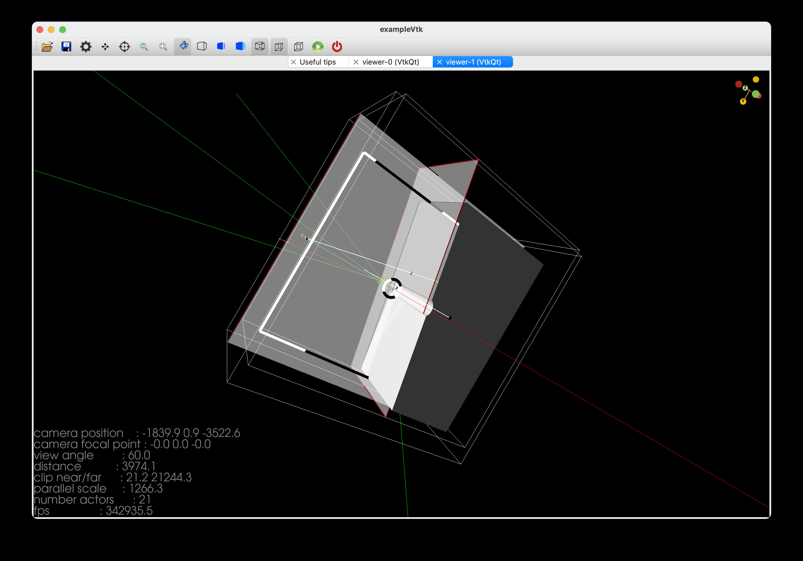

# 062 The Visualization Drivers

As explained in the Introduction to Visualization, Geant4 provides many different choices of visualization systems. Features and notes on each driver are briefly described here along with links to detailed web pages for the various drivers.

Details are given below for:

-   OpenGL

-   Qt

-   Open Inventor

-   Open Inventor Extended Viewer

-   Open Inventor Qt Viewer

-   Qt3D

-   ToolsSG

-   VTK (Visualisation toolkit)

-   HepRepFile

-   DAWN

-   VRML

-   RayTracer

-   gMocren

-   ASCIITree

## Availability of drivers on the supported systems

Table 15 lists required graphics systems and supported platforms for the various visualization drivers. Please refer to the Installation Guide for details of how to build Geant4 with support for these drivers, and Use of Geant4Config.cmake with find_package in CMake for details on how to configure applications to use them.

| **Driver** | **Required Graphics System** | **Platform** |
| --- | --- | --- |
| OpenGL-Xlib | OpenGL | Linux, UNIX, Mac with Xlib |
| OpenGL-Motif | OpenGL | Linux, UNIX, Mac with Motif |
| OpenGL-Win32 | OpenGL | Windows |
| Qt | Qt, OpenGL | Linux, UNIX, Mac, Windows |
| OpenInventor-Qt | Open Inventor (Coin3D), Qt, OpenGL | Linux, UNIX, Mac |
| OpenInventor-X | Open Inventor (Coin3D), OpenGL | Linux, UNIX, Mac with Xlib and Motif |
| OpenInventor-X-Extended | Open Inventor (Coin3D), OpenGL | Linux, UNIX, Mac with Xlib and Motif |
| OpenInventor-Win32 | Open Inventor, OpenGL | Windows |
| Qt3D | Qt | Linux, UNIX, Mac, Windows |
| ToolsSG | OpenGL-ES, Qt or none (off-screen) | Linux, UNIX, Mac, Windows |
| VTK | VTK (vtk.org) | Linux, UNIX, Mac |
| VRML2FILE | Most internet browsers | Linux, UNIX, Mac, Windows |
| HepRepFile | HepRApp or FRED | Linux, UNIX, Mac, Windows |
| DAWNFILE | Fukui Renderer DAWN | Linux, UNIX, Mac, Windows |
| VRML2FILE | any VRML viewer | Linux, UNIX, Mac, Windows |
| RayTracer | any JPEG viewer | Linux, UNIX, Mac, Windows |
| RayTracerX | X11 (also produces a jpeg file) | Linux, UNIX, Mac. |
| ASCIITree | None | Linux, UNIX, Mac, Windows |

: [Table 15 ][Required graphics systems and supported platforms for the various visualization drivers.]

## OpenGL

These drivers have been developed by John Allison and Andrew Walkden (University of Manchester). It is an interface to the de facto standard 3D graphics library, OpenGL. It is well suited for real-time fast visualization and demonstration. Fast visualisation is realized with hardware acceleration, reuse of shapes stored in a display list, etc.

Several versions of the OpenGL drivers are prepared. Versions for Xlib, Motif, Qt and Win32 platforms are available by default. For each version, there are two modes: immediate mode and stored mode. The former has no limitation on data size, and the latter is fast for visualizing large data repetitively, and so is suitable for animation.

Images can be exported using `/vis/ogl/export`.

More information can be found here: How to save a view to an image file

If you want to open a OGL viewer, the generic way is:

```text
/vis/open OGL
```

According to your G4VIS_USE\... variables it will open the correct viewer. By default, it will be open in stored mode. You can specify to open an \"OGLS\" or \"OGLI\" viewer, or even \"OGLSXm\",\"OGLIXm\",\... If you don't have Motif or Qt, all control is done from Geant4 commands:

```text
/vis/open OGLIX
/vis/viewer/set/viewpointThetaPhi 70 20
/vis/viewer/zoom 2
etc.
```

But if you have Motif libraries or Qt install, you can control Geant4 from Motif widgets or mouse with Qt:

```text
/vis/open OGLSQt
```

The OpenGL driver added Smooth shading and Transparency since Geant4 release 8.0.

**Further information (OpenGL and Mesa):**

-   https://www.opengl.org/

-   https://www.mesa3d.org

## Qt

This driver has been developed by Laurent Garnier (IN2P3, LAL Orsay). It is an interface to the powerful application framework, Qt, now free on most platforms. This driver also requires the OpenGL library.

The Qt driver is well suited for real-time fast visualization and demonstration. Fast visualization is realized with hardware acceleration, reuse of shapes stored in a display list, etc. All OpenGL features are implemented in the Qt driver, but one also gets mouse control of rotation/translation/zoom, the ability to save your scene in many formats (both vector and pixel graphics) and an easy interface for making movies.

Two display modes are available: Immediate mode and Stored mode. The former has no limitation on data size, and the latter is fast for visualizing large data repetitively, and so is suitable for animation.

This driver has the feature to open a vis window into the UI window as a new tab. You can have as many tabs you want and mix them from Stored or Immediate mode. To see the visualization window in the UI:

```text
/vis/open OGL  (Generic way. For Stored mode if you have define your G4VIS_USE_QT variable)
or
/vis/open OGLI  (for Immediate mode)
or
/vis/open OGLS  (for Stored mode)
or
/vis/open OGLIQt  (for Immediate mode)
or
/vis/open OGLSQt  (for Stored mode)
```

**Further information (Qt):**

-   Qt

-   \|Geant4\| Visualization Tutorial using the Qt Driver

## Open Inventor

The original drivers were developed by Jeff Kallenbach (FNAL) and Guy Barrand (IN2P3) based on the Hepvis class library originated by Joe Boudreau (Pittsburgh University). The Open Inventor drivers and the Hepvis class library are based on the well-established Open Inventor technology for scientific visualization. They have high extendibility. They support high interactivity, e.g., attribute editing of picked objects. Some Open Inventor viewers support \"stereoscopic\" effects.

It is also possible to save a visualized 3D scene as an OpenInventor-formatted file, and re-visualize the scene afterwards.

Because it is connected directly to the Geant4 kernel, using same language as that kernel (C++), OpenInventor systems can have direct access to Geant4 data (geometry, trajectories, etc.).

Because Open Inventor uses OpenGL for rendering, it supports lighting and transparency.

Open Inventor provides thumbwheel control to rotate and zoom.

Open Inventor supports picking to ask about data. \[Control Clicking\] on a volume turns on rendering of that volume's daughters. \[Shift Clicking\] a daughter turns that rendering off: If modeling opaque solid, effect is like opening a box to look inside.

**Further information (HEPVis and OpenScientist):**

-   Geant4 Inventor Visualization with OpenScientist

-   Overall OpenScientist Home

**Further information (OpenInventor):**

-   Josie Wernecke, \"The Inventor Mentor\", Addison Wesley (ISBN 0-201-62495-8)

-   Josie Wernecke, \"The Inventor Toolmaker\", Addison Wesley (ISBN 0-201-62493-1)

-   \"The Open Inventor C++ Reference Manual\", Addison Wesley (ISBN 0-201-62491-5)

## Open Inventor Extended Viewer

This driver was developed by Rastislav Ondrasek, Pierre-Luc Gagnon and Frederick Jones (TRIUMF). It extends the functionality of the OpenInventor driver, described in the previous section, by adding a number of new features to the viewer.

Although this viewer is still available it has been superseded by the Open Inventor Qt Viewer (see below).

## Open Inventor Qt Viewer

This driver was developed by Frederick Jones (TRIUMF) and is based in part on the Extended Viewer driver. It is supported on Linux/Unix/MacOS platforms and requires Qt5 and Coin3D libraries (Coin and SoQt) to be installed. When resources become available a Windows version of the driver will be pursued.

This is the preferred Open Inventor viewer and will potentially replace the older viewers described above. It incorporates all of their capabilities together with many added functions implemented via menu bar items, viewer buttons, a navigation panel, and keyboard and mouse inputs.

**Reference path navigation**

Most of the added features are concerned with navigation along a \"reference path\" which is a piecewise linear path through the geometry. The reference path can be any particle trajectory, which may be chosen at run time by selecting a trajectory with the mouse. Via Load and Save menu items in the File menu, a reference path can also be read from a file and the current reference path can be written to a file.

Once a reference path is established, the bottom part of the navigation panel is populated with a list of all elements in the geometry, ordered by their \"distance\" along the reference path (based on the perpendicular from the element center to the path).

**Navigation controls**

\[L,R,U,D refer to the arrow keys on the keyboard\]

-   Select an element from the list: navigate along the path to the element's \"location\" (distance along the reference path).

-   Shift-L and Shift-R: navigate to the previous or next element on the path (with wraparound).

-   L and R: rotate 90 degrees around the perpendicular to the reference path

-   U and D: rotate 90 degrees around the reference path

-   Ctrl-L and Ctrl-R: rotate 90 degrees around the horizontal axis

All these keys have a \"repeat\" function for continuous motion.

The rotation keys put the camera in a definite orientation, whereas The Shift-L and Shift-R keys can be used to \"fly\" along the path in whatever camera orientation is in effect. NOTE: if this appears to be \"stuck\", try switching from orthonormal camera to perspective camera (\"cube\" viewer button).

Menu Items:

-   Tools / Go to start of reference path: useful if you get lost

-   Tools / Invert reference path: flips the direction of travel and the distance readout

**Reference path animation**

This is a special mode which flies the camera steadily along the path, without wraparound. The controls are:

-   Tools Menu - Fly along Ref Path: start animation mode

-   Page-Up: increase speed

-   Page-Down: decrease speed

-   U (arrow key): raise camera

-   D (arrow key): lower camera

-   ESC: exit animation mode

For suitable geometries the U and D keys can be used to get \"Star Wars\" style fly-over and fly-under effects.

**Bookmarks**

At any time, the viewpoint and other camera parameters can be saved in a file as a labelled \"bookmark\". The view can then be restored later in the current run or in another run. Bookmarks are displayed in a list in the top part of the navigation panel.

The default name for the bookmark file is \"bookmarkFile\" The first time a viewpoint is saved, this file will be created if it does not already exist. When the viewer is first opened, it will automatically read this file if present and load the viewpoints into the left-hand panel of the viewer's auxiliary window.

Controls:

-   Select bookmark from list: restore this view

-   Right-arrow VIEWER button: go to next bookmark

-   Left-arrow VIEWER button: go to next bookmark

-   \"Floppy Disk\" button: bookmark the current view. The user can type in a label for the bookmark, or use the default label provided.

-   File Menu - Open Bookmark File: loads an existing bookmark file

-   File Menu - New Bookmark File: creates a new bookmark file for saving subsequent views

**Special picking modes**

Controls:

-   \"Arrow +\" VIEWER button: enable brief trajectory picking and mouse-over element readout For trajectories, the list of all trajectory points is replaced by the first and last point only, allowing easier identification of the particle without scrolling back. Passing the mouse over an element will give a readout of the volume name, material, and position on the reference path.

-   \"Crosshair\" VIEWER button: select new reference path The cursor will change to a small cross (+) after which a trajectory can be selected to become the new reference path.

**Convenience feature**

When using the Open Inventor viewer with a terminal-based UI (e.g. tcsh) it is now possible to escape from the viewer without using the mouse.

In addition to the File - Escape menu item, pressing the \"e\" key on the keyboard will exit from the viewer's secondary event loop. The viewer will become inactive and control will return to the Geant4 UI prompt.

## Qt3D

As of writing for Release 11.1, Qt3D is an \"experimental\" driver exploiting a recently announced feature of Qt. Qt3D looks like Qt's attempt to get into visualisation as well as user interface. All the same, Qt programming is tough, so please bear with us. Please try it and give us feedback.

It has been developed so far by John Allison. The advantage, as we see it, is that it programs directly over Qt, which is then free to exploit the local system to its advantage. For example, on MacOS, it will in future (they say) build directly on Metal, making us independent of OpenGL (which Apple are deprecating). It is a way of future-proofing Geant4.

If you build with Qt, this driver will be instantiated automatically.

## ToolsSG

Developed by Guy Barrand, this driver is based on his ToolsSG package distributed with Geant4 (which also supports the Geant4 analysis system). It offers the same features as the OpenGL drivers and comes with options over X11, Windows or Qt (depending on your CMake selections during Geant4 build - see Installation Guide). It has the ability to exploit local graphics systems so that, like Qt3D, it offers future-proofing for Geant4 visualisation.

Since Geant4 11.1, beside the X11, Windows, Qt \"screen\" sub-drivers, there is also the \"offscreen\" sub-driver permitting to produce file output at the png, jpeg, gl2ps formats by using only standalone C++ code based on the standard libraries (no need of extra graphical external packages, all the code comes within g4tools). This sub-driver is built by default and can be operated in a pure batch/offscreen program. In particular it permits to produce pictures at high resolution adequate for outreach.

ToolsSG also supports plotting. If you have registered histograms with the Geant4 analysis manager, they will be available for plotting at end of run. Example B5 illustrates how to do this.

These drivers use the scene graph logic found in the classes under:

```text
source/externals/g4tools/include/tools/sg
```

(sg being for \"scene graph\").

These classes are themselves a subpart of the softinex/inlib and exlib thesaurus of code accumulated for long at Orsay (at LAL before 2020 and now at the IJCLab) to help doing visualization and data analysis for various projects. (The namespaces inlib and exlib had been changed to \"tools\" when importing classes within Geant4 to avoid clashes with apps using both Geant4 and straight softinex). This scene graph way of doing visualization is borrowed from the great OpenInventor developed by Silicon Graphics Incs in the 1980's. The idea is that a data representation is done by creating a scene graph which is a tree of \"nodes\". For example a tree has in general a first tools::sg::ortho (or sg::perspective) camera node specifying a camera projection (position, orientation and depth of view), some sg::matrix node permitting to position an object in a 3D space and then some shape nodes as sg::cube, sg::cylinder or sg::vertices (a node handling a set of points, lines, segments or triangles) used to represent a piece of detector or tracks.

Whence having built a scene graph, the rendering is done, typically after having received some expose event in a drawing area window, by applying a \"render_action\" that traverses the scene graph and asks to the nodes the actions that will be passed to a specific graphics engine. For example a shape node (cube, sphere, polyhedron), when traversed, will give to the render_action the graphics primitives (points, lines, segments, triangles) representing that shape. A camera node will give a projection matrix, a matrix node will give a model matrix. A common graphics engine being GL-ES, we have the tools::sg::GL_action class that does that for GL-ES on macOS, Linux and Windows. We have also various render_action to do offscreen rendering (gl2ps_action using gl2ps and zb_action to render in an in memory z-buffer). In softinex we have also a exlib::wasm::render to render in WebAssembly using WebGL and a exlib::metal::render to render within macOS/Cocoa/Metal, but these are not yet used in Geant4/vis.

In Geant4/vis, the ToolsSG directory contains code to create a viewer within various windowing systems, codes which are declared as \"drivers\" in the vis system. Today there are the TOOLSSG_QT_GLES and TOOLSSG_XT_GLES to create a viewing area ready for GL-ES rendering if using the GUI toolkits Qt or Xt/Motif (activated through the G4UIQt, G4UIXt classes), and TOOLSSG_X11_GLES, TOOLSSG_WINDOWS_GLES to create a GL-ES viewing area straight on X11 or Windows windowing systems.

From a user point of view, typical commands to create a ToolsSG viewer are:

```text
/vis/sceneHandler/create TSG scene-handler-tsg
/vis/viewer/create scene-handler-tsg viewer-tsg 600x600-0+0
```

or with the compound command:

```text
/vis/viewer/open TSG 600x600-0+0
```

Someone can specify straight a TOOLSSG\_\[QT,XT,X11,WINDOWS\]\_GLES name driver, but if specifying \"TSG\", the G4/vis system will pick the \"right one\", according to the kind of GUI or windowing context which is choosen (in general Qt for now).

Obviously, these drivers must have been built when building/installing Geant4. With the G4 cmake system, this is done by specifying the cmake flag:

```text
-DGEANT4_USE_TOOLSSG=XX
```

where XX is one of: OFF, X11, XT, QT or WIN32.

In the case of \"offscreen\", someone has to open with:

```text
/vis/viewer/open TSG_OFFSCREEN 600x600
```

The given size will be the size widthxheight in pixels of the picture in the output file.

When a ToolsSG viewer is created, vis commands triggering the representation of a piece of detector or a track are the same as for other drivers. For example, as can be found in the examples/basic/B1/vis.mac:

```text
# Draw geometry:
/vis/drawVolume
...
# Draw smooth trajectories at end of event:
/vis/scene/add/trajectories smooth
...
```

On a technical point of view, the G4ToolsSceneHandler class is the place where tools::sg nodes are created according each Geant4/vis primitive type (G4Polyhedron, G4Polyline, G4Text, etc\...).

**ToolsSG /vis/tsg specific commands:**

The:

```text
/vis/tsg/export
```

permits to write the content of the current ToolsSG \"screen\" viewer in a file at various formats. Default file is out.eps and default format is gl2ps_eps. Today, available formats are:

```text
gl2ps_eps: gl2ps producing eps
gl2ps_ps:  gl2ps producing ps
gl2ps_pdf: gl2ps producing pdf
gl2ps_svg: gl2ps producing svg
gl2ps_tex: gl2ps producing tex
gl2ps_pgf: gl2ps producing pgf
zb_ps: tools::sg offscreen zbuffer put in a PostScript file.
```

An example of usage is:

```text
/vis/tsg/export gl2ps_pdf out.pdf
```

Another command is:

```text
/vis/tsg/plotter/printParameters
```

It permits to print the available keys used to customize a ToolsSG plotter. This command is more documented in the ToolsSG plotting section.

**ToolsSG /vis/tsg/offscreen specific commands:**

These commands are available when the current viewer is a TSG_OFFSCREEN one. In this case the default file format is zb_png. The picture is produced with:

```text
/vis/viewer/rebuild
```

by using the tools::sg offscreen zbuffer, and is put in a png file with the tools::fpng png file writer.

The default file name is:

```text
g4tsg_offscreen_[format]_[index].[suffix]
```

with:

```text
index: starting at one and incremented at each file production.
format:
  zb_png: tools::sg offscreen zbuffer put in a png file.
  zb_jpeg: tools::sg offscreen zbuffer put in a jpeg file.
  zb_ps: tools::sg offscreen zbuffer put in a PostScript file.
  gl2ps_eps: gl2ps producing eps
  gl2ps_ps:  gl2ps producing ps
  gl2ps_pdf: gl2ps producing pdf
  gl2ps_svg: gl2ps producing svg
  gl2ps_tex: gl2ps producing tex
  gl2ps_pgf: gl2ps producing pgf
suffix: according to the choosen file format: eps, ps, pdf, svg, tex, pgf, png, jpeg.
```

You can change the file name with:

```text
/vis/tsg/offscreen/set/file <file name>
```

You can change the automatic file name construction with:

```text
/vis/tsg/offscreen/set/file auto <prefix> <true|false to reset the index>
```

The default picture size, in pixels, is the one given when doing a:

```text
/vis/open TSG_OFFSCREEN [width]x[height]
```

for example:

```text
/vis/open TSG_OFFSCREEN 1200x1200
```

or by taking the default Geant visualization system viewer size (600x600):

```text
/vis/open TSG_OFFSCREEN
```

But you can change it after an \"open\" with:

```text
/vis/tsg/offscreen/set/size <width> <height>
```

We remember that after having opened a ToolsSG offscreen viewer, you have to do an explicit:

```text
/vis/viewer/rebuild
```

to produce a file.

About the picture size, note that the gl2ps files will grow with the number of primitives (gl2ps does not have a zbuffer logic). The \"zb\" files will not grow with the number of primitives, but with the size of the viewer. It should be preferred for scenes with a lot of objects to render. With zb, to have a better rendering, do not hesitate to have a large viewer size.

About transparency, the zb formats handle it. The gl2ps formats don't, in this case you can use:

```text
/vis/tsg/offscreen/set/transparency false
```

to not draw the transparent objects.

To have a starting point, go in examples/basic/B1 and play with the tsg_offscreen.mac macro file to see how to operate all these.

## VTK (Visualisation toolkit)



Example of VtkQt visualisation driver

Developed by Stewart Boogert (University of Manchester) and Laurie Nevay (CERN), this driver exploits the Visualisation Toolkit VTK (http://vtk.org). Its focus is high performance, pipelined (deferred) and instanced rendering. You need to install the VTK libraries - see Installation Guide. There is a \"native\" driver, but also one which melds with Qt if you also have Qt installed.3 viewers are currently available based on VTK

>
>
| **VTK viewer** | **Description** |
| --- | --- |
| VtkNative | Native viewer (open Cococa, Xwindows, Microsoft windows window |
| VtQt | Integrated with Qt |
| VtkOffscreen | Graphics started but no window open |

>
>

VTK allows for some functionality not common to the other visualisation systems, the available commands are

>
>
| **VTK specific command** | **Description** |
| --- | --- |
| /vis/vtk/add/imageOverlay | Place an 2D image in scene |
| /vis/vtk/add/geometryOverlay | Place an 3D data in scene |
| /vis/vtk/set/clipper | Add interactive clipper |
| /vis/vtk/set/cutter | Add interactive cutter |
| /vis/vtk/set/hud | Set Head up display (0,1) |
| /vis/vtk/set/polyhedronPipeline | Set polyhedron pipeline type (separate, append, bake, tensor) |
| /vis/vtk/set/shadows | Enable/disable shadows |
| /vis/vtk/set/warnings | Enable/disable VTK warnings |
| /vis/vtk/export | Export scene as VTP/VTU/VRML/GLTF/OBJ |
| /vis/vtk/exportCutter | Export cutters VTP/VTU |
| /vis/vtk/printDebug | Print information on pipelines |
| /vis/vtk/startInteraction | Start VtkNative window interaction |

>
>

A pipeline is a sequence of steps which converts a data structure into a set of graphics operations. The current driver implements a handful of pipelines to create a visualisation similar to that produced by OpenGL. Simple pipelines can be added to the VTK driver without understanding the entire visualisation system, for example a `G4Polyhedron` to `vtkActor` is:

```text
polydataPoints   = vtkSmartPointer<vtkPoints>::New();
polydataCells    = vtkSmartPointer<vtkCellArray>::New();
polydata         = vtkSmartPointer<vtkPolyData>::New();

polydata->SetPoints(polydataPoints);
polydata->SetPolys(polydataCells);

// clean input polydata
auto filterClean = vtkSmartPointer<vtkCleanPolyData>::New();
filterClean->PointMergingOn();
filterClean->AddInputData(polydata);
AddFilter(filterClean);

// ensure triangular mesh
auto filterTriangle = vtkSmartPointer<vtkTriangleFilter>::New();
filterTriangle->SetInputConnection(filterClean->GetOutputPort());
AddFilter(filterTriangle);

// calculate normals with a feature angle of 45 degrees
auto filterNormals = vtkSmartPointer<vtkPolyDataNormals>::New();
filterNormals->SetFeatureAngle(45);
filterNormals->SetInputConnection(filterTriangle->GetOutputPort());
AddFilter(filterNormals);

// mapper
mapper = vtkSmartPointer<vtkPolyDataMapper>::New();
mapper->SetInputConnection(GetFinalFilter()->GetOutputPort());
mapper->SetColorModeToDirectScalars();

// add to actor
actor = vtkSmartPointer<vtkActor>::New();
actor->SetMapper(mapper);
actor->SetVisibility(1);
```

Very complex algorithms can be added into a pipeline without a user being an expert in 3D graphics programming. `G4VVtkPipeline` the base class for a pipeline can be chained together so once a visualisation pipeline is written it can be reused quickly. Pipelines can be added and removed on the fly without changing other pipelines so the graphics scene does not need to be rebuilt. The current core pipelines are

>
>
| **Pipeline** | **Description** | **Geant4 primitive** |
| --- | --- | --- |
| `G4VVtkPipeline` | Base class for pipelines |  |
| `G4VtkPolydataPipeline` | Class for 3D mesh data |  |
| `G4VtkPolydataPolylinePipeline` | Class for 3D polyline | `G4Polyline` and `G4Square` |
| `G4VtkPolydataSpherePipeline` | Class for 3D sphere | `G4Circle` |
| `G4VtkPolydataPolyline2DPipeline` | Class for 2D polyline | `G4Polyline` |
| `G4VtkPolydataInstancePipeline` | Class for 3D mesh data with instances | `G4Polyhedron` |
| `G4VtkPolydataInstanceAppendPipeline` | Class for 3D mesh data with instances | `G4Polyhedron` |
| `G4VtkPolydataInstanceBakePipeline` | Class for 3D mesh data with instances | `G4Polyhedron` |
| `G4VtkPolydataInstanceTensorPipeline` | Class for 3D mesh data with instances | `G4Polyhedron` |
| `G4VtkText2DPipeline` | Class for 2D text | `G4Text` |
| `G4VtkTextPipeline` | Class for 3D text | `G4Text` |

>
>

Pipelines which can be chained onto a `G4VVtkPipeline`.

>
>
| **Pipeline** | **Description** |
| --- | --- |
| `G4VtkCutterPipeline` | Cut geometry through plane |
| `G4VtkClipOpenPipeline` | Clip (remove) geometry through plane |
| `G4VtkClipClosedSurfacePipeline` | Clip (remove) geometry through plane |

>
>

These pipelines are constructed in such a way that any pipeline can be cut or clipped.

### VTK window interaction

These are specific to the VTK window and do not change the Geant4 viewing system

>
>
| **Key** | **Action** |
| --- | --- |
| `s` | Surface |
| `w` | Wireframe |
| `3` | Toggle red/blue stereo |
| `q` | Exit interaction (VtkNative only) |

>
>

Note

To interact with the VtkNative viewer with shell UI the command `/vis/vtk/startInteraction` needs to be issued. This will block mouse and keyboard interaction with the G4 UI and input will be passed to Vtk. Once interaction is no longer required hit `q`.

Note

There are compatibility issues with graphics drivers that use different versions of OpenGL, so for the time being (Geant4 11.2), selecting Vtk suppresses the OpenGL drivers and ToolsSG drivers that use GLES.

### VTK Advanced features

VTK allows many possibilities beyond those already implemented in Geant4.

1.  XR (VR/AR) integration

2.  Shadows

3.  Physically based rendering

4.  Camera motion blur

## HepRepFile

The HepRepFile driver creates a HepRep XML file in the HepRep1 format suitable for viewing with the HepRApp HepRep Browser.

The HepRep graphics format is further described at http://www.slac.stanford.edu/\~perl/heprep .

To write just the detector geometry to this file, use the command:

```text
/vis/viewer/flush
```

Or, to also include trajectories and hits (after the appropriate /vis/viewer/add/trajectories or /vis/viewer/add/hits commands), just issue:

```text
/run/beamOn 1
```

HepRepFile will write a file called G4Data0.heprep to the current directory. Each subsequent file will have a file name like G4Data1.heprep, G4Data2.heprep, etc.

View the file using the HepRApp HepRep Browser, available from:

http://www.slac.stanford.edu/\~perl/HepRApp/ .

HepRApp allows you to pick on volumes, trajectories and hits to find out their associated HepRep Attributes, such as volume name, particle ID, momentum, etc. These same attributes can be displayed as labels on the relevant objects, and you can make visibility cuts based on these attributes (\"show me only the photons\", or \"omit any volumes made of iron\").

HepRApp can read heprep files in zipped format as well as unzipped, so you can save space by applying gzip to the heprep file. This will reduce the file to about five percent of its original size.

Several commands are available to override some of HepRepFile's defaults

-   You can specify a different directory for the heprep output files by using the setFileDir command, as in:

    ```text
    /vis/heprep/setFileDir <someOtherDir/someOtherSubDir>
    ```

-   You can specify a different file name (the part before the number) by using the setFileName command, as in:

    ```text
    /vis/heprep/setFileName <my_file_name>
    ```

    which will produce files named \<my_file_name\>0.heprep, \<my_file_name\>1.heprep, etc.

-   You can specify that each file should overwrite the previous file (always rewriting to the same file name) by using the setOverwrite command, as in:

    ```text
    /vis/heprep/setOverwrite true
    ```

    This may be useful in some automated applications where you always want to see the latest output file in the same location.

-   Geant4 visualization supports a concept called \"culling\", by which certain parts of the detector can be made invisible. Since you may want to control visibility from the HepRep browser, turning on visibility of detector parts that had defaulted to be invisible, the HepRepFile driver does not omit these invisible detector parts from the HepRep file. But for very large files, if you know that you will never want to make these parts visible, you can choose to have them left entirely out of the file. Use the /vis/heprep/setCullInvisibles command, as in:

    ```text
    /vis/heprep/setCullInvisibles true
    ```

**Further information:**

-   HepRApp Users Home Page: http://www.slac.stanford.edu/\~perl/HepRApp/

-   HepRep graphics format: http://www.slac.stanford.edu/\~perl/heprep

## DAWN

The DAWN drivers are interfaces to Fukui Renderer DAWN, which has been developed by Satoshi Tanaka, Minato Kawaguti et al (Fukui University). It is a vectorized 3D PostScript processor, and so well suited to prepare technical high quality outputs for presentation and/or documentation. It is also useful for precise debugging of detector geometry. Remote visualization, off-line re-visualization, cut view, and many other useful functions of detector simulation are supported. A DAWN process is automatically invoked as a co-process of Geant4 when visualization is performed, and 3D data are passed with inter-process communication, via a file.

When Geant4 Visualization is performed with the DAWN driver, the visualized view is automatically saved to a file named `g4.eps` in the current directory, which describes a vectorized (Encapsulated) PostScript data of the view.

There are two kinds of DAWN drivers, the DAWNFILE driver and the DAWN-Network driver. The DAWNFILE driver is usually recommended, since it is faster and safer in the sense that it is not affected by network conditions.

The DAWNFILE driver sends 3D data to DAWN via an intermediate file, named `g4.prim` in the current directory. The file `g4.prim` can be re-visualized later without the help of Geant4. This is done by invoking DAWN by hand:

```text
% dawn g4.prim
```

DAWN files can also serve as input to two additional programs:

-   A standalone program, DAWNCUT, can perform a planar cut on a DAWN image. DAWNCUT takes as input a .prim file and some cut parameters. Its output is a new .prim file to which the cut has been applied.

-   Another standalone program, DAVID, can show you any volume overlap errors in your geometry. DAVID takes as input a .prim file and outputs a new .prim file in which overlapping volumes have been highlighted. The use of DAVID is described in section Detecting Overlapping Volumes of this manual.

## VRML

These drivers were developed by Satoshi Tanaka and Yasuhide Sawada (Fukui University). They generate VRML files, which describe 3D scenes to be visualized with a proper VRML viewer, at either a local or a remote host. It realizes virtual-reality visualization with your WWW browser. There are many excellent VRML viewers, which enable one to perform interactive spinning of detectors, walking and/or flying inside detectors or particle showers, interactive investigation of detailed detector geometry etc.

The VRML2FILE driver sends 3D data to your VRML viewer, which is running on the same host machine as Geant4, via an intermediate file named `g4.wrl` created in the current directory. This file can be re-visualization afterwards. In visualization, the name of the VRML viewer should be specified by setting the environment variable `G4VRML_VIEWER` beforehand. For example,

```text
% setenv G4VRML_VIEWER  "netscape"
```

Its default value is `NONE`, which means that no viewer is invoked and only the file `g4.wrl` is generated.

## RayTracer

This driver was developed by Makoto Asai and Minamimoto (Hirosihma Instutute of Technology). It performs ray-tracing visualization using the tracking routines of Geant4. It is, therefore, available for every kinds of shapes/solids which Geant4 can handle. It is also utilized for debugging the user's geometry for the tracking routines of Geant4. It is well suited for photo-realistic high quality output for presentation, and for intuitive debugging of detector geometry. It produces a JPEG file. This driver is by default listed in the available visualization drivers of user's application.

Some pieces of geometries may fail to show up in other visualization drivers (due to algorithms those drivers use to compute visualizable shapes and polygons), but RayTracer can handle any geometry that the Geant4 navigator can handle.

Because RayTracer in essence takes over Geant4's tracking routines for its own use, RayTracer cannot be used to visualize Trajectories or hits.

An X-Window version, called RayTracerX, can be selected by setting `GEANT4_USE_RAYTRACER_X11` (for CMake) at Geant4 library build time and application (user code) build time (assuming you use the standard visualization manager, `G4VisExecutive`, or an equally smart vis manager). RayTracerX builds the same jpeg file as RayTracer, but simultaneously renders to screen so you can watch as rendering grows progressively smoother.

RayTracer has its own built-in commands - `/vis/rayTracer/`\.... Alternatively, you can treat it as a normal vis system and use `/vis/viewer/`\... commands, e.g:

```text
/vis/open RayTracerX
/vis/drawVolume
/vis/viewer/set/viewpointThetaPhi 30 30
/vis/viewer/refresh
```

The view parameters are translated into the necessary RayTracer parameters.

RayTracer is compute intensive. If you are unsure of a good viewing angle or zoom factor, you might be advised to choose them with a faster renderer, such as OpenGL. Then, on opening the RayTracer, it will pick up the current view parameters.:

```text
/vis/open OGL
/vis/drawVolume
/vis/viewer/zoom  # plus any /vis/viewer/commands that get you the view you want.
/vis/open RayTracerX  # or RayTracer
/vis/viewer/refresh
```

## gMocren

The gMocrenFile driver creates a gdd file suitable for viewing with the gMocren volume visualizer. gMocren, a sophisticated tool for rendering volume data, can show volume data such as Geant4 dose distributions overlaid with scoring grids, trajectories and detector geometry. gMocren provides additional advanced functionality such as transfer functions, colormap editing, image rotation, image scaling, and image clipping.

gMocren is further described at http://geant4.kek.jp/gMocren/. At this link you will find the gMocren download, the user manual, a tutorial and some example gdd data files.

Please note that the gMocren file driver is currently considered a Beta release. Users are encouraged to try this driver, and feedback is welcome, but users should be aware that features of this driver may change in upcoming releases.

To send volume data from Geant4 scoring to a gMocren file, the user needs to tell the gMocren driver the name of the specific scoring volume that is to be displayed. For scoring done in C++, this is the name of the sensitive volume. For command-based scoring, this is the name of the scoring mesh.

```text
/vis/gMocren/setVolumeName <volume_name>
```

The following is an example of the minimum command sequence to send command-based scoring data to the a gMocren file:

```text
# an example of a command-based scoring definition
/score/create/boxMesh scoringMesh       # name of the scoring mesh
/score/mesh/boxSize 10. 10. 10. cm      # dimension of the scoring mesh
/score/mesh/nBin 10 10 10               # number of divisions of the scoring mesh
/score/quantity/energyDeposit eDep      # quantity to be scored
/score/close
# configuration of the gMocren-file driver
/vis/scene/create
/vis/open gMocrenFile
/vis/gMocren/setVolumeName scoringMesh
```

To add detector geometry to this file:

```text
/vis/viewer/flush
```

To add trajectories and primitive scorer hits to this file:

```text
/vis/scene/add/trajectories
/vis/scene/add/pshits
/run/beamOn 1
```

gMocrenFile will write a file named G4_00.gd to the current directory. Subsequent draws will create files named g4_01.gdd, g4_02.gdd, etc. An alternate output directory can be specified with an environment variable:

```text
export G4GMocrenFile_DEST_DIR=<someOtherDir/someOtherSubDir/>
```

View the resulting gMocren files with the gMocren viewer, available from: http://geant4.kek.jp/gMocren/.

## Visualization of detector geometry tree

ASCIITREE is a visualization driver that is not actually graphical but that dumps the volume hierarchy as a simple text tree using `/vis/drawTree`.

ASCIITree has command to control its verbosity, `/vis/ASCIITree/verbose`. The verbosity value controls the amount of information available, e.g., physical volume name alone, or also logical volume and solid names. If the volume is \"sensitive\" and/or has a \"readout geometry\", this may also be indicated. Also, the mass of the physical volume tree(s) can be printed (but beware - higher verbosity levels can be computationally intensive).

At verbosity level 4, ASCIITree calculates the mass of the complete geometry tree taking into account daughters up to the depth specified for each physical volume. The calculation involves subtracting the mass of that part of the mother that is occupied by each daughter and then adding the mass of the daughter, and so on down the hierarchy.

```text
/vis/ASCIITree/Verbose 4
/vis/viewer/flush
"HadCalorimeterPhysical":0 / "HadCalorimeterLogical" / "HadCalorimeterBox"(G4Box),
                             1.8 m3 , 11.35 g/cm3
"HadCalColumnPhysical":-1 (10 replicas) / "HadCalColumnLogical" / "HadCalColumnBox"(G4Box),
                                          180000 cm3, 11.35 g/cm3
"HadCalCellPhysical":-1 (2 replicas) / "HadCalCellLogical" / "HadCalCellBox"(G4Box),
                                       90000 cm3, 11.35 g/cm3
"HadCalLayerPhysical":-1 (20 replicas) / "HadCalLayerLogical" / "HadCalLayerBox"(G4Box),
                                         4500 cm3, 11.35 g/cm3
"HadCalScintiPhysical":0 / "HadCalScintiLogical" / "HadCalScintiBox"(G4Box),
                           900 cm3, 1.032 g/cm3

Calculating mass(es)...
Overall volume of "worldPhysical":0, is 2400 m3
Mass of tree to unlimited depth is 22260.5 kg
```

Some more examples of ASCIITree in action:

```text
Idle> /vis/ASCIITree/verbose 1
Idle> /vis/drawTree
#  Set verbosity with "/vis/ASCIITree/verbose "
#    <  10: - does not print daughters of repeated placements, does not repeat replicas.
#    >= 10: prints all physical volumes.
#  The level of detail is given by verbosity%10:
#  for each volume:
#    >=  0: physical volume name.
#    >=  1: logical volume name (and names of sensitive detector and readout geometry, if any).
#    >=  2: solid name and type.
#    >=  3: volume and density.
#    >=  5: daughter-subtracted volume and mass.
#  and in the summary at the end of printing:
#    >=  4: daughter-included mass of top physical volume(s) in scene to depth specified.
.....
"Calorimeter", copy no. 0, belongs to logical volume "Calorimeter"
  "Layer", copy no. -1, belongs to logical volume "Layer" (10 replicas)
    "Absorber", copy no. 0, belongs to logical volume "Absorber"
      "Gap", copy no. 0, belongs to logical volume "Gap"
.....
Idle> /vis/ASCIITree/verbose 15
Idle> /vis/drawTree
....
 "tube_phys":0 / "tube_L" / "tube"(G4Tubs), 395841 cm3, 1.782 mg/cm3,
                           9.6539e-08 mm3, 1.72032e-10 mg
   "divided_tube_phys":0 / "divided_tube_L" / "divided_tube"(G4Tubs), 65973.4 cm3,
                           1.782 mg/cm3, 7587.54 cm3, 13.521 g
     "divided_tube_inset_phys":0 / "divided_tube_inset_L" / "divided_tube_inset"(G4Tubs),
                                   58385.9 cm3, 1.782 mg/cm3, 6.03369e-09 mm3, 1.0752e-11 mg
       "sub_divided_tube_phys":0 / "sub_divided_tube_L" / "sub_divided_tube"(G4Tubs),
                                   14596.5 cm3, 1.782 mg/cm3, 12196.5 cm3, 21.7341 g
.....
Calculating mass(es)...
Overall volume of "expHall_P":0, is 8000 m3  and the daughter-included mass to unlimited depth
                                 is 78414 kg
.....
```

For the complete list of commands and options, see the Control\...UICommands section of this user guide.
