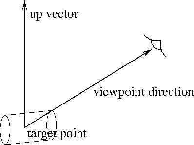
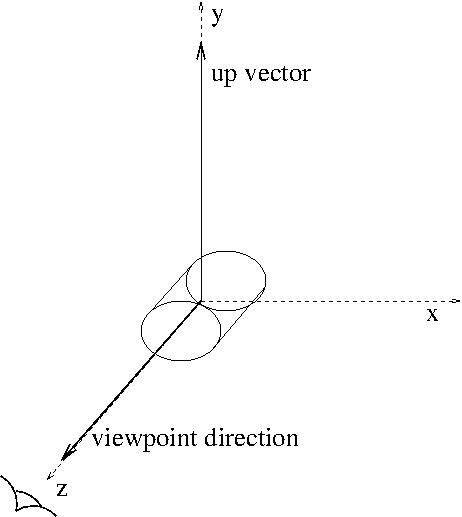

# 063 Controlling Visualization from Commands

This section describes just a few of the more commonly used visualization commands. For the complete list of commands and options, see the Control\...UICommands section of this user guide.

These commands can by typed on the session command line when in Idle state:

```bash
Idle> /vis/drawVolume
```

or specified in a macro file that is executed from the command line:

```bash
Idle> /control/execute vis.mac
```

or from your application, e.g.:

```bash
UImanager->ApplyCommand("/control/execute vis.mac");
```

Most examples have a `vis.mac` file, where you may look for inspiration.

Warning

This section is not a complete description of all visualisation commands; they are too numerous and continually evolving. Please refer to the command guidance, Control\...UICommands or simply type \"ls vis\" or \"help\". Some viewers, notably Qt, offer interactivie guidance under the \"Help\" menu.

## Scene, scene handler, and viewer

In using the visualization commands, it is useful to know the concept of \"scene\", \"scene handler\", and \"viewer\". A \"scene\" is a set of visualizable raw 3D data. A \"scene handler\" is a graphics-data modeler, which processes raw data in a scene for later visualization. And a \"viewer\" generates images based on data processed by a scene handler. Roughly speaking, a set of a scene handler and a viewer corresponds to a visualization driver.

The steps of performing Geant4 visualization are explained below, though some of these steps may be done for you so that in practice you may use as few as just two commands (such as `/vis/open` plus `/vis/drawVolume`). The seven steps of visualization are:

| Step |  | Command | Alternative command |
| --- | --- | --- | --- |
| 1 | Create a scene handler and a viewer | /vis/sceneHandler/create /vis/viewer/create | /vis/open |
| 2 | Create an empty scene | /vis/scene/create | /vis/drawVolume |
| 3 | Add raw 3D data to the created scene | /vis/scene/add/volume |  |
| 4 | Attach the current scene to the current scene handler | /vis/sceneHandler/attach |  |
| 5 | Set camera parameters, drawing style (wireframe/surface), etc | E.g., /vis/viewer/set/viewpoint |  |
| 6 | Make the viewer execute visualization | /vis/viewer/refresh |  |
| 7 | Declare the end of visualization for flushing | /vis/viewer/flush |  |

: [Table 16 ][Seven steps of visualization.]

For details about the commands, see below.

These seven steps can be controlled explicitly to create multiple scenes and multiple viewers, each with its own set of parameters, with easy switching from one scene to another. But for the most common case of just having one scene and one viewer, many steps are handled implicitly for you.

## Choosing a graphics viewer: `/vis/open` command

Command \"`/vis/open`\" creates a scene handler and a viewer, which corresponds to Step 1.

**Command:** `/vis/open [<driver_tag_name>]`

-   **Optional argument \`\`\<driver_tag_name\>\`\`**

    We recommend you omit this and choose your driver at run time. In that case a driver may be chosen:

    -   by argument in G4VisExecutive construction.

    -   by environment variable, G4VIS_DEFAULT_DRIVER.

    -   by information in \~/.g4session.

    -   If you do not use any of the above, a driver will be chosen by mode (batch/interactive) and by your build flags.

    When using environment variable G4VIS_DEFAULT_DRIVER, the format is `<graphics-system> [<window-size-hint>]`, e.g:

    ```bash
    export G4VIS_DEFAULT_DRIVER=OGL
    setenv G4VIS_DEFAULT_DRIVER OI
    export G4VIS_DEFAULT_DRIVER="TSG_OFFSCREEN 1200x1200"
    ```

    then simply execute your application:

    ```bash
    ./<your-application>
    ```

    or, to set the environment temporarily and exclusively for your application:

    ```bash
    G4VIS_DEFAULT_DRIVER=Vtk ./<your-application>
    ```

    Using `~/.g4session` (a file `.g4session` in your home directory), the first line is the default UI session. Subsequent lines have the format:

    ```bash
    <your-app-name> <ui-session> [<vis-driver>] [<window-size-hint]
    ```

    For example:

    ```bash
    Qt  # Default session
    #exampleB1 tcsh
    exampleB1 Qt TSG 1000x1000+0-0
    ```

    For a list of possible drivers see list of registered graphics systems printed at the start of execution

-   **Action**

    Create a visualization driver, i.e. a scene handler and a viewer.

To see a list of driver_tag_names:

```bash
/vis/list
```

(produces a lot of information) or:

```bash
/vis/open xx
```

which produces:

```bash
parameter value (xx) is not listed in the candidate List.
Candidates are: ATree DAWNFILE HepRepFile HepRepXML OGL OGLI OGLIQt OGLS OGLSQt RayTracer VRML1FILE VRML2FILE gMocrenFile
```

For additional options, see the Control\...UICommands section of this user guide.

## Create an empty scene: `/vis/scene/create` command

Command \"`/vis/scene/create`\" creates an empty scene, which corresponds to Step 2.

**Command:** `/vis/scene/create [scene_name]`

-   **Argument**

    A name for this scene. Created for you if you don't specify one.

## Visualization of a physical volume: `/vis/drawVolume` command

`/vis/drawVolume` is a \"compound\" command that creates a new scene (`/vis/scene/create`), adds a volume (`/vis/scene/add/volume`) and attaches it (`/vis/sceneHandler/attach`) to the current viewer (`/control/verbose 2` to see all the invoked commands). It takes care of steps 2, 3, 4 and 6. Command `/vis/viewer/flush` may be required in order to do the final Step 7.

**Commands:**

```bash
/vis/drawVolume [physical-volume-name]
```

-   **Argument**

    If physical-volume-name is \"world\" (the default), the top of the main geometry tree (material world) is added. If \"worlds\", the tops of all worlds - material world and parallel worlds, if any - are added. Otherwise a search of all worlds is made.

    In the last case the names of all volumes in all worlds are matched against physical-volume-name. If this is of the form \"/regexp/\", where regexp is a regular expression (see C++ regex), the match uses the usual rules of regular expression matching. Otherwise an exact match is required.

    For example, \"/Shap/\" matches \"Shape1\" and \"Shape2\".

-   **Action**

    Creates a scene consisting of the given physical volume(s) and asks the current viewer to draw it. The scene becomes current. Command \"`/vis/viewer/flush`\" should follow this command in order to declare end of visualization.

-   **Example: Visualization of the whole world with coordinate axes**

    ```bash
    /vis/drawVolume
    /vis/scene/add/axes 0 0 0 500 mm
    /vis/viewer/flush
    ```

## Visualization of a parameterised volume

The above command `/vis/drawVolume` works fine, but with parameterisation (see Advanced parameterisations for 'nested' parameterised volumes) you can get a very large number of volumes that can overwhelm a graphics system. The commands:

```bash
/vis/viewer/set/specialMeshRendering
```

and, optionally, the following:

```bash
/vis/viewer/set/specialMeshRenderingOption
/vis/viewer/set/specialMeshVolumes
```

can greatly improve performance and visual clarity.

## Visualization of a logical volume: `/vis/drawLogicalVolume` command

`/vis/drawLogicalVolume` is a \"compound\" command that creates a new scene (`/vis/scene/create`), adds a logical volume (`/vis/scene/add/logicalVolume`) and attaches it (`/vis/sceneHandler/attach`) to the current viewer (`/control/verbose 2` to see all the invoked commands). It shows all that can be visualised about a logical volume\-\--Booleans, voxels, readout geometries and overlaps\-\--and adds axes in the local coordinate system. All options are on by default.

This command is synonymous with `/vis/specify`.

**Command:** `vis/drawLogicalVolume <logical-volume-name> [<depth-of-descent>] [<booleans-flag>] [<voxels-flag>] [<readout-flag>] [] [<check-overlap-flag>]`

-   **Argument**

    A logical-volume name.

-   **Action**

    Creates a scene consisting of the given logical volume and asks the current viewer to draw it. The scene becomes current.

-   **Example (visualization of a selected logical volume with coordinate axes)**

    ```bash
    /vis/drawLogicalVolume Absorber
    /vis/scene/add/text 0 0 0 mm 40 -100 -200 LogVol:Absorber
    /vis/viewer/flush
    ```

For more information, use the `help` facility or refer to Control\...UICommands.

## Visualization of trajectories: `/vis/scene/add/trajectories` command

Command \"`/vis/scene/add/trajectories [smooth] [rich]`\" adds trajectories to the current scene. The optional parameters \"smooth\" and/or \"rich\" (you may specify either, neither or both) invoke, if \"smooth\" is specified, the storing and displaying of extra points on curved trajectories and, if \"rich\" is specified, the storing, for possible subsequent selection and display, of additional information, such as volume names, creator process, energy deposited, global time. Be aware, of course, that this imposes computational and memory overheads. Note that this automatically issues the appropriate \"`/tracking/storeTrajectory`\" command so that trajectories are stored (by default they are not). The visualization is performed with the command \"`/run/beamOn`\" unless you have non-default values for `/vis/scene/endOfEventAction` or `/vis/scene/endOfRunAction` (described below).

**Command:** `/vis/scene/add/trajectories [smooth] [rich]`

-   **Action**

    The command adds trajectories to the current scene. Trajectories are drawn at end of event when the scene in which they are added is current.

-   **Example: Visualization of trajectories**

    ```bash
    /vis/scene/add/trajectories
    /run/beamOn 10
    ```

-   **Additional note 1**

    See the section Controlling from Commands for details on how trajectories are color-coded.

-   **Additional note 2**

    Events may be kept and reviewed at end of run with:

    ```bash
    /vis/reviewKeptEvents
    ```

    Keep all events with:

    ```bash
    /vis/scene/endOfEventAction accumulate [maxNumber]
    ```

    (see End of Event Action and End of Run Action: /vis/scene/endOfEventAction and /vis/scene/endOfRunAction commands)

    or keep some chosen subset by some selection in your user code, for example your user event action:

    ```cpp
    if ( some criterion ) {
      G4EventManager::GetEventManager()->KeepTheCurrentEvent();
    }
    ```

    or:

    ```cpp
    if ( some criterion ) {
      UImanager->ApplyCommand("/event/keepCurrentEvent");
    }
    ```

    as described in Listing 88.

    To draw only those events kept as above:

    ```bash
    /vis/drawOnlyToBeKeptEvents
    ```

    To suppress drawing during a run:

    ```bash
    /vis/disable
    /run/beamOn 10000
    ```

    then at end of run:

    ```bash
    /vis/enable
    /vis/reviewKeptEvents
    ```

-   **Additional note 3**

    Visualising events as they are being generated inevitably slows the simulation. Visualisation can be suspended with `/vis/disable` as suggested above. You may also switch off trajectory production with `/tracking/storeTrajectory 0`. When using OpenGL, the following can help:

    ```bash
    /vis/ogl/flushAt
    <[endOfEvent|endOfRun|eachPrimitive|NthPrimitive|NthEvent|never]> <N>
    ```

    By default, this value is set to `/vis/ogl/flushAt NthEvent 100`

For more options, see the Control\...UICommands section of this user guide.

## Visualization of hits: `/vis/scene/add/hits` command

Command \"`/vis/scene/add/hits`\" adds hits to the current scene, assuming that you have a hit class and that the hits have visualization information. The visualization is performed with the command \"`/run/beamOn`\" unless you have non-default values for /vis/scene/endOfEventAction or /vis/scene/endOfRunAction (described above).

## Visualization of fields: `/vis/scene/add/magneticField` command

`/vis/scene/add/magneticField` and `/vis/scene/add/electricField` will draw any fields defined in the scene as an array of arrows whose direction, length and colour are related to the field strength and direction.

Sometimes this can result in a overwhelming number of arrows. To limit the extent of the arrows preface one or more of the above commands with:

```bash
/vis/set/extentForField
```

or:

```bash
/vis/set/volumeForField
```

or equivalent commands in `/vis/touchable/`.

This can be repeated to get the desired effect, e.g.:

```bash
/vis/set/extentForField -20 20 -55 0 0 50 cm
/vis/scene/add/magneticField
/vis/set/volumeForField detector1
/vis/scene/add/magneticField
/vis/set/volumeForField detector2 5
/vis/scene/add/electricField
```

To remove fields from the scene:

```bash
/vis/scene/activateModel Field false
```

Consult the guidance for the `/vis/scene/add/...Field` commands for further hints and suggestions.

## Visualization of Scored Data

Scored data can be visualized using the commands \"`/score/drawProjection`\" and \"`/score/drawColumn`\". For details, see examples/extended/runAndEvent/RE03.

## Additional attributes for Hits

The HepRep file formats, HepRepFile and HepRepXML, understand various additional attributes such that you can view these attributes, label trajectories by these attributes or make visibility cuts based on these attributes. Examples of adding HepRep attributes to hit classes can be found in examples /extended/analysis/A01 and /extended/runAndEvent/RE01.

For example, in example RE01's class RE01CalorimeterHit.cc, available attributes will be:

-   Hit Type

-   Track ID

-   Z Cell ID

-   Phi Cell ID

-   Energy Deposited

-   Energy Deposited by Track

-   Position

-   Logical Volume

You can add additional attributes of your choosing by modifying the relevant part of the hit class (look for the methods GetAttDefs and CreateAttValues).

## Visualization of histograms (plotting)

The G4/vis system is equipped to be able to do plotting, then to have a representation (a plot) of 1D or 2D histograms within a G4/vis viewer. The G4 vis primitive G4Plotter has been introduced to capture which histograms to plot, specify a grid of plots (2x2, 2x3, etc\...), along some style options to customize the representations (for example to change bins color, title or axis label fonts, etc\...). Specifying a grid of plots (or \"regions\") is a common practice in plotting and is a similar concept as the \"zones\" found in the good old CERN/PAW.

The known histograms are the ones managed in G4/analysis and are known in G4Plotter by using their integer id.

This said, each specific vis driver is charged with implementing the representation of a G4Plotter. Today only the ToolsSG drivers come with such representation, but we hope that more vis drivers will come with an implementation in the future.

From the user point of view, commands has been introduced to be able to specify a plot from pure .mac scripting. To start with, the best is to jump in examples/basic/B5 that comes with a commented plotter.mac example. In it you will see how to activate the vis driver (create a \"scene handler\"), create a viewer, create a scene containing a plotter model object (then a G4Plotter), create a grid of plotting \"regions\" (here 2x2 regions) and attach the histograms to each region. When done, each \"run beamOn\" should display at end the content of the histograms.

The skeleton of a plotting script then looks like:

```bash
# viewer:
/vis/sceneHandler/create TSG scene-handler-plotter
/vis/viewer/create scene-handler-plotter viewer-plotter 600x600-0+0
/vis/viewer/set/background 1 1 1
/vis/viewer/zoomTo 1
/vis/viewer/set/viewpointVector 0 0 1
# scene:
/vis/plotter/create plotter-0
/vis/scene/create scene-plotter
/vis/scene/add/plotter plotter-0
/vis/sceneHandler/attach scene-plotter
# create a 2x2 plotter regions:
/vis/plotter/setLayout plotter-0 2 2
# attach histograms to regions (examples/basic/B5 specific):
/vis/plotter/add/h1 0 plotter-0 0
/vis/plotter/add/h1 1 plotter-0 1
/vis/plotter/add/h2 0 plotter-0 2
/vis/plotter/add/h2 1 plotter-0 3
# let's go:
/run/beamOn 100
# the upper will update the plotters at end of run.
```

**Plotting style:**

Being able to customize the representations is an important part of plotting. The concept of named style had been introduced in G4/vis to handle this. A named style is nothing more than a named list of pairs (key,value) which is managed in the G4/vis system.

You can create a named style and set it as \"current style\" with:

```bash
/vis/plotting/style/select <name>
```

You can deposit pairs of key/value in the current style with:

```bash
/vis/plotter/style/add <key> <value>
/vis/plotter/style/add <key> <value>
...
```

A named style can be used on a specific region with:

```bash
/vis/plotter/addRegionStyle <plotter> <region> <style>
```

For example, in B5/plotter.mac:

```bash
/vis/plotter/addRegionStyle plotter-0 0 style-0
```

or on a whole grid of plots with:

```bash
/vis/plotter/addStyle <plotter> <style>
```

Note that someone can add multiple named styles on a plotter or on a region. If so the styles are applied in order with global ones first and then per region ones after.

IMPORTANT: the key/value pairs are specific of a G4Plotter representation implementation. If using the ToolsSG plotting you may have:

```bash
/vis/plotter/style/add bins_style.0.color blue
/vis/plotter/style/add bins_style.0.line_width 3
/vis/plotter/style/add infos_width 0.2
/vis/plotter/style/add infos_style.visible true
/vis/plotter/style/add infos_style.font roboto_bold.ttf
/vis/plotter/style/add infos_style.front_face cw
```

but, a priori, the upper key/value pairs are not expected to be known by another plotter implementation. (But it would be great to be so!).

Other usefull style commands are:

```bash
# to list known named styles.
/vis/plotter/style/list
# to print the list of key/value pairs of a named style:
/vis/plotter/style/print <style>
# to remove a name style from G4/vis:
/vis/plotter/style/remove <style>
```

Note that without passing by a style, a plotting region can be customised directly by using the command:

```bash
/vis/plotter/addRegionParameter <plotter> <region> <key> <value>
```

for example with ToolsSG plotting in B5/plotter.mac:

```bash
/vis/plotter/addRegionParameter plotter-0 0 bins_style.0.color blue
/vis/plotter/addRegionParameter plotter-0 0 bins_style.0.line_width 3
```

As for styles, the key/value pairs are specific of a vis driver plotting implementation. Note that the pairs given with the addRegionParameter on a region are applied after all styles on this region.

**ToolsSG plotting:**

The ToolsSG/G4Plotter representation is done by using the high level tools::sg::plots and tools::sg::plotter nodes (found in externals/g4tools/include/tools/sg). The tools::sg::plotter node uses a lot of nodes as tools::sg::axis, tools::sg::vertices, etc.. to build representations. (tools::sg::plots permits to implement a grid of plots). A tools::sg::node manages \"smart fields\", for example the tools::sg::sf\<float\> (simple float smart field) \"width\" in tools::sg::plotter. (Smart field is a similar concept as the SoField in OpenInventor). It is these fields that are customizable as key/value pairs from styles or region parameters. (A smart field is smart in the sense that if \"touched\", for example by setting a new value, it may induce an automatic update of the node at next rendering traversal of a scene graph).

The list of what is customizable on a tools::sg::plotter, is given with the ToolsSG specific command:

```bash
/vis/tsg/plotter/printParameters
```

For styles, specific to ToolsSG plotting, are the named styles \"default\", \"ROOT_default\", \"hippodraw\" that are \"embedded\" styles (defined as C++ functions in: tools/sg/plotter_some_styles). (These styles are the same than in G4/analysis for batch plotting). In particular the ROOT_default styles permits to mimic the default style plotting found in CERN/ROOT. Then someone can do:

```bash
/vis/plotter/addStyle <plotter> ROOT_default
```

to have the ROOT style for all regions. (Note that ROOT_default needs freetype).

In the second part of B5 plotter.mac, is shown various ways to customize the regions, for example changing the bins color, the axis labels fonts, etc\... This could be done by using default embedded styles, defining styles with commands, or setting up directly parameters of the various parts of a plot by using the dedicated addRegionParameter command.

For texts (title, tick labels, etc\...), the fonts used by default are the Hershey vectorial ones (the ones of the good old CERN/PAW) that do not need an extra package, but you can use some freetype fonts if building with the cmake flag -DGEANT4_USE_FREETYPE=ON. For example the ROOT_default embedded style uses freetype fonts. Two embedded ttf fonts come with the ToolsSG plotting: roboto_bold (some open source kind of the Microsoft arialbd) and lato_regular (close to an helvetica). You can use also your own .ttf files by using the TOOLS_FONT_PATH environment variable to specify the directory where they could be found.

**ToolsSG plotting keys:**

A style or parameter key has the form:

```bash
<direct field> of sg::plotter, as width, height, left_margin, right_margin, etc...
```

or is a field of a sub node representing a component of the scene of the plot, such as \[x,y,z\] axis, infos box, title box, grid, bins, errors, etc\... The key may refer a direct field of the component such as x_axis.title, or the style of a component handled by a tools::sg::style or sg::text_style node. A component key may contain two or three words separated by a dot.

Two words keys are for:

```bash
[x_axis,y_axis,z_axis].<field>
```

For example:

```bash
x_axis.modeling   (string field with value hplot, hippodraw).
x_axis.divisions  (in case of hplot modeling, an int specifiying primary/secondary ticks encoded as in hplot (for exa 510)).
```

or for the style components:

```bash
background_style, title_style, infos_style, title_box_style,
inner_frame_style, grid_style, wall_style
```

For example:

```bash
infos_style.visible
infos_style.font
infos_style.front_face
```

Three words keys are also for the style of the components of the tools::sg::axis as:

```bash
line_style, ticks_style, labels_style, mag_style, title_style
```

for example:

```bash
x_axis.labels_style.color
```

Three words keys are used also to specified style fields of the bins, errors, function, points, legend data representations components. For example, in one sg::plotter, you can specify to plot multiple histograms, ie multiple \"bins\". In this case, you can customize the style of the i-th \"bins\" (i-th histogram) with a key of the form:

```bash
bins_style.<i-th>.<field>
```

for example to change color of the \"front\" histogram:

```bash
bins_style.0.color
```

For the moment, the G4/vis plotting knows only histograms, but the tools::sg::plotter can handle cloud of points, errors, functions, legends, and in some future, a G4 user may have to use the errors_style, func_style, points_style, legend_style in the same way to customize a \"i-th\" cloud of points, a i-th function, a i-th legend, etc\...

We do not give here the full list of available parameters since it may evolve in time. The best is to use the command:

```bash
/vis/tsg/plotter/printParameters
```

that dumps, by querying directly the nodes, the available styles and smart fields for the sg::plotter itself or for one of its component. Moreover it dumps also the type of a field (float, integer, boolean, string, etc\...).

Put all together, the combinatory of available keys is rather rich and permits a strong customization of good parts of a sg::plotter.

## Basic camera workings: `/vis/viewer/` commands

Commands in the command directory \"`/vis/viewer/`\" set camera parameters and drawing style of the current viewer, which corresponds to Step 5. Note that the camera parameters and the drawing style should be set separately for each viewer. They can be initialized to the default values with command \"`/vis/viewer/reset`\". Some visualization systems, such as the VRML and HepRep browsers also allow camera control from the standalone graphics application.

Just a few of the camera commands are described here. For more commands, see the Control\...UICommands section of this user guide.

The view is defined by a target point (initially at the centre of the extent of all objects in the scene), an up-vector and a viewpoint direction - see Fig. 23. By default, the up-Vector is parallel to the y-axis and the viewpoint direction is parallel to the z-axis, so the the view shows the x-axis to the right and the y-axis upwards - a projection on to the canonical x-y plane - see Fig. 24 figure.

The target point can be changed with a `/vis/viewer/set` command or with the `/vis/viewer/pan` commands. The up-vector and the viewpoint direction can also be changed with `/vis/viewer/set` commands. Care must be taken to avoid having the two vectors parallel, for in that case the view is undefined.

The commands:

```bash
/vis/viewer/centreOn <volume-name> [<copy-number>]
/vis/viewer/centreAndZoomInOn <volume-name> [<copy-number>]
```

also change the target point.

[]

[Fig. 23 ][Up-vector and viewpoint direction]

[]

[Fig. 24 ][The default view]

**Command:** `/vis/viewer/set/viewpointThetaPhi [theta] [phi] [deg|rad]`

-   **Arguments**

    Arguments \"theta\" and \"phi\" are polar and azimuthal camera angles, respectively. The default unit is \"degree\".

-   **Action**

    Set a view point in direction of (theta, phi).

-   **Example: Set the viewpoint in direction of (70 deg, 20 deg)** /

    ```bash
    /vis/viewer/set/viewpointThetaPhi 70 20
    ```

-   **Additional notes**

    Camera parameters should be set for each viewer. They are initialized with command \"`/vis/viewer/reset`\". Alternatively, they can be copied from another viewer with the command \"`/vis/viewer/copyViewFrom viewer-0`\", for example.

**Command:** `/vis/viewer/zoom [scale_factor]`

-   **Argument**

    The scale factor. The command multiplies magnification of the view by this factor.

-   **Action**

    Zoom up/down of view.

-   **Example: Zoom up by factor 1.5**

    ```bash
    /vis/viewer/zoom 1.5
    ```

-   **Additional notes**

    A similar pair of commands, scale and scaleTo allow non-uniform scaling (i.e., zoom differently along different axes). For details of this and lots of other commands, see the Control\...UICommands section of this user guide.

    Some viewers have limits to how large the zoom factor can be. This problem can be circumnavigated to some degree by using `zoom` and `scale` together. If

    ```bash
    /vis/viewer/zoomTo 1e10
    ```

    does not work, please try

    ```bash
    /vis/viewer/scaleTo 1e5 1e5 1e5
    /vis/viewer/zoomTo 1e5
    ```

    Of course, with such high zoom factors, you might want to know whither you are zooming. Use `/vis/viewer/set/targetPoint` or `/vis/viewer/centreOn` or `/vis/viewer/centreAndZoomInOn`.

    Camera parameters should be set for each viewer. They are initialized with command \"`/vis/viewer/reset`\". Alternatively, they can be copied from another viewer with the command \"`/vis/viewer/copyViewFrom viewer-0`\", for example.

**Command:** `/vis/viewer/set/style [style_name]`

-   **Arguments**

    Candidate values of the argument are \"wireframe\" and \"surface\". (\"w\" and \"s\" also work.)

-   **Action**

    Set a drawing style to wireframe or surface.

-   **Example: Set the drawing style to \"surface\"**

    ```bash
    /vis/viewer/set/style surface
    ```

-   **Additional notes**

    The style of some geometry components may have been forced one way or the other through calls in compiled code. The set/style command will NOT override such force styles.

    Drawing style should be set for each viewer. The drawing style is initialized with command \"`/vis/viewer/reset`\". Alternatively, it can be copied from another viewer with the command \"`/vis/viewer/set/all viewer-0`\", for example.

## Declare the end of visualization for flushing: `/vis/viewer/flush` command

**Command:** `/vis/viewer/flush`

-   **Action**

    Declare the end of visualization for flushing.

-   **Additional notes**

    Command \"`/vis/viewer/flush`\" should follow \"`/vis/drawVolume`\", \"`/vis/specify`\", etc in order to complete visualization. It corresponds to Step 7.

    The flush is done automatically after every /run/beamOn command unless you have non-default values for /vis/scene/endOfEventAction or /vis/scene/endOfRunAction (described above).

## End of Event Action and End of Run Action: `/vis/scene/endOfEventAction` and `/vis/scene/endOfRunAction` commands

By default, a separate picture is created for each event. You can change this behaviour to accumulate multiple events, or even multiple runs, in a single picture.

**Command:** `/vis/scene/endOfEventAction [refresh|accumulate]`

-   **Action**

    Control how often the picture should be cleared. `refresh` means each event will be written to a new picture. `accumulate` means events will be accumulated into a single picture. Picture will be flushed at end of run, unless you have also set `/vis/scene/endOfRunAction accumulate`

-   **Additional note**

    You may instead choose to use update commands from your BeginOfRunAction or EndOfEventAction, as in early examples, but now the vis manager is able to do most of what most users require through the above commands.

**Command:** `/vis/scene/endOfRunAction [refresh|accumulate]`

-   **Action**

    Control how often the picture should be cleared. `refresh` means each run will be written to a new picture. `accumulate` means runs will be accumulated into a single picture. To start a new picture, you must explicitly issue `/vis/viewer/refresh`, `/vis/viewer/update` or `/vis/viewer/flush`

## HepRep Attributes for Trajectories

The HepRep file formats, HepRepFile and HepRepXML, attach various attributes to trajectories such that you can view these attributes, label trajectories by these attributes or make visibility cuts based on these attributes. If you use the default Geant4 trajectory class from /tracking/src/G4Trajectory.cc (this is what you get with the plain `/vis/scene/add/trajectories` command), available attributes will be:

-   Track ID

-   Parent ID

-   Particle Name

-   Charge

-   PDG Encoding

-   Momentum 3-Vector

-   Momentum magnitude

-   Number of points

Using `/vis/scene/add/trajectories rich` will get you additional attributes. You may also add additional attributes of your choosing by modifying the relevant part of G4Trajectory (look for the methods GetAttDefs and CreateAttValues). If you are using your own trajectory class, you may want to consider copying these methods from G4Trajectory.

## How to save a view.

```bash
/vis/viewer/save
```

This will save to a file that can be read in again with

```bash
/control/execute
```

If you save several views you may \"fly through\" them with

```bash
/vis/viewer/interpolate
```

See Making a Movie.

(Use the Geant4 \"help\" command to see details.)

## How to save a view to an image file

Most of the visualization drivers offer ways to save visualized views to PostScript (PS) or Encapsulated PostScript (EPS). Some, in addition, offer Portable Document Format (PDF). OpenGL offers a big range of formats - see below.

-   **DAWNFILE**

    The DAWNFILE driver, which co-works with Fukui Renderer DAWN, generates \"vectorized\" PostScript data with \"analytical hidden-line/surface removal\", and so it is well suited for technical high-quality outputs for presentation, documentation, and debugging geometry. In the default setting of the DAWNFILE drivers, EPS files named \"`g4_00.eps, g4_01.eps, g4_02.eps`,\...\" are automatically generated in the current directory each time when visualization is performed, and then a PostScript viewer \"`gv`\"is automatically invoked to visualize the generated EPS files.

    For large data sets, it may take time to generate the vectorized PostScript data. In such a case, visualize the 3D scene with a faster visualization driver beforehand for previewing, and then use the DAWNFILE drivers. For example, the following visualizes the whole detector with the OpenGL-Xlib driver (immediate mode) first, and then with the DAWNFILE driver to generate an EPS file `g4_XX.eps` to save the visualized view:

    ```bash
    # Invoke the OpenGL visualization driver in its immediate mode
    /vis/open OGLIX

    # Camera setting
    /vis/viewer/set/viewpointThetaPhi 20 20

    # Camera setting
    /vis/drawVolume
    /vis/viewer/flush

    # Invoke the DAWNFILE visualization driver
    /vis/open DAWNFILE

    # Camera setting
    /vis/viewer/set/viewpointThetaPhi 20 20

    # Camera setting
    /vis/drawVolume
    /vis/viewer/flush
    ```

    This is a good example to show that the visualization drivers are complementary to each other.

-   **OpenInventor**

    In the OpenInventor drivers, you can simply click the \"Print\" button on their GUI to generate a PostScript file as a hard copy of a visualized view.

-   **OpenGL**

    The OpenGL drivers can also generate image files, either from a pull-down menu (Motif and Qt drivers) or with `/vis/ogl/export`. Available formats are: eps ps pdf svg bmp cur dds icns ico jp2 jpeg jpg pbm pgm png ppm tif tiff wbmp webp xbm xpm. The default is pdf. It can generate either vector or bitmap PostScript data with `/vis/ogl/set/printMode` (\"vectored\" or \"pixmap\"). You can change the filename by `/vis/ogl/set/printFilename` And the print size by `/vis/ogl/set/printSize` In generating vectorized PostScript data, hidden-surface removal is performed based on the painter's algorithm after dividing facets of shapes into small sub-triangles.

    The `/vis/ogl/set/printSize` command can be used to print EPS files even larger than the current screen resolution. This can allow creation of very large images, suitable for creation of posters, etc. The only size limitation is the graphics card's viewport dimension: GL_MAX_VIEWPORT_DIMS

    ```bash
    # Invoke the OpenGL visualization driver in its stored mode
    /vis/open OGLSX

    # Camera setting
    /vis/viewer/set/viewpointThetaPhi 20 20

    # Camera setting
    /vis/drawVolume
    /vis/viewer/flush

    # set print mode to vectored
    #/vis/ogl/set/printMode vectored

    # set print size larger than screen
    /vis/ogl/set/printSize 2000 2000

    # print
    /vis/ogl/export
    ```

-   **HepRep**

    The HepRApp HepRep Browser such as FRED can generate a wide variety of bitmap and vector output formats including PostScript and PDF.

## Culling

\"Culling\" means to skip visualizing parts of a 3D scene. Culling is useful for avoiding complexity of visualized views, keeping transparent features of the 3D scene, and for quick visualization.

Geant4 Visualization supports the following 3 kinds of culling:

-   Culling of invisible physical volumes

-   Culling of low density physical volumes.

-   Culling of covered physical volumes by others

In order that one or all types of the above culling are on, i.e., activated, the global culling flag should also be on.

Table 17 summarizes the default culling policies.

| **Culling Type** | **Default Value** |
| --- | --- |
| global | ON |
| invisible | ON |
| low density | OFF |
| covered daughter | OFF |

: [Table 17 ][The default culling policies.]

The default threshold density of the low-density culling is 0.01 g/cm^3^.

The default culling policies can be modified with the following visualization commands. (Below the argument `flag` takes a value of `true` or `false`.)

```bash
# global
/vis/viewer/set/culling  global  flag

# invisible
/vis/viewer/set/culling  invisible  flag

# low density
#   "value" is a proper value of a threshold density
#   "unit" is either g/cm3, mg/cm3 or kg/m3
/vis/viewer/set/culling  density  flag  value  unit

# covered daughter
/vis/viewer/set/culling  coveredDaughters  flag     density
```

The HepRepFile graphic system will, by default, include culled objects in the file so that they can still be made visible later from controls in the HepRep browser. If this behavior would cause files to be too large, you can instead choose to have culled objects be omitted from the HepRep file. See details in the HepRepFile Driver section of this user guide.

## Cut view

**Sectioning**

\"Sectioning\" means to make a thin slice of a 3D scene around a given plane. At present, this function is supported by the OpenGL drivers. The sectioning is realized by setting a sectioning plane before performing visualization. The sectioning plane can be set by the command,

```bash
/vis/viewer/set/sectionPlane on x y z units nx ny nz
```

where the vector (x,y,z) defines a point on the sectioning plane, and the vector (nx,ny,nz) defines the normal vector of the sectioning plane. For example, the following sets a sectioning plane to a yz plane at x = 2 cm:

```bash
/vis/viewer/set/sectionPlane  on  2.0  0.0  0.0  cm  1.0  0.0  0.0
```

**Cutting away**

\"Cutting away\" means to removing a half space from a 3D scene. It is available for all drivers. (The OpenGL driver has its own implementation that uses OpenGL cut planes. DAWNFILE has a special way - see below. Other drivers use a \"generic\" algorithm based on Boolean subtractions and/or intersections.)

-   Add up to three cutaway planes:

    ```bash
    /vis/viewer/addCutawayPlane 0 0 0 m 1 0 0
    /vis/viewer/addCutawayPlane 0 0 0 m 0 1 0
    ...
    ```

    and, for more that one plane, you can change the mode to

    -   \"add\" or, equivalently, \"union\" (default) or

    -   \"multiply\" or, equivalently, \"intersection\":

        ```bash
        /vis/viewer/set/cutawayMode multiply
        ```

    To de-activate:

    ```bash
    /vis/viewer/clearCutawayPlanes
    ```

-   Cutting is supported by the DAWNFILE driver \"off-line\". Do the following:

    -   Perform visualization with the DAWNFILE driver to generate a file `g4.prim`, describing the whole 3D scene.

    -   Make the application \"DAWNCUT\" read the generated file to make a view of cutting away.

## Multithreading commands

Visualising events inevitably slows things down. With multithreading this effect is all the greater. See Visualization of trajectories: /vis/scene/add/trajectories command, Additional Note 3, for some advice. If you wish to continue visualising, multithreading mode offers the following fine tuning.

Since Geant4 version 10.2, in multithreading mode, events generated by worker threads are put in a queue and extracted by a special visualisation thread. If the queue gets full, workers are suspended until the visualisation thread catches up. To mitigate or avoid this try using

```bash
/vis/multithreading/maxEventQueueSize <N>
/vis/multithreading/actionOnEventQueueFull <wait|discard>
```

(See command guidance for details.)
