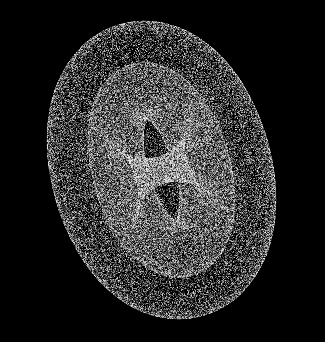

# 064 Controlling Visualization from Compiled Code

While a Geant4 simulation is running, visualization can be performed without user intervention. This is accomplished by calling methods of the Visualization Manager from methods of the user action classes (`G4UserRunAction` and `G4UserEventAction`, for example). In this section methods of the class `G4VVisManager`, which is part of the `graphics_reps` category, are described and examples of their use are given.

## G4VVisManager

The Visualization Manager is implemented by classes `G4VisManager` and `G4VisExecutive`. See Adding Visualization to Your Executable. In order that your Geant4 be compilable either with or without the visualization category, you should not use these classes directly in your C++ source code, other than in the `main()` function. Instead, you should use their abstract base class `G4VVisManager`, defined in the `intercoms` category.

The pointer to the concrete instance of the real Visualization Manager can be obtained as follows:

```cpp
//----- Getting a pointer to the concrete Visualization Manager instance
G4VVisManager* pVVisManager = G4VVisManager::GetConcreteInstance();
```

The method `G4VVisManager::GetConcreteInstance()` returns `NULL` if Geant4 is not ready for visualization. Thus your C++ source code should be protected as follows:

```cpp
//----- How to protect your C++ source codes in visualization
if (pVVisManager) {
    ....
    pVVisManager ->Draw (...);
    ....
}
```

Note: It pays to encapsulate your `Draw` messages in Visualization User Actions. The vis manager then has control over the drawing and may call your action as required, for example, to refresh the screen or write to file.

## Visualization of detector components

If you have already constructed detector components with logical volumes to which visualization attributes are properly assigned, you are almost ready for visualizing detector components. The usual and *recommended* way is to use UI commands - see Controlling Visualization from Commands.

Most examples have a file `vis.mac` that is executed by default in interactive mode.

However, if you really wish to program visualisation we recommended simply using the `ApplyCommand()` method as below:

```cpp
//----- C++ source code: How to visualize detector components (2)
//                       ... using visualization commands in source codes

G4VVisManager* pVVisManager = G4VVisManager::GetConcreteInstance() ;

if(pVVisManager)
{
    ... (camera setting etc) ...
    G4UImanager::GetUIpointer()->ApplyCommand("/vis/drawVolume");
    G4UImanager::GetUIpointer()->ApplyCommand("/vis/viewer/flush");
}

//-----  end of C++ source code
```

For the adventurous user, the vis manager offers methods such as:

```cpp
virtual void Draw (const G4VPhysicalVolume&, const G4VisAttributes&,
  const G4Transform3D& objectTransformation = G4Transform3D()) = 0;

virtual void DrawGeometry
(G4VPhysicalVolume*, const G4Transform3D& t = G4Transform3D());
// Draws a geometry tree starting at the specified physical volume.
```

## Visualization of trajectories

Again, we *recommend* using commands - see `/vis/modeling` and `vis/filtering`.

But you may specialise by writing C++ code, for example in `void G4Trajectory::DrawTrajectory()` defined in the tracking category. The vis manager offers a good collection of `Draw` methods. For example:

```cpp
//----- A drawing method of G4Polyline
virtual void G4VVisManager::Draw (const G4Polyline&, ...) ;
```

Your `DrawTrajectory` will then be used by the vis manager when you add trajectories to the scene - see Visualization of trajectories: /vis/scene/add/trajectories command.

Alternatively, you may pick up trajectories from a `G4TrajectoryContainer` at end of event and invoke your DrawTrajectory:

```cpp
void ExN03EventAction::EndOfEventAction(const G4Event* evt)
{
  .....
  // extract the trajectories and draw them
  if (G4VVisManager::GetConcreteInstance())
    {
     G4TrajectoryContainer* trajectoryContainer = evt->GetTrajectoryContainer();
     G4int n_trajectories = 0;
     if (trajectoryContainer) n_trajectories = trajectoryContainer->entries();

     for (G4int i=0; i < n_trajectories; i++)
        { G4Trajectory* trj=(G4Trajectory*)((*(evt->GetTrajectoryContainer()))[i]);
          if (drawFlag == "all") trj->DrawTrajectory(50);
          else if ((drawFlag == "charged")&&(trj->GetCharge() != 0.))
                                  trj->DrawTrajectory(50);
          else if ((drawFlag == "neutral")&&(trj->GetCharge() == 0.))
                                  trj->DrawTrajectory(50);
        }
  }
}
```

## Enhanced trajectory drawing

It is possible to use the enhanced trajectory drawing functionality in compiled code as well as from commands. Multiple trajectory models can be instantiated, configured and registered with G4VisManager. For details, see the section on Controlling from Compiled Code.

## HepRep Attributes for Trajectories

The HepRep file format, HepRepFile, attaches various attributes to trajectories such that you can view these attributes, label trajectories by these attributes or make visibility cuts based on these attributes. If you use the default Geant4 trajectory class, from /tracking/src/G4Trajectory.cc (which is what you get with `/vis/scene/add/trajectories`) the available attributes will be:

-   Track ID

-   Parent ID

-   Particle Name

-   Charge

-   PDG Encoding

-   Momentum 3-Vector

-   Momentum magnitude

-   Number of points

A more extensive list of attributes is available with `G4RichTrajectory` (`/vis/scene/add/trajectories rich`).

You can add additional attributes of your choosing by modifying the relevant part of G4\[Rich\]Trajectory (look for the methods GetAttDefs and CreateAttValues). If you are using your own trajectory class, you may want to consider copying these methods from G4Trajectory.

## Visualization of hits

There is no default code for drawing hits. You have to write a `Draw()` method in your hit class. Similarly `DrawAllHits()` in your hits collection class. You can use drawing methods of class `G4VVisManager`:

```cpp
virtual void G4VVisManager::Draw (const G4Circle&, ...);
virtual void G4VVisManager::Draw (const G4Square&, ...);
virtual void G4VVisManager::Draw (const G4VPhysicalVolume&, ...);
...
```

For example, class *MyTrackerHits* inheriting `G4VHit`:

```cpp
//----- An example of giving concrete implementation of
//       G4VHit::Draw(), using  class MyTrackerHit : public G4VHit {...}
//
void MyTrackerHit::Draw()
{
   G4VVisManager* pVVisManager = G4VVisManager::GetConcreteInstance();
   if(pVVisManager)
   {
     // define a circle in a 3D space
     G4Circle circle(pos);
     circle.SetScreenSize(0.3);
     circle.SetFillStyle(G4Circle::filled);

     // make the circle red
     G4Colour colour(1.,0.,0.);
     G4VisAttributes attribs(colour);
     circle.SetVisAttributes(attribs);

     // make a 3D data for visualization
     pVVisManager->Draw(circle);
   }
 }
```

Your `DrawAllHits()` method could be:

```cpp
//----- An example of giving concrete implementation of
//       G4VHitsCollection::Draw(),
//       using  class MyTrackerHit : public G4VHitsCollection{...}
//
void MyTrackerHitsCollection::DrawAllHits()
{
  G4int n_hit = theCollection.entries();
  for(G4int i=0;i < n_hit;i++)
  {
    theCollection[i].Draw();
  }
}
```

The *recommended* way to invoke these functions is to add hits to the scene:

```cpp
/vis/scene/add/hits
```

In this case the vis manager will invoke them as required.

Alternatively, as with trajectories, you may, if you wish, draw from your `EndOfEventAction`:

```cpp
void MyEventAction::EndOfEventAction()
{
  const G4Event* evt = fpEventManager->GetConstCurrentEvent();

  G4SDManager * SDman = G4SDManager::GetSDMpointer();
  G4String colNam;
  G4int trackerCollID = SDman->GetCollectionID(colNam="TrackerCollection");
  G4int calorimeterCollID = SDman->GetCollectionID(colNam="CalCollection");

  G4TrajectoryContainer * trajectoryContainer = evt->GetTrajectoryContainer();
  G4int n_trajectories = 0;
  if(trajectoryContainer)
  { n_trajectories = trajectoryContainer->entries(); }

  G4HCofThisEvent * HCE = evt->GetHCofThisEvent();
  G4int n_hitCollection = 0;
  if(HCE)
  { n_hitCollection = HCE->GetCapacity(); }

  G4VVisManager* pVVisManager = G4VVisManager::GetConcreteInstance();

  if(pVVisManager) {

    // Declare begininng of visualization
    G4UImanager::GetUIpointer()->ApplyCommand("/vis/scene/notifyHandlers");

    // Draw trajectories
    for(G4int i=0; i < n_trajectories; i++) {
        (*(evt->GetTrajectoryContainer()))[i]->DrawTrajectory();
    }

    // Construct 3D data for hits
    MyTrackerHitsCollection* THC
      = (MyTrackerHitsCollection*)(HCE->GetHC(trackerCollID));
    if(THC) THC->DrawAllHits();
    MyCalorimeterHitsCollection* CHC
      = (MyCalorimeterHitsCollection*)(HCE->GetHC(calorimeterCollID));
    if(CHC) CHC->DrawAllHits();

    // Declare end of visualization
    G4UImanager::GetUIpointer()->ApplyCommand("/vis/viewer/update");
  }
}
```

You can re-visualize a physical volume, where a hit is detected, with a highlight color, in addition to the whole set of detector components. It is done by calling `G4VVisManager::Draw(const G4VPhysicalVolume&, ...)`:

```cpp
//----- An example of visualizing hits with a physical volume
void MyCalorimeterHit::Draw()
{
  G4VVisManager* pVVisManager = G4VVisManager::GetConcreteInstance();
  if(pVVisManager)
  {
    G4Transform3D trans(rot,pos);
    G4VisAttributes attribs;
    G4LogicalVolume* logVol = pPhys->GetLogicalVolume();
    const G4VisAttributes* pVA = logVol->GetVisAttributes();
    if(pVA) attribs = *pVA;
    G4Colour colour(1.,0.,0.);
    attribs.SetColour(colour);
    attribs.SetForceSolid(true);

    //----- Re-visualization of a selected physical volume with red color
    pVVisManager->Draw(*pPhys,attribs,trans);
  }
}
```

## HepRep Attributes for Hits

The HepRep file format, HepRepFile, attaches various attributes to hits such that you can view these attributes, label trajectories by these attributes or make visibility cuts based on these attributes. Examples of adding HepRep attributes to hit classes can be found in examples /extended/analysis/A01 and /extended/runAndEvent/RE01.

For example, in example RE01's class RE01CalorimeterHit.cc, available attributes will be:

-   Hit Type

-   Track ID

-   Z Cell ID

-   Phi Cell ID

-   Energy Deposited

-   Energy Deposited by Track

-   Position

-   Logical Volume

You can add additional attributes of your choosing by modifying the relevant part of the hit class (look for the methods GetAttDefs and CreateAttValues).

## Visualization of text

In Geant4 Visualization, a text, i.e., a character string, is described by class `G4Text` inheriting `G4VMarker` as well as `G4Square` and `G4Circle`. Therefore, the way to visualize text is the same as for hits. The corresponding drawing method of `G4VVisManager` is:

```cpp
//----- Drawing methods of G4Text
virtual void G4VVisManager::Draw (const G4Text&, ...);
```

The real implementation of this method is described in class `G4VisManager`.

## Visualization of polylines and tracking steps

We remind the reader that the vis manager provides a generous selection of UI commands to draw and filter trajectories and thus to see the tracking steps - see Visualization of trajectories: /vis/scene/add/trajectories command.

Alternatively, if you wish, you may code your own functions. Polylines, i.e., sets of successive line segments, are described by class `G4Polyline`. For `G4Polyline`, the following drawing method of class `G4VVisManager` is prepared:

```cpp
//----- A drawing method of G4Polyline
 virtual void G4VVisManager::Draw (const G4Polyline&, ...) ;
```

The real implementation of this method is described in class `G4VisManager`.

Using this method, C++ source codes to visualize `G4Polyline` are described as follows:

```cpp
//----- How to visualize a polyline
 G4VVisManager* pVVisManager = G4VVisManager::GetConcreteInstance();

 if (pVVisManager) {
     G4Polyline polyline ;

     ..... (C++ source codes to set vertex positions, color, etc)

     pVVisManager -> Draw(polyline);
 }
```

Tracking steps are able to be visualized based on the above visualization of `G4Polyline`. You can visualize tracking steps at each step automatically by writing a proper implementation of class *MySteppingAction* inheriting `G4UserSteppingAction`, and also with the help of the Run Manager.

First, you must implement a method, `MySteppingAction::UserSteppingAction()`. A typical implementation of this method is as follows:

```cpp
//-----  An example of visualizing tracking steps
void MySteppingAction::UserSteppingAction()
{
    G4VVisManager* pVVisManager = G4VVisManager::GetConcreteInstance();

    if (pVVisManager) {
      //----- Get the Stepping Manager
      const G4SteppingManager* pSM = GetSteppingManager();

      //----- Define a line segment
      G4Polyline polyline;
      G4double charge = pSM->GetTrack()->GetDefinition()->GetPDGCharge();
      G4Colour colour;
      if      (charge < 0.) colour = G4Colour(1., 0., 0.);
      else if (charge < 0.) colour = G4Colour(0., 0., 1.);
      else                  colour = G4Colour(0., 1., 0.);
      G4VisAttributes attribs(colour);
      polyline.SetVisAttributes(attribs);
      polyline.push_back(pSM->GetStep()->GetPreStepPoint()->GetPosition());
      polyline.push_back(pSM->GetStep()->GetPostStepPoint()->GetPosition());

      //----- Call a drawing method for G4Polyline
      pVVisManager -> Draw(polyline);
    }
}
```

As well as tracking steps, you can visualize any kind 3D object made of line segments, using class `G4Polyline` and its drawing method, defined in class `G4VVisManager`. See, for example, the implementation of the `/vis/scene/add/axes` command.

## Visualization User Actions

You can implement the `Draw` method of `G4VUserVisAction`, e.g., the class definition could be:

```cpp
class MyVisAction: public G4VUserVisAction {
  void Draw();
};
```

and the implementation:

```cpp
void MyVisAction::Draw() {
  G4VVisManager* pVisManager = G4VVisManager::GetConcreteInstance();
  if (pVisManager) {

    // Simple box...
    pVisManager->Draw(G4Box("box",2*m,2*m,2*m),
                      G4VisAttributes(G4Colour(1,1,0)));

    // Etc...
  }
}
```

If efficiency is an issue, create the objects in the constructor, delete them in the destructor and draw them in your `Draw` method.

Anyway, an instance of your class needs to be registered with the vis manager, e.g.:

```cpp
 ...
G4VisManager* visManager = new G4VisExecutive;
visManager->RegisterRunDurationUserVisAction
  ("My drawings",
   new MyVisAction,
   G4VisExtent(-10*m,10*m,-10*m,10*m,-10*m,10*m));  // This 3rd argument is optional.
visManager->Initialize ();
 ...
```

Any number of actions may be registered either as \"run duration\" (i.e., permanent, or at least as permanent as detector geometry) or \"end of event\" or \"end of run\" through the methods `RegisterRunDurationUserVisAction`, `RegisterEndOfEventUserVisAction` or `RegisterEndOfRunUserVisAction`. The vis manager will invoke your `Draw` method as appropriate to give your drawing a sort of permanence, for example, that can be drawn from several different angles.

Vis action drawing must be activated by adding to a scene, e.g:

```cpp
/control/verbose 2
/vis/verbose parameters
/vis/open OGL
/vis/scene/create
/vis/scene/add/userAction
/vis/scene/add/axes
/vis/scene/add/scale
/vis/sceneHandler/attach
/vis/viewer/flush
```

The \"extent\" can be added on registration or on the command line or neither (if the extent of the scene is set by other components). Your `Draw` method will be called whenever needed to refresh the screen or rebuild a graphics database, for any chosen viewer. The scene can be attached to any scene handler and your drawing will be shown.

## Standalone Visualization

The above raises the possibility of using Geant4 as a \"standalone\" graphics package without invoking the run manager. The following main program (from `examples/extended/visualization/standalone`), together with a user vis action and a macro file\--see above\--will allow you to view your drawing interactively on any of the supported graphics systems:

```cpp
#include "globals.hh"
#include "G4VisExecutive.hh"
#include "G4VisExtent.hh"
#include "G4UImanager.hh"
#include "G4UIExecutive.hh"
#include "G4SystemOfUnits.hh"

#include "StandaloneVisAction.hh"

int main(int argc,char** argv) {

  G4UIExecutive* ui = new G4UIExecutive(argc, argv);

  G4VisManager* visManager = new G4VisExecutive;
  visManager->RegisterRunDurationUserVisAction
    ("A standalone example - 3 boxes, 2 with boolean subtracted cutout",
     new StandaloneVisAction,
     G4VisExtent(-10*m,10*m,-10*m,10*m,-10*m,10*m));
  visManager->Initialize ();

  G4UImanager::GetUIpointer()->ApplyCommand ("/control/execute standalone.mac");
  ui->SessionStart();

  delete ui;
  delete visManager;
}
```

## Drawing a solid as a cloud of points

SolidCloudVisAction.hh:

```cpp
#ifndef SOLIDCLOUDVISACTION_HH
#define SOLIDCLOUDVISACTION_HH
#include "G4VUserVisAction.hh"
#include "G4Polymarker.hh"
class G4VSolid;
class SolidCloudVisAction: public G4VUserVisAction {
public:
  SolidCloudVisAction(G4VSolid*,G4int nPoints);
  virtual void Draw();
private:
  G4Polymarker fPolymarker;
};
#endif
```

SolidCloudVisAction.cc:

```cpp
#include "SolidCloudVisAction.hh"
#include "G4VVisManager.hh"
#include "G4VSolid.hh"
SolidCloudVisAction::SolidCloudVisAction(G4VSolid* solid, G4int nPoints).
{
  fPolymarker.SetMarkerType(G4Polymarker::dots);
  fPolymarker.SetSize(G4VMarker::screen,1.);
  for (G4int i = 0; i < nPoints; ++i) {
    G4ThreeVector p = solid->GetPointOnSurface();
    G4cout << solid->GetName() << " " << p << G4endl;
    fPolymarker.push_back(p);
  }
}
void SolidCloudVisAction::Draw() {
  G4VVisManager* pVisManager = G4VVisManager::GetConcreteInstance();
  if (pVisManager) pVisManager->Draw(fPolymarker);
}
```

Then just after you instantiate the vis manager:

```cpp
G4VSolid* torus = new G4Torus("Torus",2.*cm,5.*cm,6.*cm,0.,CLHEP::twopi);
visManager->RegisterRunDurationUserVisAction
("Torus",
 new SolidCloudVisAction(torus,100000),
 torus->GetExtent());
```

Then on the command line:

```cpp
/vis/scene/create
/vis/scene/add/userAction Torus
/vis/sceneHandler/attach
```

[]

[Fig. 25 ][A torus represented by a cloud of points on its surface.]
