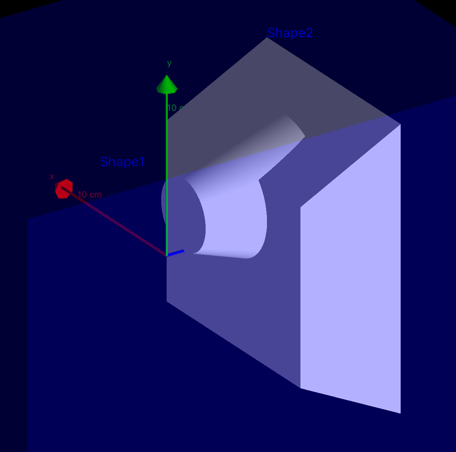
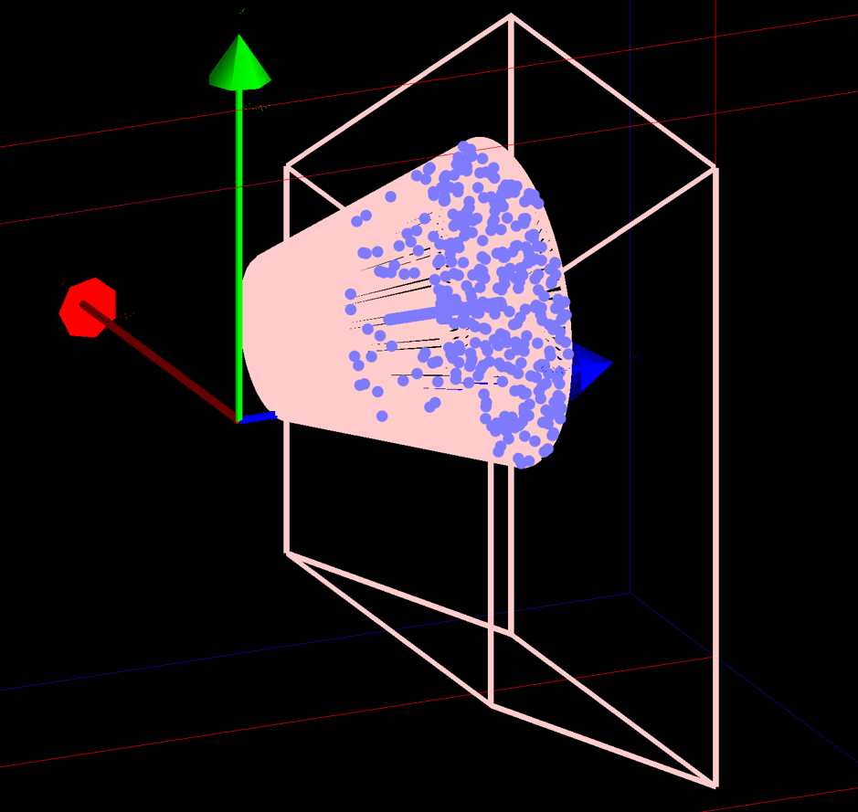

# 070 Debugging geometry with vis

One command in particular - `/vis/drawLogicalVolume` (see below) - is designed to highlight geometry overlaps. But you can explore and check your geometry with simple vis commands. Most examples have a vis.mac file that contains these and several other useful commands --- `examples/basic/B1/vis.mac` is a good place to look.

```text
/vis/drawVolume
```

will draw the whole detector and your can rotate and zoom. If you want to see just part of the detector:

```text
/vis/drawVolume <sub-detector-physical-volume-name> [<copy-number>]
```

draws all volumes with matching name. You may use a regular expression of the form /regexp/, e.g.:

```text
/vis/drawVolume /Shape/
```

draws Shape1 and Shape2 (in example B1).

You can accumulate volumes:

```text
/vis/drawVolume <physical-volume-name1>
/vis/scene/add/volume <physical-volume-name2>
```

You can also limit the depth of descent of the geometry hierarchy:

```text
/vis/drawVolume ! ! 2
```

draws the world to depth 2.

```text
/vis/scene/list  # to see what’s in the scene.
```

If you are using Qt, what you might find helpful is a little `pick` icon, 5th from the left on the top menu bar of the Qt GUI. It opens a little window and if you click on a shape its properties are displayed in the window.

With a plain OpenGL window, try `/vis/viewer/set/picking`.

If you know the place of the volume in the geometry hierarchy (we call it a "touchable"), you can `/vis/set/touchable` and `/vis/touchable/dump`. Look at the guidance to see how to use the commands. You might find `/vis/drawTree` useful.

All vis commands have extensive guidance. Use `help` or `ls` on the command line or the `Help` tab in Qt, or see \"Built-in Commands\" in the Application Developers Guide.

## Using advanced vis tools

`/vis/drawLogicalVolume` can highlight overlaps. But first you may need to identify the offending volumes. Detecting Overlapping Volumes describes how to do this.

```text
/geometry/test/run
```

gives output such as:

```text
Checking overlaps for volume Shape1 ...
-------- WWWW ------- G4Exception-START -------- WWWW -------
*** G4Exception : GeomVol1002
      issued by : G4PVPlacement::CheckOverlaps()
Overlap with volume already placed !
          Overlap is detected for volume Shape1:0
          with Shape2:0 volume's
          local point (0,30,-29.1037), overlapping by at least: 896.261 um
NOTE: Reached maximum fixed number -1- of overlaps reports for this volume !
*** This is just a warning message. ***
-------- WWWW -------- G4Exception-END --------- WWWW -------
```

[]

[Fig. 26 ][Example B1 with overlapping volumes. (To generate the above one placement in `B1::DetectorConstruction::Construct()` was moved in order to make an overlap.)]

Pick the offending volume name from the error message above:

```text
/vis/touchable/findPath Shape1
```

This gives something like the following output:

```text
World 0 Envelope 0 Shape1 0 (mother logical volume: Envelope)
Use this to set a particular touchable with "/vis/set/touchable <path>"
or to see overlaps: "/vis/drawLogicalVolume <mother-logical-volume-name>"
```

Then take the mother logical volume name from the above message:

```text
/vis/drawLogicalVolume Envelope
/vis/viewer/set/style wireframe
```

Now we see the offending volumes highlighted in pink, and the sampling points in pale blue.

[]

[Fig. 27 ][Overlaps highlighted.]

It may help to see all the points with:

```text
/vis/viewer/set/hiddenMarker false
```

If by chance the offending volumes are "invisible", make them visible with:

```text
/vis/viewer/set/culling global false
/vis/viewer/rebuild
```
