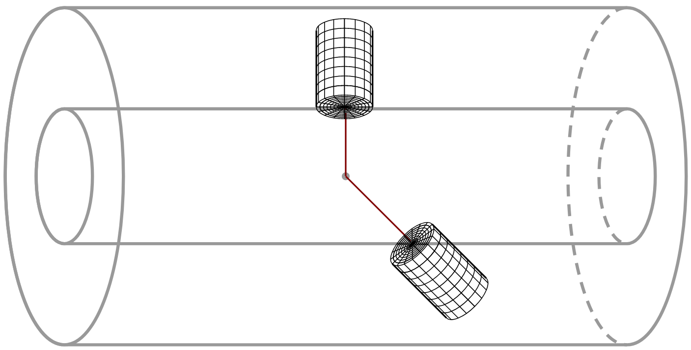
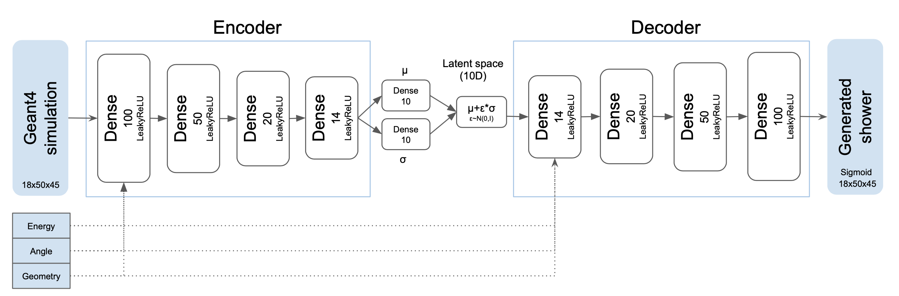
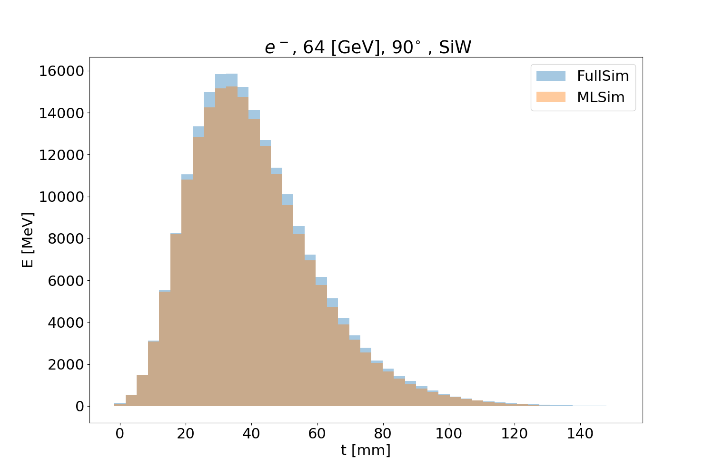
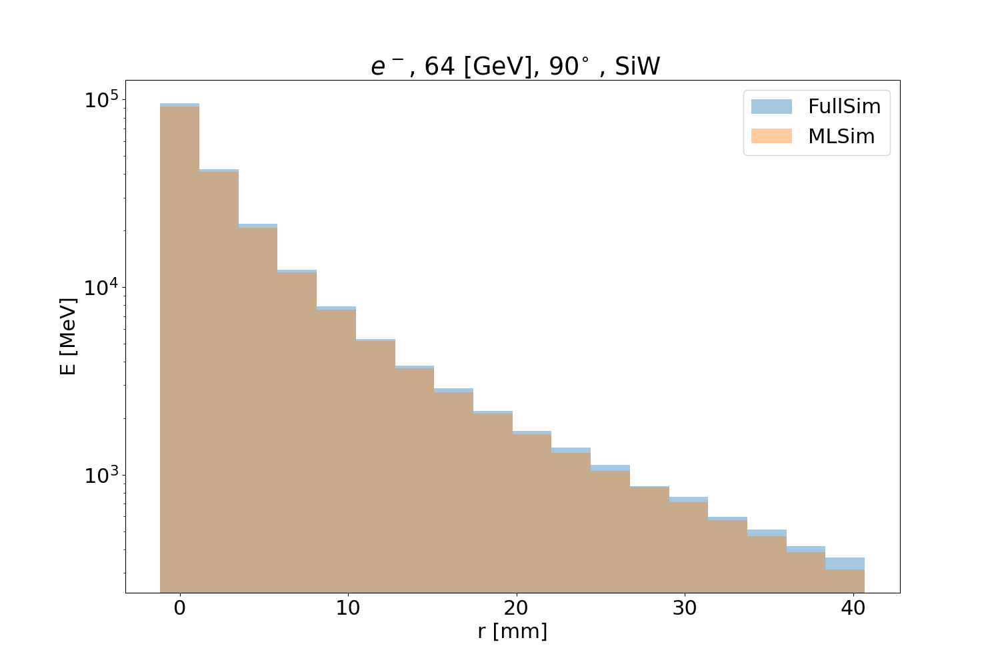
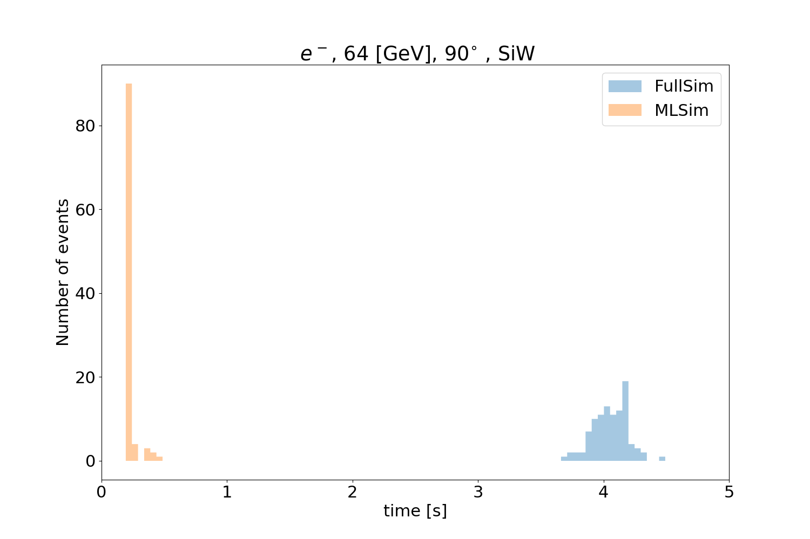
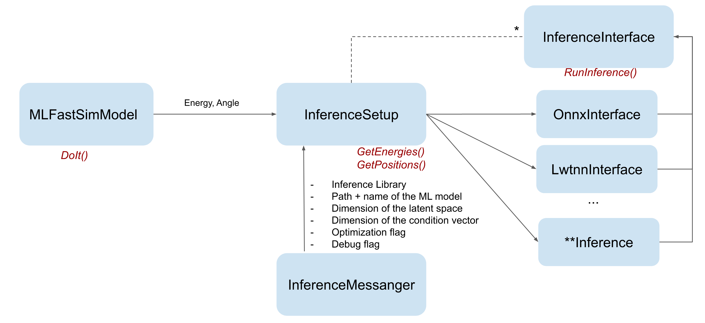

# 081 Par04

Par04 example focuses on application of Machine Learning (ML) techniques to fast simulation of calorimeters. Its main goal is to demonstrate how to do ML inference using Geant4.

In order to show how to perform ML inference, Par04 contains an ML model. It was trained externally (with Python) on dataset from standard (full) simulation done with this example. It is not optimized as its accuracy is not the concern of this example.

## Installation

Par04 example depends on external libraries used for the ML inference. Currently, following libraries can be used:

-   ONNX Runtime,

-   LWTNN.

If those libraries are not available, Par04 example can still be built to run standard (full) simulation. Such application can be used for instance to simulate the dataset used for ML training. The search for external libraries is by default switched on, but it can be switched off by setting the CMake variable `INFERENCE_LIB` to OFF.

To build the application you need to:

```text
$ cmake <Par04_SOURCE>
$ make
```

Replace `<Par04_SOURCE>` with the path to Par04 example source directory. CMake will look for inference libraries unless you use `-DINFERENCE_LIB=OFF`. You can point manually to them using `CMAKE_PREFIX_PATH` variable.

For instance, to run the example on `lxplus8` you could use:

```text
$ source /cvmfs/sft.cern.ch/lcg/contrib/gcc/11.1.0/x86_64-centos8-gcc11-opt/setup.sh
$ cmake <Par04_SOURCE> -DCMAKE_PREFIX_PATH="/cvmfs/sft.cern.ch/lcg/releases/onnxruntime/1.8.0-47224/x86_64-centos8-gcc11-opt;/cvmfs/sft.cern.ch/lcg/releases/lwtnn/2.11.1-72aca/x86_64-centos8-gcc11-opt/"
```

## How to run

Example can be run in batch mode, as well as in the interactive mode with the hit visualization.

To run the example in the batch mode you need to specify the macro (options) passing it with `-m`:

```text
$ ./examplePar04 -m <MACRO_FILE>
```

To run the example in the interactive mode:

```text
$ ./examplePar04
```

Example contains following macro files:

>
>
> -   `examplePar04.in` - runs full simulation.
>
> -   `examplePar04_onnx.in` - runs inference with ONNX Runtime. It is installed in the build directory only if ONNX Runtime is found by CMake.
>
> -   `examplePar04_lwtnn.in` - runs inference with LWTNN. It is installed in the build directory only if LWTNN is found by CMake.
>
> -   `vis.mac` - this macro is used in the interactive mode.
>
>

## ML fast calorimeter simulation

### Calorimeter

Calorimeter used in this example is a simple setup of concentric cylinders of active and passive material. It can be configured from the macro using the UI commands.

Energy deposits are scored in the detector using the cylindrical readout structure, centered around the particle momentum, as shown in Fig. 28. Dimensions of the readout structure (number and size of cells) can be also configured using the UI commands.

>
>
>
> []
>
> [Fig. 28 ][Energy deposits are scored in cylindrical readout around particle momentum.]
>
>
>

This example uses silicon as an active material, and tungsten as the passive absorber. 90 layers of both materials are placed, with 1.4 mm of tungsten and 0.3 mm of silicon. Size of the cylindrical readout has been optimized to contain (on average) 95 % of energy of 1 TeV electrons. The size of single cell has been chosen to correspond to (approximately) 0.25 Moliere radius and 0.5 radiation length.

Detector and readout (mesh) used in the example macros are configured with following commands:

```text
# Detector Construction
/Par04/detector/setDetectorInnerRadius 80 cm
/Par04/detector/setDetectorLength 2 m
/Par04/detector/setNbOfLayers 90
/Par04/detector/setAbsorber 0 G4_W 1.4 mm false
/Par04/detector/setAbsorber 1 G4_Si 0.3 mm true
## 2.325 mm of tungsten =~ 0.25 * 9.327 mm = 0.25 * R_Moliere
/Par04/mesh/setSizeOfRhoCells 2.325 mm
## 2 * 1.4 mm of tungsten =~ 0.65 X_0
/Par04/mesh/setSizeOfZCells 3.4 mm
/Par04/mesh/setNbOfRhoCells 18
/Par04/mesh/setNbOfPhiCells 50
/Par04/mesh/setNbOfZCells 45
```

Particle momentum that is used to define the orientation and the placement of the cylindrical readout (which will differ from particle to particle) is measured at the entrance to the calorimeter. This measurement can be done in several different ways, and this example is using a fast simulation model (`Par04DefineMeshModel`) that is triggered at the entrance to the calorimeter and that sets up particle entrance position and momentum in the event information `Par04EventInformation` (since single particle events are used). For simplicity of the example `Par04DefineMeshModel` is attached to the same region as `Par04InferenceModel`. It has two direct consequences:

-   In fast simulation order of activation of those model must be respected (first the model which sets up the readout properties, and then the model which kills a particle and creates deposits).

-   Full simulation is slowed down by the large region of calorimeter and presence of fast simulation model that is called (to check if particle enters the calorimeter) for every electron or photon. For realistic use case this model should be attached to very thin cylindrical region located just *before* the entrance to the calorimeter.

### Output data

Cylindrical readout is used in the sensitive detector `Par04SensitiveDetector` which accumulates energy from the event in the collection of hits, ignoring the deposits outside of the cylindrical mesh. At the end of each event, hit collection is saved to ntuple and stored in ROOT files. Additionally, simple analysis of the shower shape is performed and histograms are saved alongside the ntuple (technically, if G4 is run in sequential mode, otherwise multiple ROOT files are produced because histograms are merged while ntuples are not).

Structure of the output file(s) is the following:

```text
10GeV_100events_fullsim.root
├── events
│   ├── (D) EnergyMC
│   ├── (VD) EnergyCell
│   ├── (VI) rhoCell
│   ├── (VI) phiCell
│   ├── (VI) zCell
│   └── (D) SimTime
├── (H) energyParticle
├── (H) energyDeposited
├── (H) energyRatio
├── (H) time
├── (H) longProfile
├── (H) transProfile
├── (H) longFirstMoment
├── (H) transFirstMoment
├── (H) longSecondMoment
├── (H) transSecondMoment
└── (H) hitType
```

Where:

-   `(D)` is a double value,

-   `(VD)` is a vector of double values,

-   `(VI)` is a vector of integers,

-   `(H)` is a histogram.

Ntuple `events` contains information on energy of primary particle (in units of MeV), and vector of energy deposits: cylindrical coordinates and energy in default Geant4 units (rad for phi, mm for rho and z, MeV for energy). Only deposits above hard-coded threshold (E\>0.5 keV) are stored in the file. Histograms are created in a simple post-event analysis. Please note that for readability, energy of primary particle and total deposited energy are plotted in units of GeV. Moreover, all hits with non-zero energy are taken into account (there is no minimal energy threshold). Hit type can be used to distinguish between full and fast simulation. Hit with ID=0 is used for full simulation, and ID=1 for fast simulation.

## ML model

The model used in this example was trained externally (in Python) on data from this examples' full simulation. It is a Variational Autoencoder (VAE): a deep learning generative model. The VAE is composed of two stacked deep neural networks acting as encoder and decoder. The encoder learns a mapping from the input space to an unobserved or latent space in which a lower dimensional representation of the full simulation is learned. The decoder learns the inverse mapping, thus reconstructing the original input from this latent representation. The encoded distributions are constrained to be Gaussian distributions and the encoder is tasked to return the mean and the covariance matrix that describe these distributions.

The loss function that is optimized during the training of the VAE is composed of a regularisation loss to minimize Kulback-Leibler divergence between encoded distributions and prior Gaussian distributions, a reconstruction loss to minimize the error by computing the binary cross-entropy between the input and its reconstruction version using the latent representation.

The VAE architecture used in this example comprises 4 hidden layers with width of 100,50,20,14 and 14,20,50,100 for the encoder and decoder respectively as shown in the figure below.

>
>
>
> []
>
> [Fig. 29 ][VAE model architecture.]
>
>
>

The full simulation samples for the two detector geometries (Si/W as used in the example, and additionally 1.2 mm Scintillator/4.4 mm Pb) are showers of electron particles generated with an energy range from 1 GeV to 1 TeV (in powers of 2) and angles from 50 to 90 degrees (in a step of 10 degrees). 90 degrees means perpendicular to the z-axis. The VAE is conditioned on the three parameters.

The three figures below show the validation plots comparing the full simulation to the (ML) fast simulation after using the inference with ONNX. The plots show the longitudinal (Fig. 30), transverse profiles (Fig. 31) and simulation time (Fig. 32) for 64 GeV particles with an angle of 90 degrees.

>
>
>
> []
>
> [Fig. 30 ][Longitudinal profile for 64 GeV electrons.]
>
>
>
> []
>
> [Fig. 31 ][Transvers profile for 64 GeV electrons.]
>
>
>
> []
>
> [Fig. 32 ][Simulation time for 64 GeV electrons.]
>
>
>

## Inference

In this example, the input inference vector is constructed by sampling from a 10D Gaussian distribution. The condition vector comprises condition values of energy and angle of a particle and two values encoding the calorimeter geometry. The condition value of the energy of the particle is normalized to the maximum energy point in the range of training. For the angle, the value in degrees is also normalized to the maximum angle point in the range of training. The model was trained on two detector geometries and the conditioning of the geometry used is a one hot encoding vector with \[0,1\] for SiW geometry and \[1,0\] for SciPb geometry. After running the inference, the values are rescaled back by the energy of the particle.

### How to run inference of user models

This example was designed to facilitate integration of user model in Geant4 toolkit. Figure Fig. 33 shows how fast simulation components were implemented. Fast simulation model `Par04InferenceModel` is responsible for taking the particle out of full simulation, and creation of energy deposits with energy and position returned by `Par04InferenceSetup`. This is the model(user) specific class that should configure the ML model, run the inference using one of the inference libraries (configured in the example with UI commands thanks to `Par04InferenceSetupMessenger`), do the energy postprocessing, and finally be aware where to place energy inside of the detector. Interface to inference libraries (`Par04InferenceInterface`) is designed in a model-agnostic way. The inference works for any trained model by sampling N points from a predefined distribution where N represents the size of the input inference vector.

>
>
>
> []
>
> [Fig. 33 ][Diagram of the classes used for fast simulation with ML inference.]
>
>
>

For a specific application, the user should therefore only change `Par04InferenceSetup` class, where all inference parameters are defined. These parameters include the name of the inference library, the path and name of the inference model, the size of the input inference vector (latent vector size and condition vector size). In this class the user can define the input inference vector including the vector of conditions, run the inference and also apply a post processing step to retrieve the original energy range if the model was trained on any specific preprocessed values. The important part is also assignment of positions to the energy deposits. Fast simulation model `Par04InferenceModel` will use those positions to place the deposits, therefore it needs to be a position of the sensitive detector. For this reason, in Par04 example, where simple center of cell positions are used, both materials (active and passive) is considered as sensitive for the fast simulation runs.

### Inference with LWTNN

Lightweight Trained Neural Network (LWTNN) supports scikit-learn and Keras models where this model is saved as two separate files of the architecture (in JSON) and the weights (in HDF5). The trained model can be saved into these two separate files with:

```text
# save the architecture in a JSON file
with open('architecture.json', 'w') as arch_file:
    arch_file.write(model.to_json())
# save the weights as an HDF5 file
model.save_weights('weights.h5')
```

After building the LWTNN code available at this link, run the `kerasfunc2json` python script (available in `lwtnn/converters/`) to generate a template file of your functional model input variables by calling:

```text
$ kerasfunc2json.py architecture.json weights.h5 > inputs.json
```

And run again `kerasfunc2json` script to get your output file that would be used for the inference in C++:

```text
$ kerasfunc2json.py architecture.json weights.h5 inputs.json > Generator.json
```

`Par04LwtnnInference` is the class called if the user chooses the LWTNN library. The object that will do the computation in this class is a `LightweightGraph`, initialized from `Generator.json` file. The inference is based on evaluating the graph using the input inference vector constructed in `Par04InferenceSetup`.

### Inference with ONNX runtime

Open Neural Network Exchange (ONNX) runtime supports models from Tensorflow/Keras, PyTorch, TFLite, scikit-learn and other frameworks. For a Keras model for example, to save it into an ONNX, you can first save it as HDF5 file with:

```text
model.save("model.h5")
```

This model is then converted into an ONNX format using keras2onnx with:

```text
# Create the Keras model
kerasModel = tensorflow.keras.models.load_model(“model.h5”)
# Convert Keras model into an ONNX model
onnxModel = keras2onnx.convert_keras( kerasModel , ‘name’ )
# Save the ONNX model
keras2onnx.save_model(onnxModel, ‘Generator.onnx')
```

`Par04OnnxInference` is the class that is called if the user chooses ONNX. It creates an environment which manages an internal thread pool and creates as well the inference session for the model. This session runs the inference using the input vector constructed in `Par04InferenceSetup`.
